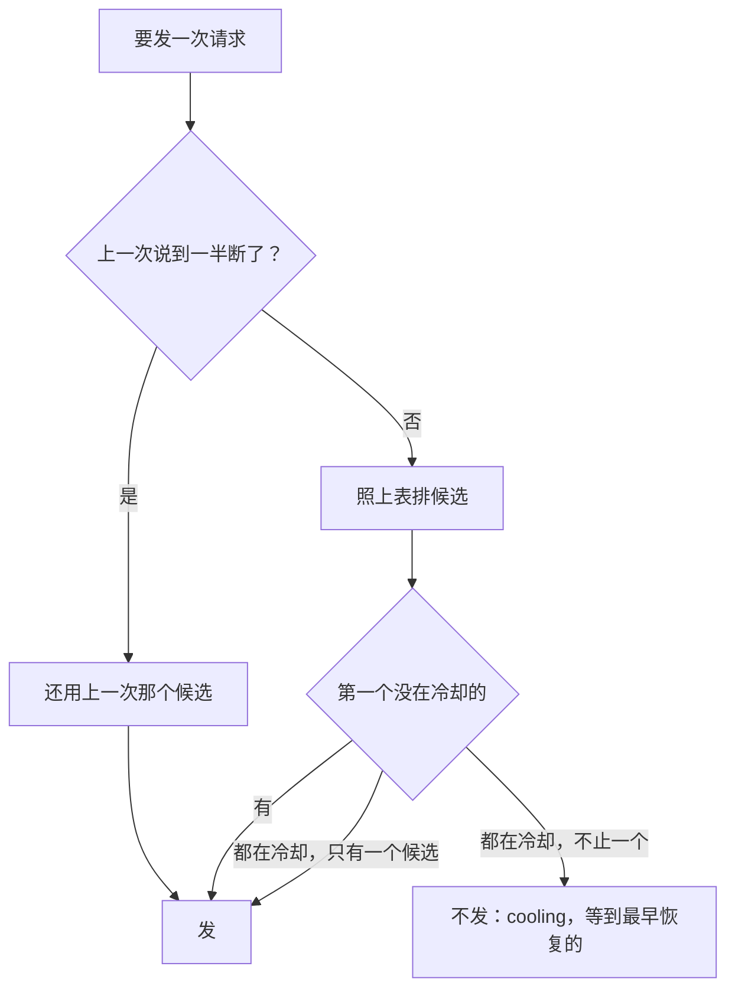

## 供应商和模型

### 是什么

GQY 怎么接上模型：配置里写几家供应商，每家带驱动、地址、几个 key。模型写成「供应商/模型」。模型的资料（窗口、最大输出、能收什么、价格）从手写、用出来的、供应商的列表、models.dev 目录、驱动的保守默认里一格格查出来，每一格说得出来源。会话钉着一个模型或者一个池，出错了按错误的分类换 key、换池里的下一个。会话里能换模型，下一个回合开始生效。第一次用时先找机器上现成的 key 和本机的模型服务。每次请求的用量、照价格算出的金额冻结进那一次的 `model.called`，头和她自己都能查。

驱动的内部（Anthropic 消息接口、OpenAI Responses 接口怎么编码、解码）不在这一页：开工前另画 `drivers/anthropic.md`、`drivers/openai-responses.md`。这一页只写它们要守的约定（「对外的样子」最后一节）。配置怎么读、怎么分层、怎么校验、密钥怎么存，归 `config.md`。这一页只写模型这一块有哪些键、每个键是什么意思。

状态：图纸，定稿（2026-10-01 起草，起草时要拍板的几题同一天定了，见「定的（2026-10-01）」；主会话审过，项目主人同一天批准），M8 的 8-6 到 8-11、8-14 的一部分、8-15 照它施工（施工方案第三节 M8 那张表）。每一节标着由哪一步做。做完一步，这一页照做好的样子改写那几节，「要跟着改的别的页」里列的几页跟着改。8-6 做完了（2026-10-01）：标 8-6 的几节照做好的样子写，施工时定的记在「施工时定的」。8-7 做完了（2026-10-01，施工完，待主会话审）：标 8-7 的几节照做好的样子写，施工时定的记在「施工时定的」8-7 那张表。8-6b 做完了（2026-10-01）：`base_url` 一行、`model.list` 的 `providers`、第十条、「样子」里的例子照做好的样子写，施工时定的记在「施工时定的」8-6b 那张表。8-9 做完了（2026-10-01，施工完，待主会话实测）：标 8-9 的几节照做好的样子写，施工时定的记在「施工时定的」8-9 那张表。8-10 做完了（2026-10-01，施工完，待主会话实测）：标 8-10 的几节照做好的样子写，施工时定的记在「施工时定的」8-10 那张表。8-11 做完了（2026-10-01，施工完，待主会话实测）：标 8-11 的几节照做好的样子写，施工时定的记在「施工时定的」8-11 那张表。8-8 补做完了（2026-10-01，施工完，待主会话实测）：挡位去掉、池多两项，标 8-8 补的几节照做好的样子写，施工时定的记在「施工时定的」8-8 补那张表。8-18 做完了（2026-10-02，施工完，待主会话实测）：思考强度，标 8-18 的几节照做好的样子写，施工时定的记在「施工时定的」8-18 那张表。8-20 做完了（2026-10-02，施工完，待主会话实测）：模型调用口，「怎么走」第十二条，标 8-20 的几节照做好的样子写，施工时定的记在「施工时定的」8-20 那张表。8-18（补）做完了（2026-10-02，施工完，待主会话实测）：去掉思考强度的会话那一层，标 8-18（补）的几节照做好的样子写，施工时定的记在「施工时定的」8-18（补）那张表。8-15 做完了（2026-10-02，施工完，待主会话实测）：用量与金额，「怎么走」第九条，标 8-15 的几节照做好的样子写，施工时定的记在「施工时定的」8-15 那张表。8-12 做完了（2026-10-03，主会话实测过，项目主人验收通过）：Anthropic 的驱动接上，「模型的资料」的档位、第一条第 2 条、第十一条第 1 条、第十二条第 1 条、「驱动要守的约定」第 11、13 条、档案那一段照做好的样子写，施工时定的记在「施工时定的」8-12 那张表。8-13 做完了（2026-10-03，主会话实测过，项目主人验收通过）：Responses 的驱动接上，同样那几节照做好的样子写，施工时定的记在「施工时定的」8-13 那张表。

### 在哪

施工时照这个放：

| 代码 | 管什么 | 哪一步 |
|---|---|---|
| `crates/gqy-models/`（新，第 2 层，纯逻辑） | 模型这一块的纯逻辑：目录的类型、四层对目录、资料合起来和来源、两种写法、池的挑法、冷却怎么算、金额怎么算。不碰文件和网络，时刻由调用的一方交进来 | 8-6 起 |
| `crates/gqy-models/src/catalog.rs`、`catalog/price.rs` | models.dev 目录的类型，只读用得上的格，一个模型一个模型地读、坏的跳过；照名字、规整以后的名字建索引；在用的目录 `Loaded`（哪一份、什么时候拉的）；价格 `Price`；模型的 `release_date`（8-11，推荐模型用） | 8-7、8-11 |
| `crates/gqy-models/src/onboard.rs`、`onboard/` | 第一次接入的纯逻辑（8-11）：目录和档案里的每一家合起来（`Listed`：名字、驱动、地址、能不能用）、找哪些环境变量、探本机的哪几家（`listing.rs`）；`provider.catalog` 搜、排（`search`）；推荐哪个模型（`recommend.rs`）；还没写进配置的一家写成一份最终值（`candidate.rs`），和配好的一家走同一条路 | 8-11 |
| `crates/gqy-models/src/matching.rs` | 四层对目录、名字规整、认供应商（`recognize`）、认原厂（`Vendors`） | 8-7 |
| `crates/gqy-models/src/facts.rs`、`facts/source.rs` | 资料的每一格、来源、合起来，写成 `model.list` 的 `facts` | 8-7 |
| `crates/gqy-models/src/observed.rs` | 用出来的（`learned.json`）、供应商的列表（`providers/<编号>.json`）的样子、读写、只记小的 | 8-7 |
| `crates/gqy-models/src/knowledge.rs` | 查资料时手头的几份：档案、认原厂的表、目录、用出来的、列表（`Knowledge`） | 8-7 |
| `crates/gqy-models/src/reference.rs` | 两种写法：读、哪里能写哪几种（8-6）；造会话记下的引用（`record`）、一个引用这一轮指到一个模型还是一个池（`resolve`）、用途池里点名的模型（`named`）（8-8；挡位 8-8 补去掉了） | 8-6、8-8 |
| `crates/gqy-models/src/settings.rs` | 模型这一块的配置项：`UseSettings`（`models.chat`、`vision`）、`PoolSettings`（`pools.<id>` 的成员、分法，8-8；派子代理能不能选、给模型看的说明，8-8 补）、`ProviderSettings`（`providers.<id>` 的驱动、地址、key、`catalog`，8-8 加 `cache`）、`ModelSettings`（`providers.<id>.models.<model>` 的窗口，8-18 加 `effort`），核心登记进清单（`config.md`） | 8-6 起 |
| `crates/gqy-models/src/effort.rs` | 思考强度（8-18；8-18（补）去掉会话那一层）：档位名怎么规整（`none`、`disabled` 读成 `off`，有开关的多 `off`），给头看的那一档从配置的哪一层来（`in_use`），空闲超时放大几倍（`idle_factor`），配置里写的不在档位里的（`unknown`，报 `unknown_effort`） | 8-18 |
| `crates/gqy-models/src/profile.rs` | 档案的样子：驱动、地址、`compat`（8-18 多 `toggle`：开关思考的字段）、能收哪些输入、一张图怎么算，核心读成 JSON 交进来 | 8-6 起 |
| `crates/gqy-models/src/provider.rs` | 一家供应商这一轮的样子（手写的、档案的合起来），一个引用这一轮发给谁，窗口手写的压过模型资料，没有模型时的原话 | 8-6 起 |
| `crates/gqy-models/src/keys.rs` | 一个会话钉在哪一个 key 上、候选的先后 | 8-6 |
| `crates/gqy-models/src/pools.rs` | 池：认得出的成员、不写分法时怎么分、钉住的照发过的认回来、候选怎么绕、指针（`Pointers`，`pools.json` 的字）怎么往前走（8-8）；派子代理能选哪几个（`offered`，8-8 补，`Offer`） | 8-8 |
| `crates/gqy-models/src/cooldown.rs` | 冷却：按分类、翻倍、封顶、成功清零 | 8-9 |
| `crates/gqy-models/src/price.rs` | 金额（`Tariff`）：照资料造（价格、倍率、出处），挑哪一档价格、乘倍率、缺一项不算；几种币种排先后（`ordered`）。`usage.currency` 在 `settings.rs` 的 `UsageSettings` | 8-15 |
| `crates/gqy-session/src/route.rs`、`route/` | 每个会话的路由：实现 `ModelPort`，挑候选、钉 key、出错换、记冷却、交限额。取代 `http.rs` 里的 `HttpModels`（8-6：`route.rs` 挑、`route/send.rs` 发；8-8：`route/pool.rs` 池里挑成员、池的限额；8-9：`route/choice.rs` 排候选、挑没在冷却的，`route/ended.rs` 说完了记冷却、换端点、成了才钉；8-18：`route/effort.rs` 给头看的那一档从配置的哪一层来、空闲超时跟着放大，8-18（补）去掉会话那一层以后不再有会话给每个模型记的一格）。8-20 起它是模型调用口的会话入口（第十二条）：解析引用、退回 `models.chat`、钉 key、钉成员、说到一半断了、交限额留在 `route.rs`、`route/send.rs`（会话的发、说完了记会话的那几样 `Tried`），挑、发、记冷却调底子 | 8-6、8-8、8-9、8-18、8-20 |
| `crates/gqy-session/src/route/base.rs`、`route/choice.rs`、`route/pool.rs`、`route/exchange.rs`、`route/ended.rs` | 模型调用口的底子（8-20 从会话的路由里拆出来，第十二条）：`Routes` 的几个方法，不认会话，只认「谁在挑」（`Seat`：钉 key 的种子、换过去的 key、钉着的成员、说到一半断了的）。照引用排候选、跳过冷却的、钉住的池从钉着的成员起、轮换的池走指针（`base.rs` 的 `pick`，`choice.rs`、`pool.rs` 排）；照真发的模型查资料、取配置的默认思考强度、挑客户端（`base.rs` 的 `ready`）；取 blob、编码、发、记用出来的窗口（`exchange.rs`）；出错照分类记冷却、说换没换端点，成了清零（`ended.rs` 的 `Attempt`） | 8-20 |
| `crates/gqy-session/src/route/once.rs`、`once/reply.rs` | 一次性入口 `OneShot`（8-20，第十二条）：交进去 `Ask`（引用、用途、system、几条消息、`max_tokens`），交回 `Answer`（正文、真发给的供应商和模型、用量）或 `Unanswered`（四种出错）；出错换了端点的当场再来，最多 5 次；正文照增量拼（`once/reply.rs`）。核心经 `Models::one_shot()` 拿到它，和会话的路由是同一个 `Routes` | 8-20 |
| `crates/gqy-session/src/route/shared.rs` | 核心一份的模型资料 `ModelData`：档案、认原厂的表、在用的目录（读完以前要它的等着）、用出来的、供应商的列表、拉列表的客户端、探本机的客户端（不走代理，8-11）；`state/models/` 的读写（8-7）；池的指针和它的 `pools.json`（8-8）；冷却表和 `[models.cooldown]` 的规矩，只在内存里（8-9）。8-20 起会话的路由和一次性入口共用这一份 | 8-7、8-8、8-9、8-20 |
| `crates/gqy-session/src/actor/model.rs` | 请求说完了跟着端口的限额：变了交内核、`Handle` 的跟着换，模型变了推 `model.changed`（`session/actor.md` 第 7 条第 8 款）；回合开始叫端口重新解析，头看得到的变了推 `model.changed`（`why` 是 `turn`，8-10） | 8-9、8-10 |
| `crates/gqy-session/src/route/turn.rs` | 回合开始照这一轮的配置重新解析会话的引用：换成内核交的、解析不出的退回 `models.chat`、钉着的成员还在的照旧、限额重算（`ModelPort::turn`） | 8-10 |
| `crates/gqy-session/src/shown.rs` | 给头看的那一份 `Shown`：限额和会话接下来请求的模型 `Next`（8-18 多 `effort`），actor 写、`Handle` 读，`subscribe` 照它答 | 8-10、8-18 |
| `crates/gqy-session/src/route/lists.rs` | 拉一家供应商的模型列表：照驱动的 `models_path()` GET、`parse_models`，存 `state/models/providers/<编号>.json`（8-7）；GET 一家的列表那一段 `provider.test` 也用（`list_models`，8-11） | 8-7、8-11 |
| `crates/gqy-session/src/route/probe.rs` | `provider.test` 试一次（8-11）：推驱动、地址、key，列模型（列不出的照目录），挑模型，发一句、收到第一段正文就停；发的那一句照挑的模型的驱动、带档案另配的头（8-14） | 8-11、8-14 |
| `crates/gqy-session/src/route/local.rs` | `provider.detect` 探本机的服务（8-11）：几家一起发，各等 300 毫秒，不走代理 | 8-11 |
| `crates/gqy-core/src/models.rs`、`models/` | 起来时读档案、认原厂的表（TOML 读成 JSON），造路由；写了 `ready` 以后读目录、用出来的、供应商的列表、池的指针（`models/catalog.rs`：快照和缓存挑新的），后台更新（`models/refresh.rs`，8-8：地址可以是环境变量的引用，`Schedule`）；`[models.cooldown]` 照配置当场换（`follow_cooldown`，8-9）；多造一个不走代理的 GET 客户端，探本机的服务用（8-11） | 8-6 起 |
| `crates/gqy-endpoint/src/models.rs`、`models/entry.rs` | 协议：`model.list`（8-7，`entry.rs` 写一家；8-8 加 `pools`、`uses.vision`，8-8 补去掉 `tiers`、池多 `subagent`、`description`；8-9 加模型、key 的冷却；8-18（补）起 `facts.effort` 多 `key`），`session.create` 的 `model` 怎么解析（`record`，8-8，`methods.rs` 调它）；`session.configure` 的参数（`methods.rs` 先查参数、再找会话、再 `record`，`ConfigureParams`，写了 `effort` 的 8-18（补）起 `bad_params`）、`subscribe` 回应的 `model`（`connection.rs` 调它，8-10；8-18 多 `effort`）；`provider.detect`、`provider.catalog`、`provider.test` 在 `providers.rs`、`providers/trial.rs`（8-11）；`model.call` 在 `models/call.rs`（8-20：参数、照这个账号的 blob 认图（`attach.rs` 的 `images`）、调一次性入口、出错写成拒绝；8-15 记在这个连接的账号上）；`usage.query` 在 `usage.rs`（8-15：开 `state/usage.db`、参数、先补再查、写成 `rows`） | 8-7 到 8-11、8-15、8-20 |
| `crates/gqy-session/src/config.rs` | `Turn::new`：一次性调用照这一刻不算项目配置的最终值冻结一份（8-20） | 8-20 |
| `crates/gqy-kernel/src/session/configure.rs` | 换模型的命令，会话的引用和最近一次换模型写在第几条（`Reference`，熔断照它），回合开始交出引用（`RunTurnStartHooks` 的 `model`），记 `replaced`（8-10）。8-18 曾在这里加过会话给每个模型记的一格思考强度，8-18（补）去掉了 | 8-10 |
| `crates/gqy-kernel/src/session/retry.rs`、`event/model.rs`、`event/transient.rs` | 分类多 `no_model`（8-6，不再来）；`failover`、`cooling`（8-9）；瞬时的 `model.changed`、`status` 的 `failover`（8-9） | 8-6、8-9 |
| `crates/gqy-kernel/src/event/` | `session.created`（8-8 多 `model`）、`session.policy_changed`、`model.called` 多的几格（8-15 的 `cost` 在 `event/cost.rs`：`Cost`、`Prices`、照位比相等的 `Real`）；内核收 `ModelEnded`、`AsideEnded` 的 `cost` 原样记下（`session/call.rs`、`session/aside.rs`），这时的上下文用量 `Session::context_used()`（`session/limits.rs`） | 8-8、8-10、8-15 |
| `crates/gqy-drivers/src/driver.rs` | 驱动接口多的两样：认证头、列模型 | 8-6、8-7 |
| `crates/gqy-drivers/src/lib.rs`、`openai_chat/effort.rs` | 调用多一格 `Call.effort`；`openai-chat` 照它发 `reasoning_effort` 或档案写的开关（`Compat.toggle`），没有的什么都不加（8-18） | 8-18 |
| `crates/gqy-endpoint/src/config/effort.rs` | 配置里写的 `effort` 不在档位里的：读进来以后另查，报 `unknown_effort`（照 `bad_reference` 的办法，目录读完以前不查，8-18） | 8-18 |
| `crates/gqy-http/src/get.rs` | 一次 GET：拉目录、拉模型列表、探本机的服务（8-7）；`get_full` 出错时另交回状态码、响应头、最多 64 KiB 的响应体，`provider.test` 列模型失败时照驱动分类（8-11） | 8-7、8-11 |
| `crates/gqy-store/src/usage.rs`、`usage/` | 用量汇总 `state/usage.db`：一行的样子（`spent.rs`）、写和补（`catch_up.rs`：会话每落一批、补会话和账号日志、一次性调用记账）、删掉的会话的合计（`purged.rs`）、查（`query.rs`）。怎么开、坏了删掉重建和会话列表的索引共用 `sqlite.rs`；清回收处之前留底在 `trash.rs`；账号日志的锁、从记下的字节读起在 `journal.rs` | 8-15 |
| `crates/gqy-basesystem/src/subagent.rs` | 派子代理的工具 `subagent` 多一格 `pool`（8-8 补，取代 8-8 的 `tier`）：只认这个会话列着的池，交给端口；执行器那一头 `crates/gqy-session/src/agents.rs` 造会话时照那时的配置拼参数（`Agents::face`），派的时候子会话记 `@池`，没写的抄父会话的引用（`Inherit`）；拼参数的那一段 JSON 在 `crates/gqy-policy/src/tools/choice.rs` | 8-8、8-8 补 |
| `crates/gqy-basesystem/src/session_usage.rs` | 她自己查用量的工具：经端口（`gqy_tool::UsagePort`）要用量、金额、上下文，写成几句；执行器那一头在 `crates/gqy-session/src/usage.rs`（派出去那一刻向内核要上下文，先补这个会话再查） | 8-15 |
| `crates/gqy-cli/src/setup.rs`、`setup/` | `gqy setup`（`cli/setup.md`）；`gqy ask` 没模型时先走它（`ask.rs` 的 `model_ready_on`） | 8-11 |
| `crates/gqy-cli/src/ask.rs`、`ask/talk.rs` | `gqy ask --model`：新开的会话 `session.create` 带上，接着的先 `session.configure`（`talk.rs` 的「找会话」） | 8-10 |
| `xtask/src/dev_home.rs` | `cargo xtask dev-home`：开发时照环境变量造一个带配置的数据根；测试在 `crates/gqy/tests/dev_home.rs`（原样编进去） | 8-6 |
| `resources/models/models-dev.json`、`models-dev.meta.json`、`models-dev.LICENSE` | 安装包带的完整目录快照，原样的 `api.json`，和它是什么时候拉的；models.dev 的 MIT 许可证原文（`licenses.md`） | 8-7 |
| `resources/models/profiles.toml` | 驱动怎么认（`[npm]`：包名 → 驱动，8-7），认得出的供应商的档案：开关、另配的头、占位工具、找 key 的环境变量、本机服务探哪里。现在有 `[npm]`、`[providers.deepseek]`：驱动、地址、开关（8-18 多开关思考的 `toggle`）、一张图怎么算（「能收哪些输入」8-7 拿掉，照模型资料）；`[providers.ollama]`：名字、驱动、地址，只为「找现成的」（8-11，档案多一格 `name`）；`anthropic`、`openai` 两段（8-12、8-13）；`[providers.opencode-go]`：只有另配的头（8-14，档案多一格 `headers`）；`[providers.opencode]`：另配的头（`User-Agent` 也在里头）+ `placeholder_tools`（8-14 补，第八条） | 8-6 起 |
| `crates/gqy-models/src/headers.rs` | 另配的头的模板：只认 `{session_digest}`，读档案时查、发之前照种子换（8-14） | 8-14 |
| `resources/models/vendors.toml` | 认原厂：家族的第一段 → 原厂在目录里的编号 | 8-7 |
| `resources/core/models/probe.txt` | `provider.test` 发的那一句：核心每试一次照 `ResourceRoot::probe` 读一次，去掉行尾的空白 | 8-11 |
| `resources/core/drivers/placeholder-tool.txt` | 占位工具的说明（8-14 补）：工具面里缺 `read`、`shell` 的请求补一条同名占位声明，说明就是这一句 | 8-14 补 |
| `resources/software/basesystem/tools/session_usage.json`、`session_usage/*.txt` | 查用量的说明和结果的几句 | 8-15 |

分层照 `01-架构.md` 第九节：`gqy-models` 是新的第 2 层 crate，登记进那张表（门禁的真相源）。它只用白名单里的 `serde`、`serde_json`、`sha2`，同一层用 `gqy-config`（声明配置项）、`gqy-drivers`（开关、输入的类型）。TOML 的资源文件由 `gqy-core` 读成 JSON 再交进去（8-6）。

### 对外的样子

#### 配置：模型这一块的键

配置怎么读、分层、校验、`{ secret = … }` 和 `{ env = … }` 怎么解开，见 `config.md`。这里是每个键的意思。生效照 `14-配置.md` G7：会改请求的，下一个回合开始时生效（K3）。

**`[providers.<编号>]`**：一家供应商（8-6）。8-6 登记进清单的是 `driver`、`base_url`、`keys`、`catalog` 四格，8-7 加 `price_multiplier`、`local`，8-8 加 `cache`，8-21 加 `name`（`config.md`「M8 的配置项」，清单里写成 `providers.<id>.*`），别的格随用到它的那一步（「施工时定的」8-6、8-7、8-8）。编号照「路径里的名字」的写法（`kernel/ids.md`：小写字母开头，只有小写字母、数字、`-`、`_`，最长 32 个字符），它要当 `state/` 下的文件名。

| 键 | 取值 | 不写是 | 是什么 |
|---|---|---|---|
| `name` | 文字，最多 64 个字符 | 照目录里对上的那一家的名字（models.dev 的 `name`），再没有的照编号 | 界面上给人看的名字（施工 8-21）。编号只用来引用模型（`<编号>/<模型>`、池的成员、用量记账）；名字只给界面看，不进请求、会话日志，改了当场生效。只有空白的当没写 |
| `driver` | `openai-chat`、`anthropic`、`openai-responses` | 照档案、目录推（第一条第 2 条） | 怎么说话。推不出来的必写 |
| `base_url` | 网址，或者 `{ env = "…" }`（施工 8-6b，照密钥一样的读法，没有 `{ secret = … }`：地址不进密钥文件） | 照档案、目录推 | 地址，路径由驱动接在后面。推不出来的必写。是引用的，真要连供应商的那一刻才照核心的环境解出来（`config.md` 第九条第 5 条），没设、设成空的这一家没有地址（`no_model`）；`config.get`、`model.list` 都照写的样子交，不交解出来的地址 |
| `keys` | 列表，每一项 `{ secret = "…" }` 或 `{ env = "…" }` | 空 | 几个 key。空的不带认证头：本机的服务 |
| `headers` | 表：头的名字 → 字符串，或 `{ secret }`、`{ env }` | 空 | 另配的头。字符串里能写 `{session_digest}`（第八条第 1 条）。和档案里的同名时盖掉档案的。还没登记：8-14 只做档案里的，手写的随用到它的那一步 |
| `catalog` | models.dev 里一家供应商的编号 | 不写 | 手写指定：这家对应目录里的哪一家（第二条第 4 条第 2 层）。例如只转 DeepSeek 的中转写 `deepseek` |
| `price_multiplier` | 不小于 0 的数 | 1 | 倍率（第二条第 11 条） |
| `cache` | `contract`、`best_effort`、`per_request` | 驱动的默认 | 缓存属于哪一类（`08-上下文投影.md` 第六节）。8-8 登记，现在只用来定池不写分法时怎么分（`[pools.<名字>]`）；key 默认钉不钉随用到它的那一步。没有哪种驱动的默认是 `per_request` |
| `compat` | 表，见下 | 档案的，档案没有的是驱动的默认 | `openai-chat` 的开关。别的驱动写了是错 |
| `placeholder_tools` | 工具名的列表 | 档案的，没有是空的 | 工具面里缺这几件时补同名的占位声明（第八条第 2 条） |
| `local` | 布尔 | 地址在本机（`127.0.0.1`、`localhost`、`::1`）的，或者档案标了 `local` 的，是 `true` | 本机的模型服务（Ollama、LM Studio 这类）：价格默认是 0，当免费（第二条第 12 条）。放在局域网别的机器上的，要当免费就写 `true` |
| `models` | 表：模型名 → 手写的资料 | 空 | 见下 |

`compat` 里的五格，一格对 `Compat` 的一格（`drivers/openai-chat.md`「开关」）：

| 键 | 取值 |
|---|---|
| `output_limit` | `"max_tokens"`、`"max_completion_tokens"` |
| `reasoning` | `"drop"`，或者 `{ replay = "reasoning_content" 或 "reasoning", always = true 或 false }` |
| `stream_usage` | `true`、`false` |
| `continuation` | `"none"`，或者 `{ field = "prefix" 或 "partial", path = "…" }` |
| `toggle` | `{ field = "…", on = <值>, off = <值> }`：开关思考写在哪个字段、开和关各写什么（8-18）。没写的这一家不能照开关关思考（「怎么走」第十一条第 1 条） |

**`[providers.<编号>.models."<模型名>"]`**：手写的资料（8-7）。模型名照供应商那边的叫法，照「短名字」的写法（1 到 128 字节，没有控制字符）。每一格都可以不写。8-7 登记了除 `driver` 以外的几格（模型手写的 `driver` 还没登记：8-14 只照目录，见「模型的资料」），8-18 加 `effort`，类型、范围见 `config.md`「M8 的配置项」：`catalog` 是最多 256 个字符的文字，`reasoning` 的每一级最多 32 个字符，价格每一项 0 到 1000000，倍率 0 到 1000；`price` 写成行内表、有表头的表都行，清单里是 `price.input` 这样的五项。

| 键 | 取值 | 是什么 |
|---|---|---|
| `catalog` | `"<目录里的供应商>/<目录里的模型>"` | 手写指定照目录里的哪一个（第二条第 4 条第 1 层） |
| `window` | 正整数，1 到 100000000 | 上下文窗口。取代开发用的 `GQY_DEV_WINDOW`（8-6 先登记这一格，造会话、载入时用；8-10 起开着的会话下一个回合开始时用上，生效时机 `next_turn`） |
| `max_output` | 正整数 | 最大输出 |
| `inputs` | `"text"`、`"image"`、`"pdf"` 的列表 | 能收哪些输入 |
| `tools` | 布尔 | 能不能调工具 |
| `reasoning` | 字符串的列表 | 思考强度有哪几档，盖过目录的。`none`、`disabled` 读成 `off`（8-18）。`effort` 照它查 |
| `effort` | 一档的名字，最多 32 个字符 | 这个模型默认的思考强度（8-18，生效时机 `next_turn`）。不写的请求里不带，照供应商的默认。写的不在这时的档位里（目录变了、写错了）：照没写发，配置报 `unknown_effort`（「怎么走」第十一条第 2 条），配置不改 |
| `price` | `{ input, output, cache_read, cache_write, currency }`：每一百万 token 的价，`currency` 是币种，写 ISO 4217 的三个大写字母，不写是 `USD` | 价格。写了就整份用它，不和目录的拼。中转站按人民币标价的写 `currency = "CNY"` |
| `price_multiplier` | 不小于 0 的数 | 盖过供应商上写的 |
| `driver` | 同供应商的 `driver` | 这个模型走另一种驱动，例如 opencode Zen 的 Claude 走 `anthropic` |

**`[models]`**：用途（8-8）。

| 键 | 取值 | 不写是 | 生效 | 是什么 |
|---|---|---|---|---|
| `chat` | 模型或者 `@池` | 没有：`no_model` | `new_session`（8-6） | 新会话默认用的，钉着的没了退回它 |
| `vision` | 模型或者 `@池` | 没有 | `next_turn` | 替看不了图的模型看图（第三条第 5 条）。8-8 只读进来、`model.list` 列出来；8-17 起照它替看不了图的模型看图（「怎么走」第十三条） |

8-8 有过四个挡位 `models.tiers.lite`、`cheap`、`standard`、`flagship`，8-8 补去掉了（2026-10-01 项目主人定，「定的」第 11 条）：现在是不认识的键，照 `config.md` 第四条警告、原样留在文件里。

**`[pools.<名字>]`**：池（8-8）。名字照「路径里的名字」的写法。

| 键 | 取值 | 不写是 | 生效 |
|---|---|---|---|
| `models` | 模型的列表（配置的类型「模型」：只能是 `<供应商>/<模型>`，写了池的是 `bad_format`，`config.md`）；可以是空的 | 没有：这个池解析不出（`pool "<名字>" has no models`），空的一样 | `next_turn` |
| `strategy` | `"pin"` 钉住、`"rotate"` 轮换 | 认得出的成员那几家全写了按次计费（`cache = "per_request"`）是 `rotate`，别的是 `pin`（`15-模型与供应商.md` M4） | `next_turn` |
| `subagent` | 布尔（8-8 补） | `false` | `new_session` |
| `description` | 一行英文，最多 60 个字（配置的类型「给模型看的字」，`config.md`；8-8 补） | 没有 | `new_session` |

- `subagent`：在不在派子代理的选项里。开着、至少有一个认得出的成员的池，新会话的 `subagent` 能选它（「工具」）。
- `description`：给模型看的一句，`subagent` 的参数里接在池名后面。给模型看的字一律英文（`26-提示词.md` J3）：CJK 的字占一半以上的是 `bad_format`，原话说要写英文。
- 这两项会话开局时拼进工具面，整个会话不变，所以是 `new_session`；池的成员、分法照旧 `next_turn`：会话里已经列着的池换了成员，下一轮生效（2026-10-01 项目主人定）。
- 模型本身没有「能不能给子代理选」的开关：想让子代理挑某一个模型，建一个只有它的池（同上）。
- 一开始就有三个池 `lite`、`standard`、`flagship`：`gqy setup` 写配置时一起写进系统配置（第七条第 5 条第 7 款），成员是空的，开关开着，不带说明（名字就说得清）。除了是预先建好的，它们是普通的池：能删、能改名；填了成员才出现在子代理的选项里（同上）。

**`[models.catalog]`**：目录怎么更新（8-7），当场生效。

| 键 | 默认 | 是什么 |
|---|---|---|
| `update` | `true` | 后台去 models.dev 拉新的。关掉只用安装包带的和缓存里已有的。环境变量 `GQY_CATALOG_UPDATE`（`true`、`false`）压过它（8-7，2026-10-01 主会话定：离线的机器、测试拉起的核心） |
| `url` | `https://models.dev/api.json` | 从哪拉。也能写 `{ env = "…" }`，照核心的环境取（8-8 改：8-6b 起网址类型整体认引用，这一项以前读成空的，`config.md`「施工时定的」8-8）；没设、设成空的到点了照拉不到算 |
| `every` | `24h` | 缓存旧过这么久才拉。1 小时到 30 天 |

**`[models.cooldown]`**：冷却（8-9），当场生效，下一次出错用新的。每一类一个表 `{ base, max }`，都是时长（`30s`、`10m`、`2h` 这样写）：`base` 1 秒到 1 小时，`max` 1 秒到 1 天；`base` 写得比 `max` 大的照 `max` 冷却（「施工时定的」8-9）。

| 键 | `base` | `max` |
|---|---|---|
| `rate_limited` | `30s` | `10m` |
| `retryable` | `10s` | `5m` |
| `auth` | `10m` | `2h` |

**`usage.currency`**：显示用的币种（8-15），默认 `USD`，当场生效，能写进个人设置。现在不换算：它只定汇总里几种币种的先后，它排最前，别的照币种代码的字母先后。以后要换算另说（2026-10-01 项目主人定）。

项目配置（`.gqy/config.toml`）这一块一项都不能写：它们都不是收紧的项（施工方案第三节 M8 下面第一条，2026-10-01）。

#### 两种写法

凡是要指定模型的地方（`models.chat`、`models.vision`、池的成员、`session.create`、`session.configure`、`gqy ask --model`），照这个先后认（8-6、8-8）：

1. `@` 开头：池，后面是池的名字。
2. 有 `/`：在第一个 `/` 处切开，前面是供应商的编号，后面是模型名（模型名里还能有 `/`：`openrouter/deepseek/deepseek-v4` 的模型名是 `deepseek/deepseek-v4`）。两边都不能是空的。
3. 别的：错，「不是模型，也不是池」。

8-8 有过第三种：挡位名（`lite`、`cheap`、`standard`、`flagship`），8-8 补去掉了（「定的」第 11 条）。现在写挡位名的照第 3 条是错：协议上 `unknown_model`。

哪里能写哪几种：

| 地方 | 模型 | `@池` |
|---|---|---|
| `models.chat`、`models.vision`、`session.create`、`session.configure`、`gqy ask --model` | 能 | 能 |
| 池的成员 | 能 | 不能 |
| `subagent` 的 `pool` | 不能 | 只能写这个会话列着的池的名字，不带 `@`（「工具」） |

#### 模型的资料

每一格一个值、一个来源。来源从上往下查，每一格各查各的，对上就停（`15-模型与供应商.md` M2）：

| 格 | 手写的 | 用出来的 | 供应商的列表 | models.dev | 驱动的保守默认 |
|---|---|---|---|---|---|
| `window` 上下文窗口 | `window` | 撞到上下文超长时报的上限 | `context_window`、`context_length`、`max_context_length` | `limit.context` 和 `limit.input` 里小的那个 | 没有：不主动压 |
| `max_output` 最大输出 | `max_output` | | | `limit.output` | 没有：输出预留照策略的上限 |
| `inputs` 能收什么 | `inputs` | | | `modalities.input` 里的 `text`、`image`、`pdf` | 只有文字 |
| `tools` 能不能调工具 | `tools` | | | `tool_call` | 不知道：照样带工具面 |
| `reasoning` 思考强度的几档 | `reasoning` | | | `reasoning_options` 里 `effort` 的几档；有 `toggle`、这一家能关思考的（openai-chat 照档案写没写开关 `compat.toggle`，anthropic 接口自带，8-12；openai-responses 没有开关，8-13），多一档 `off`，只有开关的是 `off`、`on`（8-18） | 没有 |
| `effort` 默认的思考强度 | `effort`，在这时的档位里的才算（8-18） | | | | 没有：请求里不带 |
| `price` 价格 | `price` | | | `cost`（连同 `tiers`、`context_over_200k`），币种是 `USD` | 本机的服务是 0，当免费。别的没有：不算金额 |
| `multiplier` 倍率 | 模型的 `price_multiplier`，再是供应商的 | | | | 1 |
| `cache` 缓存类别 | 供应商的 `cache` | | | | 驱动的：`anthropic`、`openai-responses` 是 `contract`，`openai-chat` 是 `best_effort` |
| `driver` 驱动 | 供应商手写的 `driver`（模型手写的随用到它的那一步） | | | 第 1、2 层对上的模型的 `provider.npm`（照档案的 `[npm]` 换），再是档案的，再是目录里那一家的 `npm`（8-14） | 没有：必写 |
| `interleaved` 交错思考 | 档案写了 `compat.reasoning` 的照档案（手写的 `compat` 随用到它的那一步） | | | 第 1、2 层对上的模型的 `interleaved`：`{"field":"reasoning_content"}`、`{"field":"reasoning"}` 两种，只管走 `openai-chat` 的（8-14） | 没有：照档案、驱动的默认 |
| `name` 显示名 | | | | `name` | 模型名 |
| `status` | | | | `status`（`deprecated`、`beta`） | 没有 |

- 价格是一整格：从哪一层来，四项和币种就都照那一层的，不拿别处的一项补。
- 本机的服务（`local` 是真的）价格只认手写的，不借目录，没写的是 0，来源是 `local`（2026-10-01 项目主人定）：按名字对上的目录价是云端的价，本机跑不花这个钱。
- 第 3、4 层按名字对上的，借不借照 `15-模型与供应商.md` 第三节那张表：能收什么、能不能调工具、思考强度都借，窗口、最大输出借、标明来源，价格照第二条第 6 条挑。
- 档位名（8-18）：照目录原样（`minimal`、`low`、`medium`、`high`、`xhigh`、`max` 这些），`none`、`disabled` 读成 `off`，手写的也一样；重复的只留第一个。能不能关、关和开怎么写，照驱动和档案（`gqy_models::provider::Provider::switchable`）：openai-chat 的，目录的 `toggle` 只在档案写了开关时才算，没写的驱动说不出来，不加 `off`；anthropic 的开关是接口自带的（`thinking` 写 `disabled`），目录有 `toggle` 就算（8-12）；openai-responses 没有开关，目录的 `toggle` 不算，`off` 只从目录写的 `none` 来（8-13）。不能关的没有 `off`。`off` 和「没写」是两回事：`off` 是关掉，没写是照供应商的默认。
- 谁在用：窗口、最大输出交给内核当限额（压缩线），造会话、载入时定，开着的会话下一个回合开始时照新的重算（8-10）。能收什么交给驱动（`Call.inputs`），每次请求照这一轮查。`driver` 定这个模型走哪种驱动。价格、倍率算金额（8-15）。思考强度的几档、`effort` 定一次请求带哪一档（8-18，「怎么走」第十一条）。别的只给 `model.list` 看。
- 8-7 做了的格：窗口、最大输出、能收什么、能不能调工具、思考强度、价格、倍率、显示名、状态（`gqy_models::facts`）；8-18 加 `effort`。`cache` 8-8 只用来定池不写分法时怎么分，照供应商手写的那一格直接读（`gqy_models::pools`），不进资料、`model.list` 的 `facts` 里没有（「施工时定的」8-8）；`driver`、`interleaved` 8-14 做了，只照目录、不进 `model.list` 的 `facts`（`Facts::wire`，路由造驱动时照它换，`Provider::for_model`）。
- 用出来的只交窗口；供应商的列表只交窗口（列表里报了的）。没对上目录、没手写的格是驱动的保守默认，来源 `default`，值是 `null`（能收什么是 `["text"]`、倍率是 1、显示名是模型名）。

**来源**写成一个对象，头照它说一句（「给人看的字」）：

| `from` | 另带 | 例子 |
|---|---|---|
| `config` | `file` 哪份配置（数据根里的相对路径）、`line` 第几行、`layer` 是哪一层（`system` 或 `personal`，照 `config.get` 说的来源；模型这一块只能写在这两层，8-6，不会出现别的值，施工 8-7（补）） | `{"from":"config","file":"system/config.toml","line":12,"layer":"system"}` |
| `learned` | `at` 什么时候记下的 | `{"from":"learned","at":"2026-10-01T08:12:30.000Z"}` |
| `provider` | `fetched` 列表什么时候拉的 | `{"from":"provider","fetched":"2026-10-01T03:00:00.000Z"}` |
| `catalog` | `entry` 目录里的哪一个、`layer` 第几层对上的、`fetched` 目录什么时候拉的 | `{"from":"catalog","entry":"deepseek/deepseek-flash","layer":3,"fetched":"2026-09-27"}` |
| `local` | 没有 | `{"from":"local"}`：本机的服务，价格当 0 |
| `default` | 没有 | `{"from":"default"}` |

#### 事件

照 `03-事件模型.md` 第八节「可以加字段」，以前的日志没有这几格，照没有读。

**`session.created`** 多一格 `model`（8-8）：造会话时解析好的引用，模型或 `@池`，写在最后一格。协议造的照 `session.create` 的 `model`，没写的照这时的 `models.chat`。子会话的照 `subagent` 的 `pool`（记 `@池`，8-8 补；8-8 造的照 `tier` 解析出的），没写的照父会话那时的引用（第三条第 4 条）。这时连 `models.chat` 都没配的不写。内核只记不解读：载入时交给路由，路由照它挑（第三条）；以前的日志没有这一格，路由照载入那一刻的 `models.chat`（和 8-6 一样）。

**`session.policy_changed`** 多两格（8-10）：

- `model`：换成的引用。人换的 `by` 是人，`cause` 是 `session.configure` 那条命令。
- `replaced`：钉着的引用没了，由内核退回默认时写，是原来那个。`by` 是内核，`cause` 是回合的。只和 `model` 一起出现（账本查）。

施工 8-18 曾在这里加过 `effort`（会话给一个模型记的思考强度）；8-18（补）去掉了这一层，思考强度改在配置里（「怎么走」第十一条）。以前的日志里带 `effort` 的照样读得进（`03-事件模型.md` 第八节「可以加字段」），内核不再理它。

**`model.called`** 多一格 `cost`（8-15），排在 `usage` 后面。算不出金额的不写（第九条第 2 条）：

| 格 | 写法 | 是什么 |
|---|---|---|
| `amount` | 数，币种照 `currency` | 这一次花了多少，不取整 |
| `currency` | 币种，ISO 4217 的三个大写字母 | 那一份价格的币种：目录的是 `USD`，手写的照写的 |
| `price` | `{ input, output, cache_read, cache_write }`，每一百万 token，币种同上 | 实际用的那一档价格，只写有的几项 |
| `multiplier` | 数 | 乘的倍率 |
| `source` | 字符串 | 价格从哪来：`catalog:<目录里的供应商>/<模型>`、`config:<文件>:<行>`，或者 `local`（本机的服务，`amount` 是 0，`price` 四项都是 0，`currency` 是 `USD`） |
| `above` | 整数，可以没有 | 用了按上下文分档的价格：是超过多少 token 的那一档 |

这几个数是整数值的写成整数（`1` 不写 `1.0`），别的照最短能读回原值的写法（「施工时定的」8-15）。主请求、摘要请求、辅助请求（回顾、起标题）都带；出错了、报了用量的照样算（钱已经花了）；被打断的、没报用量的没有。

`error.class` 多两种（8-6、8-9），都是执行器没发出去就说完的，`model.called` 没有 `endpoint`、`model`、`request`：

- `no_model`：没有能用的模型，`models.chat` 没配、会话的引用解析不出也退不回去。不再来。
- `cooling`：候选不止一个，全在冷却。能再来：等到最早恢复的那一个（第五条第 6 条）。`gqy ask` 碰到它退出码 5。

**`image.described`**（8-17，新的一种，`kernel/events-bodies.md`）：一张图的转述，「怎么走」第十三条第 5 条记。`by` 是内核，不带回合编号，`cause` 是发它的那一轮的。

| 格 | 写法 | 是什么 |
|---|---|---|
| `blob` | 内容的哈希 | 哪一张图 |
| `endpoint`、`model` | 供应商编号、模型名 | 替它看的：一次性入口真发给的那一个 |
| `text` | 字符串，不是空的 | 转述的原文，去掉了前后空白 |

#### 瞬时事件

**`model.changed`**（8-9、8-10）：会话接下来请求的模型或者限额变了。头照它换底栏、限额，`why` 是 `failover` 的在时间线上出一条通知（`13-终端界面.md` 第三节）。`by` 是内核，`cause` 是回合的，不落盘。会话 actor 造：`failover` 的是钉住的池换了成员、成了以后推，只换 key 的、轮换的池不推（第五条第 7 条，8-9）；`turn` 的是回合开始重新解析完，头看得到的几格（引用、接下来发给谁、思考强度（8-18）、窗口、压缩线）有一格变了就推，换成轮换的池也推、没有 `endpoint`、`model`（第六条第 3 条，8-10）。样本 `docs/designs/samples/transient/model.changed.jsonl`：第一条 `failover`，第二条 `turn`。

| 格 | 是什么 |
|---|---|
| `ref` | 会话的引用 |
| `endpoint`、`model` | 接下来发给谁。轮换的池没有（每次都换） |
| `effort` | 接下来那个模型真用的思考强度（8-18）：`{"level": <一档>, "from": "system" 或 "personal"}`，是配置的哪一层给的这一档（8-18（补）起不再有 `session`；照 `config.get` 说的来源）。请求里什么都不带的、轮换的池没有 |
| `limits` | 和 `subscribe` 回应里的一样：`window`、`compaction_line`，没有的不写 |
| `why` | `turn`：回合开始时重新解析，变了（换了模型、钉着的没了、配置改了）。`failover`：出错换到了池里别的模型 |

**`status`** 的 `retry` 多一格 `failover`（8-9）：`true` 是换了端点当场再来，不是 `true` 的不写。

#### 协议

照 `protocol.md` 的写法：参数里不认识的格不理，「可以不写」的写 `null` 等于没写。

**`session.create`** 多一个参数 `model`（字符串，可以不写，写 `null` 等于没写，8-8）：照「两种写法」，照这时不算项目配置的最终值解析（第三条第 1 条，`gqy_models::reference::record`）：模型要那一家配了（模型名不查），池要至少有一个认得出的成员。记下的写进 `session.created` 的 `model`。不是字符串的：`bad_params`。解析不出：`unknown_model`，什么都不造，原话记一行 `DEBUG unknown model`。同一个命令编号重发的，照样先解析再找上一次造的。

**`session.configure`**（命令，8-10）

| 参数 | 类型 | 说明 |
|---|---|---|
| `session` | 字符串，必写 | 哪个会话 |
| `model` | 字符串，必写 | 换成的模型或 `@池` |

8-18 一度多收过一格 `effort`（会话给一个模型记的思考强度，这时 `model` 变成可以不写）；8-18（补）去掉了这一层，思考强度改在配置里（`providers.<id>.models.<model>.effort`，「怎么走」第十一条）。`effort` 写了（不是 `null`）的回 `bad_params`：这是协议「同一个主版本只加、都忽略不认识的字段」（`protocol.md`）的一处例外——这个字段以前收过，照样收但当场拒，免得旧头以为还能这样换、静悄悄没生效。

回应 `{}`。换了没有看推送里的 `session.policy_changed`。

1. `model` 没写、不是字符串、是空字（`""`）；`effort` 写了：`bad_params`，不找会话。先找会话，找不到的回的是找不到。再解析，解析不出：`unknown_model`，什么都不记，原话记一行 `DEBUG unknown model`。
2. 照这时不算项目配置的最终值解析（`record`，和 `session.create` 的 `model` 一样）：模型要那一家配了，池要至少一个认得出的成员，解析出的交给内核（`Configure`）。
3. 和会话现在记着的一样：什么都不记，照样回 `{}`。不一样的，内核记一条 `session.policy_changed`，落了盘才回应；订阅着的先收到推送。
4. 以后别的临时开关（`04-核心协议.md` 第九节）加进来也是这个方法，那时参数至少写一个。

**`subscribe`** 的回应多一格 `model`（8-10）：`{"ref":…,"endpoint":…,"model":…}`，是会话接下来请求的。轮换的池没有 `endpoint`、`model`。一个模型都没有的不写这一格。8-18 多一格 `effort`：`{"ref":…,"endpoint":…,"model":…,"effort":{"level":"high","from":"system"}}`，接下来那个模型真用的一档和从配置的哪一层来（`system` 或 `personal`，照 `config.get` 说的来源，「怎么走」第十一条第 4 条）；请求里什么都不带的、轮换的池不写。

**`model.list`**（查询。8-7 做，池 8-8 加，冷却 8-9 加，挡位 8-8 补去掉）

| 参数 | 类型 | 说明 |
|---|---|---|
| `provider` | 字符串，可以不写 | 只看这一家 |
| `refresh` | 布尔，不写是 `false` | 先去拉一遍供应商的模型列表（第二条第 10 条），拉完再答 |

回应：

| 格 | 是什么 |
|---|---|
| `providers` | 配好的供应商，照编号排。每一家：`id`、`name`（显示名，施工 8-21：`{"value", "from", "key"}`，`from` 是 `config`（写了的，另带 `file`、`line`、`layer`，照资料那一格的写法）、`catalog`（目录里对上的那一家的名字）、`id`（都没有，照编号）；`key` 是完整的配置键名 `providers.<编号>.name`，头照抄它发 `config.set`；用不了的那一家也有）、`driver`、`base_url`（照配置写的样子交：写死的是地址本身，是 `{ env = … }` 的交 `{"env": "…"}`，不解出地址，施工 8-6b）、`keys`（每个 key 的 `ref`：`secret:<名字>` 或 `env:<变量>`，`set` 有没有值，`state`）、`catalog`（对上了目录里的哪一家，`how` 是怎么对上的：`config` 手写、`id` 编号一样、`similar_id` 去掉分隔以后一样、`url` 地址一样，没对上的不写）、`models`。这一家用不了的（推不出驱动、地址，驱动还没有）：`driver`、`base_url` 照手写的，没写的是 `null`，多一格 `problem`（`no_model` 的那一句原话），`models` 是空的（8-7） |
| `models` 里的每一个 | `model` 模型名、`ref` 写成引用的样子、`listed` 从哪几处列出来的（`config`、`provider`、`catalog`，照这个先后）、`facts` 每一格的 `value` 和来源（上面「模型的资料」，十格都在：`window`、`max_output`、`inputs`、`tools`、`reasoning`、`effort`（8-18：配置的默认；没写的、写的不在档位里的是 `{"value":null,"from":"default"}`；多一格 `key`，8-18（补）：这一项完整的配置键名，模型名带点的加好引号，例如 `providers.dev.models."deepseek-v4.1-flash".effort`，头照抄它发 `config.set`（个人设置），选「默认」就发 `unset: true`）、`price`、`multiplier`、`name`、`status`）、`state`。手写指定的目录条目不存在的，多一格 `catalog_missing`：写的那个条目（8-7） |
| `pools` | 每个池，照名字排：`name`、`strategy`（生效的分法：写了的照写的，没写的照成员定，一个成员都认不出的照写的或 `pin`）、`models`（照配置写的原样，认不出的也在）（8-8）；`subagent`（开关，没写的是 `false`）、`description`（没写的是 `null`）（8-8 补）。8-8 的 `tiers` 8-8 补去掉了 |
| `uses` | `chat`、`vision` 各配的引用，没配的是 `null`（8-7 只有 `chat`，8-8 加 `vision`） |
| `catalog` | 在用的目录：`source`（`snapshot` 或 `cache`）、`fetched`；两份都读不了的是 `null` |

- 先等目录读完（核心写了 `ready` 以后才读）。`provider` 写了、不是配好了的：`unknown_provider`；不是字符串的：`bad_params`。
- 照不算项目配置的最终值答（项目配置里本来就不能写模型这一块）。
- 列哪些模型：供应商的列表里的、目录里对上的那一家的、配置里手写了的、用途池里点名的（8-7 是 `models.chat`，8-8 加 `vision`、每个池的成员：`gqy_models::reference::named`），合在一起去重，照模型名排。`listed` 里点名的算 `config`。
- 模型的 `state` 有三种。`ok` 能用。`cooling` 在冷却，带 `until` 最早什么时候能用（时刻，和 `fetched` 一样的写法）、`class` 为什么（8-9）。`no_key` 写了 key，一个都没有值。它看这个模型能用的 key（取得到值的，没写 key 的是那一个）里最好的那个：有一个不在冷却就是 `ok`；都在冷却的取最早恢复的那一个；一个 key 整个在冷却、这个 key 的这个模型在冷却都算，取晚的。
- key 的 `state` 是 `ok`，或者 `cooling`（认证失败停了整个 key），带 `until`、`class`（8-9；8-7 都是 `ok`）。例子：`{"ref":"env:DEEPSEEK_2","set":true,"state":"cooling","until":"2026-10-01T08:20:00.000Z","class":"auth"}`。
- key 的值从不交出去。
- `refresh` 是真的：先一家一家拉，拉完再答，拉不到的照旧用上一份。不是的：没有列表、旧过 24 小时、这一家用得了的，在后台拉，这一次照手头的答。

**`provider.detect`**（查询，8-11）：没有参数（`params` 不写、写 `{}`）。先等目录读完。

| 格 | 是什么 |
|---|---|
| `keys` | 核心的环境里设了、不是空的 key：`env` 变量名、`provider` 目录里的编号、`name`、`driver`（照档案、目录推的，推不出的是 `null`）、`supported`（和 `provider.catalog` 的一样：驱动是现在有的、有地址）、`configured`（已经有供应商引用了这个变量的，是那一家的编号，几家都引用的取编号照字节排第一的；没有的不写）。照 `name` 不分大小写排，一样的照 `provider` |
| `local` | 本机跑着的模型服务：`provider`、`name`、`base_url`、`models`（它列出来的模型名，照字节排）、`configured`（已经有供应商推出来的地址和它一样的，去掉末尾的 `/` 再比；没有的不写）。照 `provider` 排 |
| `looked_for` | 找了哪些环境变量：名字的列表，照字节排、去重，不带值。头拿它和自己的环境比（第七条第 2 条） |

例子：

```json
{"keys":[{"env":"DEEPSEEK_API_KEY","provider":"deepseek","name":"DeepSeek","driver":"openai-chat","supported":true}],"local":[{"provider":"lmstudio","name":"LMStudio","base_url":"http://127.0.0.1:1234/v1","models":["qwen3-8b"]}],"looked_for":["302AI_API_KEY","ABOVE_API_KEY","…"]}
```

**`provider.catalog`**（查询，8-11）：先等目录读完。

| 参数 | 类型 | 说明 |
|---|---|---|
| `query` | 字符串，可以不写 | 编号、名字里有这一截的（不分大小写）。不写、写空的是全部 |
| `limit` | 正整数，不写是 50 | 最多几家。0、负数、不是整数的 `bad_params` |

回应 `providers`：每一家 `id`、`name`（档案写的，再是目录的，都没有的是编号）、`driver`（档案的，再是目录的 `npm` 照 `[npm]` 换的，认不出的是 `null`）、`base_url`（档案的，再是目录的 `api`，都没有的是 `null`）、`env`（目录里找 key 的变量，原样）、`doc`（没有的是 `null`）、`models`（目录里有几个模型）、`supported`（驱动是现在有的、有地址）、`local`（地址在本机：不要 key，8-11 施工时加）。能用的排前面，再照名字排（不分大小写，一样的照编号）。目录和档案的合起来：只在档案里的（`ollama`）也列。

```json
{"providers":[{"id":"deepseek","name":"DeepSeek","driver":"openai-chat","base_url":"https://api.deepseek.com","env":["DEEPSEEK_API_KEY"],"doc":"https://api-docs.deepseek.com/quick_start/pricing","models":4,"supported":true,"local":false},{"id":"anthropic","name":"Anthropic","driver":"anthropic","base_url":null,"env":["ANTHROPIC_API_KEY"],"doc":"https://docs.anthropic.com/en/docs/about-claude/models","models":16,"supported":false,"local":false}]}
```

**`provider.test`**（命令，8-11）：会真的花一点额度。

| 参数 | 类型 | 说明 |
|---|---|---|
| `provider` | 字符串，和 `candidate` 二选一 | 配好了的供应商 |
| `candidate` | 对象，和 `provider` 二选一 | 还没写进配置的：`driver`、`base_url`（写死的地址）、`key`（`{secret}`、`{env}`，或者 `{value}`：这一次用，不存、不记）、`catalog`。都可以不写，没写的照档案、目录推。另配的头 `headers` 随 8-14 |
| `model` | 字符串，可以不写 | 拿哪个试。不写的照推荐挑（第七条第 4 条第 3 款）。写空的 `bad_params` |

- `provider`、`candidate` 不是正好写一个的、`candidate` 不是这个形状的（`key` 不是三种之一、多了别的格）：`bad_params`。`provider` 不是配好了的：`unknown_provider`。
- `candidate` 照写进配置以后的样子推：编号是 `catalog`，没写的是 `candidate`（「施工时定的」8-11）。

回应：`ok`。成了的带 `models`（列出来的模型名）、`listed`（`provider` 或 `catalog`）、`model`（试的哪个）、`first_token_ms`（从发出去到收到第一段增量的毫秒数）。没成的带 `stage`（`list` 列模型、`request` 发请求、`config` 推不出驱动或地址、取不到 key）、`error`（`class`、`status`、`message`，和 `model.called` 的一样；没有状态码的不写 `status`）。

```json
{"ok":true,"models":["deepseek-flash","deepseek-v4-pro"],"listed":"provider","model":"deepseek-flash","first_token_ms":812}
{"ok":false,"stage":"request","error":{"class":"auth","status":401,"message":"Authentication Fails (no such user)"}}
{"ok":false,"stage":"config","error":{"class":"no_model","message":"provider \"candidate\" needs driver and base_url: it matches nothing in the catalog"}}
```

`provider.test` 不走一次性入口（第十二条第 8 条）。

**`model.call`**（命令，8-20）：经一次性入口发一次，拿整段回答和用量（「怎么走」第十二条）。会花额度；连上来的头都能调（它们本来就能经 `session.send` 花额度），有了扩展以后前面加一道能力的检查。

| 参数 | 类型 | 说明 |
|---|---|---|
| `model` | 字符串，可以不写 | 模型 `<供应商>/<模型>` 或池 `@<池>`；不写、写 `null` 的照这一刻的 `models.chat` |
| `purpose` | 字符串，必写 | 用途：1 到 32 个字符，只有小写字母、数字、`-`，例如 `vision`、`platform`。记运行日志，key 照它钉 |
| `messages` | 数组，必写 | 几条消息：`{"role": "system" 或 "user" 或 "assistant", "text": <字>, "images": [<blob 的哈希>, …]}` |
| `max_tokens` | 正整数，可以不写 | 最多输出多少 token，最大 4294967295；不写的照供应商的默认 |

1. `messages`：`system` 最多一条，只能在最前面；后面至少一条，最后一条是 `user`。`text` 必写：`system`、`assistant` 的不能是空的，`user` 的字、图至少有一样。`images` 只有 `user` 能写，是这个账号的 blob（先用 `blob.put` 传）：一条消息里先字后图，和 `session.send` 一样。不认识的格不理。
2. 不对的照先后拒：参数的写法不对、`purpose` 不合写法、`messages` 不是上面的样子、`max_tokens` 是 0 或者太大：`bad_params`。图的 blob 这个账号没有：`unknown_attachment`；有、不是图：`bad_params`。`model` 解析不出（写法不对、没有这家供应商、没有这个池、池是空的）：`unknown_model`，原话记一行 `DEBUG unknown model`。
3. 请求出错的照第十二条第 5 条：`no_model`（`data.message`）、`cooling`（`data.message`、`data.wait_ms`）、`model_failed`（`data.class`、`data.status`（有状态码的才写）、`data.message`，和 `model.called` 的 `error` 一样）。
4. 不进任何会话的日志，不推送。

回应：

| 格 | 是什么 |
|---|---|
| `text` | 回答的正文：正文块的字照先后接起来，思考不要；没有正文的是空字 |
| `provider`、`model` | 真发给的供应商编号、模型名（换过端点的是最后成了的那一个） |
| `usage` | 用量，和 `model.called` 的一样四项：`uncached`、`cache_read`、`cache_write`、`output`；供应商没报的是 `null` |

```json
{"text":"A cat on a red sofa.","provider":"deepseek","model":"deepseek-flash","usage":{"uncached":812,"cache_read":0,"cache_write":0,"output":9}}
```

**`usage.query`**（查询，8-15）

| 参数 | 类型 | 说明 |
|---|---|---|
| `from`、`until` | 时刻，可以不写 | 只算这一段，左闭右开 |
| `group` | 数组，可以不写 | 照这几样分组：`account`、`venue`、`model`、`day`、`session`、`purpose`（8-15 加：辅助请求、一次性调用的用途，主请求、摘要请求的是 `null`）。不写是一行总计 |
| `session` | 字符串，可以不写 | 只算这个会话 |
| `tree` | 布尔，不写是 `false` | 写了 `session` 的，连它派的子会话一起算 |
| `offset` | 时区，可以不写 | 分天照哪个时区，写法 `+09:00`。不写是核心所在机器此刻的 |

回应 `rows`，照分组的几样排，`null` 在前。每一行：分组的那几格（`model` 写成 `供应商/模型`，`day` 写成 `2026-10-01`，没有的写 `null`：一次性调用没有会话、场所），`requests` 发出去的请求数，`usage` 四项加起来，`amounts` 有金额的照币种各加各的（`[{"currency":"USD","amount":0.42},{"currency":"CNY","amount":1.3}]`，照 `usage.currency` 排，一个都没有的是空的），`unpriced` 有用量、没金额的有几次。不同币种不换算、不相加（2026-10-01 项目主人定）。不分组的总有一行，一次请求都没有的是 0；分组的一组都没有的 `rows` 是空的。

- 参数不对（不认识的分组、时刻和时区写法不对、会话编号写法不对、类型不对）回 `bad_params`；查不到的会话回空的。不认识的格不理，「可以不写」的写 `null` 等于没写。
- 先补再查（第九条第 4 条）；汇总读出坏了的，删掉重建再补一次，还不行回 `internal`。`usage.currency` 照这一刻的配置。
- 例子：`{"group":["purpose","model"]}` 回 `{"rows":[{"purpose":"vision","model":"deepseek/deepseek-flash","requests":2,"usage":{"uncached":1624,"cache_read":0,"cache_write":0,"output":18},"amounts":[{"currency":"USD","amount":0.0002544}],"unpriced":0}]}`。

**原因码**多这几个：

| 原因码 | 什么时候 |
|---|---|
| `unknown_model` | `session.create`、`session.configure`、`model.call`（8-20）的 `model` 解析不出：写法不对（连同以前的挡位名）、没有这家供应商、没有这个池、池是空的 |
| `unknown_provider` | `model.list`、`provider.test` 的 `provider` 不是配好了的（`provider.test` 的 8-11 起） |
| `no_model` | `model.call` 没有能用的模型：没写 `model`、`models.chat` 也没配；那一家用不了、key 一个都取不到（8-20）。`data.message` 是原话 |
| `cooling` | `model.call` 的候选不止一个、全在冷却，没发（8-20）。`data.message` 是原话，`data.wait_ms` 是最早恢复的那一个还要多久 |
| `model_failed` | `model.call` 发了、出错了（8-20）。`data.class`、`data.status`、`data.message` 和 `model.called` 的 `error` 一样 |

#### 工具

**派子代理的工具 `subagent` 多一个参数 `pool`**（8-8 补，取代 8-8 的 `tier`）。说明不改，参数一句，不进 `required`。资源里的原文（`tools/subagent.md` 有整份样本）：

```json
"pool":{"type":"string","description":"Model pool for the task. Default: your own model."}
```

会话开局时照那时的配置拼好（2026-10-01 项目主人定，技术细节主会话定），以后照快照发：

1. **列哪几个**（`gqy_models::pools::offered`）：`subagent` 开着、至少有一个认得出的成员（第三条第 1 条，`pools::pool` 解析得出）的池，照名字的字节序排。配置照造会话时取的那一份（`Turning::start`；模型这一块项目配置里不能写）。
2. **拼法**（`ToolEntry::offer`，`crates/gqy-policy/src/tools/choice.rs`，造会话时 `Agents::face` 叫它）：一个都没有的，参数格式里拿掉 `pool`，和 8-8 以前一字不差。有的，`pool` 在 `type` 后面插 `enum`（列的那几个），`description` 后面每个池接一行 `\n<名字>: <说明>`，没写说明的只接 `\n<名字>`。别的格、别的参数一个字节不动。例子（池 `fast` 带说明，`flagship` 没带）：

   ```json
   "pool":{"type":"string","enum":["fast","flagship"],"description":"Model pool for the task. Default: your own model.\nfast: Small model for quick lookups.\nflagship"}
   ```

3. **整个会话不变**：拼好的进快照，以后照快照发，载入不重拼。配置、开关、说明改了，新会话才看得到；会话里已经列着的池换了成员，照旧下一轮生效（池照这一轮的配置解析）。同一个核心上开着的几个会话，`subagent` 这一格可以不一样，缓存照会话算（同上）。子会话造的时候照它那时的配置拼它自己的。
4. **认法**：不写、写 `null` 的是没有，子会话用父会话这时用的（第三条第 4 条）。写了的要是这个会话列着的：造会话、载入时照快照里 `pool` 的 `enum` 读回一次（`Agents.pools`，端口的 `pools()`），不在里面的（大小写不对、带 `@`、这个会话一个池都没列的都算）照参数不对（`common/bad-args`，原话照 `serde` 的 `unknown variant` 列出能写的几个），端口不派；不是字的照参数不对。
5. **派出去**：子会话记 `@<池>`（`session.created` 的 `model`）。这时池空了、删了的照样记，子会话照第六条第 4 条退回 `models.chat`。
6. **以前的会话**：快照里冻着的 `subagent` 带 `tier`（8-8 造的）或者两样都没有（更早的），前缀一个字节不变。她照旧写 `tier` 的不报错、不理它，照不写办，子会话用父会话的。

- 2026-10-02 主会话照开发端点、`deepseek-v4.1-flash` 量（十二件一起时的边际份量，登记在 `26-提示词.md` 第十节）：一个池都没列的，`subagent` 189 → 141、整个 tools 数组 2195 → 2147，和 8-8 以前一样；列一个带说明的池（上面例子里的 `fast`）是 182、tools 数组 2188，每多列一个池约再多十几个 token。资源文件 697 → 628 字节，工具说明合计 7360 → 7291 字节，还在预算里（`crates/gqy-basesystem/tests/budget.rs`）。
- 工具把池名交给派子代理的端口（`AgentPort::spawn` 的 `pool`，`tools/interface.md`）。

**`session_usage`**（8-15，整页在 `tools/session_usage.md`）：零参数，访问类别 `read`，只查这个会话（不带子会话）。只给本机的会话（主会话、子会话），群里的会话没有（「施工时定的」8-15）。资源里的原文：

```json
{
  "description": "Show how many tokens and how much money this session has used so far, and how full your context is.",
  "parameters": {"type":"object","properties":{}}
}
```

结果一句一行（`session_usage/*.txt`）：

| 文件 | 原文 | 什么时候 |
|---|---|---|
| `usage.txt` | `Usage so far: {requests} requests, {input} input tokens ({cached} from cache), {output} output tokens.` | 总有 |
| `cost.txt` | `Cost: {amounts}.` | 有金额的。`{amounts}` 照币种各写一段 `<金额> <币种>`，用 ` + ` 接起来，照 `usage.currency` 排，例如 `0.42 USD + 1.30 CNY`；金额三位有效数字、至少两位小数（`0.000292`） |
| `unpriced.txt` | `{count} requests have no price, so the cost leaves them out.` | 有没金额的 |
| `context.txt` | `Context: {used} of {window} tokens.` | 算得出上下文、有窗口的 |
| `compaction.txt` | `Compaction starts at {line}.` | 有压缩线的，接在 `context.txt` 下一行 |
| `context-no-window.txt` | `Context: about {used} tokens. This model reports no window.` | 算得出上下文、没有窗口的 |
| `failed.txt` | `Could not read the usage: {error}` | 用量汇总读不了，这一次调用出错 |

- 草稿的 `context.txt` 一句带着压缩线，窗口有、压缩线没有的会话（以前造的快照、窗口不到 33000）写不对，施工时拆成 `context.txt`、`compaction.txt` 两份；读不了汇总时要有一句，多了 `failed.txt`（照 `sessions/failed.txt`）。
- 2026-10-02 主会话照开发端点、`deepseek-v4.1-flash` 量（十三件一起时的边际份量，登记在 `26-提示词.md` 第十节）：`session_usage` 48；发给模型的 tools 数组不列池的 2147 → 2195。结果的几句：`usage.txt` 25、`cost.txt` 9、`unpriced.txt` 13、`context.txt` 11、`compaction.txt` 8、`context-no-window.txt` 14、`failed.txt` 10。工具说明合计 7291 → 7465 字节，在预算里。
- 一件还是两件（另一种是 `session_usage` 只管用量、`context_usage` 只管上下文）：先做一件（主会话定）。合并前主会话用真模型问六句（还剩多少上下文、这次花了多少钱、快压缩了吗……），挑对、答对就定一件；挑错、答错再开一步试两件（第九条第 7 条）。

#### 命令行

- `gqy setup`（8-11，`cli/setup.md`）：第一次接入，走 `provider.detect`、`provider.catalog`、`provider.test`、`secret.set`、`config.set`（第七条第 5 条）。存 key 和 `gqy login` 走的是同一个方法（`config.md`）。怎么问人 2026-10-01 项目主人看过、定了（一步步问、敲数字；全屏的引导做在各个头里，「定的」第 7 条），细节照 `cli/setup.md`。`gqy ask` 没有模型时，在终端里先走它（第七条第 6 条）。
- `gqy ask --model <引用>`（8-10）：开新会话的，照它造（`session.create` 的 `model`）。接着已有会话的，先 `session.configure` 再说：永久换，以后都用它（「定的」第 2 条）。`22-命令行.md` 第三节早有这一项。
- 退出码 5「没有可用的模型」（`22-命令行.md` 第二节）认这一轮最后一条 `model.called` 的 `no_model`、`cooling`。

#### 文件

| 位置 | 是什么 | 丢了怎样 |
|---|---|---|
| `resources/models/models-dev.json` | 安装包带的目录：models.dev 的 `api.json`，原样的字节 | 起得来，目录是空的，WARN |
| `resources/models/models-dev.meta.json` | `{"source":<网址>,"fetched":<时刻>}`，时刻是 RFC 3339 的 UTC（`2026-10-01T03:25:54.000Z`），照字的先后比新旧 | 当作最旧 |
| `resources/models/models-dev.LICENSE` | models.dev 的 MIT 许可证原文，跟着快照一起发（8-7） | 没人读 |
| `resources/models/profiles.toml` | 驱动怎么认、认得出的供应商的档案 | 起不来：安装坏了 |
| `resources/models/vendors.toml` | 认原厂 | 起不来：安装坏了 |
| `<缓存目录>/models/models-dev.json`、`.meta.json` | 后台拉的目录，`meta` 另带 `etag`。整台机器共用（`store.md` 第 3 条） | 照快照，再拉 |
| `state/models/learned.json` | 用出来的：`{"<供应商>/<模型>":{"window":{"value":…,"at":…}}}` | 重新学 |
| `state/models/providers/<编号>.json` | 供应商的列表：`{"fetched":…,"models":[{"id":…,"window":…}]}` | 下次再拉 |
| `state/models/pools.json` | 池的指针：`{"<池>":<下一个是第几个>}` | 从头轮 |
| `state/usage.db` | 用量汇总，SQLite | 重建 |

`state/` 下的都是派生数据（`07-存储.md` 第六节）：先写临时文件再改名，不同步，坏了当没有。

#### 驱动要守的约定（给 8-12、8-13）

两个新驱动的内部另画一页（`drivers/anthropic.md`、`drivers/openai-responses.md`，2026-10-02 起草），这里是它们对外要做到的。openai-chat 在 8-6、8-7 补上了第 2、3、7 条（`drivers/openai-chat.md`）。

1. 同一个 `Driver` 接口：`family`、`blobs_needed`、`encode`、`decoder`、`classify`，编码、解码、分类是纯函数（`05-内核接口.md` 第七节）。
2. **认证头**（8-6 加进接口）：`auth(key)` 交回要带的头。openai-chat、openai-responses 是 `Authorization: Bearer <key>`，Anthropic 是 `x-api-key`，再加它要的版本头。没有 key 的不带。HTTP 执行器照它写，不再自己写 Bearer（`http.md`）。
3. **列模型**（8-7 加进接口）：`models_path()` 发到哪、`parse_models(字节)` 读出模型名和报了的窗口（`Listed { id, window }`），分页照那一家的。openai-chat：`/models`，窗口照 `context_window`、`context_length`、`max_context_length`，不分页。
4. 编码：同一份统一的请求出同样的字节，每种写法一份样本，请求形状探针多一张脸（`08-上下文投影.md` 第七节）。缓存标记用「稳定区结束」「请求结束」两处（`08-上下文投影.md` 第六节），不用的驱动不理。
5. 解码：统一的四种增量。用量归成四项，思考算在输出里。签名、加密的思考这类写进私有数据，同一家发回去原样带上（`03-事件模型.md` 第九节）。
6. 别家留下的思考块（私有数据不是自己家的、或者没有）：照驱动页定的降级（丢掉或者写成文字），同样的历史编出同样的字节。
7. 出错分进同样的六类，带要等多久、超了多少。报了上限的（例如 `maximum context length is <N>`），交出 `limit`，就是 N。第二条第 9 条「用出来的」要它，openai-chat 在 8-7 补上了（`Classified.limit`：说得出 N 就交，后半段说不出也交）。
8. 一张图算多少 token（`ImagePrice`）照那一家的公式。没有的照策略的固定数。
9. 缓存类别的默认（上面「模型的资料」表）。
10. 占位的几句照快照里的（`DriverTexts`），新的几句登记。
11. 输出上限：一定要写的（Anthropic），路由替它填 `Call.max_output`：一次性入口写了的照它，没写的照真发的那个模型资料的最大输出（`facts.max_output`），资料也没有的驱动写 8192（`drivers/anthropic.md`，8-12）。openai-chat 照旧不写（`drivers/openai-chat.md`）。
12. 接着写被打断的回复：一个开关，实测过的才开（`05-内核接口.md` 第七节）。
13. **思考强度**（8-18）：`Call.effort` 是这一次要的一档，规整过的名字（`off`、`on`，或者目录里的档位名）；没有的什么都不加，请求和以前一个字节不差。openai-chat 照档案的 `compat`：档位发 `reasoning_effort`；`off` 档案写了开关（`toggle`）的发开关的「关」（DeepSeek 是 `"thinking":{"type":"disabled"}`），没写的发 `"reasoning_effort":"none"`（目录写 `none` 的那种）；`on` 写了开关的发开关的「开」，没写的什么都不加。两样都接在请求最后。Anthropic（8-12）：开关是接口自带的；档位写 `"thinking":{"type":"adaptive","display":"summarized"}` 加 `"output_config":{"effort":"<档位>"}`，`off` 写 `"thinking":{"type":"disabled"}`，`on` 写 `adaptive` 那一格，都接在最后（`drivers/anthropic.md`「思考强度」）；换了思考设置，前面对话的缓存作废（system、工具的照旧），这是人自己改的，认这一次的钱。Responses（8-13）：没有开关；档位写 `"reasoning":{"effort":"<档位>","summary":"auto"}` 加 `"include":["reasoning.encrypted_content"]`（要摘要给人看、要加密的思考好回传），`off` 写 `"reasoning":{"effort":"none"}`，`on` 什么都不加，没有的不加（`drivers/openai-responses.md`「思考强度」）。

### 怎么走

**一、供应商**（8-6）

1. 核心起来时读档案（`profiles.toml`，TOML 读成 JSON 交给 `gqy-models`），交给路由的共享那一份（8-6 是 `Routes`，8-7 起是 `Routes` 里的 `ModelData`，`route/shared.rs`）。`[providers.*]` 不另读成表：一个会话在回合开始时拿一份冻结下来的配置（`14-配置.md` G7，第六条第 3 条），每次请求照它现合（`gqy_models::provider`）。
2. **驱动、地址从哪来**。先看手写的。没写的看档案（`profiles.toml` 的 `[providers.<目录里的编号>]`：写了 `catalog` 的照它，没写的照这一家的编号）。档案也没有的，看它对上的目录里那一家（第二条第 4 条第 2 层）的 `api` 和 `npm`，`npm` 照档案的 `[npm]` 表换成驱动（8-7）。都没有的，这一家用不了：请求它的当场 `no_model`，原话 `provider "<编号>" needs driver and base_url: it matches nothing in the catalog`，别的照常。8-6 还没有目录，对档案只认编号一样的（档案里 DeepSeek 那一段带着驱动和地址，`deepseek` 只写 key 就能用）。三种驱动 8-13 都有了；档案里写了别的驱动的：`driver "<它>" of provider "<编号>" is not available yet`（目录的 `npm` 换不出驱动的照「推不出」算）。驱动照这一家的 `driver` 造（`Provider::build`）：列模型、探本机的服务照它。真发给一个模型时照这个模型的（8-14，`Provider::for_model`）：供应商的 `driver` 是手写的照它；不然第 1、2 层对上的模型写了自己的 `provider.npm` 的照它换（「模型的资料」`driver` 那一格），换不出现在有的驱动的，这个模型当场 `no_model`，原话 `model "<供应商>/<模型>" needs driver "<它>", which is not available yet`（「它」是 `[npm]` 换出来的名字，表里没有的是包名），同一家的别的照常；会话、一次性入口、`provider.test` 发的那一句都照它。手写的地址可能是一个环境变量的引用（`{ env = … }`，施工 8-6b）：对目录、认不认本机的服务这两处要字面地址的，是引用时当没有这一格（不强行解出来）；真要连供应商时才照第 5 条一样的办法解出来（`gqy_models::provider::resolve_base_url`），解不出来（没设、设成空的）这一家没有地址，`provider "<编号>" has no usable base_url`。
3. **开关**：档案的，档案没有的用驱动的默认。DeepSeek 的那一套（思考每条都带、`/beta` 接着写）从代码里的 `Compat::deepseek()` 挪进了档案的 `[providers.deepseek]`（8-6），出厂只给实测过的开（`05-内核接口.md` 第七节）。手写的 `compat` 一格格盖在档案上面，随用到它的那一步。档案另带两格（8-6 加）：能收哪些输入（`inputs`，DeepSeek 收图不收 PDF）、一张图怎么算（`image_tokens = "deepseek"`），8-7 有了目录、手写的资料以后照资料。
4. **另配的头**：档案的（8-14，`[providers.<编号>]` 的 `headers`），值里只认 `{session_digest}`（第八条第 1 条），别的 `{…}` 读档案时就报错。挑候选时照「谁在挑」的种子换好挂到端点上（`route/choice.rs`）。手写的 `headers` 随用到它的那一步。
5. **key**：照写的先后。`{ secret }` 取密钥（人用 `gqy login` 存），`{ env }` 取核心的环境变量（怎么取是 `config.md` 的事），都照这一轮冻结的配置取（`TurnConfig::secret`）。取不到值的 key 不当候选。一个都取不到的，请求当场 `no_model`（`provider "<编号>" has no usable key`），8-7 起 `model.list` 里这家的模型状态是 `no_key`。没写 key 的不带认证头（本机的服务）。
6. **一个会话钉在一个 key 上**：会话编号的 SHA-256 前 8 个字节照大端当成一个无符号整数，对 key 的个数（写了的，取不取得到都算）取余，就是它的 key（`gqy_models::keys`）。不用存，重启以后还是它。候选里它排第一，别的照写的先后跟在后面（第四条）。出错换到别的 key、成了以后，这个会话一直先用新的，直到它也出错（8-9，`gqy_models::keys::order` 的 `moved`）。只记在内存里，核心重启回到算出来的那一个（「起草时定的」第 3 条）。
7. **没有模型**：端口每次请求都当场说完，分类 `no_model`，不发，原话说清是哪一种：`models.chat` 没配的 `no model configured: set models.chat`；引用读不成、指的供应商、池没有的照「出错」那张表（`"<它>" is not a model or a pool`、`no provider "<编号>"`、`no pool "<名字>"`）；那一家用不了、key 一个都取不到的照第 2、5 条。内核不再来。会话造的时候记下它的引用（8-8 起写进 `session.created.model`，第三条）；记下的解析不出的（供应商、池删了，池空了），退回这一轮的 `models.chat`，退得回去的以后钉在它上面：回合开始时退的，内核记一条带 `replaced` 的 `session.policy_changed`（8-10，第六条第 3 条）；会话没记下引用的（以前的日志），只在内存里。
8. **取代开发用的**：`DEEPSEEK_API_KEY` 的特判、`GQY_DEV_BASE_URL`、`GQY_DEV_MODEL`、`GQY_DEV_WINDOW` 从核心里删掉了，`core.md` 的环境变量表跟着删了；头不再照 `DEEPSEEK_API_KEY` 决定拉不拉起核心，一律拉起（`config.md` 第十条第 1 条）。`DEEPSEEK_API_KEY` 以后只是「找现成的」会找到的一个变量（第七条第 1 条）。开发怎么测见第十条。

**二、模型资料**（8-7）

1. **目录从哪来**：安装包带一份完整的 `api.json`（施工 8-7 下载的 2026-10-01 那一份：5.3 MB，225 家、8341 个模型），缓存目录里有后台拉的一份。两份比 `meta` 的 `fetched`，用新的。新的读不了，用另一份。都读不了，目录是空的，记 `WARN catalog unreadable`，照样起来（现在读不出模型资料起不来，改掉：目录只是资料的一层）。
2. **读**：写了 `ready` 以后在阻塞线程里读，只读用得上的格（下面），读完才答要它的（造会话、载入、`model.list`）。一个模型的格坏了（类型不对、数是负的），跳过它，记一行 `DEBUG catalog entry skipped`；一家供应商自己的格坏了，整家跳过。整份不是 JSON 对象的，算读不了。一样新的两份先用快照。读完记 `INFO catalog loaded source=<snapshot 或 cache> fetched=<…> providers=<…> models=<…> ms=<…>`，8-7 照这一行对 `23-性能预算.md` 的启动预算。
   - 供应商：`id`、`name`、`env`、`npm`、`api`、`doc`、`models`。
   - 模型：`id`、`name`、`family`、`tool_call`、`modalities.input`、`limit.context`、`limit.input`、`limit.output`、`cost`（`input`、`output`、`cache_read`、`cache_write`、`reasoning`、`tiers`、`context_over_200k`）、`reasoning_options`、`provider.npm`、`status`。
3. **后台更新**（`models.catalog.update` 开着的）：读完以后，缓存的 `fetched` 旧过 `every` 的，GET `url`，带上次的 `etag`（`If-None-Match`），连接 10 秒、整个 60 秒、最多 32 MiB。
   - 200：先读一遍，至少有一家供应商才算好的。写进缓存目录（临时文件再改名，`meta` 一起），换上新的，记 `INFO catalog refreshed …`。304：只改 `meta` 的 `fetched`。
   - 别的、读不了的：记 `WARN catalog refresh failed error=…`，一小时后再试。缓存目录算不出来的不拉，记一行。
   - 核心一直开着的，每过 `every` 再查一次。
   - 换上的新目录，会话在下一个回合开始时用（第六条第 3 条），新会话当场用。已经记下的金额不重算（第九条第 3 条）。
4. **四层对目录**：对一家配好的供应商 P（编号、地址、手写的 `catalog`）的一个模型 M，照这个先后，对上就停，交回目录里的一个条目和第几层：
   1. **手写指定**：模型写了 `catalog = "cp/cm"`，就是目录里的这一个。目录里没有它：不往下猜，这个模型不借目录，`model.list` 的这个模型标上手写指定的条目不存在。
   2. **供应商对上、名字一样**。先认 P 是目录里的哪一家，先对上的算：
      - P 写了 `catalog` 的，是那一家。目录里没有的，当 P 认不出。
      - 编号一样（不分大小写）。
      - 编号去掉 `-`、`_`、`.`、空格以后一样：`opencodego` 对上 `opencode-go`。几家都对上的，取编号照字节排第一的。
      - 地址一样：两边都去掉末尾的 `/`，再去掉末尾的 `/v1`，协议和主机名不分大小写。几家都对上的，同上。
      
      认出来了，在那一家里找 M：先找一模一样的，再找规整以后（第 5 条）一样的。找到了是第 2 层。没找到往下走。
   3. **只看名字，一样的**：整个目录里名字和 M 一模一样的。几家都有的，照第 6 条挑一家。
   4. **规整以后取最长的前缀**：整个目录里规整以后的名字 N，M 规整以后等于 N，或者以 N 加 `-` 开头。取最长的 N。只有一段、又没有数字的 N（例如 `custom`、`fast`、`free`、`auto`，2026-09-27 的目录里有 47 个）只在正好相等时才算：不然 `custom-7b`、`fast-coder` 会对上它们。几家同一个 N 的，照第 6 条。
      
      都没对上：这个模型不借目录。
5. **规整**：取最后一个 `/` 后面的。转成小写。空格、`_`、`.`、`-` 连成的一串换成一个 `-`。去掉头尾的 `-`。
6. **几家同名挑哪家**，先对上的算：
   1. 第 2 层认出来的那一家（P 在目录里的那一家）有：取它。你用的就是这家，它列的价格就是它的官方价。
   2. 原厂有：原厂照 `vendors.toml` 认。拿目录里这个条目的 `family`（没有的用名字）规整以后的第一段，去掉末尾的数字（`qwen3` 是 `qwen`，`o3` 是 `o`），查表得出原厂的几个编号，照先后，第一个列了它的就是。
   3. 都没有：照编号的字节序取第一家，能力、窗口照它借，价格不借（不是原厂的价，`15-模型与供应商.md` M9「缺的那一格拿别的价格顶，数字就不是官方价了」）。
7. **例子**（8-7 的测试照这张表写，目录用真目录裁出来的一份）：

| 配好的 | 对上 | 层 | 为什么 |
|---|---|---|---|
| `opencodego/deepseek-v4.1-flash` | `opencode-go/deepseek-v4.1-flash` | 2 | 编号去掉 `-` 一样 |
| `deepseek`（地址 `https://api.deepseek.com/v1`）的 `deepseek-flash` | `deepseek/deepseek-flash` | 2 | 编号一样。地址去掉 `/v1` 也一样 |
| `newapi` 的 `deepseek-v4.1-flash` | 目录里有它的十几家都不是原厂，取编号排第一的，价格不借 | 3 | 自己配的中转。原厂 `deepseek` 没列这个名字 |
| `newapi` 的 `claude-sonnet-4-5` | `anthropic/claude-sonnet-4-5` | 3 | 原厂 `anthropic` 列了 |
| `newapi` 的 `deepseek-flash-expire-xxxx` | `deepseek/deepseek-flash` | 4 | 前缀，原厂列了 |
| `newapi` 的 `DeepSeek V4 Flash` | 规整成 `deepseek-v4-flash`，原厂的那一条 | 4 | 大小写、空格不分 |
| `newapi` 的 `gpt-5-minimal` | `openai/gpt-5` | 4 | `gpt-5-mini` 不在分隔处断开，最长的是 `gpt-5` |
| `newapi` 的 `custom-7b` | 没对上 | | `custom` 是单段通用名 |
| `newapi` 的 `x`，写了 `catalog = "deepseek/nope"` | 没对上，标出来 | 1 | 手写指定的不存在，不往下猜 |

8. **合起来**：每一格照「模型的资料」那张表从上往下查。第 1、2 层对上的全借。第 3、4 层照 `15-模型与供应商.md` 第三节借，价格照第 6 条。
9. **用出来的**：主请求、摘要请求报上下文超长，驱动交出了上限 N（「驱动要守的约定」第 7 条），N 比这个模型发的时候手头的窗口小（或者手头没有窗口）：记进 `state/models/learned.json`（已经学到的比 N 小的不换），记一行 `INFO learned window provider=… model=… window=…`。新造的、载入的会话用上；开着的会话下一个回合开始时用上（8-10，第六条第 3 条）。只学窗口。一直留着，手写的盖过它，删掉文件就重新学。这一次的超长照旧走被动压缩（`compaction.md` 第六条）。
10. **供应商的列表**：`provider.test`、`model.list` 带 `refresh` 时拉。`model.list` 发现某家没有、或者旧过 24 小时的，在后台拉，这一次先照手头的答。照驱动的 `models_path()` GET，带这家的第一个能用的 key，连接 10 秒、整个 30 秒。拉到的存 `state/models/providers/<编号>.json`。拉不到的记一行 `WARN provider list failed`，照旧用上一份。拉列表的是核心一份的 GET 客户端，照这一家的地址挑：落在本机的不走代理（施工 8-11 补，`ModelData::fetcher_for`），别的照 `gqy_http::fetcher`。列表里报了窗口的，窗口这一格照它（第三层）。
11. **倍率**：模型的 `price_multiplier`，没有的用供应商的，都没有是 1（`15-模型与供应商.md` 第三节，2026-09-30 项目主人定）。倍率和币种无关，照乘。
12. **本机的服务当免费**（2026-10-01 项目主人定）：`local` 是真的供应商（地址在本机，或者档案标了），价格只认手写的，没写是 0，来源 `local`。目录按名字对上的价格不借。`provider.detect` 认出的本机服务写进配置以后自然是 `local`。

**三、引用、用途、池**（8-8；挡位 8-8 补去掉了）

1. **解析一个引用**（照这一回合冻结的配置，`gqy_models::reference::resolve`）：
   - 模型 `p/m`：配置里有 `p` 这家就算（模型名不查：供应商的列表不一定全）。那一家这一轮的样子照第一条（推不出来的这时就说 `no_model`）。
   - `@池`：有这个池、`models` 不是空的，成员里每个都照上一条认得出（那一家配了）。认不出的成员跳过，路由每次解析记一行 `WARN pool member skipped pool=… member=…`。一个都不剩，算解析不出（`pool "<名字>" has no models`）。
2. **校验**（配置读进来时，报法照 `config.md`）：
   - 写法不对（`models.chat`、`vision`）：`bad_format`（类型「引用」）。池的成员写了池：`bad_format`（类型「模型」，8-8 加）。池的说明不是一行英文：`bad_format`（类型「给模型看的字」，8-8 补）。池的名字、供应商的编号不合写法：键里的名字那一段的 `bad_format`。这几样解析时就丢掉这一项。
   - 引用的供应商、池不存在：`bad_reference`（错误，`gqy_config::dangling`），照不算项目配置的最终值查（指的供应商可以配在另一层）。读进来以后另查一遍、只报不丢：值照样用，路由当场照它说 `no_model` 和为什么（第一条第 7 条）；算进握手的 `config_errors`。`config.check` 查一段字时照「这段字换掉它那一层」合出来的查，字里新配的算上。
   - 都是这一项的错，别的项照常。
3. **用途**：`chat` 是新会话默认用的、钉着的没了退回的（第六条第 4 条）。`vision` 见第 5 条。`embedding`、`speech_in`、`speech_out` 不在 M8（「还没有的」）。
4. **子代理用哪个**：`subagent` 写了 `pool` 的（只能是这个会话列着的，「工具」），子会话记 `@<池>`。没写的，用父会话这时生效的引用（「定的」第 6 条：路由钉着的那一个，`ModelPort::reference`）。交给会话表，记进子会话 `session.created` 的 `model`；什么都没有的不写，子会话照它造出来那时的 `models.chat`。执行器这一头在 `crates/gqy-session/src/agents.rs`（`Inherit`）。8-8 写的是挡位 `tier`，照父会话这一轮的配置解析，8-8 补去掉了。
5. **`vision`**：替看不了图的模型看图（`10-自带软件.md` 第三节末尾），8-17 做（「定的」第 5 条），走法见「怎么走」第十三条。`model.list` 的 `uses` 里看得到它。
6. **池**（`gqy_models::pools`，路由这一头 `route/pool.rs`）：
   - **不写分法的**：认得出的成员那几家全写了按次计费（`cache = "per_request"`）的轮换，别的钉住。没有哪种驱动默认按次计费，没写 `cache` 的都不算。
   - **钉住**：造端口时（造会话、载入）钉上一个成员：载入的，最近一条发出去了的 `model.called`（不管是不是辅助请求）的 `endpoint`、`model` 是这个池的成员的，钉着它（不另记一格，日志里本来就有）；不是的、新造的，取指针指的那个成员，指针加一。以后每次请求先发给它。
   - **轮换**：每次请求从指针指的那个成员起排候选，指针加一。辅助请求（起标题、回顾、压缩的摘要）也走这一条。
   - 指针一个池一个，核心一份，在 `state/models/pools.json`：`{"<池>":<下一个是第几个>}`，第几个照认得出的成员数。每次往前走写一次（在阻塞线程里，拿着指针的锁写，写的总是最新的；临时文件再改名，不同步，坏了当没有、从头轮）。成员变了，指针对新的个数取余。
   - 钉着的、指到的那个这时用不了（那一家推不出驱动、地址，地址、key 取不到），照第四条的先后取下一个；在冷却的也跳过（8-9）。钉住的池，真发的那一个成了才钉过去，以后钉在它上面（8-9：出错换过去的、这时用不了跳过去的都一样）。都用不了的当场 `no_model`，原话是第一个候选的。
7. **池的限额**（交给内核算压缩线，造端口时定；钉住的池钉着的成员换了，跟着换成它的，8-9；回合开始重新解析时照这一轮的配置重算，8-10）：钉住的是钉着的那个成员的。轮换的取成员里说得出的窗口最小的、最大输出最小的，一张图的算法只在成员都一样时给，限额里的模型写 `none`：轮换的池里每次请求的模型都不一样，锚总是对不上，用量全靠本地估（`compaction.md` 第一条第 1 条），这是认了的。

**四、一次请求怎么挑端点**（8-6、8-8、8-9；8-20 起在底子里）

这一条和第五条是模型调用口的底子（第十二条）：会话的路由、一次性入口都照它挑、照它记，冷却表、池的指针核心一份，两个入口共用。会话的 key 换过去的那一个、钉着的成员、说到一半断了的（第 3 条）只有会话入口有。

一个候选是（供应商、key、模型）。端口每次请求照这个先后排候选：

| 会话的引用 | 候选的先后 |
|---|---|
| 模型 `p/m` | `p` 的 key：会话的那一个在前（出错换过去、成了的那一个，没有的是照会话编号钉着的），别的照写的先后；取不到值的不算 |
| 钉住的池 | 钉着的成员的 key（同上），再是下一个成员的，一直绕回来；这时用不了的成员不算（第三条第 6 条） |
| 轮换的池 | 从指针指的成员起，每个成员的 key 同上 |
| 没有 key 的供应商（本机的服务） | 只有一个候选 |



1. 取排在最前、没在冷却的候选。冷却看两处：这个 key 整个在冷却（认证失败的），或者这个 key 的这个模型在冷却。
2. 都在冷却：只有一个候选的，照样发它（等多久内核已经照它的规矩等过了）。不止一个的，不发，当场说完，分类 `cooling`（第五条第 6 条）。
3. 上一次请求收到过增量、然后出错的（说到一半断了），这一次不挑，还发给上一次那一个，不管它冷不冷（第五条第 4 条）。这一次说完了（成了、出错前一个字都没收到、被打断），这一条就放开。
4. 发出去以后报「发出去了」：真发给的供应商编号和模型名，记进 `model.called`（和现在一样）。
5. 成了（`result` 是 `ok`）：这个候选的失败次数清零，key 的认证失败次数也清零。钉住的池，钉着的成员换成它。会话的 key 换成它。
6. 被人打断：什么都不记。

**五、出错换端点、冷却**（8-9；8-20 起在底子里，两个入口共用，第十二条）

1. **哪些错换**：驱动分的 `rate_limited`、`retryable`、`auth`（额度用完的也在这一类）。`context_too_long` 走压缩，`content_policy` 如实说，`other` 是请求本身有错：都不换，不记冷却（`15-模型与供应商.md` 第五节那张表）。内核自己查出的 `bad_stream`、`empty_reply` 不经端口，照旧在同一个端点再来。
2. **冷却多久**：这个单位连着失败的第 n 次，冷却 = min(`base` × 2^(n−1), `max`)。供应商说了要等多久、比它长的，用供应商说的，也不超过 `max`。`base`、`max` 照分类取 `[models.cooldown]` 的。
   - 单位：`auth` 是整个 key（这个 key 的每个模型都停）。别的是这个 key 的这个模型。
   - 冷却到了就能用，失败次数不清零：再失败，照 n+1 算，翻倍。真成功一次才清零（第四条第 5 条）。旧版实测：固定的冷却让一直挂着的端点每两分钟被重新信任一次。
   - 冷却表核心一份，只在内存里：重启从头来。
   - 记一行 `INFO endpoint cooling provider=… key=<第几个> model=… class=… for_ms=… failures=…`。key 只写第几个，从 1 数。
3. **换**：出错的这一次，端口在「说完了」里交：
   - 还有别的候选这时就能用：`failover` 是真，不带要等多久。内核不管分类当场再来（第 5 条），下一次照第四条挑到别的。
   - 别的候选都在冷却、只剩等：`failover` 是真，要等多久 = 最早恢复的那一个还要多久（和供应商说的取长的）。
   - 只有这一个候选：`failover` 不写，照旧交分类和供应商说的要等多久，内核照它原来的规矩再来或者结束（`kernel/session.md`「出错再来」）。
4. **已经给人看过的不回退**：收到过增量才出错的，冷却照记（别的会话、以后的步照它避开），`failover` 不写，下一次照第四条第 3 条还发给它，内核带着半截接着说（`15-模型与供应商.md` M5）。
5. **内核这一头**：`ModelEnded` 多 `failover`、`cost` 两格（`cost` 见第九条）。能再来的：分类是可以再来的几类，或者 `failover` 是真，或者分类是 `cooling`。等多久照 `wait_ms`，没有的照退避。换端点也算一次再来，数进这一步的 5 次（`RETRY_LIMIT`）。推的 `status` 带 `failover`。
6. **全在冷却**（第四条第 2 条）：`model.called` 没有端点，分类 `cooling`，原话写每个候选为什么、到什么时候，照候选的先后，英文，例如 `all candidates cooling: deepseek/deepseek-flash key 1 rate_limited until 2026-10-01T08:12:30.412Z, bigmodel/glm-5.3-flash key 1 auth until 2026-10-01T08:20:00.077Z`（没写 key 的不写 `key <第几个>`）。`wait_ms` 是最早恢复的还要多久。内核照「出错再来」：不超过 2 分钟的等着再来，超过的这一轮以出错结束。头照 `model.list` 的 `state` 说清哪个模型为什么不能用、多久以后恢复。`gqy ask` 以退出码 5 结束。
7. **换了模型出通知**：每次请求说完（主请求、辅助请求都算），actor 比端口的 `limits()` 和上一次交给内核的：变了的交 `Input::Limits`，`Handle` 的限额跟着换。限额里的模型变了（钉住的池换了成员、成了以后），推 `model.changed`（`why` 是 `failover`）。换 key、模型没变的不推；轮换的池限额里的模型总是 `none`，不推（`session/actor.md` 第 7 条第 8 款）。
8. 出错收场时，还有别的候选这时就能用的，记一行 `INFO failover from=<供应商/模型> to=<供应商/模型> class=…`，带会话编号（`to` 是照第四条这一刻会挑到的下一个；模型没变、只换 key 的不写 `to`，写 `key=<第几个>`）。别的候选都在冷却、只剩等的不记。

**六、会话里换模型**（8-10）

1. **内核记着引用**：`session.created` 的 `model`，被后来带 `model` 的 `session.policy_changed` 盖掉，最后那个就是会话的引用。撤掉的回合里改的也算：换模型不是对话的一部分，照改标题（`kernel/session.md`「改标题、置顶」第 1 条）。以前的会话没有 `model` 的，引用是「跟着 `models.chat`」。
2. **`Configure { model }`**（`session.configure`）：和现在的引用一样，接受，什么都不记。不一样，追加 `session.policy_changed`，`model` 是它，`by` 是人，回合进行中的带上这个回合。落了盘才回应。什么时候来都收，正在改回文件的照「命令和回应」第 5 条拒。引用在协议那一头已经查过，内核只存字符串，不解读。
3. **回合开始时重新解析**：
   1. 内核在回合开始那一批落了盘以后交 `RunTurnStartHooks { turn, model }`，`model` 是会话现在的引用（没有的是没有）。
   2. actor 先叫路由照这一回合的配置重新解析（`ModelPort::turn`，`route/turn.rs`）：内核交了引用的换成它；没有的照路由记在内存里的（造端口那一刻的 `models.chat`，「施工时定的」8-10）。引用解析不出的，退回 `models.chat`（第 4 条），记一行 `INFO model fallback`。解析出的端点、限额换掉路由里的：钉着的成员还在池里、会话的 key 还在的，照旧。限额变了交 `Input::Limits`。头看得到的（引用、接下来发给谁、窗口、压缩线）变了推 `model.changed`（`why` 是 `turn`）。
   3. 再跑各模块的挂接点，一起交回 `TurnStartHooksDone`，多一格 `replaced`：退回了默认的，是原来的引用和退回的引用。
   4. 内核收到 `replaced`，`from` 正是它现在的引用的（对不上的不理：交回来之前人又换了，人换的算数），在注入的事实前面追加 `session.policy_changed`：`model` 是退回的，`replaced` 是原来的，`by` 是内核，`cause` 是回合的，带这个回合。
   5. 所以换模型、配置变了（新 key、新地址、池的成员）、新的目录、用出来的窗口，都在下一个回合开始时生效，一轮里前后一致（`02-内核.md` K3）。
   6. 手动压缩、清空单开的那一轮不跑挂接点，也就不重新解析：压缩照旧用上一轮的端点，fork 式摘要要复用的正是那段前缀（`09-压缩.md`）。
4. **钉着的没了**（`15-模型与供应商.md` M7）：供应商从配置里删了、池删了或者空了。退回 `models.chat`，时间线上照那条 `session.policy_changed` 说明换成了哪个，不报错、不断开。`models.chat` 也解析不出的：不记，端口是「没有模型」，这一轮的请求当场 `no_model`。模型下架（供应商那边没了）现在认不出，请求照供应商的报错走（「还没有的」）。
5. **换了模型以后**：
   - 用量的锚对不上新的端点和模型，整份本地估，已经有的规则（`compaction.md` 第一条第 1 条）。
   - 自动压缩暂停着的，解除：带 `model` 的 `session.policy_changed` 写在暂停后面，暂停不再算（`compaction.md` 第十条第 6 条「换一个模型」，照「压缩成功一次，以前的都写在它前面」那样只看写下的先后）。换过去以后再失败，从 0 数。
   - 思考块、私有数据跨家怎么带，照驱动（「驱动要守的约定」第 6 条）。
6. **头看得到**：`subscribe` 的回应带 `model`。推送里的 `session.policy_changed` 是人换的、退回的记录。`model.changed` 是真换过去的那一刻。

**七、第一次接入**（8-11）

1. **找哪些环境变量**是数据：目录里每一家的 `env` 只有一个名字的，就是它的 key（`gqy_models::onboard::key_vars`）。`env` 有几个名字的（Azure 这类要另给资源名的、Google 那三个）不找。档案的 `env` 补名字（Google 的三个名字都是 key）随第一家用得上它的：Google 要另一种驱动（「施工时定的」8-11）。
2. **`provider.detect`**：
   - 照上面的名单查核心的环境：设了、去掉前后空白不是空的列进 `keys`。值不看、不交。几家用同一个名字的（`OPENCODE_API_KEY` 是 `opencode`、`opencode-go` 两家的），一家一条。
   - 本机的服务：目录和档案里能用、地址落在本机（`127.0.0.1`、`localhost`、`::1`）的几家（例如目录里的 `lmstudio`、档案里的 `ollama`；`gqy_models::onboard::local_services`），各发一次列模型（照驱动的 `models_path()`，不带 key），几家一起发，各等 300 毫秒，没回的、回的不是 2xx、读不出模型列表的当没有。只探本机，不往外发。探本机的客户端不走代理：环境变量里的代理不会自动绕过回环（`route/local.rs`）。这条不只管第一次接入探测：地址落在本机的供应商，列模型、`provider.test`、会话真发时一律直连，不止这里的探本机（施工 8-11 补，`gqy_http::is_loopback_url`、`http.md`「客户端」第 5 条）。
   - 已经配好的供应商：`keys` 里引用了这个变量的（`{ env = … }`），写上 `configured`；推出来的地址和本机服务的一样的（去掉末尾的 `/` 再比），`local` 那一条写上 `configured`。
   - 找了哪些名字写进 `looked_for`，不带值。
   - 已经登录的 agent CLI 不找：借订阅以后再说（施工方案第三节 M8 下第一条）。
   - **核心看不到头的环境变量时**（2026-10-01 主会话定）：核心的环境是拉起它的那个头的，别的终端里后来设的它看不到。`gqy setup` 拿 `looked_for` 和自己的环境比：头看得到、核心的 `keys` 里没有的，说清是哪几个变量，给出让核心看到的办法：等核心空闲了自己退出，再在这个终端里运行 `gqy setup`，由这个终端拉起它；或者从目录里选这一家、把 key 贴进来。不复制 key。「让核心空闲时重启」要一个新的协议方法，没有做（「还没有的」）。
3. **`provider.catalog`**：照目录和档案列（`gqy_models::onboard::listed`、`search`）。驱动是现在有的（`openai-chat`）、有地址的算 `supported`。别的也列、标出来，人知道为什么选不了：`driver` 是 `null` 的认不出接口，`base_url` 是 `null` 的没有地址，都有的是驱动还没有（`anthropic`、`openai-responses`）。
4. **`provider.test`**（`route/probe.rs`）：
   1. 照配置（`provider`）或者照候选写成的一份最终值（`candidate`，`gqy_models::onboard::candidate`）推这一家，和会话的路由走同一条路（`gqy_models::provider::provider`）。推不出驱动、地址的，地址是环境变量的引用、取不到的，写了 key 一个都取不到的：`stage` 是 `config`，分类 `no_model`，原话照路由的。
   2. 列模型：照驱动的 `models_path()`，带第一个取得到的 key，整个 30 秒（和拉列表一样，`route/lists.rs` 的 `list_models`）。拉到了的，配好了的供应商顺手存进供应商的列表（第二条第 10 条），候选不存。拉不到的不算失败：照目录里对上的那一家列，`listed` 是 `catalog`。模型名照字节排、去重。
   3. 挑模型：`model` 写了的用它。没写的照推荐挑：能调工具、窗口不小于 64000、不是 `deprecated` 的里面发布最晚的（目录的 `release_date`，没有的排最后，一样的取列表里靠前的）；一个都不够格的取列表第一个（`gqy_models::onboard::recommend`）。列表是空的、又没写 `model`：`stage` 是 `list`，交列模型的出错（列表本来就是空的：分类 `other`，原话 `no models listed`）。
   4. 发一次请求：只有一条 user，是 `resources/core/models/probe.txt` 那一句（去掉行尾的空白），没有 system，没有工具面。驱动照挑的那个模型（第一条第 2 条，没有驱动的 `stage` 是 `config`，8-14），档案另配的头照种子 `provider.test` 换（8-14）。收到第一段正文（正文那一块的第一段字）就叫停，不等说完，省额度；思考不算。空闲 60 秒。客户端是拉列表的那一个（照环境变量的代理，和会话真发时一样）。
   5. 成了交回 `first_token_ms`：从发出去到收到第一段增量（思考也算），和 `model.called` 的一样。没说正文就正常说完的也算成了。没成交回分类、HTTP 状态、原话（`stage` 是 `request`）。请求发了，就报请求的结果：列模型的出错只在没有模型可试时报（第 3 款）。
   6. `candidate` 的 `{value}` 只在这一次的内存里，不记日志、不存。
   7. 不记会话日志，不记用量汇总：它不属于哪个会话。记一行 `INFO provider tested provider=… model=… ok=…`（候选的 `provider` 写它推的编号；没有模型可试的 `model` 是空的）。
5. **`gqy setup` 走的方法**，照先后。问法：交互式一步步选（列出来、敲数字、贴 key 不回显），参数能跳过对应的一步。2026-10-01 项目主人看过、定了：这是主程序里最基本的一份，全屏的引导做在各个头里，照同一组方法（施工方案 M9 那一段第 3 条）。每一步的样子在 `cli/setup.md`：
   1. 连上核心（没在跑就拉起）。
   2. `provider.detect`：列出找到的 key 和本机的服务，人选一个。都没有、或者人不要，走 `provider.catalog` 搜一家。
   3. 选的是目录里的一家、要贴 key 的：人贴进来（不回显）。环境变量里的 key 直接引用 `{ env = … }`，不复制（`15-模型与供应商.md` M8）。本机的服务不要 key。
   4. `provider.test`：贴的 key 照 `{value}` 交，先试；没成的说清为什么，回到上一步。
   5. 贴的 key 试通了，`secret.set` 存成密钥（和 `gqy login` 同一个方法），名字是供应商的编号（「施工时定的」8-11：试不通的 key 不存，也不盖掉原来的同名密钥）。
   6. 选主对话的模型：照 `provider.test` 列出的，推荐的（试的那一个）排前面。
   7. `config.set` 写系统配置的 `[providers.<编号>]`（只写 `keys`：驱动、地址推得出的不写；本机的服务写空的 `keys = []`）和 `models.chat`，经核心写（`14-配置.md` G4）。选的是已经配好的那一家的，只写 `models.chat`。配置里一个池都没有的（写之前问一次 `config.get`，不带 `cwd`：`items` 里没有 `pools.` 开头的键），同一次 `config.set` 一起写三个预设的池 `[pools.lite]`、`[pools.standard]`、`[pools.flagship]`：`models = []`、`subagent = true`，不带说明（8-8 补，2026-10-01 项目主人定）。看图的模型不问（`15-模型与供应商.md` 第七节）。
6. **`gqy ask` 没有模型时**：没写 `--model` 的，连上核心以后先问 `config.get` 的 `models.chat`（不带 `cwd`，和 `model.list` 的 `uses.chat` 是同一个值；`model.list` 会顺手在后台拉供应商的列表，「施工时定的」8-11），没有值就是没有模型。标准输入、标准错误都是终端的，先走一遍 `gqy setup`（同一条连接），写好了再连一次、照常发这条消息；setup 没走完的照它的退出码退出。不是终端的，说没有模型那一句，退出码 5，不造会话（`22-命令行.md` 第三节）。不再照 `DEEPSEEK_API_KEY` 认。

**八、opencode Zen**（8-14；2026-10-03 主会话照实测收窄，2026-10-04 项目主人定：接上免费档）

opencode 有两个端点：Zen（`https://opencode.ai/zen/v1`，按量付费）和 Console Go（`https://opencode.ai/zen/go/v1`，订阅）。两个都在目录里，地址、驱动照目录推，只写 key 就能用。

1. **头**：档案 `[providers.opencode]`（Zen）和 `[providers.opencode-go]`（Go）各带几个头，值里的 `{session_digest}` 是种子的 SHA-256 写成十六进制的前 26 位——种子是会话编号（同一个会话重启以后还是它）；一次性调用是用途；`provider.test` 是固定的 `provider.test`。值里只认这一个字段，别的 `{…}` 读档案时就报错（档案读不进来）。头由 HTTP 执行器照端点另配的头发（`http.md`），和驱动无关；名字和上面同名的（`User-Agent`）换掉上面那个。

   | 哪一家 | 头 | 值 |
   |---|---|---|
   | `opencode-go` | `x-opencode-session` | `ses_{session_digest}` |
   | `opencode` | `User-Agent` | `opencode/2.0.21`（跟着本机装的 opencode 走） |
   | `opencode` | `x-opencode-client` | `cli` |
   | `opencode` | `x-opencode-project` | `global` |
   | `opencode` | `x-opencode-session` | `ses_{session_digest}` |

   - **Go**：缺 `x-opencode-session` 回 400（`MissingSessionID`）。官方文档（`opencode.ai/docs/go`「Where can I use it」）写明 Go 给第三方编码 agent 用：用自己的 User-Agent、每段对话发一个稳定的 `x-opencode-session`；`gqy/<版本>` 照旧。
   - **Zen 免费档**（2026-10-04 实测，一次只改一个变量）：免费模型要求三件同时成立，还要流式——User-Agent 是 `opencode/<版本≥1.18>` 的形状（`gqy/<版本>` 一律 403 `FreeTierError`，`opencode/1.17.0` 回 426）；至少一个 `x-opencode-*` 头，值里的 id 是小写十六进制（base62 带大写的 403）；工具面里同时有 `shell` 和 `read`。这是绕过服务端的客户端检查，判据随时会被改——改了先跑旧版 `gqy-agent` 仓库里留下的测具 `testkit/opencode-zen/freetier_probe.js`，再动档案里那一行 UA。
2. **占位工具**：档案给 Zen 写 `placeholder_tools = ["read", "shell"]`。发请求之前，统一的请求的工具面里缺哪件，补一件同名的：说明是 `resources/core/drivers/placeholder-tool.txt` 那一句，参数 `{"type":"object","properties":{}}`，照名字排进工具面。补在统一的请求上、驱动编码之前（`gqy-session` 的 `route/placeholder.rs`，`exchange.rs`、`probe.rs` 调），所以三种驱动都成立；有这两件的会话一个字节都不动。她真调了占位的那件：内核的工具规则里没有它（快照的工具面里没有），照没有这件工具处理（`kernel/tools.md`），不会多出权限。
3. **一家几种驱动、思考回传**：见 `drivers/openai-chat.md`「接 opencode Zen」。Go 上的 Claude、MiniMax 这几个走 `anthropic`，GPT、Grok 走 `openai-responses`，别的走 `openai-chat`；交错思考的照目录的 `interleaved` 回传。

**九、用量和金额**（8-15）

1. **用量永远记**：`model.called` 的 `usage` 照旧（`03-事件模型.md` 第三节）。
2. **金额**（`15-模型与供应商.md` M9，`gqy_models::price::Tariff`）：
   1. 价格照这一次真发给的模型的资料（第二条），这一回合冻结的那一份：路由备好这一次时（`Routes::ready`）照资料造一份价格、倍率、出处。
   2. 按上下文分档的：这一次的输入（`uncached` + `cache_read` + `cache_write`）严格大于哪一档的门槛，用门槛最高的那一档。目录的 `context_over_200k` 当作门槛 200000 的一档，排在 `tiers` 后面，门槛一样的取先写的。档里没写的项用底价的。
   3. 金额 = (`uncached` × 输入价 + `cache_read` × 缓存读价 + `cache_write` × 缓存写价 + `output` × 输出价) ÷ 1000000 × 倍率，照这个先后，用双精度浮点数算。
   4. 这一次用量不是 0 的哪一项没有价格，不算金额。价格里单写了思考价、又和这一档的输出价不一样的，也不算：思考算在输出里，拆不开，算出来就不是准数。
   5. 没有用量的（打断了、没报的），没有金额。出错了、报了用量的照算：钱已经花了。
   6. **币种**（2026-10-01 项目主人定）：金额的币种就是那一份价格的币种。目录的价格是 `USD`。手写的照它的 `currency`，不写是 `USD`。倍率照乘。不换算。
   7. 本机的服务：价格是 0（第二条第 12 条），这一次金额是 0、`USD`，来源 `local`。
   8. 出处：目录的写 `catalog:<目录里的供应商>/<模型>`，手写的写 `config:<文件>:<行>`（文件照配置服务说的那一层的文件，`ConfigSource::file`；行是写了的第一项价格那一行），本机的写 `local`。
3. **冻结**：端口把价格交给回报（`Reports::billed`），说完了照报的用量算好，连同用的那一档价格、币种、倍率、出处、分档的门槛，随「说完了」交给内核（`ModelEnded`、`AsideEnded` 的 `cost`），写进 `model.called` 的 `cost`。以后目录更新、人改倍率，已经记下的不重算。内核不碰价格：金额在执行器算，内核只记。测试的剧本端口不交价格，不写 `cost`（要的照 `Script::priced`）。
4. **用量汇总**（`07-存储.md` 第六节，S3）：`state/usage.db`，SQLite，核心起来时开（`Core::new`），一个连接一直开着；怎么开、坏了删掉重建和会话列表的索引一样（`store/index.md`）。
   - 一张表 `spent`，一行是发出去了的一次请求（`model.called` 带 `endpoint`、`model`）：来处、序号、时刻、属主、场所、会话、父会话、用途、是不是摘要请求、供应商、模型、请求数（1）、没金额的次数、四项用量（没报的是 0）、金额和币种（没有的空着）。主键（来处、序号）：会话的请求是（会话编号、`model.called` 的序号），一次性调用是（`journal:<账号>`、账号日志里那一条的序号），删掉的会话的合计是（`purged:<会话编号>`、第几格）。重复写不出两行。打断了、没报用量的照样算一次请求，不算没金额。
   - 一张表 `marks`，一份日志一行：读到了哪里（会话的照日志的位置，账号日志照字节）、属主、场所、父会话，删掉的会话标 `purged`。
   - 会话每落一批（`Indexed`，`session/actor.md` 第 5 条），actor 在同一个阻塞线程里写这一批的行；记到的位置正好是这一批之前的才挪到这一批之后，这一批从第 1 条起的新起一行。写不进去的记一行 `WARN usage not indexed`，不影响会话。
   - 查之前先补（`usage.query` 补管理员的全部，`session_usage` 只补这个会话）：先读账号日志记到以后的几条，再看会话、回收处里的会话：标了 `purged` 的不读，记到的读多出来的那一截，没记过的、对不上的整份读。日志后面坏了的照坏的那一段以前的写，位置不挪，记一行 `WARN usage not indexed`。
   - 表的版本和程序的不一样、打不开、坏了：删掉建一份空的，空的照上面补满，就是重建：全部会话、回收处、账号日志里的 `usage.purged`、`usage.oneshot`。
   - 撤掉的回合里的请求也算：钱已经花了。
   - **一次性调用**（第十二条，`model.call`、替看图）：每发出去一次（换端点再来的也算一次），照真发的那个模型的价格算好金额，往调的那个账号的 `journal.jsonl` 追加一条 `usage.oneshot`（用途、供应商、模型、用量、金额，没有的不写），再写一行，没有会话、场所，记用途。写不进账号日志的不写行，记一行 `WARN usage not indexed purpose=… error=…`，照样交回答。`model.call` 记在这个连接的账号上（M8 是管理员），替看图记在会话的属主上（`ForSession.owner`）。
5. **删掉的会话**：回收处清掉一个会话（`core.md` 第 14 步）之前，照它的日志算好合计，往属主的 `journal.jsonl` 追加一条 `usage.purged`：会话、属主、场所、父会话，和它按（供应商、模型、用途、UTC 的整点小时）分好的四项用量、照币种分开的金额、请求数、没金额的次数，写完整的值。写进去了才删目录；写不进去的留着，下次再清。一次请求都没有的不写。日志后面坏了的照坏的那一段以前的算。汇总读到它时删掉这个会话的单次行（连同以前的合计），换成这一份，`marks` 标上 `purged`，以后不再读它的目录：重建时和还在的会话、回收处加起来，一个会话只在一处；崩在写完、删目录之前的，下次又写一条，照最后一条换，不加两遍。按小时存，分天时整点时区的一分不差；半点的时区（`+05:30` 这类）按小时的开头归到哪天。按用途分是施工时加的：照用途分组的查询删了会话以后对得上。账号日志的写法由 `config.md` 那一步（8-3）定，8-15 起一个核心里几个写的（配置服务、清回收处、一次性调用）照一把锁一条一条来。
6. **`usage.query`**：照汇总表算。分组照参数，`day` 照 `offset` 把时刻换成那个时区的日期。金额照币种各加各的，不换算，照 `usage.currency` 排（2026-10-01 项目主人定）。头显示成「$0.42 + ¥1.30」这样，没有价格的那几次注明「另有 N 次没有价格」（「给人看的字」）。子代理的会话属主就是派它的人（`agents.md` 第一条），按人分组自然算在他头上。M8 只有管理员，谁能查别人的随多用户。
7. **她自己查**：`session_usage`，只查这个会话（不带子会话），不给账号的汇总（`15-模型与供应商.md` 第八节）。只给本机的会话，群里的没有（「施工时定的」8-15）。
   - 用量、金额照汇总（先补这个会话，`session` 是这个会话、不带子会话）：和头经 `usage.query` 读的是同一份。金额照这一轮配置的 `usage.currency` 排。
   - 上下文照内核这时的估算（和压缩线同一个算法，`compaction.md` 第一条）、窗口、压缩线：派这一次调用时 actor 向内核要一份（`Session::context_used()`、`context_limits()`，只读），交给端口；算不了的（没交过限额、策略里没有压缩）不写上下文。
   - 一件还是两件：先做一件（主会话定）。合并前主会话在开发端点上问六句（还剩多少上下文、这次花了多少钱、快压缩了吗……），挑对、答对就定一件；挑错、答错再开一步试两件。结果写进施工单和登记簿。

**十、开发怎么测**（8-6）

1. CI 里的测试照旧不连真模型：假服务器（`gqy-http` 的 `testkit`）、执行器替身。真核心的测试在数据根里写一份 `system/config.toml`（`crates/gqy/tests/crash.rs`、`dev_home.rs`），会话的测试照配置的字造一份不变的配置（`crates/gqy-session/tests/support/routing.rs`），供应商的地址指到假服务器。
2. 真模型自测：`cargo xtask dev-home <目录>` 照三个环境变量造一个数据根：`GQY_DEV_BASE_URL`（地址）、`GQY_DEV_MODEL`（模型名）、`GQY_DEV_WINDOW`（可以不设）。它建好骨架、写 `system/config.toml`：一家 `dev`（`openai-chat`，`catalog = "deepseek"`，地址照 `{ env = "GQY_DEV_BASE_URL" }` 取、key 照 `{ env = "DEEPSEEK_API_KEY" }` 取，8-6b 起地址也不写进文件），`models.chat = "dev/<模型>"`，设了窗口的写进这个模型的 `window`。
   - 这三个名字只在 xtask 里，程序里没有了。地址、key 都不进仓库、也不进造出来的配置文件（和 key 一样只在命令里，8-6b 起地址也是这样：和本机端点地址一样，只放在拉起核心的命令的环境变量里）。
   - 之后照平常 `GQY_DEV_BASE_URL=… GQY_HOME=<目录> gqy ask …`：地址每次拉起核心都要照这个环境变量取，不是只在 `dev-home` 这一次。
   - 数据根要先有骨架再写配置：不然核心认不出它是 GQY 的数据根（`store.md`「认得出自己的数据根才动它」）。骨架照核心的写法建（`gqy-store` 的 `DataRoot::prepare`）：目录里有别的东西、认不出是 GQY 的数据根的不动。
   - 已经有 `system/config.toml` 的不盖，说一句、退出码 1：人改过的配置不替人扔掉。要换地址、模型，换一个目录，或者用 `gqy config` 改。
   - 写的配置第一行是 `#:schema`，第二行注释说是它造的、地址照 `GQY_DEV_BASE_URL` 取、key 照 `DEEPSEEK_API_KEY` 取；模型名照 TOML 的字符串写（`[providers.dev.models."<模型>"]`）。目录写相对的照当前目录接上。没设地址、模型，地址不是 `http://`、`https://` 开头（这一步只在内存里查，不写进文件），模型名超过 128 字节或有控制字符，窗口不是 1 到 100000000 的整数：说哪个变量不对，退出码 1；没写目录的印用法，退出码 2。
   - 用法（地址、key 照你自己的）：

     ```sh
     GQY_DEV_BASE_URL=https://relay.example.invalid/v1 GQY_DEV_MODEL=deepseek-v4.1-flash GQY_DEV_WINDOW=128000 cargo xtask dev-home ~/gqy-dev
     GQY_DEV_BASE_URL=https://relay.example.invalid/v1 DEEPSEEK_API_KEY=… GQY_HOME=~/gqy-dev gqy ask "在吗"
     ```

     核心在拉起它的终端里取 `GQY_DEV_BASE_URL`、`DEEPSEEK_API_KEY`：已经在跑的核心看不到后来设的，先让它退出（空闲十分钟自己走）。也可以 `GQY_HOME=~/gqy-dev gqy login dev` 存一个密钥、把配置里的 `{ env = "DEEPSEEK_API_KEY" }` 改成 `{ secret = "dev" }`（地址没有这条路：`{ secret = … }` 对网址不是合法的写法，地址一直要靠环境变量）。
3. 合进 main 以后告诉终端界面、网页两个演示：开发端点改成这样接，协议多了哪几个方法（改了协议要告诉两个头）。

**十一、思考强度**（8-18；8-18（补）去掉会话那一层，只剩配置的默认。2026-10-02 项目主人定，「定的」第 12 条）

思考强度是模型的一项配置；覆盖只有配置自己的两层：系统配置兜底，个人设置压在上面。头上选强度就写个人设置，所有会话下一轮都跟着变，新开的会话也一样（起因：会话那一格压着配置，新会话又回到默认，以前改过的会话「改不动」）。

1. **有哪几档**：「模型的资料」的 `reasoning`，照这一轮的配置、档案、目录查（`gqy_models::facts`）。名字照目录原样，`none`、`disabled` 读成 `off`。目录有 `toggle`、这一家能关思考的（openai-chat 照档案写了开关 `compat.toggle`，anthropic 接口自带，8-12；openai-responses 没有，8-13），没有 `off` 的在最前面加一档 `off`；只有开关的是 `off`、`on`。openai-chat 档案没写开关的，目录的 `toggle` 不算：驱动说不出来（第 4 条）。手写的 `reasoning` 盖过目录，照样规整。只有思考预算（`budget_tokens`）的不读，没有档位。
2. **配置的默认**：`providers.<id>.models.<model>.effort`，系统、个人两层，`next_turn`。在这时的档位里才算；不在的（目录变了、写错了）照没写，配置读进来以后另查一遍、只报不丢：`unknown_effort`（错误），算进 `config_errors`，`config.get` 的 `problems`、`config.changed` 照样带，`config.check` 照新的字查（`config.md`，照 `bad_reference` 的办法）。档位要目录：目录读完以前不查。配置不改。
3. **一次请求用哪一档**（`gqy_models::facts::Facts::effort`，已经照档位查过；路由每次挑好端点以后直接读，`route/base.rs`）：照真发给的那个模型配置的最终值（池里的成员各用各的，所以换模型不用「退」）。有就带，没有就什么都不带：照供应商的默认。主请求、辅助请求（起标题、回顾、压缩的摘要）都照这一条。会话入口、一次性入口（第十二条）一样。
4. **怎么发**：交给驱动（`Call.effort`），驱动照档案写（「驱动要守的约定」第 13 条）。没有的一个字节都不加：请求形状探针零变化。
5. **空闲超时**：照这一次的一档放大，`high` 2 倍、`xhigh` 3 倍、`max` 4 倍，别的（连同 `off`、`on`、没有）照基数 180 秒（`15-模型与供应商.md` 第五节）。
6. **头看得到**：`model.list` 的 `facts.effort` 是配置的默认，多一格 `key`（这一项完整的配置键名，模型名带点的加好引号，例如 `providers.dev.models."deepseek-v4.1-flash".effort`）；`subscribe`、`model.changed` 的 `effort` 是接下来那个模型照第 3 条算的，`from` 是配置的哪一层（`system` 或 `personal`，照 `config.get` 说的来源），轮换的池没有单一的模型，不带。回合开始重新解析完，强度变了也推 `model.changed`（`why` 是 `turn`）。
7. **不出提示**：换模型、换强度都没有给模型看的字，也不另推提示；头当场改底栏。核心只给数据。
8. **头的约定**：选强度照抄 `facts.effort.key` 发 `config.set`（写个人设置）；选「默认」发 `config.set` 的 `unset: true`，删掉这一项。换模型照旧发 `session.configure {model}`（换模型的会话那一层还留着：子代理、不同的任务、池、`gqy ask --model` 都靠它）。**人在头上手动选的模型也成为新会话的默认**（2026-10-02 项目主人定，终端界面转来）：头在发 `session.configure {model}` 的同时，发 `config.set {layer: "personal", changes: [{key: "models.chat", value: <引用>}]}`，引用写模型或 `@池` 都行（`models.chat` 收池）。由头做、不由核心做（主会话定）：`session.configure` 只管会话，写配置只走 `config.set` 一条路。`gqy ask --model` 是单次命令的参数，不算手动选，不改默认。终端界面、网页照同一条做。

**十二、模型调用口**（8-20；2026-10-01 项目主人定：里面统一、入口分两种）

模型、池要能给会话以外的人调用：以后的通讯平台、看图（8-17）、别的旁路请求。核心里只有一份调用的底子，上面两个薄入口，两个入口都只调底子，不另写挑模型、换端点的逻辑。

1. **底子**（`route/base.rs`、`route/choice.rs`、`route/pool.rs`、`route/exchange.rs`、`route/ended.rs`，`Routes` 的几个方法）：照解析出的模型或 `@池` 排候选（第四条那张表）、跳过冷却的、钉住的池从钉着的成员起、轮换的池走指针（第三条第 6 条）；照真发的那个模型查资料、取配置的默认思考强度（第十一条第 3 条）、挑客户端（本机的不走代理）；一定要写输出上限的驱动（`anthropic`，`Driver::needs_max_output`）调用没写的，照模型资料的最大输出填 `Call.max_output`，资料也没有的交给驱动兜底（8-12，「驱动要守的约定」第 11 条）；取 blob、编码、发、记用出来的窗口；出错照分类记冷却，说换没换端点（第五条），成了清零。冷却表、池的指针本来就是核心一份（`route/shared.rs`），两个入口共用：会话撞了 429，同一时刻的一次性调用自动避开那个端点，反过来也一样。
   - 底子不认会话，只认「谁在挑」的四样（`Seat`）：钉 key 的种子、出错换过去的 key、钉着的成员、说到一半断了的。会话交它自己的；一次性的种子是用途，别的都没有。
2. **会话入口**：就是会话的路由（`route.rs`、`route/send.rs`、`route/turn.rs`、`route/effort.rs`），挑、发、记冷却都调底子。只有它有的：解析引用、解析不出退回 `models.chat` 以后钉在它上面（第一条第 7 条）、回合开始重新解析（第六条）、key 照会话编号钉、出错换过去的 key 以后在前、钉住的池钉着的成员成了才换、说到一半断了还发给它（第四条第 3 条）、打断、交限额、给头看的那一档思考强度（限额里的模型照配置现算，第十一条第 6 条）。请求的字节一个不变。
3. **回顾、起标题照旧走会话入口**：它们是内核在会话里开的辅助请求，记在会话的日志里（`model.called` 的 `purpose`），回顾还要复用会话的前缀吃缓存（2026-10-02 主会话定：两个入口共用一份底子，统一的目的已经达到；搬过去回顾吃不到缓存）。
4. **一次性入口**（`OneShot`，`route/once.rs`）：核心里一个对外的类型，核心经 `Models::one_shot()` 拿到，和会话的路由是同一个 `Routes`。
   - 交进去（`Ask`）：引用（模型或 `@池`，没有的照这一刻的 `models.chat`）、用途（一个短名字，记日志、钉 key）、system（可以没有）、几条消息（`user`、`assistant` 的字，`user` 可以带图）、`max_tokens`（可以没有）。不带工具（第一版；谁要再加）。
   - 交回（`Answer`）：整段回答的正文（正文块的字照先后接起来，思考不要）、真发给的供应商和模型、用量（供应商报的四项，没报的没有）。
   - 怎么走：先等目录读完。写了引用的，照这一刻不算项目配置的最终值认（和 `session.create` 的 `model` 一样，`gqy_models::reference::record`），再解析；没写的照 `models.chat`。照底子挑一个候选：key 照用途钉（同一个用途同一个 key，和会话编号的算法一样），没有换过去的 key、没有说到一半断了的；钉住的池每次照指针取一个成员、指针加一（和新造的会话一样），成了也不钉。发出去，收到的增量拼成正文，不往外推。
   - 交进去的图，挑中的那个模型不收图的（资料的 `inputs` 没有 `image`）：不发，交 `model_failed`（分类 `other`，原话 `model "<供应商>/<模型>" does not take images`），不记冷却、不换。
   - 出错了、底子说换了端点、别的候选这时就能用的：当场换下一个再发，这一次里钉住的池从刚才的成员往下绕；最多换 5 次（和会话一轮里的 5 次一样）。只剩等的、只有一个候选的、不换的分类：不等、不再来，交 `model_failed`。收到过增量才出错的也换：半截没人看到，不用接着说。
5. **出错**（`Unanswered`，协议照它写成拒绝）：

   | 哪一种 | 什么时候 | 带什么 |
   |---|---|---|
   | `unknown_model` | 写了的引用解析不出：写法不对、没有这家供应商、没有这个池、池是空的 | 原话 |
   | `no_model` | 没写引用、`models.chat` 也没配（`no model configured: set models.chat`）；`models.chat` 指的解析不出；那一家用不了、地址或 key 一个都取不到（第一条第 2、5 条的原话） | 原话 |
   | `cooling` | 候选不止一个、全在冷却，没发（第五条第 6 条） | 原话、最早恢复的那一个还要多久 |
   | `model_failed` | 发了、出错了：换不了、换够了；模型不收图；增量对不上（`bad_stream`）；编码要的 blob 取不出来 | 分类、HTTP 状态、原话，和 `model.called` 的一样 |

6. **用量**：记运行日志一行 `INFO model call purpose=… provider=… model=… input=… output=…`（`input` 是没命中、命中、写进缓存三项加起来；没报用量的不写这两格），没成的记 `INFO model call failed purpose=… reason=…`（`model_failed` 另带 `class`）。目标 `gqy::session`，不属于哪个会话，不带会话编号；挑端点时记的 `endpoint cooling`、`failover` 也不带。8-15 起每发出去一次另记一笔账：属主的账号日志一条 `usage.oneshot`、用量汇总一行（第九条第 4 条）。
7. **不进会话**：一次性调用不进任何会话的日志、不推送。没有打断：调的一方等它说完，协议上这个连接的下一条请求排在它后面（和 `provider.test` 一样，一个连接的请求一条一条答）。
8. **`provider.test` 不走一次性入口**：它试的可能是还没写进配置的一家（一次性入口只认配置里的引用）；它要试这一家的第一个 key，不换别的 key、不看也不记冷却（换了就试不出这个 key 坏了，也不该因为试一次让会话避开它）；它收到第一段正文就停、量第一段的毫秒数，一次性入口交的是整段。
9. 协议 `model.call` 只开一次性的那种（「协议」）。流式的 `model.call`：第一版只交整段。扩展的能力检查：随扩展那一段。

**十三、替看不了图的模型看图**（8-17；设计 `10-自带软件.md` 第三节末尾、B11，`15-模型与供应商.md` 第四节；技术细节 2026-10-02 主会话定，施工时定的见「施工时定的」8-17）

主对话的模型看不了图时，`models.vision`（模型或 `@池`）替它看：把图转成一段文字，发给它时图的位置换成这段转述。看得了图的照旧收原图。没配看图模型的、转述没成的，照旧是占位那一句。不做成工具（B11）：这是拼请求的策略，人附的图、`read` 读出来的图走同一条路。

1. **看不看得了图**：端口交给内核的限额多一格 `blind`（`Limits.blind`）。一个模型：资料的 `inputs` 没有 `image` 就是看不了（`Facts::driver_inputs`，和驱动同一个认法）。池：成员里有一个看不了就算看不了，钉住的、轮换的都一样（钉住的池出错也会换到别的成员）；钉住的池出错换了成员、成了以后限额跟着换成那个成员的（这一轮剩下的请求照它），下一轮开始照整个池重算。没有模型的、测试的端口不算看不了。限额怎么交照旧（第三条第 7 条、第五条第 7 条、第六条第 3 条）：换了模型、换了配置跟着重交。
2. **什么时候转述**：回合里到了「准备好」、要发请求（`turn.rs` 的 `ask`）。组装完以后、问熔断和压缩之前，限额说看不了图：请求里 user、tool 消息里的每一张图（照 blob，同一张只算一次），这个会话转述过的、正在转的、这一轮转述没成的跳过，剩下的每一张发一次转述（`Describe`）。这一次请求要的图还有在路上的，回合停在「看图」（`Stage::Looking`），等它们都回来再回「准备好」、重新组装。所以自动、手动压缩的摘要请求也照样先转述。主请求报了超长、先压的那一次（被动压缩）不查：那一次请求已经发过，图都转述过了。快照里没有转述的字的（以前造的会话，`Assembler::describe` 交回没有）不转述。
3. **转述的请求**（组装器的 `describe`，`crates/gqy-assemble/src/vision.rs`）：工具面、system 是空的，一条 user。第一块是字：`vision/instruction.txt`；人这一轮最近说的那一句有的，接 `vision/question.txt` 和那一句的原话。第二块是这张图，去掉名字（转述只看画面）。
   - 人这一轮最近说的那一句：这一轮开头的触发那一条起（没有触发的从 `turn.started` 起），有效历史里最后一条字不空的 `message.user`；它的字块连起来、去掉前后空白，原样，不转义、不截。谁发的都算（人、别的会话、别的 harness、子代理的留言）：都是她这一轮要回应的话。内核找（`said`），交给组装器。
4. **怎么发**（执行器，`ModelPort::describe`）：经一次性入口（第十二条）发给这一轮冻结的配置里的 `models.vision`，用途 `vision`，`max_tokens` 不写；图从会话属主的 blob 取。一张图一次，几张同时发。`models.vision` 没配的不发，当场算没成（`no vision model configured: set models.vision`）。一次性入口交回的正文去掉前后空白，是空的也算没成（`the vision reply has no text`）。成了交回真发给的供应商、模型和转述（`Input::Described`）。一次性的不进会话的日志（第十二条第 7 条），用量只在运行日志 `model call purpose=vision` 那一行（带会话编号：在会话的 span 里发）。
5. **记下**：成了的，内核记一条 `image.described`（「事件」）：`by` 是内核，不带回合编号，`cause` 是这一轮的。它落了盘，回合才回「准备好」、重新组装、发请求：转述先落盘、再进请求，以后每次请求逐字节一样。同一张图在一个会话里只转述一次：转述过的从日志里一条条算（活着时每追加一条记一次，载入时照日志再走一遍）；撤销、压缩都不删它（撤掉的回合里、压缩以前转述过的图，再出现照样用）。
6. **进请求**：内核组装完，把请求里出现的每一张图在这个会话里的转述放进统一的请求的 `described`（blob → 转述原文，`kernel/request.md`），主请求、摘要请求都放。驱动编码时（`drivers/openai-chat.md` 第 9 条）：看得了图的照旧发原图，不看 `described`；看不了图的，这张图有转述、快照里有那三句标签的，写成 `drivers/image-description-open.txt`（带名字的图用 `image-description-open-named.txt`）、转述原文（不转义，末尾没有换行的补一个）、`image-description-close.txt`，照文字拼；没有转述的、快照里没有标签的照旧是占位那一句。没有图的请求 `described` 是空的，一个字节不变。
7. **出错**：没配 `models.vision`、看图的模型出错（连同它也不收图、全在冷却）、回答是空的：不记事件，这张图这一轮用占位那一句，下一轮再试；主请求照发，不因为转述没成而失败。执行器记一行 `INFO image not described blob=… why=…`（一次性入口自己另有一行 `model call failed`，第十二条第 6 条）。
8. **打断、重启**：「看图」这一步被打断的，照「准备好」那样直接结束这一轮（一次性入口叫不停）。之后才回来的照样收：成了的照样记（不带回合编号、`cause` 是发它的那一轮的），没成的不理。读回日志的时候到的先放着，读完再收。有计划的重启、崩了，在路上的跟着丢了，接着干的那一轮照第 2 条再转。
9. **头**：日志里记的始终是原图，头照原图画。`image.described` 照常推送，头可以不显示（时间线上「视觉分析」的标签随前端设计）。没有瞬时提示，`status` 不推。
10. **给模型看的字**：转述那一次请求里的两份（`core/vision/instruction.txt`、`question.txt`），主请求里图的位置的三份（`core/drivers/image-description-open.txt`、`image-description-open-named.txt`、`image-description-close.txt`）。都冻结在策略快照里（`core.vision`、`core.drivers.image_description`，`policy.md`），老会话照它造时的样子；登记在 `26-提示词.md` 第十节。
11. **这一步不做**：给她留一个追问的口子（先实测转述够不够细，不够再开一步、找项目主人定）；视频、音频；头上显示转述。本地估算的用量照旧照图算，不照转述的字算（「还没有的」）。

### 样子

配置（例子，地址用 `.invalid`）：

```toml
[providers.deepseek]
keys = [{ secret = "deepseek" }, { secret = "deepseek-2" }]

[providers.newapi]
driver = "openai-chat"
base_url = "https://relay.example.invalid/v1"
keys = [{ env = "NEWAPI_KEY" }]
price_multiplier = 0.5

[providers.newapi.models."deepseek-v4.1-flash"]
catalog = "opencode-go/deepseek-v4.1-flash"

[providers.opencode]
keys = [{ env = "OPENCODE_API_KEY" }]

[models]
chat = "deepseek/deepseek-flash"

[pools.free]
models = ["opencode/qwen3.6-plus-free", "newapi/deepseek-v4.1-flash"]
strategy = "rotate"
subagent = true
description = "Free models for quick lookups."

[pools.flagship]
models = ["newapi/claude-opus-5"]
subagent = true

[pools.lite]
models = []
subagent = true
```

`lite` 是 `gqy setup` 预先建的，还没填成员：新会话的 `subagent` 能选 `flagship`、`free` 两个（8-8 补）。

`deepseek` 没写驱动、地址：档案和目录推得出（目录的 `api` 是 `https://api.deepseek.com`，`npm` 是 `@ai-sdk/openai-compatible`）。

事件的新格（例子，8-8、8-10、8-15 各补进 `docs/designs/samples/events/` 的样本；8-8 的 `session.created` 样本两条都带 `model`：主会话照那时的 `models.chat`，子会话没写池、抄父会话的）：

```json
{"owner":"admin","venue":"local","policy":"sha256:…","permission":{"level":"workspace","read_only":false},"cwd":"~/src/gqy","model":"deepseek/deepseek-flash"}
{"model":"@free"}
{"model":"deepseek/deepseek-flash","replaced":"claude/opus"}
{"seen":44,"endpoint":"deepseek","model":"deepseek-flash","request":"sha256:…","messages":1,"usage":{"uncached":1843,"cache_read":0,"cache_write":0,"output":26},"cost":{"amount":0.00029205,"currency":"USD","price":{"input":0.15,"output":0.6,"cache_read":0.003},"multiplier":1,"source":"catalog:deepseek/deepseek-flash"},"first_token_ms":812,"duration_ms":2760,"result":"ok"}
{"seen":80,"messages":12,"result":"error","error":{"class":"cooling","message":"all candidates cooling: deepseek/deepseek-flash key 1 rate_limited until 2026-10-01T08:12:30Z, deepseek/deepseek-flash key 2 auth until 2026-10-01T08:20:00Z"}}
```

第四行的金额：1843 × 0.15 + 26 × 0.6 = 292.05，除以一百万是 0.00029205。`cache_read`、`cache_write` 是 0，没有缓存写价也照算。

账号日志里用量的两种（8-15，`home/<账号>/journal.jsonl`，外壳照 `config.md`「系统日志、账号日志」）：删掉的会话留的底，一次性调用的一笔：

```json
{"seq":7,"at":"2026-10-09T03:00:00.000Z","kind":"usage.purged","by":{"kind":"kernel"},"body":{"session":"0192f3a0-2222-7abc-8def-000000000002","owner":"admin","venue":"local","spent":[{"provider":"deepseek","model":"deepseek-flash","hour":"2026-10-01T08:00:00.000Z","requests":3,"unpriced":0,"usage":{"uncached":5529,"cache_read":0,"cache_write":0,"output":78},"amounts":[{"currency":"USD","amount":0.00087615}]},{"provider":"deepseek","model":"deepseek-flash","purpose":"title","hour":"2026-10-01T08:00:00.000Z","requests":1,"unpriced":1,"usage":{"uncached":412,"cache_read":0,"cache_write":0,"output":9},"amounts":[]}]}}
{"seq":8,"at":"2026-10-09T03:05:12.400Z","kind":"usage.oneshot","by":{"kind":"kernel"},"body":{"purpose":"vision","endpoint":"bigmodel","model":"glm-5.3-flash","usage":{"uncached":812,"cache_read":0,"cache_write":0,"output":9},"cost":{"amount":0,"currency":"USD","price":{"input":0,"output":0},"multiplier":1,"source":"catalog:zhipuai/glm-5.3-flash"}}}
```

`model.list` 的一家（例子，截了一个模型、几格资料；`crates/gqy-endpoint/tests/models.rs` 照这个样子查一字不差）：

```json
{"id":"deepseek","driver":"openai-chat","base_url":"https://api.deepseek.com","keys":[{"ref":"secret:deepseek","set":true,"state":"ok"},{"ref":"secret:deepseek-2","set":true,"state":"ok"}],"catalog":{"provider":"deepseek","how":"id"},"models":[{"model":"deepseek-flash","ref":"deepseek/deepseek-flash","listed":["config","provider","catalog"],"facts":{"window":{"value":1000000,"from":"catalog","entry":"deepseek/deepseek-flash","layer":2,"fetched":"2026-10-01T03:25:54.000Z"},"price":{"value":{"input":0.15,"output":0.6,"cache_read":0.003,"reasoning":0.6,"currency":"USD"},"from":"catalog","entry":"deepseek/deepseek-flash","layer":2,"fetched":"2026-10-01T03:25:54.000Z"},"multiplier":{"value":1.0,"from":"default"},"status":{"value":null,"from":"default"}},"state":"ok"}]}
```

推不出来的一家：

```json
{"id":"broken","driver":null,"base_url":null,"keys":[],"models":[],"problem":"provider \"broken\" needs driver and base_url: it matches nothing in the catalog"}
```

档案（例子，`resources/models/profiles.toml` 的几段）：

```toml
[npm]
"@ai-sdk/openai-compatible" = "openai-chat"
"@ai-sdk/anthropic" = "anthropic"
"@ai-sdk/openai" = "openai-responses"

[providers.deepseek]
driver = "openai-chat"
base_url = "https://api.deepseek.com"
image_tokens = "deepseek"
compat = { reasoning = { replay = "reasoning_content", always = true }, continuation = { field = "prefix", path = "/beta/chat/completions" }, toggle = { field = "thinking", on = { type = "enabled" }, off = { type = "disabled" } } }

[providers.opencode-go]
headers = { "x-opencode-session" = "ses_{session_digest}" }

[providers.anthropic]
base_url = "https://api.anthropic.com/v1"

[providers.openai]
base_url = "https://api.openai.com/v1"

[providers.ollama]
name = "Ollama"
driver = "openai-chat"
base_url = "http://127.0.0.1:11434/v1"
```

出厂的档案现在是上面几段（8-7、8-11、8-12、8-13、8-14）：DeepSeek 的驱动、地址留在档案里（目录推得出，留着是为了目录读不了时照样能用，「施工时定的」8-7），`image_tokens` 是 8-6 加的一格；8-6 加的 `inputs` 8-7 拿掉了，照模型资料。`ollama` 那一段 8-11 加了（档案多一格 `name`）；`anthropic` 那一段 8-12 加了：目录里这一家没写地址，档案补上驱动和地址 `https://api.anthropic.com/v1`，没有开关。`openai` 那一段 8-13 加了：目录里这一家也没写地址，档案补上驱动 `openai-responses` 和地址 `https://api.openai.com/v1`。`opencode-go` 那一段 8-14 加了：驱动、地址照目录，只多一个头（第八条第 1 条）。`ollama` 目录里没有（目录里的 `ollama-cloud` 是云端的），档案补上，只为「找现成的」。

`vendors.toml`（例子）：

```toml
claude = ["anthropic"]
gpt = ["openai"]
o = ["openai"]
gemini = ["google"]
gemma = ["google"]
grok = ["xai"]
qwen = ["alibaba", "alibaba-cn"]
glm = ["zhipuai", "zai"]
kimi = ["moonshotai", "moonshotai-cn"]
deepseek = ["deepseek"]
mistral = ["mistral"]
minimax = ["minimax", "minimax-cn"]
mimo = ["xiaomi"]
```

给模型看的几句都待量、待登记（`26-提示词.md` 第十节）：`probe.txt` 草稿 `Reply with OK.`，`subagent` 的 `pool`、`session_usage` 见上面「工具」。

### 出错

配置里的（报法照 `config.md`：文件、行、列、期望、收到、改法，这一项不能用，别的照常）：

| 什么时候 | 说什么（英文，进运行日志，也给头） |
|---|---|
| 驱动不认识 | `unknown driver "<它>": expected openai-chat, anthropic or openai-responses` |
| 推不出驱动、地址 | `provider "<编号>" needs driver and base_url: it matches nothing in the catalog` |
| `compat` 写在别的驱动上 | `compat only applies to openai-chat` |
| 写法不对的引用（连同以前的挡位名） | `"<它>" is not a model or a pool` |
| 池的成员不是模型 | `pool members must be models: "<它>"` |
| 引用的供应商、池不存在 | `no provider "<编号>"`、`no pool "<名字>"`（路由当场说；配置里报 `bad_reference`，话照 `config.md`「报错的话」，8-8） |
| 池是空的 | `pool "<名字>" has no models` |
| 手写指定的目录条目不存在 | `catalog has no "<它>"`（警告，不算错） |
| 模型的 `effort` 不在这时的档位里 | `unknown_effort`（错误，照 `config.md`「报错的话」，8-18），请求照没写发 |
| 头的值里有不认识的字段 | `unknown field {<它>} in header "<名字>"` |
| 倍率是负数、价格不是数 | 照 `config.md` 的类型、范围报 |

运行时的，照 `28-运行日志.md` 记成英文的一行：

| 级别 | 这件事 | 什么时候 |
|---|---|---|
| `INFO` | `catalog loaded source=… fetched=… providers=… models=… ms=…` | 起来时读完目录 |
| `WARN` | `catalog unreadable source=… error=…` | 一份读不了。两份都读不了再记一行 `catalog empty` |
| `INFO` | `catalog refreshed fetched=… providers=… models=…`、`catalog not modified` | 后台拉到了、304 |
| `WARN` | `catalog refresh failed error=…` | 拉不到、读不了、写不进缓存 |
| `WARN` | `provider list failed provider=… error=…` | 拉供应商的列表失败 |
| `INFO` | `learned window provider=… model=… window=…` | 用出来的窗口 |
| `INFO` | `endpoint cooling provider=… key=… model=… class=… for_ms=… failures=…` | 记冷却（没写 key 的没有 `key`） |
| `INFO` | `failover from=… to=… class=…`（只换 key 的写 `key=…` 不写 `to`） | 换端点 |
| `INFO` | `model fallback session=… from=… to=…` | 钉着的没了，退回默认 |
| `WARN` | `pool member skipped pool=… member=…` | 池里认不出的成员（那一家没配），路由每次解析记一行（8-8） |
| `DEBUG` | `unknown model why=…` | `session.create`、`model.call`（8-20）的 `model` 解析不出，回 `unknown_model`（8-8，目标 `gqy::endpoint`） |
| `INFO` | `provider tested provider=… model=… ok=…` | 试了一次 |
| `INFO` | `model call purpose=… provider=… model=… input=… output=…` | 一次性入口成了一次（8-20，第十二条第 6 条；没报用量的没有 `input`、`output`） |
| `INFO` | `model call failed purpose=… reason=…`（`model_failed` 另带 `class`） | 一次性入口没成（8-20）：`reason` 是 `unknown_model`、`no_model`、`cooling`、`model_failed` |
| `INFO` | `image not described blob=… why=…` | 替看不了图的模型看图没成（8-17，第十三条第 7 条）：会话的 actor 记，带会话编号；这张图这一轮写占位 |
| `WARN` | `usage not indexed session=… error=…` | 用量汇总写不进去（会话落一批时，actor 记，目标 `gqy::session`）；补的时候哪一份日志读不完（`session` 是会话编号或者 `journal:<账号>`，`usage.query` 记在 `gqy::endpoint`，`session_usage` 记在 `gqy::session`）（8-15） |
| `WARN` | `usage not indexed purpose=… error=…` | 一次性调用记不进账号日志、汇总（8-15，目标 `gqy::session`）：照样交回答 |
| `INFO` | `usage index created` | 核心起来时新建了用量汇总（8-15，目标 `gqy::endpoint`） |
| `WARN` | `usage index rebuilt reason=…`、`usage index unusable error=…` | 读不了、坏了、版本不对的删掉重建；重建也打不开，这一回不记账（8-15） |
| `WARN` | `usage not read error=…` | `usage.query` 读汇总出错：删掉重建再补一次（8-15） |

`request` 那一行（`session/actor.md` 第 7 条）照旧写真发给的端点、模型。

### 给人看的字

原因码：

| 原因码 | 中文 | 英文 |
|---|---|---|
| `unknown_model` | 配置里没有这个模型或者池。 | There is no such model or pool in the configuration. |
| `unknown_provider` | 没有这个供应商。 | There is no such provider. |
| `no_model` | 没有可用的模型。 | No model is available. |
| `cooling` | 模型都在冷却，稍后再试。 | All models are cooling down; try again later. |
| `model_failed` | 请求模型出错了。 | The model request failed. |

资料的来源，头照 `from` 说（草稿，界面那一步定样子）：

| 来源 | 中文 | 英文 |
|---|---|---|
| `config` | 手写，{file} 第 {line} 行 | Set in {file}, line {line} |
| `learned` | 用出来的，{at} 记下 | Learned on {at} |
| `provider` | 供应商的模型列表，{fetched} 拉的 | From the provider's model list, fetched {fetched} |
| `catalog` 第 1 层 | 照 models.dev 的 {entry}，手写指定 | From models.dev {entry}, set by hand |
| `catalog` 第 2 层 | 照 models.dev 的 {entry}，供应商对上 | From models.dev {entry}, same provider |
| `catalog` 第 3 层 | 照 models.dev 的 {entry}，按模型名对上 | From models.dev {entry}, matched by model name |
| `catalog` 第 4 层 | 照 models.dev 的 {entry}，按名字前缀对上 | From models.dev {entry}, matched by name prefix |
| `local` | 本机的服务，当免费 | Local service, counted as free |
| `default` | 驱动的保守默认 | Driver default |

`gqy ask` 退出码 5 的那一行（草稿）：

| 什么时候 | 中文 | 英文 |
|---|---|---|
| `no_model`（8-11 起照这一句） | 没有可用的模型：还没配。运行 gqy setup。 | No model is available: none is set up. Run gqy setup. |
| `cooling` | 没有可用的模型：都在冷却，最早的 {wait} 后恢复。 | No model is available: all are cooling down. The first is back in {wait}. |

金额（2026-10-01 项目主人定：照币种分开写、不换算，没价格的注明几次）：

| 什么 | 中文 | 英文 |
|---|---|---|
| 几种币种接起来 | `$0.42 + ¥1.30` | `$0.42 + ¥1.30` |
| 没价格的 | 另有 {count} 次没有价格 | {count} more requests have no price |
| 本机的服务 | 本机，免费 | Local, free |

币种的写法是给人看的字，放在 `core/human/`：`USD` 写 `$`、`CNY` 写 `¥`，别的写代码，例如 `EUR 1.20`。几位小数随界面定。

`model.changed` 的通知、`/models` 抽屉、底栏的字随 M9 的界面。

### 守着它的

施工时照这张表写：

| 测试 | 守哪几条 | 哪一步 |
|---|---|---|
| `crates/gqy-models/src/reference/tests.rs` | 两种写法的先后、切在第一个 `/`、哪里能写哪几种、报的原话、配置收的和 `models.chat` 那一处认的一样（8-6）；池的成员配置收的和 `PoolMember` 那一处认的一样，造会话记下的引用和解析不出的几种，一个引用这一轮指到模型还是池、池的认不出的成员跳过（8-8；一个引用发给谁 8-8 从 `provider/tests.rs` 挪来）；以前的挡位名哪里都不认、点名的模型不算挡位（8-8 补） | 8-6、8-8 |
| `crates/gqy-models/src/provider/tests.rs`、`profile/tests.rs`、`keys/tests.rs` | 认得出的一家只写 key、手写的压过档案、档案照 `catalog` 找、没有档案的照驱动的默认、推不出来的和还没有的驱动说清楚、档案认得也要配了才算；引用发给谁、池和不在的供应商、没配的原话；窗口手写的压过模型资料、模型名里有点的；档案的几格读法、一格格盖在默认上、多了不认识的格读不进来、DeepSeek 那一套和 `Compat::deepseek()` 一样；key 照会话编号的算式、同一个编号同一个、先后、分得开 | 8-6 |
| `crates/gqy-models/src/catalog/tests.rs` | 真目录裁出来的一份（`crates/gqy-models/testdata/models-dev-trimmed.json`，另加了一个坏模型）读得进、坏的模型和坏的一家跳过、不认识的格不理、`limit.input` 比 `context` 小的取小的、思考强度、分档的价、两份索引、整份坏的读不了 | 8-7 |
| `crates/gqy-models/src/matching/tests.rs` | 第二条第 7 条那张表的每一行，规整，单段通用名，几家同名先取第 2 层认出的那家、再原厂、再字节序且不借价格 | 8-7 |
| `crates/gqy-models/src/facts/tests.rs` | 每一格各查各的，窗口照手写、用出来的、列表、目录的先后，价格整份不拼，第 3、4 层借哪些，本机的当免费，倍率谁盖谁，手写指定不存在的什么都不借，来源一字不差；来源是配置的带 `layer`（系统、个人两层都写时跟着真的来源走），别的来源不带这一格（8-7（补）） | 8-7；8-7（补） |
| `crates/gqy-models/src/observed/tests.rs`、`provider/tests.rs`（8-7 那几条） | 用出来的只记小的、读写一字不差，列表读写；照目录推驱动、地址，本机的认法 | 8-7 |
| `crates/gqy-config/src/item/kind/tests.rs` | 小数、文字、时长三种类型：查、从 TOML 和协议读、Schema、说成什么话、宏的写法、类型本身写坏了的（8-7）；给模型看的字：一行、最多几个字、没有控制字符、CJK 的字占一半以上的不收，话里说要英文（8-8 补，`english.rs`） | 8-7、8-8 补 |
| `crates/gqy-drivers/src/openai_chat/models/tests.rs`、`classify/tests.rs`、`classify/excess/tests.rs`，`crates/gqy-http/tests/get.rs` | 列模型的读法；超长交出上限；一次 GET | 8-7 |
| `crates/gqy-session/tests/route_facts.rs`、`route_learned.rs`、`http.rs` | 目录读完以前造会话等着、窗口照目录、读不了照样造、换上的新目录新会话用；用出来的窗口记下、写盘、记一行、新会话用上、大的不记、手写的盖过；能收什么照手写的资料 | 8-7 |
| `crates/gqy-models/src/pools/tests.rs` | 钉住从发过的认回（`find`）、候选绕一圈、轮换指针、成员变了取余、指针的字读写、默认的分法（全是按次计费的才轮换）、认不出的成员跳过、没写成员和一个都不剩的解析不出（8-8）；派子代理能选的：开关开着、有认得出的成员的才列，照名字的字节序排，说明照写的（8-8 补） | 8-8 |
| `crates/gqy-models/src/cooldown/tests.rs` | 翻倍、封顶、连着很多次不溢出，供应商说的更长、更短，成功清零，到期先试、次数不清零，认证失败停整个 key、别的 key 和别的一家不停、成了一起清，key 和模型都在冷却的取晚的，只有三类记冷却，规矩照配置、`base` 比 `max` 大的照 `max` | 8-9 |
| `crates/gqy-models/src/keys/tests.rs`（8-9 那几条） | 出错换过去、成了的 key 在前，不在了的照钉着的；key 的名字照引用的写法 | 8-9 |
| `crates/gqy-models/src/price/tests.rs` | 金额的算式、分档（严格大于、门槛一样取先写的、档里没写的用底价）、缺项不算、思考价不同不算、倍率照资料、用量是 0 的项不要价、币种照价格、本机的是 0、出处的写法、几种币种排先后 | 8-15 |
| `crates/gqy-kernel/src/event/cost/tests.rs`、`event/model/tests.rs`、`session/tests/cost.rs`、`session/tests/title.rs`（那一条）、`session/tests/limits.rs`（那一条） | `cost` 读写一字不差、整数写成整数、照位比相等、写坏的读不进；`model.called` 的 `cost` 排在 `usage` 后面、以前的日志照读；交来的原样记下、出错的照记、没交的不写、被打断的没有，辅助请求也记；`context_used()` 没限额、没压缩的没有，照压缩线的算法 | 8-15 |
| `crates/gqy-kernel/src/session/tests/random/watch/model.rs` | 随机测试：说完了的 `model.called` 带的就是最近一次喂进去的金额，被打断的没有（新路「记下金额」） | 8-15 |
| `crates/gqy-session/tests/route_cost.rs`、`session_usage.rs`、`route_vision.rs`（那一条） | 路由照真发的模型手写的价格、倍率算金额，出处写层和行，缺项不写；剧本带价格的会话记金额、落盘写进汇总，她调 `session_usage` 看到用量、金额、上下文和压缩线；替看图记在属主的账号日志上、不进会话 | 8-15 |
| `crates/gqy-session/tests/route.rs`、`route_pools.rs` | 两台假服务器：key 照会话编号挑、重启还是它（8-6，连同：取不到的跳过、几种 `no_model` 不发、没写 key 不带认证头、开着的会话钉着造它时的模型、钉着的那一家没了退回这一轮的 `models.chat` 以后钉在它上面、造的时候没配的配好以后用上、窗口照配置）；池（8-8，`route_pools.rs`）：钉住的一个会话一直发给一个成员、新会话照指针分开、认不出的成员跳过，载入照日志认回钉着的、指针写进 `pools.json` 重启读回来，轮换的一次一个，这时用不了的跳过、钉到下一个，池没了退回 `chat` 以后钉在它上面，限额照钉着的、轮换的取小的，`session.created` 记下会话的引用；429 换 key、换池里的下一个、当场再来，说到一半断了还发给它，全在冷却交 `cooling`，只有一个候选照发，限额变了交内核、推 `model.changed`（8-9，放在 `route_failover.rs`：另有成了以后一直用换过去的 key、轮换的池跳过冷却的、不推，换端点数进 5 次，请求本身有错的不换不记；`failover_log.rs`：两行运行日志） | 8-6、8-8、8-9 |
| `crates/gqy-kernel/src/session/tests/scenario/models.rs`、`session/tests/configure.rs`、`scenario/breaker.rs`、`scenario/manual.rs` | `Configure`：一样的不记、落了盘才回应、回合进行中的下一轮生效、撤掉的回合里的也算、载入照日志算，回合开始交引用，`replaced` 记在注入前面、对不上的不理，`models.chat` 也没有的不记，`failover` 不管分类当场再来、数进 5 次，`cooling`、`no_model`，换模型解除压缩的暂停、失败从 0 数（`breaker.rs`），手动压缩、清空那一轮不交引用（`manual.rs`） | 8-6、8-9、8-10 |
| `crates/gqy-session/tests/route_turn.rs`、`fallback_log.rs` | 回合开始重新解析：换了模型的下一轮发给新的、推 `model.changed`（`turn`）、`Handle` 跟着换；钉着的没了退回 `models.chat`、内核记下、以后钉在它上面；`models.chat` 也没有的不记、`no_model`；只改窗口的下一轮用上；换成轮换的池推的没有端点；载入照换过的引用；`model fallback` 那一行 | 8-10 |
| `crates/gqy-cli/tests/ask.rs` | `gqy ask --model`：新开的照它造，接着的先换（`@池`）再说，换不成的（连同以前的挡位名）退出码 1、不发话 | 8-10、8-8 补 |
| `crates/gqy-kernel/src/event/*/tests.rs`、`crates/gqy-kernel/tests/samples.rs` | 新的几格读写一字不差，以前的日志照读，样本对得上（8-8：`session/tests.rs` 的 `session.created.model`，写在最后、`null` 当没有、不是字的读不进来） | 8-8、8-10、8-15 |
| `crates/gqy-endpoint/tests/models.rs`、`models_pools.rs` | `model.list` 的形状、来源、状态，用不了的一家、手写指定不存在的、只看一家、`unknown_provider`，`refresh` 拉完再答、不写的在后台拉（8-7）；冷却：模型照能用的 key 里最好的那个、都在冷却的带最早恢复的、认证失败停了的 key、取不到值的 key 不算（8-9）；`models_pools.rs`（8-8）：`pools`（8-8 补多 `subagent`、`description`，没有 `tiers`）、`uses` 的形状，用途池里点名的模型也列，`session.create` 的 `model` 记下解析出的、几种 `unknown_model`（连同以前的挡位名）什么都不造、不是字的 `bad_params`，真核心派子代理时子会话照 `pool`、抄父会话记下的，`bad_reference` 的问题、话、`config_errors`，`config.check` 照新的字查；`session.configure` 记下解析出的、先推再回应、一样的不记、参数不对和解析不出的什么都不记，`subscribe` 的 `model` 照真路由（8-10，`models_pools.rs`；`limits.rs` 照蓝图的例子一字不差）；`model.list` 的 `facts` 里来源是配置的带 `layer`，个人设置压着系统配置（`models.rs`，8-7（补）） | 8-7 到 8-10；8-7（补） |
| `crates/gqy-models/src/onboard/tests.rs` | 找哪些变量（只有一个名字的、几家同名一家一条）、只探本机能用的几家、档案的一家也列、名字档案的先；搜（编号、名字、不分大小写）、排（能用的先、名字不分大小写）、`limit`；推荐（够格的里发布最晚的、没日期的排后、一样的取靠前的、都不够格取第一个、`deprecated`、窗口、工具）；候选写成的最终值和写进配置的一样推、`{value}` 的引用不和真的密钥撞名 | 8-11 |
| `crates/gqy-endpoint/tests/providers.rs`、`providers_test.rs` | `provider.detect` 照交进来的环境找、值不交、空白的不算设了，本机的服务几家一起探（假服务器等三家都到了才回，挨个探的一家都探不到）、300 毫秒没回的、回错的、读不出的当没有，配好的写 `configured`（变量、地址），`looked_for` 不带值；`provider.catalog` 搜、排、`supported`、`local` 的标法、`limit`、参数不对；`provider.test`（`providers_test.rs`）对假服务器：成了交 `first_token_ms`、收到第一段正文就停（假服务器停住不动也照样成了）、只有一条 user 没有工具、配好的存列表、候选不存、`{value}` 去掉前后空白，列不出的照目录列，认证失败交分类、状态、原话，推荐的不是列表第一个，推不出的 `config`，没有模型可试的 `list`，参数不对、`unknown_provider` | 8-11 |
| `crates/gqy-core/tests/catalog.rs`、`crates/gqy-core/src/models/tests.rs` | 快照和缓存挑新的、坏的退回另一份、没有 `meta` 的当最旧、都坏照样起来，后台拉（写缓存、换上）、304、失败一小时后再试，关掉 `update` 不拉、打开当场拉；出厂的快照、`meta`、认原厂的表读得进、表里的原厂都在目录里 | 8-7 |
| `crates/gqy-models/src/headers/tests.rs`、`profile/tests.rs`、`catalog/tests.rs`、`facts/tests.rs`、`provider/tests.rs` 的 8-14 那几条 | 摘要怎么算、同一个种子同一个值、值里只认 `{session_digest}`；目录读模型的包名、交错思考的字段；只取第 1、2 层；同一家的模型照目录走三种驱动、没有驱动的 `no_model`、手写的供应商驱动压过目录；交错思考照目录回传、档案写了的照档案、不走 openai-chat 的不管；8-14 补：档案的 `placeholder_tools` 读成名字列表 | 8-14、8-14 补 |
| `crates/gqy-session/tests/route_zen.rs` | 只写 key：Go 的模型各发各的路径、认证头照各自的驱动、输出上限照模型的驱动填；请求带 `x-opencode-session`，一次性的照用途、会话照会话编号；DeepSeek 回传空串；没有驱动的模型 `no_model`、没发、别的照常；没写头的一家不带；8-14 补：Zen 的 User-Agent 盖成 `opencode/2.0.21`、三个头照用途换、工具面里缺的补占位（空参数、说明照资源）、没写头的照客户端默认；`route/placeholder.rs` 的三条单测：缺的照名字排着补、已经有的一字节不动、空的不补 | 8-14、8-14 补 |
| `crates/gqy-http/tests/auth.rs` | 认证头照驱动（`Bearer`、`x-api-key` 加版本头），没有 key 的不带，打印端点不漏 key（8-6，放在用假服务器的集成测试里） | 8-6 |
| `crates/gqy-core/src/models/tests.rs`、`crates/gqy-core/tests/serve.rs` | 出厂的档案读得进来、DeepSeek 那一套和请求形状探针用的一样、TOML 读成 JSON、写坏的说是档案；真核心没配模型的每次请求 `no_model`、没发出去 | 8-6 |
| `crates/gqy/tests/dev_home.rs` | `xtask dev-home` 的三个变量怎么读、哪些不收；造的配置照清单读一处错都没有；已经有配置的不盖、别人的目录不动；真核心在这个数据根上照配置连上假服务器，带着 `DEEPSEEK_API_KEY` 的值、发给写的那个模型，`gqy ask` 答得上来 | 8-6 |
| `crates/gqy-store/tests/usage.rs`、`usage_purged.rs`、`crates/gqy-endpoint/tests/usage.rs`、`crates/gqy-endpoint/src/usage/tests.rs` | 一次一行、没发出去的不算、重复不出两行、补多出来的（连同换了段的、从没写过的）、重建（版本不对、乱写的文件、用着用着坏了）、回收处、撤掉的回合也算、分组（`null` 在前）、`tree`、左闭右开；`usage.purged` 按小时按用途的合计一字不差、写进去了才删、写不进去的留着、写两遍只算一次、重建照账号日志读回来、整点时区一分不差、半点时区照小时开头；一次性调用记进账号日志、照用途分组、重建以后还在；协议上照分组、币种各加各的、照 `usage.currency` 排、参数不对的 `bad_params` | 8-15 |
| `crates/gqy-basesystem/tests/subagent.rs` | `pool` 只认端口列着的、交给端口，不写的、`null` 交没有，不在列表里的、大小写不对的、带 `@` 的、不是字的照参数不对、端口不派、原话列出能写的几个，一个都没列的照样拒；`tier` 不报错、不理它；资源里 `pool` 没有 `enum`（8-8 补） | 8-8、8-8 补 |
| `crates/gqy-session/tests/spawn/pool.rs` | 子会话的引用：写了 `pool` 的记 `@池`，没写的、写 `tier` 的抄父会话钉着的；工具面照造会话时的配置拼，开着开关、有成员的才列，配置改了这个会话（连同载入以后）一字不变、新会话变，拿新会话才列的池在老会话里照参数不对；一个都没有的不出现 `pool`（8-8 补，取代 8-8 的 `tier.rs`） | 8-8 补 |
| `crates/gqy-policy/src/tools/choice/tests.rs` | 拼 `pool`：一个都没有的拿掉、和资源去掉它一字不差，有的插 `enum`、说明一行一个，别的字节不动；照快照读回列着的，读回的和拼进去的一样，没有这一格的是空的（8-8 补） | 8-8 补 |
| `crates/gqy-core/tests/settings.rs`（8-8 补那一条） | `models.tiers.*` 不认识了：警告、原样留着 | 8-8 补 |
| `crates/gqy-config/src/dangling/tests.rs` | `bad_reference`：供应商、池没配的一处一条、带名字、指到值那一行，配了的、不算数的那一层不报，说成话；类型「模型」只收 `<供应商>/<模型>` | 8-8 |
| `crates/gqy-core/tests/catalog.rs` | 目录的地址写成环境变量的引用的照核心的环境取、后台照它拉，没设、设成空的没有地址、照失败算（8-8） | 8-7、8-8 |
| `crates/gqy-basesystem/tests/session_usage.rs`、`src/session_usage/tests.rs`、`budget.rs` | 查用量的输出一字不差、几种情形（有没有金额、没价格的、窗口、压缩线，没有端口、查不了、叫停），金额的写法（8-15）；工具面的预算（8-8 加了 `tier`、8-8 补换成 `pool`，8-15 加了 `session_usage`，十三件，还在预算里） | 8-8、8-15 |
| `crates/gqy-session/tests/sessions.rs`、`read.rs` | 工具面：群里的会话没有 `session_usage`，本机的有（8-15） | C-3、8-15 |
| `crates/gqy-cli/tests/setup.rs`、`setup_skip.rs` | `gqy setup` 走一遍（假终端照剧本回，假服务器，`cli/setup.md`「守着它的」）；`gqy ask` 没模型：终端里先走 setup 再说，不是终端退出码 5、不造会话（8-11）；空的配置里写出三个预设的池，已经有池的不写（8-8 补） | 8-11、8-8 补 |
| `crates/gqy-http/tests/get.rs`（8-11 那一条） | `get_full` 出错时交回状态码、头、响应体，原话和 `get` 的一样 | 8-11 |
| `xtask/src/ledger.rs` | 新的几句和登记簿对得上（8-8、8-8 补：`subagent.json` 换了指纹；8-15：`session_usage.json` 和七句） | 8-8、8-11、8-14、8-15 |
| `crates/gqy-core/tests/settings.rs`、`crates/gqy/tests/config.rs` | `usage.currency` 登记进清单、三种语言有名字和说明、生成的样本跟着变（8-15） | 8-15 |
| `crates/gqy-models/src/effort/tests.rs` | 思考强度：`none`、`disabled` 读成 `off`、重复的去掉；目录的开关只在档案写了开关时多 `off`、只有开关的是 `off`、`on`；给头看的那一档从配置的哪一层来（`in_use`：系统、个人、都没有）；空闲超时放大几倍；配置里写的不在档位里的报在值那一行、那一家用不了的和不算数的那一层不查 | 8-18；8-18（补）去掉会话的 `pick` 测试 |
| `crates/gqy-models/src/facts/tests.rs`、`catalog/tests.rs`、`profile/tests.rs`（8-18 那几条） | 资料的 `effort` 只认档位里的、来源写文件和行；个人设置压着系统配置：两层都写、只写一层、都不写各一条（8-18（补））；`reasoning` 照档案算开关、手写的盖过目录照样规整；目录的开关、`none`、只有预算的读法；档案的 `toggle` | 8-18 |
| `crates/gqy-drivers/tests/openai_chat_effort.rs` | 没写思考强度的一个字节不加；档位发 `reasoning_effort`；`off`、`on` 照档案的开关，没有开关的 `off` 发 `none`、`on` 不加；都接在最后 | 8-18 |
| `crates/gqy-kernel/src/event/session/tests.rs`、`tests/samples.rs`、`tests/transient_sample.rs` | 以前日志里带 `effort` 的 `session.policy_changed` 照读得进、内核不理它（8-18（补），替掉了 8-18 的 `session/tests/effort.rs`、随机测试里那一串命令编号，整份删掉）；`model.changed` 第二条的 `effort.from` 是 `system` | 8-18；8-18（补）删会话那一层 |
| `crates/gqy-session/tests/route_effort.rs` | 一次请求照配置的默认、都没有；换模型以后用新模型自己的；轮换的池每个成员各用各的；个人设置压着系统配置、下一轮生效，`from` 跟着从 `system` 换成 `personal`；空闲超时照那一档放大（`effort_log.rs` 的 `WARN` 测试随会话那一层 8-18（补）删掉了） | 8-18；8-18（补）去掉会话那一层 |
| `crates/gqy-endpoint/tests/models_name.rs` | `model.list` 的 `name`：写了的照写的（带文件、行、层）、只有空白的当没写、照目录的名字、照编号、用不了的那一家也有、`key`；`config.set` 改了当场照新的答，超过 64 个字符拒 | 8-21 |
| `crates/gqy-endpoint/tests/models_effort.rs` | `session.configure` 写了 `effort` 回 `bad_params`、不写 `model` 回 `bad_params`（8-18（补），替掉了 8-18 的「记下、清掉、和模型一起换」那几条）；`subscribe` 的 `effort.from`；`model.list` 的 `facts.effort.key`（普通的、模型名带点的）、`facts.effort` 来源是配置的带 `layer`（8-7（补））；配置里写错的 `unknown_effort`、算进 `config_errors`、`config.check` 照新的字查 | 8-18；8-18（补）；8-7（补） |
| `crates/gqy-session/tests/route*.rs`、`http.rs`、`*_log.rs`（8-6 到 8-18 的） | 拆出底子以后一个不改照旧全过：会话入口的行为、请求的字节一个不变 | 8-20 |
| `crates/gqy-session/tests/once.rs`、`once_pools.rs`、`once_shared.rs` | 一次性入口：模型、`@池`、不写照 `models.chat`；system 和几条消息照先后发、不带工具、`max_tokens` 照写的发；带图照字节发、模型不收图的不发；四种出错（`unknown_model`、`no_model`、`cooling`、`model_failed`）；配置的默认强度；key 照用途钉、取不到的跳过；429 当场换下一个 key、说到一半断了也换、只有一个候选的不再来、最多换 5 次、成了清掉冷却；钉住的池照指针取成员、出错换下一个成员，轮换的池指针一次走一个、跳过冷却的（`once_pools.rs`）；冷却两个入口共用：会话撞了 429 一次性的立刻避开，反过来也一样（`once_shared.rs`） | 8-20 |
| `crates/gqy-kernel/src/session/tests/scenario/vision.rs`、`session/tests/random.rs` 的替它看图（8-17） | 内核这一头：什么时候转述、记事件、落了盘才请求、只转述一次、没成的这一轮不再试、带人这一轮的话、打断、切级别、老快照（`kernel/session.md`「守着它的」） | 8-17 |
| `crates/gqy-kernel/src/event/image/tests.rs`、`tests/samples.rs`、`crates/gqy-kernel/src/request/tests.rs` 的转述那一条（8-17） | `image.described` 读写一字不差、样本对得上；`described` 空的不写进字节、不算进指纹 | 8-17 |
| `crates/gqy-assemble/src/vision/tests.rs`、`tests/probe_vision.rs`、`tests/random_logs.rs`（8-17） | 转述的请求怎么拼；看不了图的那张脸和存档（`docs/designs/samples/probe/vision/`）；随机日志五个种子里一个看不了图（`kernel/request.md`「守着它的」） | 8-17 |
| `crates/gqy-drivers/tests/openai_chat_described.rs`、`src/texts/tests.rs` 的标签那几条（8-17） | 驱动把图的位置换成带标签的转述、能看图的一字不差、老快照照旧占位（`drivers/openai-chat.md`「守着它的」） | 8-17 |
| `crates/gqy-session/tests/route_vision.rs`、`vision_log.rs`（8-17） | 路由照资料认看不看得了图、经一次性入口问 `models.vision`、没配的照旧占位、运行日志（`session/actor.md`「守着它的」） | 8-17 |
| `crates/gqy-policy/src/snapshot/tests/vision.rs`、`crates/gqy-store/src/resources/tests.rs`（8-17） | 快照带着两份字和三句标签、老快照没有的不转述；资源目录读得出五份 | 8-17 |
| `crates/gqy-endpoint/tests/model_call.rs`、`model_call_log.rs` | `model.call` 的回应形状；参数校验（`purpose` 的写法、`messages` 的样子、`max_tokens`、`model` 是空字）、blob 不是这个账号的 `unknown_attachment`、不是图的 `bad_params`、`unknown_model`；出错的 `data`；不造会话、不进会话日志；测试的端口没有一次性入口的答 `no_model`；运行日志成了、没成各一行，不带 key（`model_call_log.rs`） | 8-20 |

### 出处

- `15-模型与供应商.md` M1 到 M9，第二节（供应商、opencode Zen）、第三节（资料、四层对目录、倍率）、第四节（用途、子代理选池）、第五节（池、出错怎么换）、第六节（会话里换模型）、第七节（第一次接入）、第八节（用量与花费）、第九节（协议）。
- `14-配置.md` 第七节（密钥）、G7（生效时机）。`02-内核.md` K3、第七节（资源调度）。
- `05-内核接口.md` 第七节（驱动的规格、出错分类、缓存类别）。
- `08-上下文投影.md` C5、C6、第六节（钉住端点）、第七节（度量）。
- `09-压缩.md`（压缩线用模型的窗口）。`compaction.md` 第一条、第十条。
- `03-事件模型.md` 第三节（`model.called`）、第八节（格式演进）、第九节（供应商的原样数据）。
- `07-存储.md` 第二节（缓存目录）、第六节（派生数据、删掉的会话的用量）。
- `10-自带软件.md` 第十节（`read`、`shell` 不改名）。`26-提示词.md` J12、第十节、附录（派子代理那件的草稿）。
- `22-命令行.md` 第二、三节（退出码 5、`--model`、没模型时的引导）。
- 旧版的证据：`zen_headers.rs`、`zen_tools.rs`（Zen 的头、占位工具的原话），`models_cache/api.rs`（models.dev 的格、`limit.input`），2026-09-27 的目录缓存（本页的统计数字）。

### 还没有的

- 借 agent CLI 的订阅（Claude Code、Codex、Antigravity、CodeBuddy）和订阅的额度：以后再说（施工方案第三节 M8 下第一条）。「找现成的」那时加上已登录的 CLI。
- 成员自带的供应商、成员家目录的密钥（M6）：随多用户。
- 用途 `embedding`、`speech_in`、`speech_out`：随记忆、语音。
- 替看图（8-17）没做的：给她留一个追问的口子（先实测转述够不够细）；视频、音频；头上显示转述；本地估算的用量照转述的字算（现在照图算，看不了图的端点上估多了）。转述的用量 8-15 记进了账本（属主的账号日志、用量汇总，用途 `vision`）。
- 币种之间换算：以后另说（「定的」第 3 条）。
- 思考强度的菜单：头那边（M9）。Anthropic、Responses 怎么写思考强度：随 8-12、8-13（「驱动要守的约定」第 13 条）。思考预算（`budget_tokens`）：不读。
- 存根能用不能用这一格（`08-上下文投影.md` C5）：随工具加载。
- 投放层的保温、写入宽限（`08-上下文投影.md` C6）。连接预热。
- 资源调度器：每个端点的并发、限速、优先级（`02-内核.md` 第七节）。`kernel.status` 里端点的健康。`gqy doctor` 逐个试供应商。
- 模型的别名、只列几个（`15-模型与供应商.md` 第三节）。按权重分的池（M4 的重开条件）。
- 缓存类别 `cache` 定 key 默认钉不钉、进模型资料的那一格：8-8 只用它定池不写分法时怎么分（「施工时定的」8-8）。池里出错换下一个成员、成了才钉：8-9。
- 用出来的：工具结果里收不收图。现在只学窗口。
- 目录里模型的 `provider.api`、`shape`（Azure 这类带模板的地址）：只认 `provider.npm`。
- 辅助请求各自默认用哪个模型或池：随各子系统。
- 模型调用口（8-20）没做的：流式的 `model.call`（第一版只交整段）；一次性入口带工具（谁要再加）；`model.call` 前面的能力检查（随扩展那一段）；一次性入口的用量 8-15 记进了账本（第九条第 4 条）。
- 池的别的开关（例如给哪个人用）：随多用户。
- 模型下架的认法：供应商的列表不一定全，报错的说法各家不一样，现在只认配置里删掉的。
- 设置页里供应商、池的专门编辑器，`/models` 抽屉，底栏：M9。
- 第一次接入（8-11）没做的：让核心空闲时重启（要一个新的协议方法，`gqy setup` 现在只说等它空闲退出）；档案的 `env` 补名字（Google 要另一种驱动）；`provider.test` 的 `candidate` 带另配的头（随 8-14）、地址写成环境变量的引用；`gqy setup` 接目录里没有的中转站（自己写驱动、地址），现在照旧写配置。本机的服务走请求时不走代理：8-11 补做了（`http.md`「客户端」第 5 条），探本机的服务、列模型、`provider.test`、会话真发时、拉模型列表，地址落在本机的都直连。

### 起草时定的

技术细节照推荐定的。2026-10-01 主会话全部审过、都认了：

| # | 定了什么 | 为什么 | 别的选法 |
|---|---|---|---|
| 1 | 挑端点、冷却、换端点放在执行器（每个会话一个路由，核心一份冷却表）。内核只多认 `failover`（不管分类当场再来）和两种分类 `cooling`、`no_model` | 内核不碰 I/O，也不认识配置。「换不换」要知道池、key、冷却，只有执行器知道。内核的重试次数、等待、推 `status` 照旧一套 | 内核持有候选表、自己挑：内核要认识配置和时钟里的冷却，破了纯逻辑 |
| 2 | 会话钉着的是引用：`session.created.model`、`session.policy_changed.model` 记它。池里钉着哪个成员，从最近一条发出去的 `model.called` 读回，不另记 | 日志里本来就有，一件事一条记录。重启照样钉在同一个成员上，缓存不丢 | 另加事件记钉着的成员：多一种记录，和 `model.called` 说的是同一件事 |
| 3 | key 照会话编号的 SHA-256 取余挑，出错换了只在内存里 | 不用存。重启还是它。出错换 key 很少见，重启回到原来那个只掉一次缓存 | 照池一样用指针轮着分、`model.called` 记第几个 key：要多记一格，换来的只是少掉一次缓存 |
| 4 | 换模型、配置变了、新目录、钉着的没了，都在回合开始时由执行器重新解析，结果随 `TurnStartHooksDone` 交回，内核记 `replaced`。手动压缩、清空那一轮不跑挂接点，也不重新解析 | K3 要的就是回合开始那一刻。挂接点那一下本来就在回合开始、先落盘后请求之前，一来一回不多加。压缩照旧用上一轮的端点，fork 式要复用的前缀在那里 | 内核另交一个「换模型」动作：多一种动作，时机和挂接点是同一刻。执行器在配置变的那一刻就换：回合中途会换 |
| 5 | 8-6 的「出错才换」挪到 8-9，和池的出错换用同一套冷却。8-6 只做钉 key、排候选 | 换 key 和换池里的成员是同一件事，两步各写一套会对不上 | 8-6 先写一个简单的换 key：8-9 再推倒 |
| 6 | 第 2 层在认出的那一家里也认规整以后一样的名字。第 3、4 层同名几家的，先取第 2 层认出的那一家，再取原厂 | 你用的就是那一家，它列的价就是它的官方价（例如 opencode 给 `deepseek-v4.1-flash` 标的价是 opencode-go 的两倍，按原厂算就少算了一半） | 严格照「取原厂」：走 opencode 的请求按 DeepSeek 的价算，数不对 |
| 7 | 原厂照 `vendors.toml` 认：家族的第一段去掉末尾数字，查表 | 目录里没有「原厂」这一格。试过「哪家列这个家族的占比最高」，`gpt`、`qwen`、`gemma` 都认错。一张十几行的表是数据，不进代码 | 照供应商编号是不是名字的前缀：`claude`、`gpt`、`glm`、`kimi` 全对不上。没有原厂就不借：`deepseek-v4.1-flash` 在十几家都有，只好一格格手写 |
| 8 | 认不出原厂的，能力、窗口借编号排第一的，价格不借 | 价格要的是官方价，拿中转的价顶就不是准数（M9 的原则）。能力、窗口换渠道不变 | 取最低价：中转有时比原厂低，数也不准 |
| 9 | 第 4 层跳过只有一段、没有数字的通用名，除非正好相等 | 真目录里有 47 个这样的名字（`custom`、`fast`、`free`），不跳 `custom-7b` 会对上 `custom` | 不跳：错借。要求前缀至少两段：`codestral-latest` 对不上 `codestral`，要手写 |
| 10 | 手写指定的目录条目不存在，不往下猜，标出来 | 人写明了要哪一个，猜到别的反而藏住了错 | 往下三层接着找 |
| 11 | 供应商认目录：手写的 `catalog`、编号、去掉分隔的编号、地址（去掉 `/v1`）。几家都对上取字节序第一 | 设计的先后，加上可以手写。`/v1` 两种写法 DeepSeek 都收 | 地址压过编号：设计定的是编号先 |
| 12 | 目录读不出照样起来，目录只是一层资料 | 现在读不出模型资料起不来。完整目录 5 MB、会随下载更新，坏一次不该让核心起不来 | 照旧起不来 |
| 13 | 写了 `ready` 以后在后台读目录，要它的等它 | 5 MB 的 JSON 要几十毫秒，冷启动预算 150 毫秒（`23-性能预算.md`）。8-7 量了写进施工单 | 读完再说 `ready`：头多等 |
| 14 | 安装包带原样的 `api.json`，缓存里也是原样的，旁边一份 `meta` | 两份同一个格式，刷新快照就是下载一次。来源、日期另记 | 裁成只留用得上的格：小，可是每次刷新要跑一遍裁的脚本、格式和缓存不一样 |
| 15 | 冷却的初值：限速 30 秒到 10 分钟，连不上 10 秒到 5 分钟，认证 10 分钟到 2 小时。都是配置 | 旧版固定 2 分钟太短，认证 600 秒。翻倍加封顶，一直挂着的端点越来越少被试 | 一种冷却不分类：认证失败和一时限速一样短 |
| 16 | 认证失败停整个 key，别的错只停这个 key 的这个模型 | 认证是 key 的事。限速、5xx 常常只是一个模型的事 | 全按 key：一个模型限速拖累同一 key 的别的模型 |
| 17 | 只有一个候选时，冷却不拦 | 没得换，拦了只会让内核白数一次重试。等多久由内核照原来的规矩 | 照样拦：单端点的 5xx 重试从 1 秒变成至少 10 秒 |
| 18 | 说到一半断了，下一次照样发给它，这一条在内存里、对下一次说完就放开 | 设计的「重来的还是原来那个端点」。冷却照记，别的会话、以后的步照它避开 | 断了就换：另一个模型接着说半截话 |
| 19 | 换模型解除自动压缩的暂停 | 暂停的原因（连着失败、压完很快又满）是跟着模型的窗口来的。`compaction.md` 第十条第 6 条本来就教人「换一个模型」 | 不解除：换到大窗口的模型还是不压，到窗口就停 |
| 20 | `models.chat` 改了，已经开着的会话不跟着换，只影响新会话 | 设计：`chat` 是「新会话默认用的模型」，会话钉着模型 | 跟着换：每改一次，每个会话掉一次缓存 |
| 21 | 金额由执行器算好随「说完了」交给内核，照那一份价格的币种（「定的」第 3 条）、双精度浮点数，不取整 | 内核不认识价格。浮点加减乘除在三个平台上是确定的，精度远够显示 | 整数的百万分之一：一次读缓存可能不到一个单位，要更小的单位 |
| 22 | 单写了思考价、又和输出价不一样的，不算金额 | 思考算在输出里拆不开，算出来不准。真目录 7750 个有价的模型里只有 38 个这样 | 照输出价算：数不准，又不写「约」 |
| 23 | 按上下文分档的价格照这一次的输入挑档，`context_over_200k` 当门槛 200000 | 目录里 569 个模型有 `tiers`、487 个有 `context_over_200k` | 只用底价：长上下文少算 |
| 24 | 用量汇总是 SQLite（`state/usage.db`），一次请求一行，查之前补多出来的。删掉的会话按 UTC 小时记进账号日志 | S3 定了 SQLite。一次一行分天、分模型都能算。按小时的记录够整点时区分天 | 每次查都扫全部日志：会话多了慢。删掉的逐次记：账号日志太大 |
| 25 | `usage.query` 多 `tree`、`offset` 两个参数 | 头看一棵子代理树花了多少、照自己的时区分天 | 头自己加：要先知道有哪些子会话 |
| 26 | opencode Zen 的头、占位工具做成供应商的档案，占位补在统一的请求上（8-14 收窄成只做 Go 的会话头；8-14 补恢复：Zen 的头和占位都做，第八条） | Zen 的 Claude、GPT 走另外两种驱动，补在 openai-chat 的开关里管不到它们。头是 HTTP 的事，和驱动无关 | 照施工方案写成 openai-chat 的开关：另两种驱动要再做一遍 |
| 27 | Zen 端点把 `User-Agent` 盖成 `opencode/<版本≥1.18>` 的形状，另带三个 `x-opencode-*` 头（2026-10-04 项目主人定：接上免费档，推翻 10-03 的「不冒充」） | 2026-10-04 实测：免费档照 User-Agent 认客户端——`gqy/<版本>` 一律 403；版本、`x-opencode-*` 里 id 的形状、工具面里的 `shell`/`read` 都参与判定。判据会被服务端改，改了就重跑探针 | 不冒充：免费档用不了（10-03 的做法） |
| 28 | `provider.detect` 只探本机的地址，300 毫秒。不在起来时自动探 | 找现成的不该往外发请求。人要的时候才探 | 起来时就探：每次拉起核心都多几次连接 |
| 29 | 供应商的列表人要时才拉（`provider.test`、`refresh`、`model.list` 缺了在后台拉） | 列表只给 `/models` 看，不值得每次起来带着 key 去请求 | 起来时拉一遍配好的每一家 |
| 30 | 用出来的只学窗口，从超长的报错里解析上限 | 解析已经有了（`excess` 那一套），驱动多交一个数。别的（收不收图）靠报错的原话猜不准 | 也学图：原话五花八门 |
| 31 | 开发用的三个环境变量挪进 `cargo xtask dev-home`，程序里删掉 | 真模型自测照旧一条命令，程序里不留开发开关。地址照旧不进仓库 | 留一个隐藏的环境变量：施工单 3-9 再补定过配置做好以后删 |
| 32 | 新 crate `gqy-models` 放第 2 层 | 对目录、冷却、金额都是纯函数，照 `gqy-drivers` 的做法单测、随机测。执行器、核心、协议都要用 | 放在 `gqy-core`：会话 actor 在它下面一层用不到 |

### 定的（2026-10-01）

起草时要拍板的几题，同一天定了：

| # | 题 | 定了什么 | 谁定的 |
|---|---|---|---|
| 1 | 会话里选了挡位，以后这一挡的配置改了，会话跟不跟着换 | 不跟着换：记下当时解析出的模型或池（第六条第 2 条）。会话钉着模型，前缀和缓存稳。2026-10-01 挡位去掉了（第 11 条），这一条跟着没有了 | 主会话，照「前缀稳定第一」 |
| 2 | `gqy ask --model` 接着已有的会话说 | 永久换，等于 `session.configure`，以后都用它 | 项目主人 |
| 3 | 金额的币种 | 默认美元。手写的价格可以写币种（例如中转站按人民币标价），不写是美元。金额照那一份价格的币种记进 `model.called.cost`。汇总照币种分开显示（「$0.42 + ¥1.30」），不换算，数字都是准的。另有一个显示用的币种设置 `usage.currency`，默认美元：不换算时它只定汇总里几种币种的先后，以后要换算另说 | 项目主人 |
| 4 | 本机的模型服务、查不到价格的 | 本机的服务（`provider.detect` 认出的、档案里标了 `local` 的，也就是 `local` 是真的供应商）价格默认 0，当免费。别的真查不到价格的，汇总显示有价的合计，注明「另有 N 次没有价格」 | 项目主人 |
| 5 | 替看不了图的模型看图 | 8-8 只加 `models.vision` 这一格，替看图在 M8 里另开一步（施工方案另加一行） | 主会话 |
| 6 | 子代理不写挡位用哪个模型 | 用父会话这时用的模型。8-8 补以后是不写池，照旧 | 主会话 |
| 7 | `gqy setup` 看不到终端里的环境变量，和它怎么问人 | 说清看不到哪个、给出让核心看到的办法、不复制 key（第七条第 2 条）。怎么问人照推荐写（交互式一步步选，参数能跳过对应的一步）；2026-10-01 项目主人看过、定了，全屏的引导做在各个头里 | 主会话 |
| 8 | 管密钥的命令 | `gqy login`、`gqy logout`、`gqy login --list`，由 `config.md` 写。这一页用到存 key 的地方照这个名字引用 | 照 `config.md` |
| 9 | 工具的名字 | 派子代理的工具改名 `subagent`（另开小单正在做），这一页的 `tier` 照新名字写（8-8 补换成 `pool`）。父子留言的工具以后改名 `send_message`，随跨会话 | 主会话 |
| 10 | 和施工方案不一样的两处、三处技术细节 | 出错换 key 挪到 8-9。Zen 做成供应商档案、占位补在统一的请求上。路由放执行器。回合开始重新解析。第 2 层认出的那家先于原厂。都认（「起草时定的」第 1、4、5、6、26 条） | 主会话 |
| 11 | 挡位还要不要（8-8 合进去以后重开） | 不要了：配置 `models.tiers.*`、`model.list` 的 `tiers`、`subagent` 的 `tier`、写法里的挡位名都去掉，`cheap` 不要了。模型只照池的名字分：池多一个开关（在不在子代理的选项里）、一句给模型看的说明，子代理能选的池在会话开局时拼进工具面、整个会话不变。一开始就有 `lite`、`standard`、`flagship` 三个池，成员是空的，填了才能选（没选「填上当时选的主对话模型」）；它们是普通的池，能删、能改名。模型本身没有「给不给子代理选」的开关，要选一个模型就建一个只有它的池。为什么：挡位和池是两层同样的东西，配一个挡位先要想它指哪个模型或池（`15-模型与供应商.md` M3）；子代理要的只是「挑哪一组模型」，池的名字加一句说明就说得清 | 项目主人（2026-10-01，终端界面的会话转来、项目主人确认；技术细节主会话定） |
| 12 | 思考强度怎么定 | 照 opencode 的做法，是每个模型的一项配置（`effort`，没写的请求里不带）；有哪几档照目录，手写的 `reasoning` 能盖掉。会话里改的只改这个会话里这一个模型的那一格，别的会话、配置的默认不动。一次请求用真发给的那个模型的：会话的，再是配置的，再没有就不带，所以换模型不用「退」。能关的多一档 `off`，只有开关的是 `off`、`on`，不能关的没有 `off`；`off` 和没写是两回事。换模型、换强度都不出提示，头当场改底栏（「怎么走」第十一条）。之前问过的「换了模型、新模型没有那一级怎么退」随这个定法没了。2026-10-02 会话那一层去掉了（第 13 条），这一条跟着没有了 | 项目主人（2026-10-01，终端界面的会话转来，同一天细化过一次；`off` 是网页那边转来的；技术细节主会话定） |
| 13 | 思考强度要不要会话那一层（8-18 合进去以后重开） | 不要了：覆盖只剩配置自己的两层，系统配置兜底、个人设置压在上面，和窗口、价格这类字段一样。头上选强度写个人设置，所有会话下一轮都跟着变，新开的会话也一样。`session.configure` 不再收 `effort`，`model` 变回必写；`subscribe`、`model.changed` 的 `effort.from` 从「会话记的、配置的默认」改成「配置的哪一层」（`system`、`personal`）；`model.list` 的 `facts.effort` 多一格 `key`，头照抄它发 `config.set`。为什么：会话那一格压着配置，新会话又回到默认，以前改过的会话「改不动」 | 项目主人（2026-10-02，网页的会话转来；技术细节主会话定） |

### 施工时定的

8-6 施工时照推荐定的技术细节（2026-10-01，施工员定，写进了正文；标着「主会话定」的是主会话同一天定的；配置那一半在 `config.md`「施工时定的」8-6）：

| 定了什么 | 为什么 | 别的选法 |
|---|---|---|
| 8-6 进清单的只有用得上的几格：`driver`、`base_url`、`keys`、`catalog`、模型的 `window`、`models.chat`。`headers`、`price_multiplier`、`cache`、`compat`、`placeholder_tools`、`local`、别的模型资料、挡位、池随用到它的那一步 | 不为以后写代码：8-6 没有一处读它们；`catalog`、`window` 是 `xtask dev-home` 要写的 | 照图纸一次登记全：清单里多一堆没人读的项，写了也不生效 |
| `driver` 是选项，列图纸的三种；写了还没有的两种，这一家用不了，请求当场 `no_model`（`driver "…" … is not available yet`） | 选项至少两个（`config.md` 的规矩）；配置的写法照图纸定，以后加驱动不改清单 | 只列 `openai-chat`：选项只有一个，宏不收 |
| 档案照 `catalog`（写了的）或编号找，多两格：`inputs`、`image_tokens`；DeepSeek 那一段带驱动、地址 | 以前写在代码里的「DeepSeek 收图、照官方算法算图、地址」得有个去处，8-7 以前没有目录；`dev` 写 `catalog = "deepseek"` 就拿到 DeepSeek 那一套开关 | 照编号认 DeepSeek 写在代码里：代码里又有了供应商的名字 |
| 档案在核心读成 JSON 再交给 `gqy-models`（自己把 `toml_edit` 的文档转成 JSON），不另开 `toml_edit` 的 `serde` | 不多带依赖；`gqy-models` 只用 `serde_json` | 开 `serde`：多两个依赖 |
| 模型资料 `ModelTable` 从核心挪进 `gqy-models` | 路由在会话那一层，要照它查窗口；核心在上一层 | 核心查好交进去：路由每次照配置换模型时查不到 |
| 不另造 `route/shared.rs`：核心一份的（客户端、档案、模型资料）放在 `Routes`，冷却表、池的指针随 8-8、8-9 | 8-6 只有这三样，都不会变 | 先造一个空的共享层：不为以后写代码 |
| 会话的引用 8-6 记在路由里（只在内存）：造会话、载入时的 `models.chat`；解析不出的退回这一轮的 `models.chat`，退得回去的以后钉在它上面 | `session.created.model` 随 8-8；不退回的话，配置以前开的会话一直 `no_model` | 每一轮照这一轮的 `models.chat`：开着的会话跟着换，和 `new_session` 对不上 |
| 一个会话的 key 照写了的 key 的个数取余，取不到的按候选的先后跳过 | 补设、删掉一个密钥不让别的会话换 key、掉缓存 | 照取得到的个数取余：设一个密钥，一半的会话换 key |
| 限额（窗口、最大输出、一张图）造路由时照那一刻的配置定，会话里不变；`window` 的生效时机写 `new_session` | 限额会变、推 `model.changed` 随 8-9、8-10；写 `next_turn` 就和真的行为对不上 | 写 `next_turn`：开着的会话改了窗口不生效 |
| `ModelPort::model()` 交回一份（不再是引用），运行日志的 `request` 那一行写上一次解析出来的那个 | 路由的模型会变；真发给谁记在 `model.called` | 照旧交引用：要另起一把锁拿着 |
| `TurnConfig` 成了 `Arc<Turn>`：最终值连同取密钥的那一份配置，`ConfigSource` 多 `secret(引用)`，端点的配置服务照密钥文件、核心的环境取 | key 跟着这一轮冻结（`config.md` 第九条第 7 条）；会话那一层看不到端点 | 回合开始时把 key 都取好放进去：用不上的家也取一遍 |
| 驱动的 `auth(key)` 交回头的列表；`Endpoint` 的 key 可以没有（`Endpoint::keyless`），没有的不问驱动 | 图纸「驱动要守的约定」第 2 条；本机的服务不带认证头 | 交一个头：Anthropic 要两个 |
| `Compat` 的接着写的路径成了字，`Compat` 不再是 `Copy`；`Compat::deepseek()` 留在 `testkit` 开关后面给测试用，核心的测试守着它和档案一样 | 档案里的路径是读进来的；请求形状探针不读资源 | 删掉：探针要改成读档案 |
| `no_model` 的原话照图纸，再加两种：`provider "…" has no usable key`、`driver "…" of provider "…" is not available yet`；路由每次记一行 `WARN no model why=…` | 说清是哪一种没有；运行日志看得到 | 一律 `no model configured`：配了还说没配 |
| 命令行认 `no_model`（没发出去）是退出码 5，没发出去的认证失败不再算没有模型；分类的话「没有可用的模型」 | 以前没有 key 才报认证失败，现在认证失败是真的 key 不对 | 两种都算 5：key 写错了也叫人去配 |
| `cargo xtask dev-home` 的代码在 `xtask/src/dev_home.rs`，测试把它原样编进 `crates/gqy/tests/dev_home.rs`（`#[path]`）；xtask 依赖 `gqy-store` 建骨架 | xtask 不是库；测的就是那一份代码；骨架照核心的写法 | 另写一份造数据根的：两份要对；测试里跑 `cargo xtask`：测试里套 cargo |
| `dev-home` 已经有配置的不盖；key 写成 `{ env = "DEEPSEEK_API_KEY" }` | 不替人扔掉改过的配置；图纸第十条 | 盖掉：手改的白改 |
| 没有 key 也一律拉起核心（主会话定，照图纸）；没有模型那一句先指到 `gqy config edit --system`，8-11 换成 `gqy setup`（主会话定） | 头不知道配置里有没有模型 | 照旧看 `DEEPSEEK_API_KEY`：配置里配了也不拉起 |

8-7 施工时照推荐定的技术细节（2026-10-01，施工员定，写进了正文；标着「主会话定」的是主会话同一天定的；配置那一半在 `config.md`「施工时定的」8-7）：

| 定了什么 | 为什么 | 别的选法 |
|---|---|---|
| `GQY_CATALOG_UPDATE=false` 压过 `models.catalog.update`；测试拉起的真核心都带它，缓存目录指到它自己的临时目录（Linux 的 `XDG_CACHE_HOME`、Windows 的 `LOCALAPPDATA`；macOS 照家目录，不改家目录，只靠前一条）（主会话定） | 测试拉起的核心不连 models.dev，也不写本机共用的缓存 | 测试的数据根里写配置：写了自己配置的测试要改成追加 |
| 核心一份的模型资料 `ModelData` 放在会话那一层（`route/shared.rs`），用出来的、列表的读写也在那里；核心只读目录、后台更新 | 路由记下用出来的窗口、`model.list` 拉列表都在会话那一层以上；核心在最上面，往下交 | 读写都放核心、会话那一层经端口回调：多一个接口，只有一个实现 |
| `Models` 多一个 `ready()`：造会话、载入先等它，路由的等目录读完；剧本的马上好 | 「起草时定的」第 13 条：写了 `ready` 以后读目录、要它的等它 | 写 `ready` 之前读完：头多等 |
| 限额照旧造路由时定；用出来的窗口新造的、载入的会话用上，开着的会话随 8-10 | 8-6 定了限额会话里不变，会变、推 `model.changed` 随 8-9、8-10 | 8-7 就让开着的会话换限额：要先有推限额的事件 |
| 资料的九格：窗口、最大输出、能收什么、能不能调工具、思考强度、价格、倍率、显示名、状态；`cache`、模型的 `driver` 不做 | 不为以后写代码：`cache` 8-8 定池、key 钉不钉时用；只有一种驱动 | 照图纸一次做全：两格没人读 |
| 档案的 `inputs` 拿掉，能收什么照资料；DeepSeek 的驱动、地址留在档案里 | 图纸第一条第 3 条；目录读不了时 DeepSeek 照样能用 | 驱动、地址也拿掉：目录坏了 DeepSeek 用不了 |
| 价格的值带着币种；目录的是 `USD`，带分档 `tiers`、`context_over_200k`、思考价；手写的只有四项和币种 | 金额随 8-15，这一步把价格这一格读对、说得出 | 只读四项：8-15 再改目录的读法 |
| 价格的来源照写了的第一项（`input`、`output`、`cache_read`、`cache_write`、`currency` 的先后）那一行 | 写成行内表的都在一行；分开写的指到第一项 | 照最上面那一行：要多比一遍 |
| 币种不另查写法：配置里是最多 3 个字符的文字，照写的用 | 头照它分开显示，写错了一眼看得出 | 加一种「币种」类型：多一种类型只为一项 |
| 本机的服务：手写的 `local`，没写的照最终的地址（手写的、档案的、目录的）的主机名：`127.0.0.1`、`localhost`、`::1` | 第二条第 12 条 | 只看手写的：Ollama 要人写一行 |
| 认供应商的地址照手写的、档案的地址比（目录推出来的地址不拿来认自己） | 认出来才知道目录推的地址，绕不回去 | — |
| 认原厂：几家同名的照字节序一家家看它的 `family`（没有的用模型名），第一个列了原厂的就是 | 图纸第 6 条说的是「这个条目」，几家同名时 `family` 可能不一样 | 只看第一家的 `family`：别家写对了也认不出 |
| 目录的索引：模型名、规整以后的名字各一张表，第 4 层照规整以后的名字在 `-` 处切前缀查表 | 一个模型查一次不用扫八千个；`model.list` 一家几百个模型照样快 | 每次扫全表 |
| 坏的模型跳过，交回跳过的名字由核心记 `DEBUG catalog entry skipped`；一家供应商自己的格坏了整家跳过 | 纯逻辑一层不记日志 | 一家坏了整份读不了 |
| 一样新的两份目录先用快照；没有 `meta` 的当最旧 | 快照是随安装包验过的 | 先用缓存 |
| 304 只改缓存 `meta` 的时刻，不换在用的目录；缓存的目录本体还在才带 `ETag` | 内容没变；本体没了还说 304，手里什么都没有 | 304 也重读一遍缓存：白读 5 MB |
| 拉目录、拉列表共用一个 GET 的客户端（连接 10 秒），整个 60 秒、32 MiB；列表整个 30 秒、16 MiB | 图纸第二条第 3、10 条；几千个模型的列表也就几 MB | 和请求模型共用客户端：连接超时 30 秒 |
| `model.list` 不写 `refresh` 的，后台只拉这一家用得了的（推得出驱动、地址）、没有列表或者旧过 24 小时的；拉不到的每问一次记一行 | 用不了的拉了也是白拉 | 每家都拉 |
| `model.list` 用不了的一家照样列，多一格 `problem`，`models` 是空的；手写指定的目录条目不存在的模型多一格 `catalog_missing` | 图纸要标出来，没写格名；头照它说清哪里不对 | 不列用不了的一家：配了却看不见 |
| `model.list` 的 `uses` 8-7 只有 `chat`，`pools`、`tiers` 不写 | 不为以后写代码：`vision`、池、挡位随 8-8 | 写空的：头以为配置里没写 |
| `model.list` 照不算项目配置的最终值答，手写来源的 `file` 是那一层文件的写法（`system/config.toml`） | 项目配置里不能写模型这一块 | 照某个目录带项目配置：`model.list` 没有目录参数 |
| 列模型用的驱动带空的占位字（只有编码用它） | 列模型、认证头用不着占位；不为它改驱动的造法 | 驱动另开一个不带字的造法 |
| 快照带 models.dev 的 MIT 许可证原文 `models-dev.LICENSE`（`licenses.md`） | MIT 要求随副本带上版权和许可声明 | 不带：许可证不全 |

8-6b 施工时照推荐定的技术细节（2026-10-01，项目主人定要做、施工员照推荐定写法；配置那一半在 `config.md`「施工时定的」8-6b）：

| 定了什么 | 为什么 | 别的选法 |
|---|---|---|
| `Provider.base_url` 的类型是 `Address`（`Literal`、`Env` 两种），不是解好的字；对目录、本机的服务这两处字面地址才用得上的查法，是引用时当没有这一格；真要连供应商时（`route.rs`、`route/lists.rs`）才经 `resolve_base_url` 照和 key 一样的 `secret` 闭包解出来 | `provider()` 本来就是纯逻辑、不碰 IO（第一条），解出地址要环境访问；`model.list`、`config.get` 走的是同一份 `Provider`，解好了就没法在那两处隐瞒 | 造 `Provider` 的时候就把地址解出来：纯逻辑函数要带 IO 闭包，`model.list` 也无从只显示引用 |
| `xtask dev-home` 写 `base_url = { env = "GQY_DEV_BASE_URL" }`，不写地址本身；地址在 `Vars::read` 里只读进内存校验写法（必须 `http://`、`https://` 开头），从不落盘 | 本机端点地址和 key 一样，只想放在拉起核心的命令的环境变量里（项目主人定）；上游校验能让人更早发现拼错的地址 | 不校验，直接写引用：地址写岔了要等连不上才发现 |
| `route/lists.rs` 拉供应商的模型列表也经 `resolve_base_url`，和 `route.rs` 发请求共用同一个办法 | 两处都是「真要连供应商的那一刻」，没有理由走两套解法 | 列表那边另写一份：两份要对着改 |

8-8 施工时照推荐定的技术细节（2026-10-01，施工员定，写进了正文；配置那一半在 `config.md`「施工时定的」8-8）：

| 定了什么 | 为什么 | 别的选法 |
|---|---|---|
| 池的成员是一种新的配置类型「模型」（`Kind::Model`，宏里写 `models` 是它的列表）：只收 `<供应商>/<模型>`，池、挡位、写法不对的 `bad_format`（8-8 补去掉挡位以后，挡位名就是写法不对的一种） | 「哪里能写哪几种」池的成员只能写模型；写在类型上，写错当场报文件、行、列，和别的类型一样 | 照引用收、路由跳过：写错了要等用的时候才看得出来 |
| `bad_reference` 照不算项目配置的最终值另查一遍（`gqy_config::dangling`，挂在引用的密钥取不到的那一处 `Config::missing`），只报不丢，算进 `config_errors`；`config.check` 照「这段字换掉它那一层」合出来的查 | 指的供应商可能配在另一层，合出来才知道；丢了这一项，路由反而说「没配 `models.chat`」，照样用着、当场说清是哪一家没有更明白 | 合并时丢掉：合并要认识模型那一块的键，还有先后依赖 |
| 有没有这一家、这个池由用的一方交两个闭包说，`gqy-config` 只认引用的写法 | 配置那一层不认识模型那一块的键 | `gqy-config` 自己认 `providers.<id>`、`pools.<id>`：低层知道了高层的事 |
| 供应商登记 `cache`（三个选项，不写照驱动），只用来定池不写分法时怎么分，不进模型资料、`model.list` 的 `facts` | 图纸的默认分法要它；资料的九格 8-7 定了，多一格头要跟着改，现在只有池用它 | 不登记、池默认一律钉住：和图纸的默认分法对不上 |
| 池的指针和 `pools.json` 放在会话那一层的 `ModelData`（`route/shared.rs`），核心起来时随用出来的、列表一起读（`read_observed`） | 照 8-7 用出来的、列表的先例；往前走指针的是路由，在会话那一层 | 照图纸「在哪」放核心：核心在上一层，要经端口回调，多一个接口只有一个实现 |
| 指针存「下一个是第几个」，取的时候对认得出的成员数取余，存回去的也取过余 | 成员变了照新的个数取余（图纸）；存的数不会一直长 | 存一直加一的计数：大了也照样取余，只是读不出「下一个是谁」 |
| 写 `pools.json` 在阻塞线程里，拿着指针单独的那一把锁写 | 路由在 actor 里挑端点，不碰磁盘；几次写排着队，最后落盘的总是最新的；不挡查资料 | 当场在 actor 里写：碰磁盘；不拿锁写：后写的可能被先写的盖掉 |
| 钉住的池造端口时就钉上；载入时照最近一条发出去了的 `model.called`（连同辅助请求的）认 | 限额照钉着的成员定，造端口时就要知道；辅助请求也发给钉着的那个，日志里最近一条就是它 | 第一次请求时才钉：造会话时的限额不知道照谁 |
| 钉着的、指到的这时用不了（推不出驱动、地址，地址、key 取不到），照第四条的先后取下一个，钉住的换成真发的那一个；出错才换、成了才钉随 8-9 | 第四条的先后 8-8 就有了，一个没配好的成员不该拖住整个池；出错换要冷却表，随 8-9 | 用不了就 `no_model`：池里别的成员好好的也发不出去 |
| 轮换的池的限额：说得出的窗口、最大输出里取小的，说不出的不算；一张图的算法成员都一样才给；限额里的模型写 `none` | 图纸「取最小的」；全说不出的不主动压，和单个模型一样；`none` 让锚对不上，用量全靠本地估（图纸认了的） | 有一个说不出就当整个不知道：一个没资料的成员让整个池都不压 |
| `session.create` 的 `model` 照不算项目配置的最终值解析（`reference::record`）：模型只查那一家配了，池要至少一个认得出的成员；没写的由造会话的一方照这时的 `models.chat` 写进 `session.created` | 图纸「解析不出」那几种；模型名不查（供应商的列表不一定全）；项目配置里不能写模型这一块 | 照带项目配置的最终值：多读一遍项目配置，结果一样 |
| 会话的引用经 `ForSession.reference` 交给路由（造的是解析好的，载入的是 `session.created.model`），以前的日志没有的照载入那一刻的 `models.chat`；路由的 `ModelPort::reference` 交出它，派子代理照它抄 | 内核只记不解读（「起草时定的」第 1 条）；8-10 以前引用不会变，内核用不着交 | 内核另交引用：8-10 的 `RunTurnStartHooks` 才要它 |
| 子会话的引用由执行器（`agents.rs` 的 `Inherit`：父会话钉着的引用、这一轮的配置）解析，工具交给端口的只是挡位的名字。8-8 补去掉挡位以后，交的是池名，`Inherit` 不再带配置 | 工具在第 3 层，不认识配置；配置跟着父会话这一轮冻结（K3） | 工具自己解析：工具要拿到配置 |
| `tier` 的名单只有 `gqy_models::reference::TIERS` 一份，`subagent` 读参数时照它查（`gqy-basesystem` 多依赖同为第 2 层以下的 `gqy-models`），测试守着参数格式的 `enum` 和它一样。8-8 补去掉了 `TIERS`，`gqy-basesystem` 也不再依赖 `gqy-models` | 无硬编码；写错的原话列出能写的几个（`serde` 的 `unknown_variant`） | 工具里再写一份四个词 |
| `models.catalog.url` 换成网址的 `Address`（有默认值的 `Setting for Address`），后台更新照 `Schedule`（地址照核心的环境取好）跑；没有地址的到点了记一行 `WARN catalog refresh failed`、照失败算 | 8-6b 留下的小毛病：写了引用读成空的、一直拉不到；取不到和拉不到一样，一小时后再试 | 写了引用的报配置错：网址类型整体认引用（8-6b），这一项不该例外 |
| `open.rs` 长过 500 行，`Create`、`Load` 挪进 `open/setup.rs`；路由里池的那一半拆进 `route/pool.rs`；`route.rs` 测试的几个共用小函数挪进 `tests/support/routing.rs` | 行数门禁；`route_pools.rs` 也要用 | 塞在原文件里：过了上限 |
| `model.list` 的 `pools[].models` 照配置写的原样（认不出的也在），`strategy` 是生效的 | 头照它画设置页，写错的要看得到；生效的分法才说得清这个池现在怎么分 | 只列认得出的：写错的成员在头那里看不见 |
| `vision`、四个挡位、池两项的生效时机是 `next_turn`，`chat` 照旧 `new_session`。8-8 补去掉了挡位，池多的两项是 `new_session` | 挡位、池每次用的时候照那一轮的配置解析；会话已经记下的不跟着变（「定的」第 1 条），说成「下一轮」不会让人以为开着的会话换了模型 | 写 `new_session`：和派子代理照这一轮配置解析对不上 |

8-9 施工时照推荐定的技术细节（2026-10-01 施工时定，写进了正文；配置那一半在 `config.md` 的配置项表）：

| 定了什么 | 为什么 | 别的选法 |
|---|---|---|
| 冷却表放在会话那一层的 `ModelData`（`route/shared.rs`），单独一把锁；`[models.cooldown]` 的值也存在那里，核心照配置的变化当场换（`gqy-core` 的 `models.rs`，照 `[models.catalog]` 的做法） | 冷却表核心一份，路由在会话那一层；图纸写的是「当场生效」 | 照这一轮冻结的配置取：开着的回合要下一轮才用上新的数 |
| 冷却的单位认 key 的引用（`secret:<名字>`、`env:<变量>`，和 `model.list` 的 `ref` 一样），不认第几个；没写 key 的（本机的服务）是这一家没有 key 的那一个单位。运行日志的 `key=` 照这一轮写的第几个，从 1 数 | 配置里改了 key 的先后，冷却跟着 key 走 | 认第几个：调了先后，冷却记到别的 key 头上 |
| `[models.cooldown]` 的六项：`base` 1 秒到 1 小时，`max` 1 秒到 1 天；`base` 写得比 `max` 大的，照 `max` 冷却。设置页在 `models` 页的 `cooldown` 组 | 范围够调，又不会写出一冷一个月的；算式里取小的本来就兜住了 | 校验 `base` 不大于 `max`：两项跨着查，配置那一层没有这种查法 |
| 成了才钉：钉住的池，钉着的成员只在请求成了时换成真发的那一个（8-8 的「这时用不了」跳过的也一样）；会话的 key 也是成了才换。钉着的成员换了，端口的限额跟着换成它的 | 图纸第四条第 5 条；出错换过去的那一个可能也不行，成了才说明它能用 | 挑到就钉（8-8 的做法）：换过去又失败，钉着的已经不是原来那个 |
| 「说到一半断了还发给它」只认主请求（摘要请求也算主请求）：辅助请求（起标题、回顾）不看、不留这一条 | 辅助请求每次从头问，不接半截，也不该把主请求要接着说的那一个放开 | 都认：起标题插在中间，主请求就换了端点 |
| 别的候选都在冷却、只剩等时要等多久：所有候选（连同刚出错的这一个）里最早恢复的那一个还要多久，再和供应商说的取长的（照图纸原样） | 图纸第五条第 3 条 | 不算刚出错的这一个：它的冷却不短于供应商说的，取长的那一步结果一样 |
| `failover` 那一行在出错收场那一刻记：`to` 是照第四条这一刻会挑到的下一个；只换 key、模型没变的不写 `to`，写 `key=<第几个>`。别的候选都在冷却、只剩等的不记这一行（还没换） | 出错收场时端口就知道下一个是谁；等到下一次挑要另记一格「刚换过」 | 下一次挑到别的时才记：要多记一格状态 |
| `model.changed` 由会话 actor 造：请求说完以后比端口的 `limits()` 和上一次交给内核的，变了交 `Input::Limits`，`Handle` 的限额跟着换（`subscribe` 交新的）；限额里的模型变了、不是 `none` 的推 `model.changed`。`turn`、`cause` 照内核这时的回合（内核多一个只读的 `Session::turn_cause()`），`limits` 照交完以后内核算的 | 图纸第五条第 7 条；回合、`cause`、压缩线都在内核手里，只读拿来用，不为一条推送加一种输入 | 内核加一种输入、由内核推：随机测试的输入清单、生成器、看守都要跟着加 |
| 轮换的池不推 `model.changed`：它的限额里的模型总是 `none`，换成员不算「接下来请求的模型变了」 | 图纸 `model.changed` 那张表：轮换的池没有 `endpoint`、`model` | 每次请求都推：头的时间线上每一次请求都多一条通知 |
| 内核：`failover` 是真、没带要等多久的等 0 毫秒，照样走「到点叫醒」（交 `Wake`、推 `status`）；`cooling` 算能再来的分类，没带 `wait_ms` 的照退避 | 不另开一条「当场再来」的路，打断、重启、来了消息照「出错再来」第 8 条走 | 当场组装再发：等的时候打断、来消息要另写一遍 |
| `gqy ask` 碰到没发出去的 `cooling` 退出码 5，说「候选都在冷却」再接原话 | 第五条第 6 条；和 `no_model` 一样是「这时没有能用的模型」 | 退出码 1：和请求本身出错混在一起 |
| `model.list` 的 `until` 是时刻（和 `fetched` 一样的写法）。模型的状态照它能用的 key（取得到值的）里最好的：有一个不在冷却就是 `ok`；都在冷却的取最早恢复的那一个；一个 key 的整个 key 在冷却和这个模型在冷却都算，取晚的 | 第三条「它看这个模型能用的 key 里最好的那个」 | 只看模型那一格：认证失败停了整个 key，模型还显示能用 |
| 换端点的测试另开 `crates/gqy-session/tests/route_failover.rs` | `route.rs` 再加就过了行数上限 | 塞进 `route.rs`：过了上限 |

8-10 施工时照推荐定的技术细节（2026-10-01 施工时定，写进了正文）：

| 定了什么 | 为什么 | 别的选法 |
|---|---|---|
| 内核的引用和「最近一次换模型写在第几条」放在 `session/configure.rs` 的 `Reference`：每追加一条记一次，载入时照整份日志一路算（撤掉的回合里的也算）。熔断只看写在最近一次带 `model` 的 `session.policy_changed` 后面的暂停、失败 | 和「撤掉的回合里改的也算」一致：引用变了，暂停跟着解除，撤销不把暂停带回来；照日志算，载入、重启以后一样 | 照有效历史比先后（熔断原来的做法）：撤掉换模型那一轮，引用还是新的，暂停却回来了 |
| `TurnStartHooksDone` 的 `replaced` 是 `Replaced { from, to }`。内核只在 `from` 正是它现在的引用、`to` 和它不一样时记；对不上的不理 | 执行器照回合开始那一刻的引用解析，交回来之前人又换了的，人换的算数，下一轮再解析 | 照交来的记：人刚换的被退回盖掉 |
| 路由回合开始重新解析（`ModelPort::turn`，`route/turn.rs`）：内核交了引用的，换成它（变了的，钉着的成员清掉）；内核没有引用的（以前的日志、造的时候连 `models.chat` 都没配），照旧用路由记在内存里的（造端口那一刻的 `models.chat`），解析不出的退回这一轮的 `models.chat`，也只在内存里，不交 `replaced` | 没有记下的引用就没有「原来的」可写；`models.chat` 改了开着的会话不跟着换（「起草时定的」第 20 条） | 没有引用的每轮照 `models.chat`：开着的会话跟着 `models.chat` 换 |
| 回合开始推 `model.changed` 照头看得到的几格比：引用、接下来发给谁、窗口和压缩线，有一格变了就推（`why` 是 `turn`）；换成轮换的池也推，没有 `endpoint`、`model`。限额变了照旧交 `Input::Limits`。`failover` 照 8-9 只在模型变了时推 | 头照它换底栏、限额（「瞬时事件」那张表）；用出来的窗口、手写的窗口改了，头的压缩线要跟着换 | 只在模型变了时推：换成轮换的池、只改了窗口的，头不知道 |
| 给头看的那一份（`Handle`）是 `Shown`：限额和 `Next`（引用、接下来发给谁），actor 交了限额、回合开始解析完写一次；`subscribe` 的 `model` 照 `Next` 写，两样都没有的不写 | 推 `model.changed` 和答 `subscribe` 照同一份，不会对不上 | 协议那一头另问端口：要穿过 actor 拿端口 |
| 载入时造路由的引用照内核从日志算的（`Session::reference()`），不只看 `session.created.model` | 载入以后、第一轮开始以前，`subscribe`、限额照换过的模型答 | 照 `session.created.model`：第一轮开始以前说的是换之前的模型 |
| `session.configure` 的 `model` 是空字（`""`）的 `bad_params`；先查参数，再找会话，再照这时的配置解析（`record`） | 图纸第 1 条的先后；只有空白的照写法不对算 `unknown_model` | 去掉空白再比：一样的结果，多一条规矩 |
| `gqy ask --model` 接旧会话：找到会话以后、订阅之前发 `session.configure`；被拒的照核心的原话说，退出码 1，不发话 | 换不成就不该用旧模型说这一句 | 换不成照样说：人以为换了 |
| 内核 `session.rs` 长过 500 行：发一条消息挪进 `session/send.rs`；actor 回合开始那一段挪进 `actor/model.rs` | 行数门禁 | 塞在原文件里：过了上限 |
| `providers.<id>.models.<model>.window`、`max_output` 的生效时机从 `new_session` 改成 `next_turn` | 8-6 定 `new_session` 是因为那时开着的会话限额不变；8-10 起下一个回合开始照新的重算，写 `new_session` 就和真的行为对不上 | 照旧写 `new_session`：设置页说「以后开的会话生效」，人以为开着的会话不变 |
| 钉着的没了退回默认记一行 `INFO model fallback from=… to=…`，会话编号在 span 里；会话没有记下的引用、只是还没配 `models.chat` 的那种（`from` 没有），不记 | 「出错」那张表早有这一行；没有原来的就不是退回 | 每次退都记，`from` 写 `none` |
| 随机测试换模型另用一串随机数和一串命令编号（`model-<n>`），四个种子里一个，挂接点的结果三回里一回带着退回（多半对得上） | 原来那串输入不跟着错开，难得走到的几条路照样走得到；对不上的退回也要走到 | 夹在原来的随机输入里：别的种子的路跟着变 |

8-11 施工时照推荐定的技术细节（2026-10-01 施工时定，写进了正文）：

| 定了什么 | 为什么 | 别的选法 |
|---|---|---|
| 第一次接入的纯逻辑放进 `gqy-models` 的 `onboard`：每一家合起来、找哪些变量、探哪几家、搜和排、推荐、候选写成最终值；I/O（探本机、列模型、发那一句）放会话那一层的 `route/local.rs`、`route/probe.rs`，和拉列表在一起；协议那一头在端点的 `providers.rs`、`providers/trial.rs` | 和 `model.list` 一样分：纯逻辑能单测，HTTP 只在执行器以上；核心在最上面，端点调不到它 | 放核心：端点在核心下面，调不到 |
| 候选照「写进配置以后的样子」造一份最终值（`providers.<编号>.*`，编号是 `catalog`，没写的是 `candidate`），交给和路由同一个 `provider::provider` 推；`{value}` 的 key 写成一个不合密钥名字写法的引用（`(value)`），取值时只认这一个 | 试的和写进去以后真用的走同一条路，不会试通了写进去不通；`{value}` 和真的密钥撞不上名 | 另写一份候选怎么推：两份要对得上 |
| `provider.detect` 的 `keys` 多一格 `supported`，`local` 多一格 `configured`；`provider.catalog` 的每一家多一格 `local` | 头要知道哪几个选得了（`anthropic` 的 key 找到了也用不了）、搜到的哪一家不要 key；本机的服务也会已经配好 | 头另问 `provider.catalog`、自己认地址：多一次往返，认法两处 |
| 本机只探能用的几家（驱动现在有、地址在本机），各等 300 毫秒，一起发（`JoinSet`），客户端不走代理 | 用不了的探到了也选不了；reqwest 照环境变量的代理不自动绕过回环，开着代理的机器探本机会被送去代理 | 照环境变量的代理：设了代理的机器一家都探不到 |
| `provider.test` 用拉列表的那个客户端（连接 10 秒，照环境变量的代理）发那一句 | 和会话真发时一样走代理，试通了真用也通；端点拿不到路由的客户端（在 `Models` 后面） | 另给 `ModelData` 一个请求的客户端：多一份，只差连接的时限 |
| 请求发了就报请求的结果；列模型的出错只在没有模型可试时报（`stage` 是 `list`）。图纸原来那一句「第 3 步也没成才报它」读成「第 3 步没法做」 | `/models` 404、key 又错了的，报 404 会让人去查地址；请求才是试通的那一下 | 两步都没成报列模型的：错的方向 |
| 列模型失败的出错照驱动分类：`gqy_http::get_full` 出错时另交回状态码、响应头、最多 64 KiB 响应体，`get` 照旧只交原话 | 「和 `model.called` 的一样」要分类、状态、原话；拉目录、拉列表的调用方不用改 | 照原话里的 `HTTP 401` 抠状态：靠字面 |
| 收到正文那一块的第一段字就叫停；思考不算，`first_token_ms` 照第一段增量（思考也算）；没说正文就正常说完的算成了 | 图纸「收到第一段正文」；`first_token_ms` 和 `model.called` 一个算法；说完了也是通了 | 收到第一段增量就停：只证明了它在想 |
| 那一句的请求没有 system，消息里的字去掉行尾的空白（文件以换行结尾） | 图纸「只有一条 user」；文件照惯例带行尾换行 | 照文件原样带换行 |
| `gqy setup` 贴的 key 先照 `{value}` 试，通了才 `secret.set`（图纸原来的先后是先存再试） | 试不通的 key 不留下，也不把原来设过的同名密钥换成错的 | 先存再试：试不通还要删，原来的找不回来 |
| `gqy setup` 写系统配置；供应商只写 `keys`（本机的写 `keys = []`），选的是已经配好的那一家只写 `models.chat` | 驱动、地址推得出的不写（图纸）；`keys = []` 让这一家算配好了；已经配好的那家别的格（几个 key、倍率）不动 | 照目录写全：配置里一堆推得出的值 |
| `gqy ask` 没模型的判断放在说话之前、另用一条连接，不是终端的也先判：说那一句，退出码 5，不造会话 | 发出去再发现没模型，会话里留下一条失败的回合；setup 走完再连一次，`talk` 不用改 | 照说完那一轮的 `no_model` 认：终端里要重发一遍同一句，会话里有两条 |
| 判有没有模型问 `config.get` 的 `models.chat`，不问 `model.list`（图纸原来写的） | 两个是同一个值；`model.list` 不带 `refresh` 时会在后台拉旧了的列表，每天头一次 `gqy ask` 都会多一次 GET（`xtask dev-home` 的测试就撞上了） | 照图纸问 `model.list`：多一次没人要的拉列表 |
| 测试里要「配了模型、请求当场 `no_model`」的（`gqy undo`、`compact`、`recap`、`rename`、`redo` 的主程序测试），系统配置写一家驱动还没有的供应商（`crates/gqy/tests/support` 的 `UNUSABLE_MODEL`） | 没配模型的 `gqy ask` 不再造会话，那几条测试要的是一条失败的回合 | 在协议上开会话：几个测试各写一遍 |
| 帮助页一种语言多一页 `setup`；`gqy ask` 的「用 gqy config edit --system」那一句换成「运行 gqy setup」 | 「施工时定的」8-6 那一条：8-11 换成 `gqy setup` | — |
| 档案 `Profile` 多一格 `name`，`[providers.ollama]` 写名字、驱动、地址；`anthropic`、`openai`、`opencode` 那几段不在这一步加 | `ollama` 目录里没有，要名字给人看；另几段的驱动、头这一步用不上 | 照图纸「样子」一次加全：驱动没有，加了也用不了 |
| 「伪终端」照先例做成照剧本回的假终端（`Console`），三个平台都跑 | `cli/config.md`、`cli/login.md` 的先例：真的伪终端要加依赖、三个平台各一套 | 起真的伪终端：Windows 上没有 |

8-8 补施工时照推荐定的技术细节（2026-10-01 施工时定，写进了正文；配置那一半在 `config.md`「施工时定的」8-8 补）：

| 定了什么 | 为什么 | 别的选法 |
|---|---|---|
| 拼 `pool` 的那一段在 `crates/gqy-policy/src/tools/choice.rs`（`ToolEntry::offer` 拼、`ToolEntry::offered` 读回），照原样的 JSON 一格格搬，不经 `serde_json::Value` | 工具面是快照的一部分。`Value` 的对象照字母排键，转一道 `description`、`prompt` 的字节都会变；照原样搬，只变 `pool` 那一格 | 在 `agents.rs` 里经 `Value` 改：别的参数的字节跟着变 |
| 列着的池在造会话、载入时照快照里 `pool` 的 `enum` 读回（`Agents.pools`），工具经端口的 `pools()` 查 | 快照是这个会话工具面唯一的出处，载入不重拼也照样知道；工具在第 3 层，不认识配置 | 另存一格：同一件事记两处。工具自己拿配置：开局以后配置改了就对不上 |
| 写错的原话照 `serde` 的 `unknown variant` 自己拼（名单是会话里才知道的），测试拿固定的名单和 `serde` 拼的比一字不差 | `unknown_variant` 只收编译时定的名单；和别的参数不对的话一个样子 | 另写一句：多一份给模型看的字要登记 |
| 派出去不查池这时还解析不解析得出，照记 `@池` | 列着的池整个会话不变；解析不出的子会话照第六条第 4 条退回 `models.chat`，和别的会话一样 | 派之前先解析、不出的报错：她选的是列着的，报了她也改不了 |
| 写法里的挡位名去掉以后照写法不对报（`"lite" is not a model or a pool`）；`Place` 只剩两处：用途和会话（`Use`）、池的成员（`PoolMember`） | 用途和会话能写的一样了 | 留三处：两处一模一样 |
| `model.list` 的池：`subagent` 没写的是 `false`，`description` 没写的是 `null` | 头照它画设置页：开关有默认值，说明没有 | 没写的不写这一格：头要自己补默认值 |
| `gqy setup` 写之前问一次 `config.get`（不带 `cwd`、`keys`），`items` 里有 `pools.` 开头的键就算有池；三个池和 `keys`、`models.chat` 在同一次 `config.set` 里写，屏幕上照旧只说 `models.chat` | 不带 `cwd` 就是系统、个人合出来的，项目配置里本来不能写池；一次写完，不会只写一半 | 问 `model.list` 的 `pools`：它会顺手在后台拉供应商的列表（「施工时定的」8-11） |
| `gqy-basesystem` 不再依赖 `gqy-models` | 只有 `subagent` 用过它的 `TIERS` | 留着：没人用的依赖 |

8-18 施工时照推荐定的技术细节（2026-10-02 施工时定，写进了正文；配置那一半在 `config.md`「施工时定的」8-18）：

| 定了什么 | 为什么 | 别的选法 |
|---|---|---|
| 读目录时只规整名字、记下有没有开关（`catalog::Reasoning`）；开关算不算在合资料时照这一家的档案（`facts`） | 目录只说模型能开关，说不说得出来看这一家的档案 | 读目录时就加 `off`：没写开关的那几家也多一档发不出去的 `off` |
| 开关加出来的 `off` 放在最前面；重复的名字只留第一个 | 照从弱到强排，和目录里 `none` 的位置一样 | 放在最后 |
| 档案的开关写成 `compat.toggle = { field, on, off }`，`on`、`off` 照原样的 JSON 发 | 各家开关的字段、写法不一样（DeepSeek 是 `thinking.type`），是数据 | 代码里认 DeepSeek |
| 档位只发 `reasoning_effort`，不同时发开关的「开」；`off` 没写开关的发 `reasoning_effort: "none"`，`on` 没写开关的不加 | 照施工单：档位、开关各走各的字段；OpenAI 兼容的接口关思考的写法就是 `none`；`on` 没有别的说法 | 档位也带开关的「开」：多十几个字节，DeepSeek 默认开着思考，效果一样 |
| 两样都接在请求最后（输出上限后面） | 前面的字节不动，开关只差最后一截 | 照字母先后插在中间 |
| 空闲超时 `high` 2 倍、`xhigh` 3 倍、`max` 4 倍，别的（连同 `off`、`on`、没有）1 倍，写成常量（`effort::idle_factor`） | `15-模型与供应商.md` 第五节的倍数；`on` 是照供应商默认的强度，和没写一样 | `on` 也放大 |
| 内核给每个模型记一格（`BTreeMap`，键是 `<供应商>/<模型>`），和引用放在同一个 `Reference` 里照日志算；`RunTurnStartHooks` 多 `efforts`，载入时造路由也交（`ForSession.efforts`） | 照 8-10 的引用：载入、重启以后一样，内核只存字 | 执行器自己读日志：要另读一遍 |
| 路由回合开始收下那一格表、记下这一轮的配置；每次请求挑好端点以后照真发的那个模型算（`route/effort.rs`）。会话记的不在档位里的，每次请求记一行 `WARN` | 池的成员各用各的；轮换的池每次换模型，只能在挑好以后算 | 回合开始算一次：轮换的池算不出 |
| 给头看的那一档（`ModelPort::effort`）照路由记着的配置、限额里的那个模型现算，算法同上、不记 `WARN`；`Next` 多 `effort`，`subscribe`、`model.changed` 照它写 | 和 `model` 同一份，钉住的池换了成员也跟着 | 另存一格：换成员时要两处改 |
| 辅助请求也带 | 同一个模型、同一格，不另定规矩 | 辅助请求不带：起标题、摘要照供应商的默认 |
| `session.configure` 的 `effort.level` 要写（写 `null` 也算），没写的 `bad_params` | 没写当清掉，头漏写一格就把会话的那一格清了 | 没写当 `null` |
| `effort.model` 照模型认：池、写法不对、那一家没配的 `unknown_model`；档位照这时不算项目配置的最终值查 | 和 `record` 的模型一样，模型名不查；档位和请求时同一个算法 | 另开一个原因码 |
| `model` 和 `effort` 一起来的，两样都查过才交内核，内核只写变了的几格、一条事件 | 一条命令一个结局：一样不成，什么都不记 | 两条事件 |
| `model.list` 的 `facts.effort` 只写生效的那一档：写的不在档位里的是 `null`、`default` | 和请求真用的一样；写错了看 `config_errors` | 照写的交：头以为生效了 |
| `model.changed` 的 `effort` 排在 `model` 后面、`limits` 前面；`subscribe` 回应的排在 `model` 后面 | 照「接下来发给谁」那几格放在一起 | 放在最后 |
| 随机测试另用一串命令编号（`effort-<n>`），夹在换模型那个种子里：二十回里一回，档位、清掉、和换模型一起来都有；看守查一样的不记、只写变了的、回合开始交的那一格表和日志算的一样 | 照 8-10 换模型的做法，别的种子不跟着错开 | 新开一个种子 |

8-18（补）去掉会话那一层，施工时照推荐定的技术细节（2026-10-02 施工时定，写进了正文）：

| 定了什么 | 为什么 | 别的选法 |
|---|---|---|
| `session.policy_changed` 的 `effort` 字段整个从 `PolicyChanged` 结构体删掉，不是留着字段永远不写：旧日志里带的字段照样读得进（serde 默认忽略不认识的字段，`event.rs`「读进来的样子」） | 读进来的结构体本来就不解读 `effort`；留着一个没人写、没人读的字段只是摆设 | 留着字段但永远是 `None`：多一份没用的状态 |
| `session.configure` 收到 `effort` 参数不是静默忽略，是显式收下来再在参数校验里拒绝（`bad_params`）：这是协议「同一个主版本只加、都忽略不认识的字段」的一处例外 | 旧头、脚本如果还在发 `effort`，静默吞掉会让它以为生效了；当场拒绝更安全，逼它改用 `config.set` | 照协议默认的规矩走、静默忽略：旧头会一直以为换成功了 |
| `from` 从配置层（`Layer::System`/`Personal`）翻成协议的 `EffortSource::System`/`Personal`，这一步放在 `gqy-models`（`effort::in_use`），不放在 `gqy-kernel` | `gqy-kernel` 不能依赖 `gqy-config`（层序只许同层或更低层）；`gqy-models` 已经依赖 `gqy-config`，离 `facts` 又近 | 在 `gqy-kernel` 里另定义一套配置层的概念：和 `gqy-config::Layer` 重复 |
| 一次请求不经过任何「选一个」的函数，`route/base.rs` 的 `Routes::ready()` 直接读 `facts.effort.value` | 没有会话覆盖以后，`facts` 本身就是最终值，没有再挑一次的必要 | 留着 `pick()`，会话那一头永远传 `None`：多一层用不上的间接 |
| `model.list` 的 `facts.effort.key` 在 `gqy-endpoint`（`entry.rs` 直接 `key::fill(effort::ITEM, …)`）拼好，不进 `gqy-models` 的 `Facts::json()` | 一项配置键名怎么拼、头怎么抄，是协议层的事；`gqy-models` 的资料不该多担这一份 | 塞进 `Facts::json()`：模块往上多懂一层协议细节 |
| `crates/gqy-session/tests/effort_log.rs`、`crates/gqy-kernel/src/session/tests/effort.rs` 整份删掉，不是改写 | 这两份测的就是会话那一层这个概念；概念没了，测试没地方挂 | 留着文件改成测别的：文件名和这步记录对不上 |

8-20 施工时照推荐定的技术细节（2026-10-02 施工时定，写进了正文「怎么走」第十二条、「协议」`model.call`）：

| 定了什么 | 为什么 | 别的选法 |
|---|---|---|
| 底子放在 `gqy-session` 的 `route/` 下，是 `Routes` 的几个方法（`base.rs` 挑、`exchange.rs` 发、`ended.rs` 的 `Attempt` 记），会话的路由和一次性入口都在它上面 | 冷却表、池的指针、模型资料、HTTP 客户端、冻结的配置都在这一层（第 4 层）；底子要发 HTTP、写 `pools.json`，进不了纯逻辑的第 2 层；纯的那一半（key 的先后、池怎么绕、冷却怎么算）本来就在 `gqy-models` | 新开一个 crate：`ModelData`、`TurnConfig` 要一起搬，碰的文件多一倍；搬进 `gqy-models`：纯逻辑层不许 I/O |
| 底子只认「谁在挑」的四样（`Seat`）：钉 key 的种子、换过去的 key、钉着的成员、说到一半断了的。会话交它自己的；一次性的种子是用途，别的都没有 | 会话和一次性的差别就这四样；底子不知道会话是什么 | 底子拿着会话的 `Pinned`：一次性的得造一个假的 |
| 会话那一头说完了记的（说到一半断了、换过去的 key、钉住的池换成员和限额）留在 `route/send.rs` 的 `Tried`，先叫底子的 `Attempt` 记冷却、说换没换，再改会话的 | 冷却、换端点两个入口一样；钉住、接着说只有会话有 | 底子里带一个「是不是会话」的开关：底子又认了会话 |
| 一次性入口是 `OneShot`，核心经 `Models::one_shot()` 拿：`Routes` 交它自己，测试照剧本回的端口没有，`model.call` 答 `no_model` | 两个入口共用一份底子，从构造上就是同一个 `Routes`，核心起来时不用另交 | `Core::with_one_shot` 另交：可能交成另一份，冷却表就不共用了 |
| 一次性的钉住的池：每次照指针取一个成员、指针加一（和新造的会话一样），这一次里出错换下一个；成了不钉 | 一次性的没有状态可钉；照指针分开，几次调用不全压在一个成员上 | 总从第一个成员起：第一个一直最忙 |
| 一次性入口自己再来：出错、底子说换了端点、别的候选这时就能用的，当场换下一个，最多换 5 次；只剩等的、只有一个候选的、不换的分类，不等、交 `model_failed` | 没有内核替它再来；要不要等、等多久，调的一方（平台、看图）自己定 | 照内核的规矩等着再来：一次调用可能卡两分钟，连接上后面的请求都等着 |
| 一次性的收到过增量才出错的也换（交给底子的「说到一半断了」是假） | 半截没人看到，不用接着说 | 照会话的不换：只能交出错 |
| 交进去的图，模型不收图的不发、交 `model_failed`（`other`，`model "<供应商>/<模型>" does not take images`），不记冷却、不换 | 会话里换成占位那一句是给她看的字；一次性交回去的是对图的回答，悄悄丢了图答出来的是错的 | 照占位发：多一句给模型看的字要登记，答的也不是图 |
| 驱动的占位用空的那一份（`route/lists.rs` 的 `listing_texts`，和列模型、`provider.test` 一样） | 一次性的没有工具、文件，图只在模型收图时发，占位用不上 | 照出厂人格的快照取：多读一份文件，用不上 |
| 配置照这一刻不算项目配置的最终值（和 `model.list` 一样），端点照核心当前的配置 `Turn::new` 冻结一份 | 一次性的不属于哪个目录；一次调用里前后一致 | 照某个目录合项目配置：项目配置本来就不能写模型这一块 |
| 写了引用的先照 `record` 认（解析不出是 `unknown_model`），再解析；没写的 `models.chat` 解析不出是 `no_model` | 和 `session.create` 的 `model` 一样；没写的是配置的事，不是调的一方写错了 | 都算 `unknown_model`：调的一方没写，也说它写错了 |
| 回答的正文：增量照累积器拼（`once/reply.rs`），正文块的字照先后接起来，思考不要；空的照样交回空字；增量对不上的交 `model_failed`（`bad_stream`） | 和会话里拼回复同一个累积器 | 空的当出错：调的一方自己看得出 |
| `model.call` 的消息写成 `{"role", "text", "images"}`：`system` 最多一条、只能在最前；最后一条是 `user`；`text` 必写，`system`、`assistant` 的不能是空的，`user` 的字、图至少一样；`images` 只有 `user` 能写；一条里先字后图 | 最小的一套；最后一条是 `user` 才是问；先字后图和 `session.send` 一样 | 照 OpenAI 的 `content` 数组：多一层，字、图能交错，第一版用不上 |
| 图的 blob 这个账号没有的 `unknown_attachment`，有、不是图的 `bad_params` | 和 `session.send` 的附件一样；不是图就是参数不对 | 新开一个原因码 |
| `max_tokens` 是正整数，最大 4294967295 | 驱动的 `max_output` 是 32 位 | 不设上限：大了编码不进去 |
| 出错的 `data`：`no_model` 带 `message`；`cooling` 带 `message`、`wait_ms`；`model_failed` 带 `class`、`status`（有的才写）、`message` | 施工单只写了 `model_failed` 的；另两种也带原话，调的一方说得清是哪一种 | 只有 `model_failed` 带 |
| 运行日志：成了 `INFO model call purpose provider model input output`，没成 `INFO model call failed purpose reason`（`model_failed` 另带 `class`），目标 `gqy::session` | 照施工单记成了的那一行；没成的也记一行，平台那边调不通时运行日志里查得到 | 没成的不记：只剩挑端点时的几行，看不出是哪一次调用 |
| `provider.test` 不改走一次性入口（第十二条第 8 条） | 试的可能是没写进配置的一家；要试第一个 key、不换不冷却；收到第一段正文就停 | 改走：试不出某个 key 坏了，试一次还让会话避开它 |

8-17 施工时照推荐定的技术细节（2026-10-02 施工时定，写进了正文「怎么走」第十三条、「事件」）：

| 定了什么 | 为什么 | 别的选法 |
|---|---|---|
| 事件叫 `image.described`，四格 `blob`、`endpoint`、`model`、`text`；`by` 是内核，不带回合编号，`cause` 是发它的那一轮的；账本不另查 | 转述挂在图上，不属于哪一轮：撤哪一轮都不该拿走 | 带回合编号：撤掉那一轮以后复用要另想办法 |
| 看不看得了图放进限额（`Limits.blind`）；池里有一个成员看不了就算看不了 | 限额本来就是端口照模型资料交给内核的，换模型、换配置跟着重交；钉住的池出错会换成员 | 内核每次发请求前问端口：多一来一回；池照钉着的成员算：换过去的成员看不了图时只能写占位 |
| 钉住的池出错换了成员、成了以后，限额跟着换成那个成员的，这一轮剩下的请求照它；下一轮开始照整个池重算 | 限额本来就照钉着的成员换（第五条第 7 条）；这一轮剩下的里看得了图的成员收原图，没有坏处 | 换了成员也留着池的那一格：路由多记一格，这一轮里看不出差别，也没有测试测得出 |
| 转述放进统一的请求的 `described`，驱动照这一次端点的 `inputs` 挑原图还是转述 | 端点是发的那一刻才定的（池、换端点）；看得了图的照旧收原图，字节一个不变 | 内核组装时直接把图换成字：池里看得了图的成员也只收到转述 |
| `described` 只在有转述时写进规范字节，不算进指纹 | 没有图的请求字节、哈希都不变；同一张图只转述一次、先于第一次带它的请求，只有转述没成、下一轮补上时，那条消息在看不了图的端点上会变，指纹看不出来，认了 | 算进每条消息的指纹：多一层，绝大多数时候白算 |
| 转述的指令归组装器（`Assembler::describe`，字冻结在快照的 `core.vision`），标签归驱动的占位（`core.drivers.image_description`） | 照回顾、起标题：请求怎么拼归组装器；图的位置写什么归驱动，和占位放在一起。以前造的快照两样都没有：不转述，照旧写占位 | 执行器每次从资源读指令：老会话也转述，可它快照里没有标签，转了也用不上 |
| 「人这一轮最近说的那一句」从这一轮的触发那一条起找，谁发的都算，原样、不截 | 施工单写的是这一轮；别的会话、harness、子代理的留言也是她这一轮要回应的话；很长的一句少见，一张图只转一次 | 找全会话最近的一句：回报开的一轮会带上很久以前的话；截到一个长度：要多一句截断的记号 |
| 转述的请求里图去掉名字；主请求里带名字的图用另一份开头标签写上名字 | 转述只看画面；主请求里看不了图的也要知道附的是哪个文件（施工 3-9 四补的理由） | 照原样带名字：看图的模型会把文件名也写进描述 |
| 执行器经端口发（`ModelPort::describe`）：路由用它自己那一份 `Routes` 造 `OneShot`，拿会话属主的 blob；测试的端口当场交没成 | 一次性入口要 blob 和配置，路由手里都有；测试的端口没有一次性入口 | actor 另拿一个 `OneShot`：造 actor 的地方多交一样 |
| 一张图一个 `Describe`，几张同时发；回合只等这一次请求要的那几张 | 一张图一次请求（施工单）；同时发省时间 | 一张一张发：几张图等几倍的时间 |
| 「看图」这一步打断了照「准备好」直接结束；之后回来的成了照记 | 一次性入口叫不停；转述没错，记下省下一轮的钱 | 回来了也扔：下一轮还要再花一次 |
| 没成的记在这一轮上（`Turn.unseen`），这一轮里不再试 | 施工单：下一轮再试；一轮里每一步都试的话，没配看图模型的会话每一步记一行日志 | 会话里只试一次：配好看图模型以后也不再转 |
| 没成的由 actor 记一行 `INFO image not described`；成了的不另记 | 施工单要记一行；成了的一次性入口那一行已经带着会话编号（在会话的 span 里发） | 成了也记一行：两行说一件事 |
| 8-7（补）：来源是配置的那一格多 `layer`，直接用 `Layer::as_str()`，和 `config.get` 的 `origin()`（`crates/gqy-endpoint/src/config/wire.rs`）写法一样 | `Source::Config` 本来就带着 `layer: Layer` 这一格（8-7 造的），`model.list` 没把它写进 JSON；项目配置进不了这清单（`layers: [System, Personal]`），所以只会出现 `system`、`personal` | 另造一套系统/个人的映射：已经有 `Layer::as_str()`，多造一套是抄一遍 |

8-15 施工时照推荐定的技术细节（2026-10-02 施工时定，写进了正文「怎么走」第九条、「事件」、「协议」`usage.query`、「工具」`session_usage`）：

| 定了什么 | 为什么 | 别的选法 |
|---|---|---|
| 金额照 `gqy_models::price::Tariff` 算：挑路由备好这一次时（`Routes::ready`）照真发的那个模型的资料造一份（价格、倍率、出处），交给回报（`Reports::billed`），说完了照用量算好随 `ModelEnded`、`AsideEnded` 交给内核 | 价格要照真发的那个模型、这一轮冻结的配置；回报在说完那一刻才有用量；测试的剧本端口不带价格，照旧不写 `cost` | `Reports::ended` 多一个参数：十几处调用跟着改，剧本端口也得算 |
| 分档：输入（`uncached` + `cache_read` + `cache_write`）严格大于门槛才算这一档，`tiers` 照写的先后、`context_over_200k` 排在最后当门槛 200000 的一档；门槛一样的取先写的 | 「超过」和 `context_over_200k` 的名字对得上；models.dev 的 `tiers` 都写在 `context_over_200k` 前面 | 到了门槛就算：和「超过 20 万」差一个 token |
| `cost` 里的数（金额、价格四项、倍率）是整数的写成整数（`1` 不写 `1.0`），别的照最短能读回原值的写法 | 样本里倍率写 `1`；照 `serde_json` 写浮点会多出 `.0` | 一律写浮点：样本、头都要认 `1.0` |
| 内核里这几个数是 `Real`（双精度，照位比相等）：`ModelCalled`、输入都要 `Eq` | 照 `gqy-config` 的 `Number`；读进来的 JSON 没有 `nan` | 改成去掉 `Eq`：几十处比较的测试要改 |
| `cost` 装在盒子里（`Option<Box<Cost>>`） | 照 `first_difference`：`model.called` 再大，clippy 的 `large_enum_variant` 拦 | 平铺：每条事件都多占一百多字节 |
| 出处里手写的配置写成 `config:<文件>:<行>`，文件照配置服务说的那一层的文件（`ConfigSource::file`），测试里不变的配置写层的名字 | 和 `model.list` 的来源同一份文件名；会话那一层不认数据根 | 写层的名字：人对不上是哪个文件 |
| 用量汇总一张表 `spent`，一行是一次请求，或者删掉的会话一个小时里一个（供应商、模型、用途）的合计；主键（`source`、`seq`）：会话的请求是（会话编号、`model.called` 的序号），一次性的是（`journal:<账号>`、账号日志里那一条的序号），删掉的会话是（`purged:<会话编号>`、第几格）。另一张表 `marks` 记每一份日志读到了哪里（会话的照 `Mark`，账号日志照字节和下一条的序号）、属主、场所、父会话，删掉的会话标 `purged` | 一张表一种查法，按小时的合计和单次的请求加起来一样；记到哪照会话列表的索引（3-8 七补） | 每种一张表：查询要拼三张 |
| 一行另有 `requests`（请求数）、`unpriced`（有用量、没金额的次数）；删掉的会话一格里几种币种的，金额各占一行（别的格是 0） | 单次的和合计的照同一个 `SUM` 加 | 金额写成 JSON：查询里拆不开 |
| 只记发出去了的请求（`model.called` 带 `endpoint`、`model`）；打断了、没报用量的照样算一次请求，用量记 0，不算没金额的 | 「发出去的请求数」；没发出去的不花钱 | 没发出去的也记：账上多出供应商是空的行 |
| 会话的属主、场所、父会话照 `session.created`：actor 写时照造会话、载入时的，补的时候照日志第一条，记在 `marks` | 补的时候从记下的位置读起，读不到第一条 | 每一行都从日志第一条读：补一截要读两处 |
| actor 写：先写这一批的行（重复的不出两行），记到的位置正好是这一批之前的才往前挪；这一批从第 1 条起的新起一行。写不进去记 `WARN usage not indexed session=… error=…` | 照会话列表的索引：落后的停在原处，等补的时候读多出来的一截；行本身重复写不出两行，先写不丢 | 位置对不上就不写行：落后的那一截要等查询才补上 |
| 补（`usage.query`、`session_usage` 之前）：管理员的会话、回收处里的会话，记到的照 `read_marked` 读多出来的，没记过的、对不上的整份读；标了 `purged` 的不读；再读账号日志从记到的字节起的几条 | 照会话列表的补法；`session_usage` 只补这个会话 | 每次整份读：几百个会话每次几十毫秒 |
| 删了的会话：回收处清它之前，照它的日志算好按（供应商、模型、用途、UTC 的整点小时）分的合计，写进属主的 `journal.jsonl`（`usage.purged`），写进去了才删目录；没有一次请求的不写。汇总读到 `usage.purged` 时删掉这个会话的单次行、换成合计，`marks` 标 `purged`，以后补的时候不再读它的目录 | 按用途分：照用途分组的查询删了会话以后对得上；写完整的值，崩在写完、删目录之前的，下次照样再写一条，汇总照最后一条换，不会加两遍 | 只按供应商、模型、小时分：删了以后回顾、起标题的用量算进主请求 |
| 一次性调用（`model.call`、替看图）每发出去一次，往调的那个账号的 `journal.jsonl` 追加一条 `usage.oneshot`（用途、供应商、模型、用量、金额，没有的不写），再写进汇总；唯一编号是（这个账号的日志、那一条的序号） | 真相只有事件（S1）：汇总删掉重建时，一次性调用照样读得回来；会话的日志装不下不属于会话的请求 | 只写进汇总：表一重建，一次性调用的账就没了 |
| 账号日志多了几个写的（配置服务、清回收处、一次性调用）：一个核心里一把锁，追加一条一条来 | 每次追加读最后一行接着数 `seq`，两个同时写会撞号 | 每个写的各开一份文件：账号日志就不止一份了 |
| 替看图的属主照会话的（`ForSession.owner`）；`model.call` 的是这个连接的账号（M8 是管理员）；都不记会话 | 主会话定一次性调用不属于哪个会话；钱记在谁头上照属主 | 记会话：会话的用量就多出一截日志里没有的 |
| 汇总在 `state/usage.db`，核心起来时开（`Core::new`），一个连接一直开着；交给会话（写）、模型资料（一次性入口写，`ModelData::keep_ledger`）、协议（查） | 照会话列表的索引，一个进程一个连接；一次性入口在会话那一层，拿不到端点的家底 | 一次性调用交回用量、调的一方记：替看图的回报要多带一截 |
| 怎么开库、查版本、`quick_check`、WAL、坏了连同 `-wal`、`-shm` 删掉，从 `index.rs` 挪进 `gqy-store` 的 `sqlite.rs`，索引和汇总共用；`IndexError`、`Opened` 照旧叫这两个名字 | 两份库一样的开法写两遍，改一边忘一边 | 抄一份：一百来行一样的代码 |
| 重建：版本不对、读不了、`quick_check` 不过的删掉建空的，记 `WARN usage index rebuilt reason=…`；空的照补的办法填满 | 照会话列表的索引：「空的照日志补就是重建」 | 起来时整份重建：起来慢 |
| `usage.query` 的 `group` 多一样 `purpose`（用途：辅助请求、一次性调用的，主请求、摘要请求的是 `null`）；分组的格没有的写 `null`（一次性调用没有会话、场所）；`rows` 照分组的格的先后排，`null` 在前 | 主会话定一次性调用照用途分组 | 用途单开一个方法：头要调两次 |
| `usage.query` 的参数不对（不认识的分组、时刻和时区写法不对、会话编号写法不对）回 `bad_params`；查不到的会话回空的 `rows` | 和别的方法一样 | 查不到的回 `unknown_session`：删了的会话查不到，可账还在 |
| 时区写成 `+09:00`、`-05:30`，`±14:00` 以内；分天照时刻加上它取日期 | 和事实里的写法一样 | 认时区的名字：要带时区库的数据 |
| `session_usage` 只给本机的会话（主会话、子会话），群里的会话没有 | 群里的人不可信，花了多少钱是属主的事 | 都给：群里谁都能问到属主花了多少 |
| `session_usage` 的上下文在派出去那一刻照内核算（`Session::context_used()`，和压缩线同一个算法），交给端口；用量、金额照汇总，先补这个会话 | 工具在别的任务里跑，拿不到内核；派出去和跑起来之间内核不变 | 端口回头问 actor：多一来一回 |
| 金额给她看时写三位有效数字、至少两位小数（`0.42`、`1.30`、`0.000292`），币种照 `usage.currency` 排，用这一轮冻结的配置 | 一次请求花的常常不到一分钱，两位小数会写成 0 | 照四位小数：小的照样写成 0 |

8-12 施工时照推荐定的技术细节（2026-10-03 主会话施工时定，写进了正文；驱动内部的在 `drivers/anthropic.md`「施工时定的」）：

| 定了什么 | 为什么 | 别的选法 |
|---|---|---|
| 造驱动、能不能关思考、要不要替它填输出上限，都在认得的驱动这个类型上（`provider::Driver::build`、`needs_max_output`，`Provider::build`、`switchable`）；路由的 `Ready.driver` 是 `Box<dyn Driver>` | 加一种驱动只登记在这一处，会话、一次性入口、列模型、`provider.test`、探本机的服务都照它造 | 每处各写一个 `match`：加 8-13 时五处都要改 |
| 输出上限在路由备好这一次时填（`Routes::ready`）：调用写了的照它，一定要写的驱动照模型资料的 `max_output`（超过 `u32` 的照最大值），都没有的交给驱动兜底 | 两个入口共用一份底子；资料在路由手里，驱动不碰资料 | 驱动自己查资料：驱动是纯翻译，拿不到资料 |
| `provider.test` 发的那一句不填输出上限，`anthropic` 照驱动兜底的 8192 | 只发一句、收到第一段就停，上限没用 | 照资料填：要多查一次 |
| 探本机的服务照那一家的驱动列模型，认不出驱动的不探 | 只探能用的几家，驱动都认得；本机跑 Anthropic 兼容接口的也照它的路径列 | 一律照 openai-chat：走 `anthropic` 的本机服务列不出模型 |
| 测试里拿 `anthropic` 当「还没有的驱动」的几处换成 `openai-responses`（`crates/gqy/tests/support` 的 `UNUSABLE_MODEL`、`onboard` 的测试、`provider.detect` 的测试） | `anthropic` 有了；`openai-responses` 随 8-13，到时候再换 | 写一个不存在的驱动名：配置的 `driver` 是选项，写不进去 |

8-13 施工时照推荐定的技术细节（2026-10-03 主会话施工时定，写进了正文；驱动内部的在 `drivers/openai-responses.md`「施工时定的」）：

| 定了什么 | 为什么 | 别的选法 |
|---|---|---|
| `openai-responses` 登记进认得的驱动（`provider::Driver`），造驱动、能不能关思考（不能）、要不要替它填输出上限（不要）都在那一处 | 8-12 定下的一处登记 | — |
| 三种驱动都有了以后，测试里要「用不了的供应商」的：配置里不写驱动和地址、目录也对不上（`crates/gqy/tests/support` 的 `UNUSABLE_MODEL`）；要「还没有的驱动」的：档案、本机服务的档案里写 `google` | 配置的 `driver` 是选项，写不进还没有的；档案、目录换出来的才可能是还没有的 | 留一个假的驱动名在选项里：配置清单里多一个用不了的选项 |

8-14 施工时照推荐定的技术细节（2026-10-03 主会话施工时定，写进了正文）：

| 定了什么 | 为什么 | 别的选法 |
|---|---|---|
| 模型照目录怎么说话放进资料的 `Facts::wire`（包名、交错思考的字段，只取第 1、2 层），不进 `model.list`；路由造驱动时照它把供应商换成这个模型的样子（`Provider::for_model`：驱动、开关），能不能关思考也照它 | 资料本来就是照真发的那个模型查的，一处查、几处用；供应商的样子还是一份，换只在发的那一刻 | `Provider` 里存一张模型表：这一家的模型多，表要跟着目录换 |
| 模型的包名换不出驱动的原话写「它」：`[npm]` 换出来的名字，表里没有的写包名本身（`@ai-sdk/google`） | 人看得出缺的是哪一种；表里加了名字以后照名字说 | 一律写包名：表里写了还没有的驱动名时说不清 |
| 头在挑候选时照「谁在挑」的种子换好挂到端点上（`route/choice.rs`），`provider.test` 照固定的种子 `provider.test` | 种子本来就在 `Seat` 里（钉 key 也照它）；HTTP 执行器不认模板 | 执行器换模板：要把种子一路交到 HTTP，执行器多认一样东西 |
| 列模型不带另配的头 | Go 的 `GET /models` 不带也列得出（2026-10-03 实测）；头只为对话 | 列模型也带：多一个种子要定 |
| 出厂的档案只写 `[providers.opencode-go]` 的头；Zen（`opencode`）不写 | 驱动、地址目录推得出；Zen 按量付费的模型不要头 | 两家都写：Zen 多发一个没用的头 |

8-21 施工时照推荐定的（2026-10-04 主会话，写进了正文；项目主人转来的要求是「可配置的显示名称，在 `model.list` 中返回，未填写时回退到供应商名称或 ID」）：

| 定了什么 | 为什么 | 别的选法 |
|---|---|---|
| `providers.<id>.name`：文字，最多 64 个字符，系统、个人，当场生效 | 只给界面看，不改请求 | 下一轮生效 |
| 回退：写了的（去掉两头空白不是空的）→ 目录里对上的那一家的名字 → 编号 | 项目主人说的「供应商名称或 ID」 | 档案里本机服务的名字也算一层（本机服务的编号本来就是它的名字） |
| `model.list` 的 `name` 写成 `{"value", "from", "key"}`，写了的另带 `file`、`line`、`layer`；用不了的那一家也有 | 和资料的格、思考强度的 `key` 一个样子，头少写一种读法；照 `from` 知道是不是写了的 | 只交一个字符串 |
| 名字不进请求、会话日志、用量记账，引用只认编号 | 名字改了不该让任何记录对不上 | — |

### 要跟着改的别的页

这一页不改它们，施工时各步照这里改：

| 页 | 改什么 | 哪一步 |
|---|---|---|
| `config.md`（另一个分身起草） | 清单里登记这一页的每个键，连同 `providers.*.local`、`usage.currency`（类型、默认、范围、生效时机、谁能改、项目配置不能写）。`gqy login` 存的 key 就是 `{ secret }` 取的那些。`{ secret }`、`{ env }` 怎么解开、核心的环境。`config.set` 写整张表（供应商、池）。每个值的文件、行（`model.list` 的来源要它）。回合开始冻结的快照交给路由。账号日志（`usage.purged` 要写它）。8-15 改了：配置项表加 `usage.currency`，登记的先后、文字那一行，账号日志多用量的两种和锁，两份样本块跟着生成的样本 | 8-1 到 8-5、8-15 |
| `protocol.md` | `session.create` 的 `model`。`session.configure`、`model.list`、`provider.detect`、`provider.catalog`、`provider.test`、`usage.query`。`subscribe` 回应的 `model`、限额会变（第 5、7 条改）。`model.changed`。`status` 的 `failover`。两个原因码。「还没有的」删掉换模型那条。8-11 改了：方法表加 `provider.detect`、`provider.catalog`、`provider.test`，`unknown_provider` 也是 `provider.test` 的，「在哪」「守着它的」加 `providers.rs`。8-10 改了：方法表、`session.configure` 一节，`subscribe` 回应的 `model`（例子换了）、第 5 条，「在哪」「守着它的」，「还没有的」删掉换模型、`session.configure` 两处。8-7 改了：方法表加 `model.list`，原因码、给人看的字加 `unknown_provider`，「在哪」「守着它的」加 `models.rs`。8-8 改了：`session.create` 的 `model`，原因码、给人看的字加 `unknown_model`，守着它的加 `models_pools.rs`。8-9 改了：`subscribe` 第 5、7 条（限额会变、照 `model.changed` 换），推送那一段加 `model.changed`、`status` 的 `failover`，`model.list` 的冷却，「还没有的」换模型那条改成只剩 `turn` 那一半8-15 改了：方法表加 `usage.query`，新的一节，`bad_params` 多一种，「在哪」加 `usage.rs`，`model.call` 记账一句。 | 8-7 到 8-11、8-15 |
| `kernel/events.md`、`kernel/events-bodies.md` | `session.created.model`、`session.policy_changed.model`、`replaced`（账本查只和 `model` 一起）、`model.called.cost`、分类 `cooling`、`no_model`。瞬时的 `model.changed`。样本。8-8 改了：`events-bodies.md` 的 `session.created` 多 `model`，样本两条都带它。8-9 改了：`events-bodies.md` 的分类加 `cooling`；`events.md` 瞬时事件加 `model.changed`、`status` 的 `failover`，样本 `status.jsonl` 多一条、新的 `model.changed.jsonl`。8-10 改了：`events-bodies.md` 的 `session.policy_changed` 多 `model`、`replaced`，样本多 139、144 号两条；`events.md` 的表、`model.changed` 的 `why` 多 `turn`、推的时机第 20 条，样本 `model.changed.jsonl` 多一条；`kernel/history.md` 账本查的规矩多一行8-15 改了：`events-bodies.md` 的 `model.called` 多 `cost` 和金额那张表；`events.md` 样本说明里 46 号带金额。 | 8-8、8-9、8-10、8-15 |
| `kernel/session.md` | `Configure`。`RunTurnStartHooks` 带 `model`。`TurnStartHooksDone` 带 `replaced`。`ModelEnded` 带 `cost`、`failover`。「出错再来」认 `failover`、`cooling`。「载入」算引用。`Session::context_used()`。8-6 改了：「出错再来」写明 `no_model` 不再来，「守着它的」加 `scenario/models.rs`。8-9 改了：`ModelEnded` 带 `failover`，「出错再来」认 `failover`、`cooling`（换了端点没说等多久的等 0 毫秒、状态带 `failover`），多一个只读的 `turn_cause()`，「守着它的」`scenario/models.rs`、随机测试那两行。8-10 改了：命令 `Configure`、新的一节「换模型」，`RunTurnStartHooks` 带 `model`，`TurnStartHooksDone` 带 `replaced`，只读的 `reference()`，「载入和崩溃」第 2 条算引用，「在哪」加 `configure.rs`、`send.rs`，「守着它的」`tests/configure.rs`、`scenario/models.rs`、`breaker.rs`、`manual.rs`、随机测试8-15 改了：`ModelEnded`、`AsideEnded` 带 `cost`，`model.called` 的 `cost` 那一行，只读的 `context_used()`。 | 8-6、8-9、8-10、8-15 |
| `compaction.md` | 「模型的资料」那段换成指到这一页。第十条第 6 条：换模型解除暂停。「还没有的」删掉那一条。8-7 改了：「在哪」「模型的资料」指到这一页。8-10 改了：第十条第 6 条「换一个模型」、「模型的资料」开着的会话下一轮重交、「在哪」`breaker.rs`、「守着它的」、「还没有的」删掉那一条 | 8-7、8-10 |
| `drivers/openai-chat.md` | 开关来自档案和配置，`Compat::deepseek()` 删掉。「现在接的是哪一家」重写。认证头、列模型两样接口。`Classified` 多 `limit`。「还没有的」删掉 Zen 那条。8-6 改了：开关来自档案，`Compat::deepseek()` 留在 `testkit` 后面；「现在接的是哪一家」重写；`auth` 加进接口。8-7 改了：列模型两样接口、`models.rs`，`Classified` 多 `limit`（第 8 条），「现在接的是哪一家」能收什么照资料、驱动照目录的 `npm` | 8-6、8-7、8-14 |
| `drivers/anthropic.md`、`drivers/openai-responses.md` | 新页，照「驱动要守的约定」。8-12 做了 `drivers/anthropic.md`，`drivers/openai-chat.md` 跟着改了「在哪」（`media.rs`）、超长的说法、「还没有的」。8-13 做了 `drivers/openai-responses.md`，`drivers/openai-chat.md` 跟着改了「在哪」（`join` 挪进 `media.rs`）、「还没有的」 | 8-12、8-13 |
| `http.md` | 认证头照驱动。另配的头的模板。一次 GET。「会话怎么用它」改成路由。8-6 改了：认证头照驱动、`Endpoint::keyless`、「会话怎么用它」指到路由、`tests/auth.rs`。8-7 改了：一次 GET（`get.rs`、`fetcher`、`tests/get.rs`）。8-14 改了：另配的头的值由路由照档案的模板换好，执行器不认模板，「还没有的」去掉那一条 | 8-6、8-7、8-14 |
| `session/actor.md` | 端口照引用造、回合开始重新解析、限额会变、推 `model.changed`。写用量汇总。第 8 条 `HttpModels` 换成路由。8-6 改了：第 8 条换成路由，`ForSession` 带编号和配置，`model()` 交回一份，测试表加 `route.rs`。8-8 改了：`ForSession` 多 `reference`、`sent`，端口多 `reference()`，路由的池，测试表加 `route_pools.rs`。8-9 改了：第 7 条第 8 款跟着端口的限额、推 `model.changed`，`Handle` 的限额会变，第 8 条出错换 key、换端点、说完了先交给路由记，测试表加 `route_failover.rs`、`failover_log.rs`。8-10 改了：`Handle` 的 `next()`、`Shown`，载入先交给内核再照它算的引用造端口，第 4 条「跑回合开始的挂接点」重新解析、推 `model.changed`（`turn`），第 7 条第 8 款写 `Shown`，第 8 条第 2 款回合开始重新解析，测试表加 `route_turn.rs`、`fallback_log.rs`8-15 改了：第 5 条第 8 点写用量汇总，运行日志加 `usage not indexed`。 | 8-6、8-8、8-9、8-10、8-15 |
| `session/tools.md` | 派子代理照 `tier` 解析模型、写进子会话。8-8 改了：「派子代理」多子会话用哪个模型（`Inherit`），测试表加 `spawn/tier.rs` | 8-8 |
| `tools/subagent.md`（改名以后的页） | `tier` 参数，「还没有的」删掉它。8-8 改了：样本、参数表、怎么走、出错、守着它的 | 8-8 |
| `tools/session_usage.md` | 新页8-15 加了。 | 8-15 |
| `tools/interface.md` | 查用量的端口。派子代理的端口带挡位（8-8 改了：`spawn(description, prompt, tier)`）8-15 改了：`Call.usage`、查用量的端口 `UsagePort` 那一段、造 `Call` 那一句、「在哪」加 `usage.rs`。 | 8-8、8-15 |
| `policy.md` | 快照不变。工具面里 `subagent` 的参数、新的 `session_usage` 跟着新会话进快照（8-8 改了：`subagent` 多 `tier` 那一句）8-15 改了：「造会话」第 1 条多 `session_usage` 一句（施工 8-15 没改 `choice.rs`，零参数不用拼）。 | 8-8、8-15 |
| `core.md` | 「模型」一节重写。起来的先后加上读目录、后台更新。环境变量表删掉 `DEEPSEEK_API_KEY`、`GQY_DEV_*`。第 14 步清回收处之前记 `usage.purged`。8-6 改了：「模型」一节重写，环境变量表删掉那几个，第 9 步读档案，运行日志加 `model profiles loaded`。8-7 改了：起来的先后第 9、13 步，「模型」第 1、5、6 条，环境变量表加 `GQY_CATALOG_UPDATE`、缓存目录，运行日志加目录那几行8-15 改了：第 12 步开用量汇总，第 14 步删之前留用量的底。 | 8-6、8-7、8-15 |
| `store.md`、`store/resources.md` | 缓存目录里的 `models/`。`state/models/`、`state/usage.db`。资源目录的 `models/` 四份，刷新快照的办法换成下载原样的 `api.json`。8-7 改了：缓存目录的 `models/`、`state/models/`；资源目录 `models/` 的五份（快照、`meta`、许可证、档案、认原厂的表）、刷新快照的办法。8-8 改了：`state/models/pools.json`8-15 改了：「在哪」加 `usage.rs`、`sqlite.rs`，`journal.rs`、`trash.rs` 两行，数据根里加 `state/usage.db`，第 12 条第 2 款留底；`store/index.md` 的「在哪」加 `sqlite.rs`、「还没有的」删掉用量总表那条。 | 8-7、8-8、8-15 |
| `cli/ask.md`、`cli/main.md`、新页 `cli/setup.md` | `--model`。退出码 5 认 `no_model`、`cooling`。没模型时走 setup。子命令 `setup`。8-11 改了：新页 `cli/setup.md`；`cli/ask.md` 第 2 条连核心以后先看有没有模型、没有模型那一句、「守着它的」；`cli/main.md` 子命令表、帮助页样本、帮助页十四页。8-9 改了：`cli/ask.md` 退出码 5 认没发出去的 `cooling`。8-10 改了：`cli/ask.md` 参数表、「找会话」第 1、4 条、帮助页样本、「守着它的」、「还没有的」删掉 `--model`；`cli/main.md` 帮助页样本 | 8-9、8-10、8-11 |
| `log.md` | 新的几行（「出错」那张表）。8-11 改了：`provider tested`、`probe text unreadable`。8-7 改了：目录、用出来的、列表、`state/models/` 那几行。8-8 改了：`pool member skipped`、`unknown model`、目录没有地址的 `catalog refresh failed`。8-9 改了：`endpoint cooling`、`failover`。8-10 改了：`model fallback`，`unknown model` 也是 `session.configure` 的 | 8-7 到 8-11 |
| `licenses.md` | 引入 SQLite 的依赖（例如 `rusqlite` 带 `bundled`，MIT，SQLite 是公有领域），门禁照查8-15：没加新依赖，`rusqlite` 3-8 七补已经引入、门禁照查，这一页不改。 | 8-15 |
| `26-提示词.md` 第十节、`prompts.md` | 登记 `subagent.json` 的新参数、`session_usage.json` 和结果的几句、`placeholder-tool.txt`（8-14 补做了：29 token）、`probe.txt`，各量 token（8-8 改了：`subagent.json` 那一行 141 → 189，`prompts.md` 重新生成；8-11 改了：登记 `probe.txt`，`prompts.md` 重新生成）8-15 改了：登记 `session_usage.json` 和七句（48、25、9、13、11、8、14、10），一段量法，`prompts.md` 重新生成。 | 8-8、8-11、8-14、8-15 |
| `01-架构.md` 第九节 | 第 2 层登记 `gqy-models`（8-6 登记了） | 8-6 |
| `15-模型与供应商.md` | 「后续再定」里定了的：第一版的驱动、第 3 层怎么认原厂（`vendors.toml`）、`usage.query` 的形状。「定的」那几条（这一次已补进第四、六、七、八节和 M9） | 图纸批准时 |
| `22-命令行.md` | `gqy setup` 的问法（8-11 开工前定）、`--model` 接旧会话是永久换。8-10 改了：第三节 `--model` 那一行。8-11 改了：第三节「还没配模型时」、第五节 `gqy setup` 那一行 | 8-10、8-11 |
| `07-存储.md` 第六节 | `usage.purged` 按小时、按币种记8-15 改了：第六节「删掉的会话」后面两条：`usage.purged` 按小时、按用途、按币种，一次性调用的 `usage.oneshot`。 | 8-15 |
| `docs/blueprint/README.md` | 分页表加 `models.md`（这一次已加）。新的驱动页、`tools/session_usage.md`、`cli/setup.md` 随各步（8-11 加了 `cli/setup.md`）8-15 加了 `tools/session_usage.md`。 | 各步 |
| 8-18 跟着改的几页 | 思考强度：`config.md`（清单、原因码、样本）、`protocol.md`（`session.configure`、`subscribe`、`model.list`、`unknown_effort`）、`kernel/events-bodies.md`（`session.policy_changed` 的 `effort`）、`kernel/events.md`（`model.changed` 的 `effort`）、`kernel/session.md`（`Configure`、`RunTurnStartHooks`）、`session/actor.md`、`drivers/openai-chat.md`（`toggle`、`Call.effort`）、`http.md`（「还没有的」删掉空闲超时那一条），设计 `15-模型与供应商.md` 第五、六节。8-18 都改了 | 8-18 |
| 8-8 补跟着改的几页 | 挡位去掉、池多两项、`subagent` 的 `pool`：`config.md`（清单、类型「给模型看的字」、样本）、`protocol.md`、`tools/subagent.md`、`tools/interface.md`、`session/tools.md`、`session/actor.md`、`policy.md`、`agents.md`、`kernel/events-bodies.md`、`kernel/session.md`、`cli/ask.md`、`cli/setup.md`、`README.md`，设计 `15-模型与供应商.md`、`26-提示词.md` 第十节、`10-自带软件.md` 第九节，`prompts.md` 重新生成。8-8 补都改了 | 8-8 补 |
| 8-20 跟着改的几页 | 模型调用口：`protocol.md`（方法表、`model.call` 一段、出错多三个原因码、`bad_params`、`unknown_model`、`unknown_attachment` 多 `model.call` 的、运行日志、给人看的字、「在哪」「守着它的」）、`session/actor.md`（「在哪」、端口的表、第 8 条路由调底子、测试表）、`log.md`（`model call` 两行，`endpoint cooling`、`failover` 一次性的不带会话编号）。8-20 都改了 | 8-20 |
| 8-18（补）跟着改的几页 | 去掉思考强度的会话那一层：`protocol.md`（`session.configure` 改回只收 `model`、`subscribe`、`model.changed` 的 `effort.from`、`unknown_effort` 原因码去掉）、`kernel/events-bodies.md`（`session.policy_changed` 不再写 `effort`，旧日志照读）、`kernel/events.md`（`model.changed` 的 `effort.from`）、`kernel/session.md`（`Configure` 改回 `model: String`、`RunTurnStartHooks` 去掉 `efforts`）、`session/actor.md`（`ModelPort::turn` 去掉 `efforts` 参数）。8-18（补）都改了 | 8-18（补） |
| 8-17 跟着改的几页 | 替看不了图的模型看图：`kernel/events.md`（种类表、24 种）、`kernel/events-bodies.md`（`image.described`）、样本 `image.described.jsonl`；`kernel/request.md`（`Request.described`、渲染表、「替它看的图」一段、`Assembler::describe`）；`kernel/session.md`（`Limits.blind`、`Describe`、`Described`、阶段 `Looking`、「替它看图」一节）；`drivers/openai-chat.md`（第 9 条、`DriverTexts`）；`session/actor.md`（端口的 `describe`、`Back::Described`）；`policy.md`、`store/resources.md`（快照的 `core.vision`、`core.drivers.image_description`，资源的五份）；`log.md`（`image not described`）；`26-提示词.md` 第十节登记五份、`prompts.md` 重新生成；请求形状探针多一张脸（`docs/designs/samples/probe/vision/`） | 8-17 |
| 终端界面、网页两个演示 | 合进 main 以后各发一条：开发端点改成 `xtask dev-home`，协议多的方法和推送 | 8-6、8-10 |
