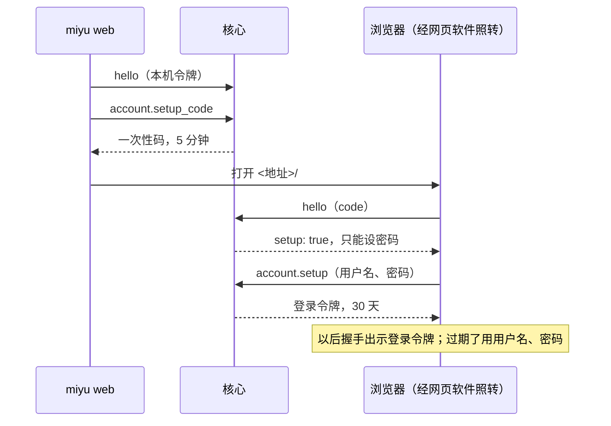

## 网页界面和核心给它的通用方法

### 是什么

网页界面是一个单独的软件：程序 `miyu-web` 加一套页面文件，装了才有，不装就没有。它和终端界面一样是核心的一个头：自己开一个只听本机的 HTTP 端口，给页面，把浏览器的 WebSocket 一帧一条转成核心协议的一行一条（`protocol.md`），经本机套接字（Windows 上是命名管道）连核心。

核心里没有为网页写的代码。网页要的、终端也用得上的几样，核心做成通用的协议方法，哪个头都能调：给人看的字、列文件和找文件、路径、mermaid 画成 SVG、分块传和分块读、链接卡片。身份照旧由核心验：每条连接在握手时出示凭据，核心自己认，网页软件只转发。

网页演示（proto/web-demo 分支的 `web-demo/`）现在靠一个桥顶着这些活（proto/web-demo 分支的 `docs/blueprint/web.md`「和设计 21 的出入」）。这条线做完，桥整个删掉：

| 桥现在干的 | 以后谁干 | 协议上叫什么 | 步 |
|---|---|---|---|
| 1. 页面文件、WebSocket、访问口令、核对 Origin | 网页软件；身份由核心验：第一次用一次性码给管理员设用户名和密码，以后用它们登录 | 握手的 `code`、`user`、`password`、`login`，`account.setup_code`、`account.setup`、`account.logout` | W-8、W-9 |
| 2. `web.human` 给人看的字 | 核心 | `human.get` | W-1 |
| 3. `web.info`、`web.realpath` | 核心 | 握手回应的 `host`，`fs.realpath` | W-3 |
| 4. `/file`、`/blob` | 内容由核心给，地址由网页软件给 | `blob.get`、`fs.read`；网页软件的 `/media` | W-6、W-10 |
| 5. `/upload`、`web.upload_done` | 页面经核心分块传，网页软件不经手 | `blob.open`、`blob.write`、`blob.close` | W-5 |
| 6. `web.link_preview`、`/link-image` | 核心的 `net` 包；卡片的图存成 blob，经 `/media` 给 | `link.preview` | W-7、W-10 |
| 7. `web.mermaid` | 核心的 `mermaid` 包 | `mermaid.render` | W-4 |
| 8. `web.files` | 核心 | `fs.list`、`fs.find` | W-2 |
| 9. 核心没在跑时拉起它 | 网页软件，照别的头 | 无 | W-9 |

状态：图纸，2026-10-01 项目主人批准；W-8（第一条）2026-10-04 照项目主人定的重画，项目主人同一天批准。「网页界面是一个软件，网页的东西不放进核心」是项目主人 2026-10-01 定的，重开了设计 04 的 P5（末尾「要改的设计」）；「画 mermaid 在核心里，做成可选的软件包」也是同一天项目主人定的。技术细节照推荐定了，写在末尾「起草时定的」；项目主人拍板的六题单列一节。施工步子 W-1 到 W-11，W 是和 M8 并行的一条线，不占里程碑的号。W-1 做好了：`human.get`（`crates/miyu-endpoint/src/human.rs`、`crates/miyu-store/src/human.rs` 交出模板原文，`crates/miyu-endpoint/tests/human.rs`）。 W-2 做好了：`fs.list`、`fs.find`（`crates/miyu-fs/src/list.rs`、`find.rs`；`crates/miyu-endpoint/src/files.rs`、`files/cache.rs`；`crates/miyu-fs/src/list/tests.rs`、`find/tests.rs`；`crates/miyu-endpoint/tests/files.rs`）。W-3 做好了：握手回应的 `host`、`fs.realpath`（`crates/miyu-endpoint/src/hello.rs`、`files.rs`；`crates/miyu-endpoint/tests/hello.rs`）；施工时发现「从最近在的一层换成真实的位置」这段逻辑 4-3 就有了（`crates/miyu-fs/src/resolve.rs` 的 `resolve()`），没有新开 `real.rs`，改成直接复用它（「在哪」「起草时定的」第 38 条）。W-5 做好了：`blob.open`、`blob.write`、`blob.close`（`crates/miyu-endpoint/src/uploads.rs`，和 `attach.rs` 共用认是什么、文件名和媒体类型怎么查、存好了怎么拼回应这几样；`crates/miyu-store/src/blob.rs` 多分块暂存、改名进位置、扔掉、起来时清；`crates/miyu-core/src/packages.rs` 多 `clear_uploads`；`crates/miyu-endpoint/tests/uploads.rs`、`crates/miyu-core/tests/packages.rs`）。W-6 做好了：`blob.get`、`fs.read`（`crates/miyu-fs/src/range.rs` 新开的安全地打开以后读一段，`blob.get`、`fs.read` 共用；`crates/miyu-store/src/blob.rs` 多 `Blobs::read_range`；`crates/miyu-endpoint/src/attach.rs` 的 `get`、`files.rs` 的 `read`；`crates/miyu-fs/src/range/tests.rs`、`crates/miyu-endpoint/tests/reads.rs`）。W-7 做好了：`link.preview`（可选软件包 `net`、crate `miyu-net`，细节搬到 `net.md`；在后台答的查询 `crates/miyu-endpoint/src/queries.rs` 的 `register_background`、`connection.rs`；`crates/miyu-core/src/packages/net.rs`；`crates/miyu-net/src/guard/tests.rs`、`html/tests.rs`、`tests/preview.rs`、`tests/proxy.rs`、`crates/miyu/tests/link_preview.rs`）。 W-8 做好了：身份的核心这一半（`crates/miyu-endpoint/src/login.rs`、`login/files.rs`，握手 `hello.rs`、连接 `connection.rs`；`crates/miyu-store/src/accounts.rs`、`logins.rs`；`crates/miyu-ipc` 的 `connect_bare`、`connect_or_start_bare`；`crates/miyu-endpoint/tests/login.rs`、`login_log.rs`，`crates/miyu-ipc/tests/bare.rs`），`miyu web` 随 W-9。 W-9 做好了：网页软件 `miyu-web`（起停、页面、WebSocket 照转）和主程序的 `miyu web`，搬到新页 `web-ui.md`。

- W-1 到 W-7（核心的通用方法）现在就做，和 M8 并行。
- W-8（身份）2026-10-04 照项目主人定的重画（第一条）：只有一个账号 `admin`，网页第一次用本机终端给的一次性码进来、设登录用的用户名和密码，以后用它们登录；成员随多用户那一段。W-9 到 W-11（网页软件、媒体地址、打包）在 W-8 以后，第十一条的 `miyu web` 跟着第一条改了。
- 在那之前网页照旧用桥，桥的活随 W-1 到 W-7 一样样挪进核心。

### 在哪

施工时照这个放。

**核心和主程序这边**：

| 代码 | 管什么 | 步 |
|---|---|---|
| `crates/miyu-endpoint/src/hello.rs` | 握手多认 `code`、`login`；回应多 `host`、`login` | W-3、W-8 |
| `crates/miyu-endpoint/src/human.rs` | `human.get` | W-1 |
| `crates/miyu-endpoint/src/files.rs`、`files/` | `fs.list`、`fs.find`、`fs.realpath`、`fs.read` 的参数和回应；找文件的清单记几份 | W-2、W-3、W-6 |
| `crates/miyu-endpoint/src/uploads.rs` | `blob.open`、`blob.write`、`blob.close`：跟着连接走的上传表、60 秒不写作废 | W-5 |
| `crates/miyu-endpoint/src/attach.rs` | `blob.put` 认是什么、上限，挪成和分块上传共用的一份（W-5）；`blob.get`（W-6） | W-5、W-6 |
| `crates/miyu-endpoint/src/queries.rs` | 可选软件包登记的查询：方法名到怎么答的一张表 | W-4 |
| `crates/miyu-endpoint/src/login.rs`、`login/` | 一次性码、设密码、密码登录和限流、登录令牌，`account.setup_code`、`account.setup`、`account.logout`，握手认四种凭据，用一次性码连着的只能设密码 | W-8 |
| `crates/miyu-store/src/human.rs` | 交出模板的原文，不只是换好的字 | W-1 |
| `crates/miyu-store/src/blob.rs` | 分块暂存、改名进位置；读一段 | W-5、W-6 |
| `crates/miyu-store/src/logins.rs` | `home/<账号>/logins.json`：读、写、删过期的 | W-8 |
| `crates/miyu-store/src/accounts.rs`、`private_json.rs` | `system/accounts.json`：用户名、argon2id 的密码哈希；读、写。只给自己看的 JSON 小文件读写共用 `private_json.rs` | W-8 |
| `crates/miyu-endpoint/src/login/files.rs` | 凭据文件怎么读、改、写，坏了的当空的、照现在的字节盖掉；系统日志的 `account.password_set` | W-8 |
| `crates/miyu-endpoint/src/refusal/message.rs` | 拒绝时给人看的话，从 `refusal.rs` 挪出来（W-8 时过了 500 行） | W-8 |
| `crates/miyu-fs/src/list.rs`、`find.rs` | 列一层；建清单、打分 | W-2 |
| `crates/miyu-fs/src/resolve.rs` | 从最近一层在的目录换成真实的位置：`resolve()`，4-3 就有了，`fs.realpath` 直接复用，没有新开文件（「起草时定的」第 38 条） | W-3 |
| `crates/miyu-fs/src/range.rs` | 安全地打开以后读一段 | W-6 |
| `crates/miyu-mermaid/`（新，第 3 层） | 画 SVG、三种记号色、缓存、第一次用才读字体。可选软件包 `mermaid` | W-4 |
| `crates/miyu-net/`（新，第 3 层） | 地址闸、钉住解析好的地址、自己跟重定向、读到 `</head>`、挖元数据、认图。可选软件包 `net`，以后 `web_fetch` 用同一份 | W-7 |
| `crates/miyu-core/src/packages.rs` | 照编进来的可选软件包往查询表里登记（cargo 开关 `mermaid`、`net`）；起来时清掉分块上传留下的暂存 | W-4、W-5、W-7 |
| `crates/miyu-ipc/src/lib.rs`、`start.rs` | 不读本机令牌的连法：`connect_bare`、`connect_or_start_bare` | W-8 |
| `crates/miyu-cli/src/web.rs` | `miyu web`：现在找主程序真实位置旁边的 `miyu-web`，把参数交给它；有了软件包的清单（M9 那一段第 4 条）照清单找（施工 W-9 定：清单还没有） | W-9 |
| `resources/software/mermaid/style.json` | 字体、三种记号色 | W-4 |
| `resources/software/net/link_preview.json` | 抓链接卡片的规矩：时限、上限、请求头、记多久（照桥的那份） | W-7 |
| `resources/core/human/{zh,en,ja}.json` | 新原因码的话 | 各步 |

**网页软件**：

| 代码 | 管什么 | 步 |
|---|---|---|
| `crates/miyu-web/`（新，第 5 层，头） | 程序 `miyu-web` | W-9 |
| `crates/miyu-web/src/main.rs` | 子命令 `open`、`serve` | W-9 |
| `crates/miyu-web/src/open.rs` | 确保 `serve` 在跑；第一次没有管理员账号的，照终端的样子出示本机令牌要一次性码；开浏览器 | W-9 |
| `crates/miyu-web/src/serve.rs` | 单实例、听端口、写那一行、空闲退出 | W-9 |
| `crates/miyu-web/src/pages.rs` | 页面文件、响应头 | W-9 |
| `crates/miyu-web/src/ws.rs` | 核对 Host、Origin；WebSocket 和核心连接两头照转 | W-9 |
| `crates/miyu-web/src/media.rs`、`media/` | `POST /media` 换票据，`GET /media/<票据>` 分段给；细的见 `web-ui.md`「在哪」 | W-10 |
| `resources/web/web.json` | 出厂的端口、空闲多久、票据记多久、媒体类型的表、页面的内容安全策略 | W-9、W-10 |
| `resources/web/pages/` | 页面文件。M9 的网页搬进主仓库以前，开发时设 `MIYU_WEB_PAGES` 指到网页演示的 `web-demo/` | W-9 |

- 分层照 `01-架构.md` 第九节：`miyu-mermaid`、`miyu-net` 在第 3 层（执行器），`miyu-web` 在第 5 层（头）。门禁读那张表，三行要先登记（「要跟着改的别的页」）。
- `miyu-web` 只依赖 `miyu-ipc`、`miyu-store`、`miyu-kernel`（编号的写法），不依赖 `miyu-endpoint`、`miyu-core`：它不是核心。
- 主程序 `miyu` 不依赖 `miyu-web`。`miyu web` 只是一个找程序、交参数的入口（「怎么走」第十一条）。
- 标 W-8 到 W-11 的几行随用户系统重画（「是什么」末尾）。

### 对外的样子

#### 核心多的方法

都在握手以后用。现在连上来的都是管理员，照 `protocol.md`「握手」第 4 条。

| 方法 | 做什么 | 谁能调 | 步 |
|---|---|---|---|
| `human.get` | 给人看的字：工具的样子、说法的模板 | 都能 | W-1 |
| `fs.list` | 列一层目录 | 都能 | W-2 |
| `fs.find` | 在一个目录里模糊找文件 | 都能 | W-2 |
| `fs.realpath` | 一个路径换成真实的位置 | 都能 | W-3 |
| `mermaid.render` | mermaid 源码画成 SVG。编进了 `mermaid` 包才有 | 都能 | W-4 |
| `blob.open`、`blob.write`、`blob.close` | 分块传一个附件，最后存成 blob | 都能 | W-5 |
| `blob.get` | 分块读这个账号的一个 blob | 都能 | W-6 |
| `fs.read` | 分块读本机的一份文件 | 都能 | W-6 |
| `link.preview` | 一个链接的卡片。编进了 `net` 包才有 | 都能 | W-7 |
| `account.setup_code` | 要一个一次性码：第一次建账号、忘了密码重设 | 只有出示本机令牌连上的 | W-8 |
| `account.setup` | 设登录用的用户名和密码，换一个登录令牌 | 只有用一次性码连上的 | W-8 |
| `account.logout` | 作废登录令牌 | 都能 | W-8 |

#### 握手多的

参数（W-8）：凭据正好写一种：`token`、`code`、`login`，或者 `user` 加 `password`。

| 参数 | 类型 | 说明 |
|---|---|---|
| `token` | 字符串 | 本机令牌，照旧（`ipc.md`） |
| `code` | 字符串 | 一次性码：64 位小写十六进制 |
| `login` | 字符串 | 登录令牌：64 位小写十六进制 |
| `user`、`password` | 字符串 | 登录用的用户名、密码 |

回应多两格：

| 格 | 值 | 步 |
|---|---|---|
| `host` | `{"home": <系统的家目录>, "platform": "linux" 或 "macos" 或 "windows", "workspace": <这个账号的工作区>}`，总有 | W-3 |
| `login` | `{"expires": <时刻>, "token": <登录令牌>}`：只在用密码握手时有（用一次性码的在 `account.setup` 的回应里） | W-8 |
| `setup` | `true`：用一次性码连上的，只能设密码 | W-8 |

```json
{"id":"h1","jsonrpc":"2.0","result":{"account":"admin","core":{"version":"0.1.0"},"host":{"home":"<家目录>","platform":"macos","workspace":"<家目录>/.miyu/home/admin/workspace"},"language":"zh","login":{"expires":"2026-10-31T06:00:00.000Z","token":"9f…"},"protocol":1,"sandbox":{"usable":true}}}
```

#### 每个方法的参数和回应

**`human.get`**（W-1）

| 参数 | 类型 | 说明 |
|---|---|---|
| `language` | 字符串，可以不写 | 2 到 8 个小写字母，例如 `zh`。不写照这个连接的语言（握手回应的 `language`） |

回应 `{"language": <语言>, "said": {<说法的编号>: <模板>}, "tools": {<工具名>: <样子>}}`。样子照 `store/resources.md` 的 `Face`：`name`，可以有 `subject`、`icon`、`block`。

**`fs.list`**（W-2）

| 参数 | 类型 | 说明 |
|---|---|---|
| `cwd` | 字符串，必写 | 相对的路径照它接：绝对路径，或者 `~`、`~/…`，头报的那种写法 |
| `dir` | 字符串，不写是 `""` | 打的那一截目录：`~` 打头的照家目录，绝对的照原样，别的照 `cwd` |
| `prefix` | 字符串，不写是 `""` | 名字的开头 |

**`fs.find`**（W-2）

| 参数 | 类型 | 说明 |
|---|---|---|
| `cwd` | 字符串，必写 | 在哪个目录里找，写法同上 |
| `query` | 字符串，不写是 `""` | 打的字 |
| `fresh` | 布尔，不写是 `false` | 头开列表时写 `true`：清单建好 10 秒以上的重建 |

两个的回应一个样子：`items` 每一条 `{"dir": <布尔>, "full": <绝对路径>, "marks": [<第几个字>…], "path": <列表上写的>, "size": <字节数>}`，`size` 只有文件才有；`partial` 列没列全；`fs.find` 另有 `building`：清单还在建。

```json
{"building":false,"items":[{"dir":false,"full":"<家目录>/src/miyu/src/main.rs","marks":[4,5,6,7],"path":"src/main.rs","size":2048}],"partial":false}
```

**`fs.realpath`**（W-3）：`path` 必写；`cwd` 可以不写，`path` 是相对的才要。回应 `{"path": <真实的位置>}`。

**`mermaid.render`**（W-4）：`source` 必写。回应 `{"marks": {"label": <色>, "line": <色>, "text": <色>}, "svg": <SVG 的字>}`：SVG 里字、线、连线标签垫底用的三种记号色，头照它换成自己的颜色（第五条第 7 款）。

**`blob.open`、`blob.write`、`blob.close`**（W-5）

| 方法 | 参数 | 回应 |
|---|---|---|
| `blob.open` | `name`（必写，照 `blob.put`）、`media_type`（可以不写，照 `blob.put`）、`size`（必写，非负整数：一共几个字节） | `{"upload": <上传编号>}` |
| `blob.write` | `upload`、`offset`（非负整数，从 0 数）、`data`（base64，一块最多 512 KiB） | `{"received": <一共收到几个字节>}` |
| `blob.close` | `upload` | 照 `blob.put` 的回应：`blob`、`name`、`media_type`、`kind`，图片另有 `width`、`height` |

**`blob.get`**（W-6）：`blob` 必写（内容哈希）；`offset` 不写是 0；`length` 不写是 512 KiB，最多 512 KiB，写 0 只问大小。回应 `{"data": <这一段的 base64>, "size": <一共几个字节>}`。

**`fs.read`**（W-6）：`path` 必写（绝对路径，或者 `~`、`~/…`）；`offset`、`length` 同 `blob.get`。回应同 `blob.get`。

**`link.preview`**（W-7）：`url` 必写。回应二选一：

```json
{"card":{"description":"…","icon":{"blob":"sha256:…","media_type":"image/x-icon"},"image":{"blob":"sha256:…","media_type":"image/png"},"site":"GitHub","title":"…","url":"https://github.com/…"}}
{"card":null,"why":"no_preview"}
```

- `image`、`icon` 可以是 `null`。图是这个账号的 blob，头照 `blob.get` 读，网页照 `/media` 给。
- `why`：`not_a_url`（读不成地址）、`unsupported_scheme`（不是 http、https）、`no_preview`（不是网页、没有标题、地址过不了闸、跳转太多，下次也一样）、`unreachable`（超时、连不上、对方回 4xx、5xx，过会儿可能就好了）。做不出卡片是正常的结果之一，不是出错。
- 细节（地址闸、代理、在后台答）见 `net.md`。

**`account.setup_code`**（W-8）：没有参数。回应 `{"code": <一次性码>, "expires": <时刻>, "first": <还没设过密码>}`。

**`account.setup`**（W-8）：`username`、`password`，都是字符串。回应 `{"username": …, "login": {"expires": <时刻>, "token": <登录令牌>}}`。

**`account.logout`**（W-8）：`all` 布尔，不写是 `false`。回应 `{"revoked": <作废了几个>}`。

#### 网页软件对外的样子

命令（W-9）：

| 命令 | 做什么 |
|---|---|
| `miyu web` | 打开网页：确保网页软件在跑，开浏览器。还没设过密码的，先要一个一次性码，带着它开 |
| `miyu web --reset` | 忘了密码：要一个一次性码带着它开浏览器，重设用户名和密码；设好了以前的浏览器登录全部作废 |
| `miyu web --print` | 不开浏览器，印出网址（要一次性码的连码一起），人自己开 |
| `miyu web --port <端口>` | 网页软件这一次在哪个端口上听；`0` 是随便挑一个空的 |
| `miyu web --logout` | 作废这个账号全部的登录令牌：所有浏览器都要用密码再登一次 |
| `miyu-web open …`、`miyu-web serve` | `miyu web` 交给的程序本身；`serve` 是 `open` 拉起来的，不写进帮助 |

HTTP（W-9、W-10）：

| 请求 | 做什么 | 要什么 |
|---|---|---|
| `GET /`、`GET /<页面文件>` | 页面文件 | Host 对得上。不要登录：里面没有秘密 |
| `GET /ws` | WebSocket：转到核心 | Host、Origin 对得上；身份在握手里，核心验 |
| `POST /media` | 换一张票据 | `Authorization: Bearer <登录令牌>` |
| `GET /media/<票据>` | 一个 blob 或者一份本机文件，可以带 `Range` | 票据 |

数据根里多的文件（W-9）：

| 文件 | 内容 | 谁写 |
|---|---|---|
| `run/web.lock` | 空文件，网页软件的单实例锁在它上面 | 网页软件 |
| `run/web` | 一行：网页的地址，`http://127.0.0.1:<端口>` | 网页软件，每次起来 |
| `home/<账号>/logins.json` | 登录令牌的哈希、什么时候造的、什么时候过期（W-8） | 核心 |
| `system/accounts.json` | 登录用的用户名、argon2id 的密码哈希（W-8） | 核心 |

### 怎么走

**一、身份：本机的浏览器怎么进来**（W-8，2026-10-04 照项目主人定的重画，项目主人同一天批准）

项目主人 2026-10-01 定的方向（第 1 到 3 题），2026-10-04 定的细节：

- 只有一个账号 `admin`，编号、家目录 `home/admin/` 不变（设计 06 U13）。网页第一次进来，是给 `admin` 设登录用的用户名和密码；用户名只用来登录，默认 `admin`，日志、家目录里照旧是 `admin`。成员（编号就是用户名）随多用户那一段。
- 本机的头（终端界面、`miyu ask`）照旧出示本机令牌，就是 `admin`。网页登录的也是 `admin`：两边看到的是同一批会话。
- 一次性码只从本机的终端来（`miyu web`）：第一次建、忘了密码重设，都用它；用过就作废，在命令行里出现没关系（第 3 题）。
- 以后用用户名和密码登录，浏览器记住 30 天（第 2 题）。密码用 argon2id（设计 06 U4，依赖加 `argon2`）。
- `miyu web --logout` 要：在本机作废全部浏览器的登录。



1. **凭据放在哪**：`system/accounts.json`（照 Linux 的 `/etc/shadow`）：`{"version":1,"accounts":[{"id":"admin","username":<用户名>,"password":"$argon2id$v=19$m=19456,t=2,p=1$…","changed":<时刻>}]}`。照写配置文件的办法（`crates/miyu-store/src/config_file.rs`）先写临时文件再改名，Unix 上 0600。没有这个文件、没有 `admin` 那一行：还没设密码。读不了、坏了：当是没设，记一行 `WARN accounts not read`，只有一次性码进得来。
2. **`account.setup_code`**：只给出示本机令牌连上的连接，别的回 `local_only`。码是 32 个系统给的随机字节，写成 64 位小写十六进制；5 分钟内有效（设计 21 X6）；只在核心的内存里，核心重启全部作废；同时最多 16 个，多了丢掉最早的。回应 `{"code": …, "expires": …, "first": <还没设过密码>}`，`miyu web` 照 `first` 说「建账号」还是「重设密码」。
3. **握手带 `code`**：在内存里、没过期，当场作废，这个连接是 `admin`，回应多 `"setup": true`。这样的连接只能调 `hello`、`human.get`（页面要字）、`account.setup`，别的回 `setup_first`。对不上、过期了、用过了：`bad_code`，回完断开。页面中途刷新了：码已经用掉，再运行一次 `miyu web`。
4. **`account.setup`**：参数 `username`、`password`。用户名照「路径里的名字」的写法（`kernel/ids.md`：小写字母开头，只有小写字母、数字、`-`、`_`，最长 32 个字符）；密码 8 到 1024 个字节，不能全是空白。不合的 `bad_params`，连接照旧是设密码的样子，可以再来。合了：在阻塞线程里算 argon2id，写 `accounts.json`，作废这个账号全部的登录令牌（重设的时候把以前的浏览器都踢出去），造一个新的登录令牌（第 7 条）。落了盘才回应 `{"username": …, "login": {"expires": …, "token": …}}`，这个连接从此是完整的 `admin`。系统日志记一条 `account.password_set`（`by` 是 `admin`，不带用户名以外的东西）。
5. **握手带 `user`、`password`**：用户名对上 `accounts.json` 里的、密码验得过（阻塞线程里验）：这个连接是那个账号，回应带新造的登录令牌 `login`。对不上（用户名不对和密码不对一样说）：`bad_password`，回完断开。同一个用户名 60 秒内错 5 次，这 60 秒里剩下的都回 `login_throttled`（`data.retry_after_ms`），连密码都不验（设计 06 U4 的初值，策略数据）。计数只在内存里。现在只有本机的浏览器经网页软件进来，看不到来源，按用户名数；远程访问做的时候再加按来源。
6. **握手带 `login`**：登录令牌的 SHA-256 在这个账号的 `home/admin/logins.json` 里、没过期，这个连接就是这个账号。对不上、过期了、作废了：`bad_login`，回完断开，页面改问用户名、密码。查的时候照哈希找，不逐字节比原文。
7. **登录令牌**：32 个随机字节，64 位小写十六进制，30 天（设计 06 U4）。`logins.json` 的写法：`{"version":1,"tokens":[{"created":<时刻>,"expires":<时刻>,"hash":"sha256:<64 位>"}]}`，先写临时文件再改名，Unix 上 0600。每次写都把过期的删掉；最多 64 行，多了删最早造的。读不了、坏了：当是空的，记一行 `WARN logins not read`，用登录令牌的都进不来，用密码再登一次就是。
8. **凭据只能写一种**：`token`、`code`、`login`、`user` 加 `password`。都没写：`bad_token`，照旧。写了不止一种、`user` 和 `password` 只写了一个：`bad_params`，回完断开。
9. 用一次性码、密码、登录令牌连上的，和出示本机令牌的一样是 `admin`，命令照账号判（设计 06）。只差一样：不能要一次性码。浏览器拿到登录令牌、知道密码，也换不出一次性码，一次性码只能从本机的终端来。
10. **`account.logout`**：用登录令牌连上的，`all` 不写，作废这一个，回完断开这个连接；`all` 写 `true`，作废这个账号全部的登录令牌，断开所有用登录令牌、密码连着的连接（这个连接回完再断）。出示本机令牌的只能写 `all: true`，不然 `bad_params`。作废就是从 `logins.json` 里删掉那一行。密码不动。
11. 一次性码、密码、登录令牌一个字都不进运行日志。握手过了记 `INFO connected head=… version=… protocol=1 via=token`（`code`、`password`、`login`）。
12. 别的进程（包括沙盒里的命令）连上核心的套接字、网页软件的端口，都没有凭据：本机令牌、`accounts.json`、`logins.json` 在数据根里，沙盒读不到（设计 11 第五节）；一次性码只在终端里印出、5 分钟、用一次；登录令牌只在浏览器里，和网页软件转发、换票据时的内存里（第十条第 2 款），不落盘。

**二、给人看的字**（`human.get`，W-1）

1. 每次现读资源目录：照 `Human::load` 的读法，先读内核的 `core/human/<语言>.json`，再照名字的先后读 `software/` 下每个软件包的 `human/<语言>.json`，哪一份没有这种语言照英文（`store/resources.md`「怎么走」第 3 条）。开发时改了资源，不用重启核心。在阻塞线程里读。
2. `tools` 合成一张，后读的盖掉先读的同名工具；`said` 的编号前面加上它在资源目录里的位置（`core/…`、`software/<包>/…`），模板照原样给。换字段是头的事，照 `store/resources.md`「怎么走」第 4 条：控制字符换成 `�`。
3. 不给 `config` 那一格：配置的名字、说明在 `config.schema` 里。
4. 读得到却读不懂的：`internal_error`，记一行 `WARN human not read error=…`，写明是哪一份。
5. 回应的 `language` 是要的那一种；哪一份退回了英文，回应里不分，和 `miyu ask` 读到的一样。

**三、列文件、找文件**（`fs.list`、`fs.find`，W-2；照 proto/tui-demo 分支 `docs/blueprint/tui.md`「`@` 文件列表」第 2、3 条，设计 13 H14）

1. `cwd` 照 `fs.md` 换成真实的位置（`~` 照家目录接），要是一个目录。换不成、不在、不是目录：`path_unreadable`。
2. 数据根：落在数据根里、又不在这个账号的工作区里的，不列、不找，回 `path_forbidden`（照 `fs.md` 边界表的「谁都不能碰」那一片）。列的时候每一条照真实的位置判，落进那一片的不列。工作区在数据根里（默认的会话就在那里干活），照样能列。
3. `fs.list`：`dir` 照参数表接好、换成真实的位置，只读那一层。名字照开头对 `prefix`，大小写不论。点开头的藏起来，`prefix` 以 `.` 开头才列。目录在前、文件在后，各照名字排（大小写不论）。目录的 `path` 后面带 `/`。最多 50 条，多了截掉、`partial` 是 `true`。`marks` 是 `path` 的前几个字，`prefix` 有几个字就几个。
4. `fs.find`：在 `cwd` 里建一份清单：`ignore` 库，和核心的 `glob`、`grep` 同一套，认 `.gitignore`（不要求是 git 仓库），跳过隐藏目录和出厂名单里的 `node_modules`、`target`，跳过数据根（工作区除外），不跟链接；最深 8 层，最多 20000 个，收满就停、`partial` 是 `true`。`path` 是相对 `cwd` 的，用 `/` 连，目录后面带 `/`。
5. 清单在阻塞线程里建，不挡别的请求。还没建完，照已经建好的那一部分答，`building` 是 `true`；头隔 200 毫秒再问，直到 `false`。
6. 什么时候重建：这个目录还没有清单；`fresh` 是 `true`、清单建好 10 秒以上。核心最多记 4 个目录的清单，多了丢最久没用的。同一个目录同时来两次，第二次等第一次建的那一份。
7. 怎么排：打的字照先后都在 `path` 里（大小写不论）才列。先试整个落在文件名里，落不下再从路径开头找；每个字对上 1 分，落在文件名里多 3 分，在一段的开头（路径的头一个字，或者前面是 `/`、`-`、`_`、`.`、空格）多 8 分，和上一个字连着多 5 分；文件名去掉扩展名正好是打的字多 100 分。分高的在前，一样的路径短的在前，再一样的照字排。最多 50 条。`query` 是空的都对得上、0 分。打分照桥的 `mention.rs` 的 `score`，测试一起搬过来。
8. `full` 照平台的写法（Windows 上是 `C:\…`）；`size` 照文件现在的大小，读不出的不写。
9. 出厂的数（50、20000、8 层、10 秒、200 毫秒、4 份、跳过的名单）写在 `crates/miyu-fs/src/find.rs`，照 `jobs.output_chars` 的放法，配置那一步能改。

**四、路径**（W-3）

1. 握手回应的 `host`：`home` 是核心起来时拿到的系统的家目录，照原样；`platform` 是核心所在的平台；`workspace` 是这个账号的工作区，换成真实的位置。头拿 `home` 把路径写成 `~/…`，拿 `platform` 认路径分隔、命令的引号怎么写，拿 `workspace` 当新会话默认的工作目录（设计 11 第四节：网页上开的会话默认在账号的工作区）。
2. `fs.realpath`：`~` 照家目录接；相对的接在 `cwd` 上，没给 `cwd` 的 `bad_params`。从它自己往上找第一层在的，那一层换成真实的位置，后面几段原样接上：还没建出来的目录，建出来以后就是这个位置。一层都不在（Windows 上盘符都没有）：`path_unreadable`。
3. 只说位置，不读内容：落在数据根里的照样换。

**五、mermaid**（`mermaid.render`，W-4；设计 04 第五节、13 第九节，2026-10-01 项目主人定）

另见 `mermaid.md`：施工 W-4 时这一节的内容搬过去了，连同「在哪」`crates/miyu-mermaid/`、`style.json` 那两行的细节、「守着它的」对应的那一行（`web-module.md`「起草时定的」第 23 条）。

**六、分块上传**（`blob.open`、`blob.write`、`blob.close`，W-5；设计 04 第十节「后续再定」的分块上传）

1. `blob.open`：`name`、`media_type` 照 `blob.put` 第 1 条的写法查；`size` 超过 20 MiB（20,971,520 字节）当场 `attachment_too_big`。这个连接同时开着 4 个的：`too_many_uploads`。成了交回上传编号（16 位小写十六进制），在这个账号的 `blobs/tmp/` 里建暂存文件 `upload-<编号>`。
2. `blob.write`：`offset` 要正好等于已经收到的字节数，不对回 `upload_offset`，`data.received` 写已经收到几个，头从那里接着传。`data` 不是 base64、解出来超过 512 KiB、加上它超过 `size`：`bad_params`。写进暂存文件，边写边算 SHA-256。
3. `blob.close`：收到的不够 `size`：`upload_incomplete`（`data.received`）。够了：照 `blob.put` 第 4 条认是什么、查图片的上限，照第 5 条存：暂存文件改名进位置，同一份内容已经有了的，删掉暂存的，还是那一个 blob。回应和 `blob.put` 一样。
4. 上传跟着连接走：编号只认开它的那个连接，别的连接拿来用回 `upload_unknown`。连接断了，它开的上传全部作废、删掉暂存文件。60 秒没有 `blob.write` 的，也作废。`close` 以后编号作废。
5. 同一个连接上的请求本来就一条条办（`protocol.md`「一个连接」第 1 条），一个上传不会同时写两块。一个附件拆成 40 块左右，一块一个来回。
6. 核心起来时清掉 `blobs/tmp/` 里的 `upload-*`：崩了、被杀留下的。
7. 不碰会话，不进会话的日志，和 `blob.put` 第 6 条一样。附件的大小上限和 `blob.put` 同一个数，一处定义。

**七、分块读**（`blob.get`、`fs.read`，W-6）

1. `blob.get`：这个账号的 blob，照属主给，不照会话（「起草时定的」第 12 条）。没有：`unknown_blob`。
2. `fs.read`：照 `fs.md` 换成真实的位置，`~` 照家目录接，相对的 `bad_params`。照边界表落在「谁都不能碰」那一片（数据根里、工作区以外）：`path_forbidden`。照 `fs.md` 第四节安全地打开，路上一层链接都不跟；没有、不是普通文件、没有权限：`path_unreadable`。能读哪些是项目主人 2026-10-01 定的（第 4 题）。
3. 读法：从 `offset` 起读 `length` 个字节，读到结尾就停；`offset` 过了结尾的，`data` 是空的。`size` 是打开那一刻的大小。`length` 写 0 只回 `size`，`data` 是空的。超过 512 KiB：`bad_params`。
4. 一段一段读不重新核对哈希：核对整个 blob 的哈希在核心自己用它的时候（`store.md` 第 10 条）。
5. 在阻塞线程里读。

**八、链接预览**（`link.preview`，W-7）

另见 `net.md`：施工 W-7 时这一节的内容搬过去了，连同「在哪」`crates/miyu-net/`、`link_preview.json` 那两行的细节、「守着它的」对应的那一行。

**九、网页软件：起停、端口、页面、WebSocket**（W-9）：挪到 `web-ui.md`「怎么走」第一条（施工 W-9）。

**十、网页软件：媒体地址**（W-10）：挪到 `web-ui.md`「怎么走」第三条（施工 W-10）。

**十一、`miyu web`**（W-9）：挪到 `web-ui.md`「怎么走」第二条（施工 W-9）。

**十二、三个平台**

1. 网页软件连核心走 `miyu-ipc`：Linux、macOS 是 Unix 域套接字，Windows 是命名管道，照 `ipc.md`。`connect_bare` 在三个平台上都只是不读 `run/token`，核对目录、核对管道另一头照旧。
2. 拉起 `serve` 照拉起核心的办法跟终端脱开：Unix 上自成一个进程组，Windows 上 `DETACHED_PROCESS`、`CREATE_NEW_PROCESS_GROUP`。
3. 打开网址：`xdg-open`、`open` 收一个参数，不经 shell；Windows 照 `cmd` 的规矩加引号。
4. `fs.list`、`fs.find` 的 `path` 一律用 `/`，`full` 照平台；`dir` 在 Windows 上 `\` 和 `/` 都认。点开头的算藏起来，三个平台一样，不看 Windows 的隐藏属性。
5. 测试里的临时目录先换成真实的位置再比（macOS 的 `/var` 是链接）。
6. 端口只听 `127.0.0.1`。浏览器把 `localhost` 解析成 `::1` 的连不上，所以网址一律写 `127.0.0.1`；Host 认 `localhost`、`[::1]` 只为人自己敲地址的时候。

### 样子

这条线不加给模型看的字：`link.preview` 只给头，`mermaid.render` 的 SVG 只给头，都不进请求。

**`miyu web`**，例子：

```text
$ miyu web
还没设过网页的登录密码：带着一次性码打开网页，在网页上设用户名和密码。
网页开在 http://127.0.0.1:<端口>，已经交给浏览器打开。
浏览器没打开的话，用 miyu web --print。

$ miyu web
网页开在 http://127.0.0.1:<端口>，已经交给浏览器打开。

$ miyu web --reset --print
在浏览器里打开，重设用户名和密码：
http://127.0.0.1:<端口>/#setup=9f03b21c…
这个链接 5 分钟内有效，只能用一次，别发给别人。
```

**握手**，例子（页面第一次，经网页软件照转）：

```json
{"id":"h1","jsonrpc":"2.0","method":"hello","params":{"protocol":[1,1],"head":{"kind":"web","version":"0.1.0"},"locale":"zh-CN","code":"9f03b21c…"}}
{"id":"h1","jsonrpc":"2.0","result":{"account":"admin","core":{"version":"0.1.0"},"host":{…},"language":"zh","protocol":1,"sandbox":{"usable":true},"setup":true}}
{"id":"s1","jsonrpc":"2.0","method":"account.setup","params":{"username":"shorin","password":"…"}}
{"id":"s1","jsonrpc":"2.0","result":{"login":{"expires":"2026-11-03T06:00:00.000Z","token":"5c1e…"},"username":"shorin"}}
```

以后（登录令牌过期了的）：

```json
{"id":"h1","jsonrpc":"2.0","method":"hello","params":{"protocol":[1,1],"head":{"kind":"web","version":"0.1.0"},"user":"shorin","password":"…"}}
```

### 出错

协议的拒绝照 `protocol.md`「出错」：`code` 是 `-32010`，原因码在 `data.reason`。新的原因码：

| 原因码 | 什么时候 | 步 |
|---|---|---|
| `bad_code` | 握手的一次性码对不上、过期了、用过了（之后断开） | W-8 |
| `bad_login` | 握手的登录令牌对不上、过期了、作废了（之后断开） | W-8 |
| `bad_password` | 握手的用户名、密码对不上（之后断开） | W-8 |
| `login_throttled` | 这个用户名 60 秒内错了 5 次；`data.retry_after_ms`（之后断开） | W-8 |
| `setup_first` | 用一次性码连上的，先设密码 | W-8 |
| `local_only` | 不是出示本机令牌连上的，要一次性码 | W-8 |
| `path_unreadable` | 换不成真实的位置、不在、该是目录的不是目录、该是普通文件的不是、没有权限 | W-2、W-3、W-6 |
| `path_forbidden` | 落在数据根里、又不在这个账号的工作区里 | W-2、W-6 |
| `mermaid_too_long` | 源码超过 64 KiB | W-4 |
| `mermaid_failed` | 画不出；`data.detail` 是画图的库的原话 | W-4 |
| `too_many_uploads` | 这个连接同时开着 4 个上传 | W-5 |
| `upload_unknown` | 没有这个上传：编号不对、作废了、不是这个连接开的 | W-5 |
| `upload_offset` | `offset` 和收到的对不上；`data.received` | W-5 |
| `upload_incomplete` | `close` 时没收齐；`data.received` | W-5 |
| `unknown_blob` | 这个账号没有这个 blob | W-6 |

- `bad_params` 多几种：握手写了不止一种凭据、`user` 和 `password` 只写了一个；不是用一次性码连上的调 `account.setup`；`account.setup` 的用户名不合写法、密码不到 8 个字节、超过 1024 个字节、全是空白；`language` 不合写法；`fs.realpath` 相对的没给 `cwd`；`fs.read` 是相对的；`length` 超过 512 KiB；`blob.write` 的 `data` 不是 base64、太大、超过 `size`；`account.logout` 出示本机令牌的没写 `all: true`；mermaid 源码是空的。
- `attachment_too_big` 多一种：`blob.open` 的 `size` 超过 20 MiB；`blob.close` 认出是图、超了图的上限。
- `internal_error` 多几种：给人看的字读不懂；`accounts.json`、`logins.json` 写不下；暂存文件建不了、写不进；画图的库初始化不了（读不到字体）。

网页软件的 HTTP：

| 状态 | 什么时候 |
|---|---|
| 403 | Host 不对；`/ws` 的 Origin 不对；`/media` 的路径在数据根里 |
| 400 | `/media` 的正文不是 JSON 对象、`blob` 和 `path` 不是正好一个、`type`、`name` 不是字符串、`download` 不是布尔（施工 W-10） |
| 401 | `/media` 没带、带错了登录令牌；令牌作废了、过期了（这个令牌的票据一起作废，施工 W-10） |
| 404 | 页面文件没有；票据不认识；blob、文件没有 |
| 405 | 页面文件、`/media/<票据>` 不是 `GET`；`/media` 不是 `POST` |
| 416 | `Range` 超出 |
| 502 | 连不上核心（`/media`） |

运行日志（核心的目标 `miyu::endpoint`，网页软件的 `miyu::web`，一律英文）：

| 级别 | 行 | 什么时候 |
|---|---|---|
| `WARN` | `human not read error=…` | 给人看的字读不懂（W-1） |
| `WARN` | `files index failed dir=… error=…` | 建清单时读不了一层目录，跳过它接着建（W-2） |
| `WARN` | `mermaid not ready error=…` | 画图的库初始化不了（W-4） |
| `WARN` | `upload not stored error=…` | 暂存、改名进位置没成（W-5） |
| `INFO` | `password set first=…` | `account.setup` 设好了密码（W-8） |
| `INFO` | `login issued via=…` | 造了一个登录令牌：`setup`、`password`（W-8） |
| `INFO` | `logins revoked count=…` | `account.logout`、重设密码（W-8） |
| `WARN` | `accounts not read error=…`、`accounts not written error=…` | `accounts.json` 读不了、写不下（W-8） |
| `WARN` | `logins not read error=…`、`logins not written error=…` | `logins.json` 读不了、写不下（W-8） |
| `WARN` | `bad code`、`bad login`、`bad password`、`login throttled` | 握手被拒（W-8；只写 `head`） |
| `INFO` | `login revoked, closed` | 连接靠的登录令牌作废了，断开（W-8） |
| `WARN` | `password not hashed error=…`、`no random bytes error=…` | 算不出密码哈希、系统给不出随机字节（W-8），回 `internal_error` |
| `INFO` | `listening url=…`、`stopped reason=…` | 网页软件起来、退出（W-9） |
| `WARN` | `rejected host=… origin=…` | Host、Origin 不对（W-9） |
| `WARN` | `media cut short offset=… error=…` | `/media` 给到一半核心那头断了、给得比说的少（W-10） |
| `WARN` | `no random bytes for a ticket` | 系统给不出随机字节，票据造不成，回 500（W-10） |
| `WARN` | `core unreachable error=…` | 连不上核心（W-9） |
| `WARN` | `link preview failed host=… why=…` | 抓卡片没成，只写主机名（W-7，目标 `miyu::net`） |

### 给人看的字

协议的拒绝照握手时的语言，中文、英文各一句：

| 原因码 | 中文 | 英文 |
|---|---|---|
| `bad_code` | 这个一次性码用不了了：过期了，或者已经用过。再运行一次 miyu web。 | This one-time code no longer works: it expired or was already used. Run miyu web again. |
| `bad_login` | 登录过期了，或者被退出了，用用户名和密码再登录一次。 | The login expired or was signed out. Sign in with your username and password. |
| `bad_password` | 用户名或者密码不对。 | Wrong username or password. |
| `login_throttled` | 错的次数太多了，过一分钟再试。忘了密码的话，在本机运行 miyu web --reset。 | Too many failed attempts. Try again in a minute. Forgot the password? Run miyu web --reset on this machine. |
| `setup_first` | 先设好用户名和密码。 | Set a username and password first. |
| `local_only` | 只有本机的终端能要一次性码。 | Only a terminal on this machine can ask for a one-time code. |
| `path_unreadable` | 读不了这个路径。 | This path cannot be read. |
| `path_forbidden` | 这是 Miyu 自己的数据，不给看。 | This is Miyu's own data and is not shown. |
| `mermaid_too_long` | 这张图的源码太长了。 | The diagram source is too long. |
| `mermaid_failed` | 这张图画不出来。 | The diagram could not be drawn. |
| `too_many_uploads` | 同时传的文件太多了，等前面的传完。 | Too many uploads at once; wait for the others to finish. |
| `upload_unknown` | 没有这个上传，可能等太久作废了，重新传一次。 | No such upload; it may have expired. Upload the file again. |
| `upload_offset` | 上传接不上，从核心说的地方接着传。 | The upload is out of step; continue from where the core says. |
| `upload_incomplete` | 文件还没传完。 | The file is not fully uploaded yet. |
| `unknown_blob` | 找不到这份内容。 | This content cannot be found. |

`miyu web` 和网页软件印的（照 `ui.language`，和 `miyu ask` 一样）：

| 什么时候 | 中文 | 英文 |
|---|---|---|
| 交给了浏览器 | 网页开在 {url}，已经交给浏览器打开。 | The web UI is at {url} and has been opened in your browser. |
| 带了码的提示 | 浏览器没打开的话，用 miyu web --print。 | If the browser did not open, use miyu web --print. |
| 第一次 | 还没设过网页的登录密码：带着一次性码打开网页，在网页上设用户名和密码。 | No web password yet: opening the web UI with a one-time code to set a username and password. |
| `--print --reset` | 在浏览器里打开，重设用户名和密码： | Open this in a browser to reset the username and password: |
| 起不来、连不上核心 | 网页软件起不来：{原因}；连不上核心：{原因} | The web UI could not start: {reason}; Could not reach the core: {reason} |
| `--print` | 在浏览器里打开： | Open this in a browser: |
| `--print` 的提醒 | 这个链接 5 分钟内有效，只能用一次，别发给别人。 | This link works once within 5 minutes. Do not share it. |
| 没装 | 没装网页界面。装法：装和 miyu 同一个版本的 miyu-web 包（各发行版怎么装），它装在 miyu 旁边。 | The web UI is not installed. Install the miyu-web package of the same version as miyu (…); it goes next to miyu. |
| 端口被占 | 端口 {port} 被占了。换一个：miyu web --port <端口> | Port {port} is in use. Pick another: miyu web --port <port> |
| `--logout` | 作废了 {count} 个登录，浏览器要用密码再登一次。 | Signed out {count} logins; browsers need to sign in with the password again. |

### 守着它的

施工时照这个写：

| 测试 | 守哪几条 | 步 |
|---|---|---|
| `crates/miyu-endpoint/tests/human.rs` | 和 `Human::load` 读到的一样；编号带位置；软件包盖掉内核的同名工具；没有这种语言照英文；不带 `config`；读不懂的说是哪一份；改了资源下一次就是新的 | W-1 |
| `crates/miyu-fs/src/find/tests.rs`、`list/tests.rs` | 打分（照桥的 `score` 测试）；按目录找：开头对、点开头打了点才列、目录在前、50 条截断；模糊找：认 `.gitignore`、跳过隐藏目录和名单、最深几层、收满就停 | W-2 |
| `crates/miyu-endpoint/tests/files.rs` | 真核心：数据根不列不找、工作区照样列；清单没建完先给一部分、`building`；`fresh` 隔 10 秒才重建；最多记 4 份；`path` 用 `/` | W-2 |
| `crates/miyu-endpoint/tests/hello.rs` | `host` 三格，`workspace` 是真实的位置；`fs.realpath` 往上找最近在的一层、相对的要 `cwd` | W-3 |
| `crates/miyu-mermaid/src/tests.rs`、`crates/miyu-core/tests/packages.rs` | 记号色都换得掉、底和框不填色；同一份源码第二次不重画；空的、太长、画不出各说一句；没编进来回 `unknown_method`；第一次调之前不读字体 | W-4 |
| `crates/miyu-endpoint/tests/uploads.rs` | 分块传完和 `blob.put` 同一个回应、同一个 blob；接不上回 `received`；没收齐不收；别的连接用不了；断开、60 秒不写作废并删暂存；超过 20 MiB 当场拒；同时 4 个；起来时清暂存 | W-5 |
| `crates/miyu-endpoint/tests/reads.rs` | 读一段、读到结尾、过了结尾是空的、只问大小；没有这个 blob；`fs.read` 数据根拒、工作区能读、链接不跟、不是普通文件 | W-6 |
| `crates/miyu-net/src/guard/tests.rs`、`html/tests.rs`、`tests/preview.rs`、`tests/proxy.rs` 等 | 地址闸的表、元数据、跳转、图、记多久、代理、在后台答：细节见 `net.md`「守着它的」 | W-7 |
| `crates/miyu-endpoint/tests/login.rs` | 一次性码只给本机令牌的连接、一次、5 分钟、`first`；用码连上的只能设密码；用户名、密码的写法；设好了换出登录令牌、落了盘才回、以前的登录全部作废；密码登录对、错一样的话、60 秒错 5 次就拒、不验；登录令牌认得、过期不认、作废不认；凭据写两种、只写用户名拒；`logout` 一个、全部、断开连接；`accounts.json`、`logins.json` 坏了的样子；日志里没有码、密码、令牌 | W-8 |
| `crates/miyu-store/src/accounts/tests.rs` | `accounts.json` 读写一字不差、0600、改名落盘；argon2id 的参数照写的、验得过、错的验不过 | W-8 |
| `crates/miyu-ipc/tests/socket.rs`、`pipe.rs` | `connect_bare` 连得上、不读 `run/token` | W-8 |
| `crates/miyu-web/tests/serve.rs` | 单实例、`run/web`、那一行；Host、Origin 不对 403；页面文件不出页面目录；响应头；不设 cookie；空闲退出 | W-9 |
| `crates/miyu-web/tests/ws.rs` | 真核心：一帧一行两头照转、一个字节都不改；握手的凭据照原样到核心；核心断了 WebSocket 关 1012；网页软件的代码里不读本机令牌（照源码查） | W-9 |
| `crates/miyu-web/tests/open.rs`、`crates/miyu/tests/web.rs` | 没设过密码、`--reset` 的带一次性码，别的不带；`--print`；`--logout`；没装时说怎么装 | W-9 |
| `crates/miyu-web/tests/media.rs`、`src/media/tests.rs` | 换票据要登录令牌；同一个资源交回同一张；`Range` 206、416；类型照表、`nosniff`、`sandbox`；下载的名字转义；票据作废 404（细的见 `web-ui.md`「守着它的」） | W-10 |
| 真机实测 | 三个平台各开一次网页、登录、发一句带附件的话、看一张图和一段视频拖进度、一张链接卡片、一张 mermaid 图；终端演示经核心出 mermaid 图、`@` 选文件 | W-9、W-10 |

### 出处

- 项目主人 2026-10-01：网页界面是一个软件，装了才有，网页的东西不进核心（重开设计 04 P5）；核心只给跟界面无关的通用方法；以后远程访问每条连接的身份由核心自己验，网页软件只转发，不拿本机令牌替远程的人登录。
- 项目主人 2026-10-01：画 mermaid 在核心里（设计 04 第五节、13 第九节，2026-09-26 定的），做成可选的软件包，第一次用到才初始化。
- `docs/designs/21-网页.md` X5、X6、第七节；`04-核心协议.md` 第二节、第四节、第五节、P5、P6、第十节「后续再定」（分块上传）；`06-多用户与身份.md` 第二节、U4（登录令牌只存哈希、30 天）；`11-权限与沙盒.md` 第四节（网页上开的会话默认在账号的工作区）、第五节（本机令牌、沙盒读不到数据根）；`10-自带软件.md` 第四节（`net` 包）；`12-进程形态与分发.md` 第三节、第四节（单独分发的程序、软件包）；`13-终端界面.md` 第九节、H14。
- 网页演示的桥：proto/web-demo 分支的 `web-demo/bridge/src/`（规矩、数、测试照它搬）；它的蓝图 `docs/blueprint/web.md`、`docs/blueprint/web/architecture.md`。
- 2026-09-30 和网页演示的会话定的：本机文件、blob 小的经协议，大的由网页给带令牌的地址。
- RFC 6265 第 8.5 节：cookie 不分端口（不用 cookie 的理由）。Jupyter 打开浏览器时写跳转文件，同一个理由：登录码不进进程列表。

### 还没有的

- 远程访问：网页软件听别的网卡、证书（设计 21「后续再定」）、账号密码登录（设计 06 U4 的密码那一半、失败限流）。到时候网页软件照样只转发，凭据照样由核心验。
- 多用户：成员的 `fs.*` 只给自己的工作区（设计 11 第三节）；`blob.get` 分享来的会话（U12）要加 `session` 一格，只给那个会话用过的 blob。
- 登录过的设备列出来、一个个撤（设计 06 第二节）：现在只能全部作废。
- 装软件的管理（`miyu pkg`）：`mermaid`、`net` 现在是编译时的开关，网页软件现在是单独的发行包；有了软件包管理以后照它装、停用。网页软件的数（端口这些）那时搬进它清单里声明的配置项。
- `view.detail`（M9 的视图投影）：到时候 mermaid 照同一份缓存给。
- `web_fetch`、`web_search`（`net` 包的工具）：用 `miyu-net` 的抓取和地址闸。
- 页面进主仓库：随 M9 的网页。在那之前网页软件照 `MIYU_WEB_PAGES` 给网页演示的页面。
- 桌面端（Tauri）：外壳照终端的样子连核心，用的是同一套通用方法；`/media` 换成它注册的自定义协议。
- 链接卡片的图随存储的回收清掉：它们是没人引用的 blob（`store.md`「还没有的」）。

### 施工步子

编号 W-1 到 W-11，2026-10-01 项目主人批准。每一步一个工作树、一张施工单。先做核心的通用方法（终端也能用，经桥的 WebSocket 照转，网页当场就能用）；身份、网页软件、媒体地址、打包等用户系统，那时照第一条的方向重画再施工。每一步合进 main，照规矩把 sha 和形状告诉两个头（终端界面、网页）。

| 步 | 做什么 | 合了网页能去掉桥的哪一块 | 先后 |
|---|---|---|---|
| W-1 | 给人看的字 `human.get` | `human.rs` 和 `web.human`。终端演示不用再自己照 `MIYU_RESOURCES` 读 | 第一步 |
| W-2 | 列文件、找文件 `fs.list`、`fs.find`，打分和清单挪进 `miyu-fs` | `mention.rs`、`resources/mention.json`、`web.files`。终端演示 `src/mention/` 里列目录、建清单、打分的那几份（`listing.rs`、`index.rs`、`fuzzy.rs`） | W-1 以后，能和 W-3 同时做 |
| W-3 | 路径：握手回应的 `host`，`fs.realpath` | `web.info`、`web.realpath`、`cwd()` | W-1 以后 |
| W-4 | mermaid：可选软件包 `mermaid`、crate `miyu-mermaid`、查询表、`mermaid.render` | `mermaid.rs`、`resources/mermaid.json`（颜色搬进页面）、`web.mermaid`、依赖 `mermaid-rs-renderer`。终端演示 `figures/mermaid.rs` 里画 SVG 的那一半和这个依赖（栅格化留着） | W-1 以后 |
| W-5 | 分块上传 `blob.open`、`blob.write`、`blob.close` | `upload.rs`、`/upload`、`web.upload_done`：页面经桥的 WebSocket 直接分块传 | W-1 以后 |
| W-6 | 分块读 `blob.get`、`fs.read` | 桥的 `media.rs` 改用它们，`history.rs` 删掉（不再读会话日志） | W-5 以后（同改 `blob.rs`） |
| W-7 | 链接卡片：可选软件包 `net`、crate `miyu-net`、`link.preview`，图存成 blob | `link_preview/` 四个文件、`resources/link_preview.json`、`web.link_preview`、`/link-image`：卡片的图照 W-6 经桥的 `/blob` 给 | W-4（查询表）、W-6 以后 |
| W-8 | 身份：一次性码（`account.setup_code`）、设用户名和密码（`account.setup`）、密码登录和限流、登录令牌 30 天、`account.logout`、`connect_bare`（2026-10-04 重画） | 桥不再替页面出示本机令牌：页面照第一条握手，一次性码先由桥从终端要（W-9 换成 `miyu web`）。用测试的头验 | 现在 |
| W-9 | 网页软件：crate `miyu-web`、`serve` 和 `open`、单实例、端口、页面文件、Host 和 Origin、WebSocket 照转、空闲退出、主程序的 `miyu web` | 页面能经网页软件打开、登录、连核心。本机文件、blob 还靠桥（W-10），这一步演示两边都能开 | W-8 以后 |
| W-10 | 网页软件的媒体地址 `/media`：票据、分段给 | 桥整个删掉（`web-demo/bridge/`）；页面宿主的 `browser.js` 改用 `/media` | W-6、W-9 以后 |
| W-11 | 打包和安装：发行时网页软件单独一个包（第 6 题），发布前检查包里有程序和页面、程序报的版本对 | 无 | W-10 以后；页面随 M9 进主仓库，没进之前只备好打包，不发 |

### 起草时定的

技术细节照推荐定了，2026-10-01 随图纸批准。标「随用户系统重看」的几行到那时再认。

| # | 定了什么 | 为什么 | 别的选法 |
|---|---|---|---|
| 1 | 网页软件是一个独立的头进程，自己起停（单实例、空闲退出），不是核心拉起的扩展 | 核心重启时页面不断：网页软件接着连回核心，页面的 WebSocket 一直在（项目主人 2026-09-30 要的「核心重启以后页面自己连回来」）。核心不管它的起停，核心里也就没有它 | 核心拉起它当扩展（核心一退它也退，页面跟着断；核心要管它的命） |
| 2 | 主程序留一个 `miyu web`，只找主程序旁边的 `miyu-web`、把参数交给它 | 设计 22 第五节有这条命令；主程序里不放网页的代码。没装的说怎么装 | 主程序里写全部（主程序就带着网页的代码）。只有 `miyu-web` 一个命令（和别的命令不在一处） |
| 3 | 一个标签页一条核心连接，网页软件不合并 | 照桥；核心分得清是哪个终端做的（web/architecture.md「多用户、多终端」第 7 条） | 合成一条（核心分不出终端，回应要网页软件自己分） |
| 4 | 网页软件转发的连接用 `connect_bare`，代码里不读本机令牌；只有 `miyu-web open` 要一次性码那一下照终端出示 | 第 1 题推荐的做法落到代码上：网页软件被攻破、有 bug，也成不了你。测试照源码查 | 照 `connect` 读出令牌、不用它（拿在手里就可能被用） |
| 5 | 一次性码、登录令牌都是 32 个随机字节、64 位小写十六进制；登录令牌只存 SHA-256 | 随机的 256 位猜不到，哈希够了；设计 06 U4 的 argon2id 是给人起的密码的 | 登录令牌也用 argon2id（慢，白花力气） |
| 6 | 握手的凭据只写一种：`token`、`code`、`login`，或者 `user` 加 `password`（2026-10-04 加了密码） | 身份只在握手时定，一处验（`protocol.md`「握手」）；网页软件原样转，不用懂 | 先连上、再 `account.login`（握手以后还有一段没认人的状态） |
| 7 | 设计 04 方法表的 `account.login_link` 换成 `account.setup_code`，只交一次性码 | 核心不知道网页开在哪个端口，出不了链接；链接由网页软件拼 | 核心出整个链接（核心要知道网页的事） |
| 8 | 登录令牌存在 `home/<账号>/logins.json` | 人的数据放进人的家目录（设计 07 第二节第 1 条）；核心重启不丢，页面自己连得回来 | 只在内存（核心一重启，开着的页面都要重新 `miyu web`） |
| 9 | 附件由页面经核心的分块上传直接传，网页软件不收附件 | 一条路：远程的头、桌面端都一样；网页软件不存临时文件、不用「传完删」 | 页面 POST 给网页软件、它再分块转给核心（多一份代码、多一份临时文件，原来的交代写着网页软件收附件，这里改了） |
| 10 | 分块上传三个方法，顺序写，跟着连接走，60 秒不写作废，暂存在 `blobs/tmp/`，一块最多 512 KiB | 顺序写最简单，断了照 `received` 接着传；跟着连接走就不会留下没人管的暂存；放在 `blobs/tmp/` 改名进位置和 `Blobs::put` 同一个办法；512 KiB 的 base64 放得进 1 MiB 的一行 | 一个 `blob.put` 加分块的格（一个方法两种用法）。乱序写 |
| 11 | 分块读也是一块最多 512 KiB，`length` 写 0 只问大小 | 同上；问大小不另开方法 | 另开 `blob.stat`、`fs.stat` |
| 12 | blob 照属主给，不照会话 | 核心认账号，账号的 blob 本来就是它的（设计 06 U2）。桥照会话查，是因为它不知道是谁；照会话查要读整份日志 | 照会话查（分享 U12 来了再加） |
| 13 | （随用户系统重看）媒体地址用票据：带登录令牌 POST 换一张，票据只管一个资源、12 小时不用作废、只在网页软件的内存里。不用 cookie，登录令牌不写进地址 | `127.0.0.1` 上 cookie 不分端口：模型写一张 `http://127.0.0.1:<别的端口>/` 的图，浏览器就把 cookie 带给那个端口，沙盒里的命令能在那里听着（RFC 6265 第 8.5 节）。登录令牌写进地址，复制一下图片地址就漏了，贴进对话还会进日志 | cookie。地址里带登录令牌。核心发票据（核心就有了只为浏览器的东西） |
| 14 | 链接卡片的图存成账号的 blob，经同一个 `/media` 给；网页软件不另做图片代理 | 抓网上东西的只有核心一处，地址闸只有一份；终端要显示卡片的图也照 `blob.get` | 网页软件自己代理图片（再写一份地址闸）。图只在核心内存里（要另开读图的方法） |
| 15 | 主机信息放进握手的回应 `host`，不另开方法 | 头一连上就要（写 `~/…`、认平台），少一个来回；`workspace` 跟着账号变，握手时已经知道是谁 | 另开 `host.info` |
| 16 | `fs.list`、`fs.find` 的 `path` 一律用 `/`，`full` 照平台 | 头拿 `path` 显示、打分，拿 `full` 交回核心；两种写法各管一样 | 都照平台（头要分平台打分） |
| 17 | 数据根不列不读，账号的工作区除外 | 照 `fs.md` 的边界表；桥整个数据根都不列，默认的会话就在工作区里，它列不出来 | 照桥 |
| 18 | 找文件的清单没建完先给建好的那部分，头隔 200 毫秒再问 | 照终端演示：大目录不卡；不用推送，查询就是查询 | 等建完再回（大目录要等好几秒）。建好了推送 |
| 19 | 可选软件包登记查询：端点多一张查询表，核心起来时照编进来的包往里登记 | 加东西只登记，不改中心；没编进来就没有这一行，回 `unknown_method` | 端点里写死 `#[cfg]` 的分支 |
| 20 | `mermaid`、`net` 是编译时的开关，发行版默认打开 | 没装的核心里真的没有这块代码；现在还没有软件包管理，编译时的开关就是「装」。有了 `miyu pkg` 再照设计 10 第四节停用 | 单独的 worker 程序（多一个进程、一套 stdio 的说法、一份起停；画图的库是纯 Rust，用不着）。一直编进去、停用了不构造（代码还在） |
| 21 | mermaid 先做一个只出 SVG 的方法 `mermaid.render`，`view.detail` 随 M9 | 视图投影还没有，头现在就要图；M9 的 `view.detail` 用同一个画法、同一份缓存，头到时候换不换都行 | 现在就做 `view.detail`（要先有视图条目，那是 M9 的一大块） |
| 22 | mermaid 的颜色用三种记号色，回应里写明，头自己换 | 一张 SVG 给所有头，缓存只照源码；网页换成 CSS 变量，终端换成主题色再栅格化 | 头传颜色进来（缓存要照颜色分，同一张图画好几次） |
| 23 | mermaid 这一块先写在这一页，施工 W-4 时另立 `docs/blueprint/mermaid.md`，这一页只留指过去的一句 | 一页一个部件，和 crate 对得上；现在写在一起，项目主人一次批 | 现在就另立一页 |
| 24 | HTTP 用 `hyper`（只开 HTTP/1 的服务端），WebSocket 用 `tokio-tungstenite` | 桥是手写的解析，正式的软件不手写协议；两个都是 MIT，树里已经有 `tokio`。许可证门禁查 | 手写（照桥）。`axum`（多一层用不上的路由） |
| 25 | 网页软件的数（端口、空闲多久、票据、媒体类型、内容安全策略）放在 `resources/web/web.json`，不进核心的配置清单 | 进了核心的配置清单，核心就有了为网页写的东西；软件包的清单能声明配置项以后再搬（设计 05 第二节） | 核心替它声明（照 `tui.startup` 的先例） |
| 26 | 网页软件只听 `127.0.0.1`，Host 只认三种写法，Origin 对上才接 WebSocket | 远程默认关（设计 04 P6）；Host 挡 DNS rebinding，Origin 挡别的网站 | 也听 `::1`（`localhost` 两种都通，代价是两个监听） |
| 27 | 页面文件不要登录也给 | 里面没有秘密；登录要先有页面 | 页面也要票据 |
| 28 | 网页软件起停照核心的样子：`run/web.lock`、`run/web`、`ready` 那一行 | 头已经会拉起核心、等那一行，同一套代码 | 一直前台跑（照桥，关了终端就没了） |
| 29 | `fs.*` 的出厂数写在代码里，配置那一步能改 | 照 `jobs.output_chars` 的放法；这几个数终端演示定过（设计 13 H14） | 现在就做成配置项（每一项要三种语言的名字和说明） |
| 30 | `logins.json` 最多 64 行，过期的写的时候删 | 文件不会一直长；写的时候顺手删，不另起清理 | 不设上限 |
| 31 | `link.preview` 在后台的任务里抓，回应照 `id` 对上，不挡这个连接后面的请求 | 抓一页要几秒；一个连接上的请求本来一条条办，页面上别的都会卡住 | 照一条条办（卡片多的时候整个页面卡几秒） |
| 32 | `human.get` 每次现读资源目录 | 一个连接只要一次，读几份 JSON 很快；开发时改了资源不用重启核心 | 核心起来时读好记着 |
| 33 | `find::Index::start` 的清单上限 `cap` 当参数传，不直接读 `CAP` 常量（施工 W-2） | 出厂调用传 `miyu_fs::CAP`；测试传小一点的数，不用真的在磁盘上造两万个文件才能测到「收满就停」 | `cap` 写死在 `Index::start` 里（测试要么真造两万个文件、要么测不到这一条） |
| 34 | `Boundary` 新增 `blocks_descent(dir)`，和 `zone(path)` 分开（施工 W-2） | `fs.find` 要穿过数据根去够到里面的工作区，但数据根自己、别的子目录不许进：「要不要往下走」和「这一条算不算数」是两个问题，`zone` 答后者，`blocks_descent` 答前者 | 只用 `zone`：要么数据根整个进不去（工作区在数据根里的找不到），要么数据根里別的内容也被走进去（`zone` 分不清「借道」和「目的地」） |
| 35 | 找文件的清单在原生系统线程（`std::thread::spawn`）里建，不用 `tokio::task::spawn_blocking`（施工 W-2） | `miyu-fs` 本来不依赖 tokio，不为这一步新加这个依赖；照 proto/tui-demo 分支 `tui-demo/src/mention/index.rs` 的先例 | 用 `tokio::task::spawn_blocking`（`miyu-fs` 要新加 tokio 依赖，这个 crate 目前只有纯文件操作） |
| 36 | `fs.find` 的 `partial` 是「清单本身没走完」或者「对上的比截出来的 50 条还多」两种之一（施工 W-2） | 第 18 条写了清单没建完先给一部分；`fs.list` 的 `partial` 已经是「截断了」的意思，`fs.list`、`fs.find`「两个的回应一个样子」照这个理解 | 只算「清单没走完」：目录不大、清单建完了，但对上的有 80 条只截了 50 条，头不知道还有更多 |
| 37 | `Core` 新增 `with_files_fresh(Duration)`，照 `with_hello_wait` 的先例（施工 W-2） | `fs.find` 的 `fresh` 判断要不要重建清单的时长（出厂 `FRESH_SECS` 10 秒）做成核心的一个可换字段，测试设成几十毫秒，不用真等十秒 | 10 秒写死在 `find.rs` 里不让核心改（测试要么真等十秒、要么测不到「隔多久才重建」） |
| 38 | `fs.realpath` 不新开 `crates/miyu-fs/src/real.rs`，直接调 `crates/miyu-fs/src/resolve.rs` 的 `resolve()`（施工 W-3） | 这张图纸起草时以为「从最近一层在的换成真实的位置」是没有的新逻辑，施工时发现 4-3 早就在 `resolve()` 里实现了（`fs.list`、`fs.find` 的 `cwd` 已经在用）：`fs.realpath` 要的 `~` 接家目录、相对路径接 `cwd`、还不存在的往上找最近一层，和 `resolve()` 一个字都不差，新开一个文件只是把同一段逻辑抄一遍 | 照图纸抄一份新代码进 `real.rs`（AGENTS.md 第 8 条：避免耦合、不要重复，发现设计和代码对不上先停下改图纸） |
| 39 | `fs.realpath` 把 `ResolveError` 的几种（`NoHome`、`DanglingLink`、`ParentOfMissing`、`Io`）一律映射成 `path_unreadable`（施工 W-3） | 协议上只有一种「换不成真实的位置」的原因码，和 `fs.list`、`fs.find` 的 `path_unreadable` 是同一个；头不需要分清是哪一种换不成，换一条路径再试就是了 | 按错误种类拆成几个原因码（头用不上这么细，`path_unreadable` 的消息已经够说明白） |
| 40 | 握手回应 `host.home`：系统的家目录读不出来时写 `null`，不省略这一格（施工 W-3） | `host` 这一格「总有」，三个子格也总有，省略 `home` 会让头多判一次「这一格在不在」；读不出来是真实状态，`null` 如实说 | 整个 `host.home` 省掉（和「总有」的说法矛盾，头还要多写一层 `.get()`） |
| 41 | 「核心起来时清暂存」的测试分两处（施工 W-5）：`crates/miyu-endpoint/tests/uploads.rs` 直接测 `Blobs::clear_uploads`（分块写、`offset` 这些协议行为已经在这个文件测过），`crates/miyu-core/tests/packages.rs` 测调用它的那一层 `packages::clear_uploads` | `clear_uploads` 照「在哪」放在 `crates/miyu-core/src/packages.rs`，比 `miyu-endpoint` 高一层（`arch_dep_check.py` 的层序），`miyu-endpoint` 的测试够不到它；蓝图起草时「守着它的」把这条整个写进了 `uploads.rs`，施工时照分层拆成两处 | 只在 `uploads.rs` 测 `Blobs::clear_uploads`（没人验这个函数真的接进了起来的先后）；或者给 `miyu-endpoint` 加一个它够不到的依赖（破坏层序） |
| 42 | 凭据放在 `system/accounts.json`，照 Linux 的 `/etc/shadow`：一个账号一行，用户名、argon2id 的整串（带参数和盐）、改的时刻（2026-10-04 起草） | 密码属于系统怎么认人，不是人的数据；以后加成员照样一行一个，查用户名不用一个个家目录翻 | 放在 `home/admin/` 里（加了成员以后登录要先知道去哪个家目录找）；放进配置文件（配置会被 `config.get` 交出去） |
| 43 | argon2id 的参数 `m=19456`（KiB）、`t=2`、`p=1`（2026-10-04 起草） | OWASP 密码存储的推荐值之一，验一次几十毫秒；参数写进哈希串里，以后调了旧的照样验得过 | 照库的默认（版本一换默认值可能跟着变） |
| 44 | 一次性码在握手时当场作废，用码连上的连接只能设密码（2026-10-04 起草） | 码只用一次说到做到：码漏在浏览器历史、终端回滚里也再进不来；设到一半刷新了，再 `miyu web` 一次就是 | 设好密码才作废（码在 5 分钟里能开好几条连接）；用码连上的就是完整的管理员（没设密码也能用，引导形同虚设） |
| 45 | 用户名照「路径里的名字」的写法，密码 8 到 1024 个字节、不能全是空白（2026-10-04 起草） | 用户名以后就是成员的编号（项目主人定的），一开始就照它的写法；密码只设下限，不要求大小写、符号（NIST 800-63B 的意思），上限挡住拿超长的串耗 argon2 | 用户名随便写（以后成员的编号要再转一次）；密码规则一大串 |
| 46 | 登录失败按用户名数，60 秒 5 次，计数只在内存里（2026-10-04 起草） | 设计 06 U4 写的是「同一来源」；本机的浏览器都经网页软件进来，核心看到的来源是一样的，按用户名数才挡得住猜密码；核心重启清零没关系，重启本身比 60 秒长 | 按来源（现在看不到）；落盘（多一份文件，好处不大） |
| 47 | 设好、重设密码时，这个账号的登录令牌全部作废（2026-10-04 起草） | 忘了密码来重设，多半是怀疑别人知道了：以前的浏览器都该踢出去 | 只改密码不动令牌（30 天里旧的浏览器还进得来） |

### 项目主人拍板的

2026-10-01 问过的六题，项目主人当天答了：

1. **本机打开的网页，身份由谁验**：核心验，网页软件只转发、不读本机令牌。项目主人另外定了登录的样子：第一次是一个一次性码，进网页有一个建管理员账号的引导；建好了码作废，以后用用户名和密码登录。现在还没有用户系统，W-8 到 W-11 等它（「是什么」末尾）。
2. **网址和登录记多久**：固定端口（出厂值写在网页软件的数据里，`--port` 能换），浏览器记住登录 30 天。
3. **登录码怎么交给浏览器**：不用跳转页。一次性码只用一次、建了管理员账号就作废，在命令行里出现没关系；以后用用户名和密码登录，命令行里没有能登录的东西。
4. **网页能看本机哪些文件**：和她读文件一样，整盘能看，数据根不行（账号的工作区可以）。
5. **链接卡片走不走代理**：走，和请求模型一样照环境变量（`net.md`「怎么走」第 5 条，原来是这一页「怎么走」第八条第 5 款）。代理那头把名字解析到内网的口子认了。
6. **网页软件怎么装**：同一个仓库，单独的程序 `miyu-web` 加页面文件，发行时单独一个包（AUR、deb、rpm、Homebrew 各一个 `miyu-web`），安装脚本问一句装不装。

先后：W-1 到 W-7 现在做，W-8 到 W-11 等用户系统（项目主人 2026-10-01 定）。

2026-10-04 项目主人定的（W-8 照它重画）：

7. **网页登录的是谁**：只有一个账号 `admin`。网页第一次进来是给 `admin` 设登录用的用户名和密码，用户名只用来登录（可以就叫 `admin`），家目录、日志照旧是 `admin`；本机的终端照旧是 `admin`，两边是同一批会话。成员以后另做，编号就是用户名。
8. **密码哈希**：argon2id，依赖白名单加 `argon2`（RustCrypto）。
9. **忘了密码**：在本机终端 `miyu web --reset`，要一个一次性码进网页重设。
10. **`miyu web --logout`**：要。

### 要改的设计

项目主人批准以后照这个改，这一页不改设计文件本身。

**`04-核心协议.md` P5「网页的页面由谁提供」**
- 原文要点：已定「核心里的可选 HTTP 模块」，只在启用网页时构造，页面文件从安装目录读；未选「独立的网页网关进程」，理由是多一个进程、多一跳转发；重开条件「网页需要的能力让核心明显变重」。
- 改成：已定「网页界面是一个单独的软件」（程序 `miyu-web` 和页面文件），装了才有；它是一个头，自己开端口、给页面，把 WebSocket 转成核心协议，经本机套接字（Windows 上是命名管道）连核心；核心里没有为网页写的代码，网页要的、终端也用得上的做成通用的协议方法（2026-10-01 项目主人定）。未选「核心里的 HTTP 模块」：没开网页也带着它的代码，网页的东西进核心就是核心往上依赖一个界面。原来的顾虑「多一个进程、多一跳转发」：本机多一跳，代价小。重开条件：实测本机多一跳的延迟人感觉得到。

**`04-核心协议.md` 其余几处**
- 第二节传输表「浏览器、远程：WebSocket，每帧一条」改成：浏览器连网页软件（WebSocket，每帧一条），网页软件连核心（本机套接字、命名管道，一行一条）。「各平台的坑」最后一条「核心必须自己检查 Origin 头」改成：网页软件检查 Origin 和 Host。
- 第四节身份：「本机连接要…出示本机令牌」改成：本机的头出示本机令牌；浏览器出示一次性码、用户名和密码、或者登录令牌；都由核心在握手时验，网页软件只转发、不读本机令牌。
- 第五节 mermaid：「头经 `view.detail` 按需取」后面补：视图投影做出来以前经 `mermaid.render` 取；画图是可选的软件包 `mermaid`，没装的头显示源码。
- 第九节方法表：加 `human.get`、`fs.list`、`fs.find`、`fs.realpath`、`fs.read`、`blob.open`、`blob.write`、`blob.close`、`blob.get`、`mermaid.render`、`link.preview`；`account.login_link` 换成 `account.setup_code`、`account.setup`（2026-10-04）；`account.logout`（表里已经有）写明多一格 `all`。
- 第十节「后续再定」的「附件的大小上限，以及分块上传」：定了，上限照 `blob.put` 的 20 MiB，分块三个方法。

**`21-网页.md` 第一节第 3 条**
- 原文要点：页面由核心里可选的 HTTP 模块提供，只有开了网页才构造它；页面文件放在资源目录里，不编进二进制。
- 改成：网页界面是一个单独的软件，装了才有：程序 `miyu-web` 加页面文件，页面文件放在它的资源目录 `web/` 里，不编进二进制。它是一个头，经核心协议连核心。

**`21-网页.md` X5「页面文件放在哪」**
- 原文要点：已定「放在资源目录里，由核心的 HTTP 模块提供，不编进二进制」；未选编进二进制。
- 改成：已定「放在网页软件的资源目录 `web/pages/` 里，由网页软件提供，不编进二进制」；开发时 `MIYU_WEB_PAGES` 指到别处。未选：编进二进制（照旧）；由核心的 HTTP 模块提供（P5 改了）。

**`21-网页.md` X6「本机怎么证明是你」**（随用户系统改，照第 1、3 题重写）
- 原文要点：`miyu web` 打开一条一次性的登录链接，用过就换成登录令牌；远程用账号密码；链接 5 分钟、一次；令牌在 `#` 后面，页面拿到就从地址栏抹掉；未选本机不设防。
- 改成（2026-10-04 照第一条）：本机的浏览器第一次、忘了密码时，用 `miyu web` 从本机终端要来的一次性码进来（`account.setup_code`，5 分钟、一次），给管理员设登录用的用户名和密码（`account.setup`）；以后用用户名和密码登录，换一个登录令牌，浏览器记住 30 天（第 2 题）。码放在网址 `#` 的后面，不发给服务器、不进 Referer，页面拿到就从地址栏抹掉；码出现在进程列表、终端里没关系，它只用一次（第 3 题）。网页软件只转发，凭据由核心验，不读本机令牌（第 1 题）。未选：本机不设防（照旧）；用过的码直接换成登录令牌、不设密码（起草时的样子，2026-10-04 项目主人改）。

**`21-网页.md` 第七节「本机打开」「远程」**
- 原文要点：本机打开靠 `miyu web` 的一次性链接（浏览器读不到本机令牌）；远程必须登录，核心检查 WebSocket 的 Origin 头。
- 改成：本机打开同 X6；网页软件只听回环地址，核对 Host、Origin，不设 cookie，本机文件和 blob 经票据地址给（`/media`）。远程：每条连接的身份由核心在握手时验，网页软件只转发，不能拿本机令牌替远程的人登录（2026-10-01 项目主人定）；Origin 由网页软件查。

**别的设计**（照改，细节见「要跟着改的别的页」）
- `12-进程形态与分发.md`：第一节的图里「浏览器里的网页 → 核心」改成经网页软件，「网页头的页面由核心顺带提供」改掉；第三节 R2 加「网页界面是单独的程序 `miyu-web`，随网页软件装」，资源目录那一句的「网页」改成网页软件自己的资源。
- `22-命令行.md` 第五节 `miyu web`：交给网页软件，没装的说怎么装。
- `06-多用户与身份.md` 第二节：「只有开启远程访问时，管理员才需要设置密码。本机的浏览器读不到本机令牌，由 `miyu web` 打开一次性的登录链接」改成：本机的头不要密码（本机令牌）；浏览器要：第一次和忘了密码时用本机终端给的一次性码设用户名和密码，以后用它们登录（2026-10-04 项目主人定）。用户名只用来登录，账号编号照旧是 `admin`（U13）。U4 不改（argon2id、30 天、60 秒 5 次）；限流现在按用户名数，远程访问时再加按来源。
- `10-自带软件.md` 第四节：可选软件包加「画 mermaid」；`net` 多一样「链接卡片 `link.preview`」。
- `13-终端界面.md` 第九节：SVG 由核心经 `mermaid.render` 出（`view.detail` 随 M9）。
- `01-架构.md` 第九节：登记 `miyu-mermaid`、`miyu-net`（第 3 层）、`miyu-web`（第 5 层）。
- `07-存储.md` 第二节：`system/accounts.json`、`home/<账号>/logins.json`，`run/web.lock`、`run/web`。
- `24-威胁模型.md` 第二节：加三行。本机别的进程（包括沙盒里的命令）连网页软件的端口：页面谁都拿得到、里面没有秘密，WebSocket、媒体要登录令牌或票据，Host、Origin 挡 DNS rebinding 和别的网站；挡不住：浏览器里的页面有能执行脚本的漏洞。进程列表里的一次性码：只用一次、建了管理员就作废（第 3 题，随用户系统）。网页软件被攻破：它没有本机令牌，只看得到经它转的登录令牌。

### 要跟着改的别的页

这次不改，施工时照步改：

- `protocol.md`：握手（参数三选一、回应的 `host` 和 `login`、第 3 条）；方法表、每个新方法一段；「一个连接」第 1 条（`link.preview` 在后台答的例外）；出错的表、给人看的字、运行日志、守着它的。W-1 到 W-8。
- `ipc.md`：`connect_bare`、`connect_or_start_bare`；「还没有的」第 1 条改成指到这一页（WebSocket、Origin 在网页软件）。W-8。
- `core.md`：起来的先后里登记可选软件包、清分块上传的暂存；「在哪」加 `packages.rs`。W-4、W-5、W-7。
- `store.md`：blob 的分块暂存和读一段（第 9、10 条）；`accounts.json`、`logins.json`；`run/` 下网页软件的三样。W-5、W-6、W-8、W-9。
- `store/resources.md`：`Human` 交出模板原文；资源目录里多 `software/mermaid/`、`software/net/`、`web/`；「还没有的」那条「网页、字体这类资源」改掉。W-1、W-4、W-7、W-9。
- `fs.md`：列一层、建清单、打分、从最近在的一层换真实位置、读一段。W-2、W-3、W-6。
- `http.md`：写明 `miyu-net` 另有自己的客户端（不走代理的钉地址；走代理的先在本机解析过闸），不经 `miyu-http`；代理照同一套环境变量。W-7。
- `log.md`：目标多 `miyu::web`、`miyu::net`、`miyu::mermaid`；网页软件自己的 `state/logs/web.log`。W-4、W-7、W-9。
- `licenses.md`：新依赖 `mermaid-rs-renderer` 和它带的字体库、`hyper`、`tokio-tungstenite`，`ignore` 挪进 `miyu-fs`，`argon2`（W-8）。W-2、W-4、W-8、W-9。
- `cli/main.md` 加子命令 `web`；新页 `cli/web.md`。W-9。
- 新页：`mermaid.md`（W-4，这一页第五条挪过去）、`net.md`（W-7，第八条挪过去）、网页软件一页 `web-ui.md`（W-9，第九、十、十一条挪过去；名字施工时定，不和 proto/web-demo 分支的 `web.md` 撞）。README 的页表跟着加。
- README 的页表：这一页一行（这次加了），施工时照做好的改状态。
- proto/web-demo 分支的 `docs/blueprint/web.md`：「在哪」的桥那一行、「连核心」、给人看的字、`@` 选文件、mermaid、读本机文件、附件、链接卡片几节照新方法改；「和设计 21 的出入」那张表照这一页改。`docs/blueprint/web/architecture.md`「宿主」：`urls` 改成 `/media` 的票据、`files.stage` 改成分块上传、「头这边顶替的查询」那一行删掉。网页演示的会话改。
- proto/tui-demo 分支的 `docs/blueprint/tui.md`：「图片、公式和 mermaid 图」（SVG 由核心出，「和设计 13 的出入」里 mermaid 在头里出图那一条删掉）、「`@` 文件列表」（经 `fs.list`、`fs.find`）、给人看的字（经 `human.get`，`src/language.rs` 不再照 `MIYU_RESOURCES` 读）。终端演示的会话改。
- 设计文件：见「要改的设计」。`docs/designs/26-提示词.md` 不动：这条线不加给模型看的字。
- `docs/construction/README.md` 第三节、`施工图.html`：这条线的步子。批准以后。
- 施工 W-9：网页软件挪到新页 `web-ui.md`（第九、十一条），`cli/web.md` 不另开（`web-ui.md`「施工时定的」第 8 条）。
