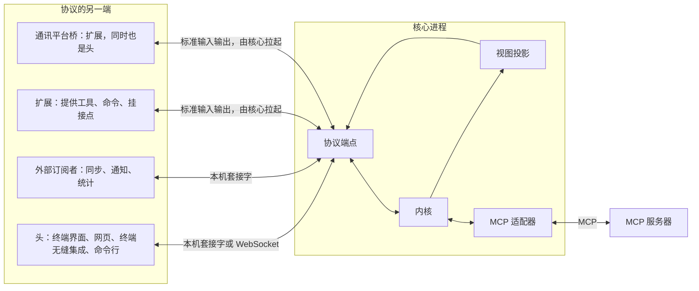
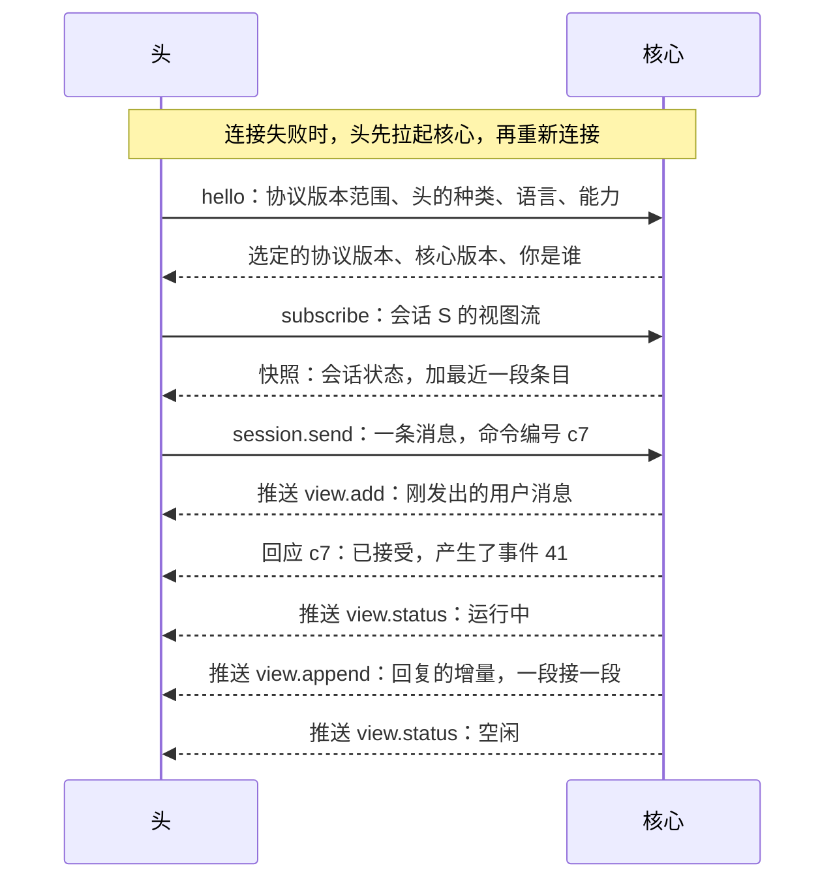
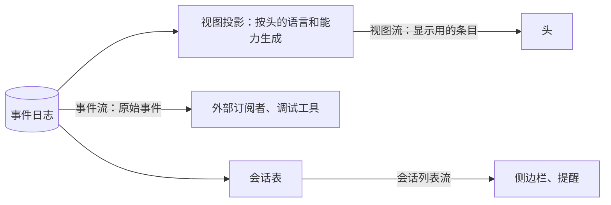
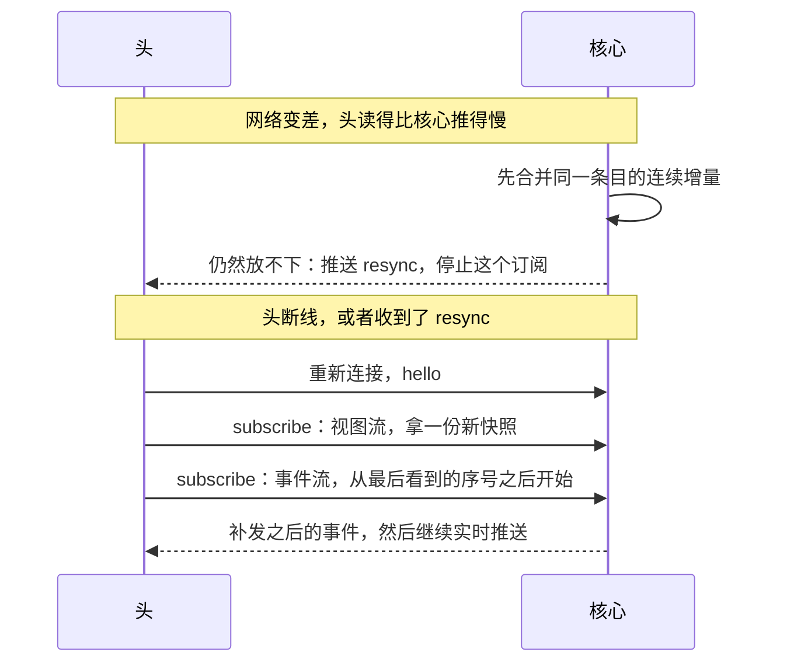

## 核心协议（草案）

状态：P1 到 P6 已定（2026-09-25）。其余内容为草案。

核心协议是核心对外的唯一入口，相当于 Linux 的系统调用接口。头和外部订阅者都只通过它与核心交互。

扩展也说这套协议：它们由核心拉起，经标准输入输出连接，扮演“提供者”，向核心提供工具、命令和挂接点。只提供工具的 MCP 服务器，由核心里的 MCP 适配器接入。细节见 `05-内核接口.md`。

### 一、全景



协议里只有四种消息：

| 消息 | 方向 | 结局 |
|---|---|---|
| 命令 | 头发给核心 | 被接受，回应里带上它产生的事件序号；或被拒绝，附原因 |
| 查询 | 头发给核心 | 返回结果，不改变任何状态 |
| 推送 | 核心发给头 | 事件、视图更新、要求重新订阅 |
| 反向调用 | 核心发给提供者 | 提供者返回结果，例如执行一次工具调用、处理一次挂接。执行中提供者可以发通知报进度（`tool.progress`），核心转成瞬时事件 |

### 二、消息格式与传输

消息格式是 JSON-RPC 2.0（P1）。命令、查询和反向调用是请求，推送是通知。下面的例子为了好读排成了多行，实际传输时每条消息占一行。

握手：

```json
{
  "jsonrpc": "2.0",
  "id": "0192f3a4-7c1e-7d10-9b1a-2f5e6c7d8e90",
  "method": "hello",
  "params": {
    "protocol": [1, 1],
    "head": { "kind": "tui", "version": "0.1.0" },
    "locale": "zh-CN",
    "caps": { "images": true, "input": true, "notify": false }
  }
}
```

发送一条消息，以及被接受时的回应：

```json
{
  "jsonrpc": "2.0",
  "id": "0192f3a4-8a2b-7e20-8c3d-4f6a7b8c9d01",
  "method": "session.send",
  "params": { "session": "0192f3a0-1111-7abc-8def-001122334455", "text": "看看 src 目录" }
}
```

```json
{
  "jsonrpc": "2.0",
  "id": "0192f3a4-8a2b-7e20-8c3d-4f6a7b8c9d01",
  "result": { "events": [41] }
}
```

被拒绝时的回应。`reason` 是稳定的、给程序看的原因码，`message` 是按头的语言写给人看的话：

```json
{
  "jsonrpc": "2.0",
  "id": "0192f3a4-8a2b-7e20-8c3d-4f6a7b8c9d01",
  "error": {
    "code": -32010,
    "message": "这个会话已经被删除了。",
    "data": { "reason": "session_not_found" }
  }
}
```

核心推送的一段流式输出：

```json
{
  "jsonrpc": "2.0",
  "method": "view.append",
  "params": { "session": "0192f3a0-1111-7abc-8def-001122334455", "item": "i-44", "text": "我先看一下" }
}
```

传输方式（P2）：

| 场合 | 传输 | 分帧 |
|---|---|---|
| Linux、macOS 本机 | Unix 域套接字 | 每行一条消息 |
| Windows 本机 | 命名管道 | 每行一条消息 |
| 浏览器 → 网页软件 | WebSocket | 每帧一条消息 |
| 网页软件 → 核心 | 本机套接字、命名管道 | 每行一条消息 |
| 核心拉起的扩展、桥 | 标准输入输出 | 每行一条消息 |

JSON 序列化后不含裸换行，字符串里的换行都会被转义，所以按行分帧是安全的。MCP 的标准输入输出传输用的也是这种分帧。

**协议的单一真相源**：消息结构只在 Rust 类型里定义一次。JSON Schema、网页头用的 TypeScript 类型、协议参考文档都由它生成。测试负责检查生成物是否最新。

**各平台的坑**：

- macOS 的 Unix 套接字路径上限是 104 字节，Linux 是 108 字节。套接字必须放在短路径下。
- Unix 上，套接字放在只有本人能进入的目录里（权限 0700）。连接前核对目录属主，防止别人抢先建一个同名套接字冒充核心。
- Windows 命名管道的默认安全描述符允许 Everyone 读取，必须显式设置成只允许当前用户。创建时还要声明“第一个实例”，防止别的进程抢先占用管道名。头连上以后核对管道另一头的进程是自己的，不是的不交本机令牌：核心没在跑的时候，别的用户可能先占了这个名字冒充核心（施工 3-8 补）。
- 浏览器不会替 WebSocket 执行同源限制。网页软件检查 Origin 和 Host，防止别的网站连进来。

### 三、一次连接的全过程



单次命令行是最薄的头：连上核心，发一条消息，打印回复，等这一回合和它派出去的子代理都回报完就退出（`22-命令行.md` 第三节）。它放到后台的命令留在核心里继续跑，不会因为它退出而被杀掉。它同时也是协议的参考实现，端到端测试都用它来驱动核心。

### 四、身份

- **连接即身份。** 本机连接要同时满足两条：能连上本人的套接字或管道，这由操作系统担保；并且出示本机令牌。本机令牌放在数据根里，只有本人可读，沙盒里的进程读不到（`11-权限与沙盒.md` 第五节）。远程连接凭登录令牌。浏览器的连接由网页软件转发，身份照样由核心在握手时验，网页软件不读本机令牌（2026-10-01 项目主人定）：浏览器出示一次性码、用户名和密码、或者登录令牌（2026-10-04，`21-网页.md` X6）。
- **消息正文里自称的身份一概不作数。**
- **代表别人只能降权，不能提权。** 通讯平台桥是一个扩展，由核心拉起。它转发平台上某个外部用户的命令时，声明“代表某人”，核心就给这些命令外部信任级别。只有被批准了 `act_for_external` 这项扩展能力的扩展，才能做这种声明。唯一的例外是主人绑定：核心按系统配置认出主人的平台账号，在私聊里按本人对待（`18-通讯平台.md` Q7）。这是核心自己的判定，不是桥给自己提权。
- **核心拉起的扩展，身份是扩展自己。** 它能做的事，以清单里声明、安装时批准的能力为限（`05-内核接口.md` 第三节）。
- **远程访问默认关闭（P6）。** 核心默认只监听本机。远程访问要手动开启，并且必须登录。

### 五、三种订阅



- **视图流**：显示用的条目，给头用。能查看这个会话的身份都可以订阅。
- **事件流**：原始事件，完整无删减，包括注入进上下文的内容。给外部订阅者和调试工具用，只对会话的所有者，以及被批准了 `events.read` 能力的扩展开放。
- **会话列表流**：会话的新建、改名、状态变化。给侧边栏、系统提醒用。

**核心决定“显示什么”，头决定“怎么画”（P3）：**

| 核心决定 | 头决定 |
|---|---|
| 显示哪些条目，每个条目的种类和状态 | 布局、换行、宽度适配 |
| 条目里的文字：工具显示名、一句话摘要、折叠汇总、出错说明。按头声明的语言生成；折叠汇总在头声明语言跟着系统走（auto）时用英文，手动定了语言的用那种语言（`13-终端界面.md` H3，2026-10-01 改） | 颜色、字体、动效 |
| 哪些条目默认折叠 | 人手动展开、收起。这类纯界面状态留在头里，不回传 |
| 会话状态：空闲、运行中、等你回答；正在做什么；用时；上下文用量；累计的 token 与缓存命中率；当前的预设（名字和颜色）、模型、供应商与权限级别；待办；改动的文件；回合数；后台任务表（2026-09-26 补上底栏要的几项） | 输入框、按键、补全菜单的交互 |
| 可用的斜杠命令目录 | 命令面板的样子 |
| 主题色板：由一个种子色生成的整套语义色 | 把语义色映射成终端颜色或网页样式 |

视图条目：

| 条目 | 内容 |
|---|---|
| `user` | 发送者（多人场所才显示名字）、文本、附件 |
| `assistant` | Markdown 文本，以及是否还在输出 |
| `reasoning` | 思考文本，默认折叠 |
| `tool` | 工具显示名、一句话摘要、状态、可展开的详情 |
| `tool_group` | 一串连续工具调用的汇总，例如 `Ran 3 commands · 2 edits · 12s` |
| `question` | 问题、选项、状态：等待回答，或已由谁回答 |
| `approval` | 要做的事、风险说明、状态 |
| `subagent` | 子会话的任务和状态，可以跳转过去 |
| `notice` | 压缩发生了、模型换了、出错了。出错时说清发生了什么、为什么、怎么办 |

- 每个条目有稳定的编号，并记录它来自哪些事件序号。头靠这个发出“撤销到这里”“从这里分叉”之类的命令。
- 视图更新只有五种推送：`view.add`、`view.update`、`view.append`（给正在输出的文本追加内容）、`view.remove`、`view.status`。
- 头在握手时声明自己的能力，例如能不能显示图片。不能显示图片的头，核心在它的条目里用文字占位。能力只影响视图，不影响模型看到的内容（`01-架构.md` 第五节）。
- 后台任务表随 `view.status` 推送，覆盖整个会话树：每一项有种类、标题、父亲是谁、状态、正在做什么（它最新一步的一句话摘要）、用时、用量；等人确认时附上要确认什么。终端界面照它画会话树。任务结束时，时间线里多一条 `notice`（`13-终端界面.md` 第七节）。
- **条目只带摘要**：完整的 diff、长输出，头展开时再用 `view.detail` 按需取。每个会话的视图在它自己的 actor 里算，一个会话的大输出不会拖慢别的会话（2026-09-25 补）。
- **mermaid 图由核心出 SVG**：按「源码加尺寸」的哈希缓存，头经 `view.detail` 按需取；视图投影做出来以前经 `mermaid.render` 取。画图是可选的软件包 `mermaid`，没装的头显示源码。网页直接用这份 SVG；终端界面把它栅格化成图片（`13-终端界面.md` 第九节，2026-09-26 补）。

### 六、命令的五条保证

1. **命令编号由发送方生成，全局唯一。** JSON-RPC 请求的 id 就是命令编号。同一编号重复发送，只生效一次。去重记录随事件一起落盘（事件的 `cause` 字段），核心重启后依然有效，断线重发不会重复执行。
2. **先见结果，后见回应。** 同一个连接上，一个命令直接产生的事件，以及由它们推出的视图更新，一定先于这个命令的回应送达（前提是这个连接订阅了那个会话）。头收到回应时，界面已经是对的，不需要猜。
3. **先答者胜。** 多个头同时打开一个会话时，同一个提问，第一个被接受的回答生效。之后的回答被拒绝，原因是“已经回答过了”，而它们的界面也已经通过推送更新了。
4. **拒绝一定有原因。** 拒绝里带一个稳定的原因码，和一句按头的语言写的人话。
5. **斜杠命令由核心解析（P4）。** 头从命令目录拿到命令名、说明和参数格式，用来做补全。人提交之后，头把原文交给核心解析。只有一个解析器，所以所有头的行为一致；扩展新增的命令，也会自动出现在所有头里。

**几个头同时开着同一个会话**（2026-10-01 和项目主人讨论定，调研见 `docs/reviews/2026-09-30-多用户多头现状调研.md`；M8 做，照这几条画蓝图）：

1. **内容同步，输入框各管各的。** 时间线、会话状态、确认和提问的抽屉，所有头一样；输入框里没发出去的字是这个头自己的草稿，不同步。
2. **打断时退回的排队的话**：每个头的时间线上都出现这一句，点一下放进这个头的输入框；不直接塞进哪个输入框，免得几个头各发一遍。
3. **别处撤销、恢复、清空、压缩**：别的头同步刷新，不另加说明。
4. **撤销防抖**：头发撤销时带上它看到的最后一轮，后到的那一个发现这一轮已经撤掉了，就不再撤，说一句「这一轮已经撤掉了」；一个头连按两下，第二下带的是看到第一次的结果以后的最后一轮，照样撤两轮。不按时间算「同时」。
5. **能不能确认看那一刻**：要确认的那一刻，有能弹抽屉的头订阅着就弹给它，没有才当场拒；不再照造会话那个连接冻结。`miyu ask` 开的会话以后在终端界面、网页里接着聊，照样能确认。这件事不进给模型看的前缀。
6. **没抢到的回答**：第 3 条的先答者胜照旧；后到的回答另给一个原因码，说「已经在别处回答了」（施工时定名）；别的头看到已回答的事件就收起抽屉。
7. **通知只在最近用过的那个头响**：人最后敲过键、点过的那个头；在别处答了，别的头上的通知撤掉。
8. **会话删光了不自动新建**：头显示空的首页，打第一句话时才造会话，和新开一个头一样。
9. **中途接进来的头**：快照和之后的推送在会话 actor 的同一步里拿，不重不漏；视图流掉队的，整份快照重来（技术细节，主会话定）。

### 七、慢、断线与重连



- 核心永远不因为某个头慢而等待。每个订阅都有一个有上限的发送队列。
- 队列紧张时，先合并同一条目的连续增量。还是放不下，就推送 `resync`，停止这个订阅。
- 视图流重连时直接拿新快照。快照只包含最近一段条目，更早的条目用 `view.page` 按需往前翻。
- 事件流重连时报出最后看到的序号，核心补发之后的事件。做到了（2026-10-01，施工 3-8 六补）：`subscribe` 的 `after`，补的那一截和之后的推送在会话 actor 的同一步里拿，回应带补到哪一条 `upto`（`docs/blueprint/protocol.md`「补发」）；合并增量还没做。

### 八、版本

- 握手时，头报出自己支持的协议主版本范围，核心选出双方都支持的最高版本。没有交集就拒绝，并用人话说明该怎么办。
- 同一个主版本之内只做加法：可以加方法、加字段，双方都忽略不认识的字段。要改含义，就升主版本。
- 头和核心随同一个发行包升级。头发现核心比自己旧（常见于升级后核心还没重启），就请求核心在空闲时重启自己。

### 九、方法一览

| 族 | 方法 | 类型 |
|---|---|---|
| 握手 | `hello` | 请求 |
| 账号 | `account.login`、`account.logout`、`account.register`、`account.invite`、`account.list`、`account.disable`、`account.setup_code`、`account.setup`、`profile.set` | 命令。邀请、列出、停用需要“管账号”能力（`06-多用户与身份.md`）；`account.login_link` 给本机的网页一次性登录链接（`21-网页.md` X6）；`profile.set` 写「希望 AI 怎么认识你」 |
| 组与权限 | `group.create`、`group.add_member`、`group.remove_member`、`group.delete`、`permission.set`、`capability.grant`、`capability.revoke` | 命令。`permission.set` 相当于 chmod、chgrp 和 ACL，只有资源的属主能改；管理组、把能力授予组需要“管账号”能力 |
| 会话 | `session.create`、`session.fork`、`session.configure`、`session.set_permission_level`、`session.set_meta`、`session.delete` | 命令 |
| 对话 | `session.send`、`session.interrupt`、`session.answer`、`session.revert`、`session.unrevert`、`session.redo`、`session.compact`、`session.clear`、`session.recap` | 命令 |
| 后台任务 | `job.stop` | 命令 |
| 配置与密钥 | `config.set`、`config.trust`、`secret.set`、`secret.delete` | 命令（`14-配置.md` 第八节；`config.trust` 记下信任哪份项目配置，第三节） |
| 供应商 | `provider.test` | 命令（`15-模型与供应商.md` 第九节） |
| 斜杠命令 | `command.run` | 命令 |
| 给人看的字 | `human.get` | 查询 |
| 文件 | `fs.list`、`fs.find`、`fs.realpath`、`fs.read` | 查询 |
| 附件 | `blob.put`、`blob.open`、`blob.write`、`blob.close` | 命令 |
| 媒体 | `blob.get`、`mermaid.render`、`link.preview` | 查询 |
| 人格与预设 | `persona.save`、`persona.delete`、`preset.save`、`preset.delete` | 命令（`16-人格与预设.md` 第九节） |
| 记忆 | `memory.remember`、`memory.update`、`memory.forget` | 命令（`17-记忆.md` 第九节） |
| 知识库 | `kb.add`、`kb.remove`、`kb.mount`、`kb.reindex` | 命令（`19-知识库.md` 第六节） |
| 语音 | `voice.transcribe`、`voice.synthesize`、`voice.listen`、`voice.dictate` | 命令（`20-语音.md` 第九节） |
| 场所 | `venue.set`，以及桥发来的 `venue.appeared`、`venue.gone` | 命令（`18-通讯平台.md` 第十二节） |
| 软件包 | `pkg.install`、`pkg.enable`、`pkg.disable`、`pkg.remove`、`source.add`、`source.remove` | 命令（`12-进程形态与分发.md` 第四节） |
| 放行规则 | `rule.revoke` | 命令：撤销记住的放行规则（`11-权限与沙盒.md` 第二节） |
| 核心 | `kernel.restart_when_idle` | 命令：空闲时重启自己（第八节） |
| 工具 | `tools.override`、`tools.reset` | 命令：写或删一份工具描述的同名覆盖（`25-工具加载.md` 第七节） |
| 订阅 | `subscribe`、`unsubscribe` | 请求 |
| 查询 | `session.list`、`view.page`、`view.detail`、`events.read`、`command.catalog`、`model.list`、`theme.get`、`kernel.status`、`config.schema`、`config.get`、`config.check`、`secret.list`、`provider.detect`、`provider.catalog`、`session.export`、`usage.query`、`profile.get`、`rule.list`、`persona.list`、`persona.get`、`preset.list`、`preset.get`、`memory.search`、`memory.list`、`kb.list`、`kb.search`、`kb.read`、`voice.status`、`venue.list`、`venue.show`、`pkg.search`、`tools.catalog`、`tools.describe` | 查询 |
| 推送 | `view.add`、`view.update`、`view.append`、`view.remove`、`view.status`、`event`、`sessions.changed`、`config.changed`、`resync` | 推送 |
| 提供者 | `provide`：登记自己提供的工具、命令、挂接点 | 请求 |
| 反向调用 | `tool.call`、`hook.call`、`outbound.send` | 核心发给提供者的请求。`outbound.send` 把出站队列里的一条交给桥（`18-通讯平台.md` 第八节） |

- `session.configure`：换模型、临时开关某个功能这类策略变化，按内核 K3 在下一个回合开始时生效。会话用哪个人格、哪个预设、记忆的范围，在 `session.create` 时定，之后不换（`16-人格与预设.md` Y5、`17-记忆.md` L3）。
- `session.set_permission_level`：开关只读，或者改常用的那一级（工作区、完全放开）。收紧当场生效，放宽下一步生效（`11-权限与沙盒.md` 第二节，内核怎么做见 `02-内核.md` 第六节「权限级别怎么切」）。改成完全放开之前，头先请人确认一次。
- `session.interrupt`：打断一个会话正在进行的回合，子代理的会话也一样（`02-内核.md` 第七节）。各个阶段怎么收拾，见 `02-内核.md` 第六节「打断和急着插话」。带 `"queued":"send"` 的，打断以后排着队的消息马上发；`"queued":"return"` 的，撤回来交还给头（`02-内核.md` 第六节「排队的消息」）。
- `session.send` 带 `"urgent": true` 的是急着插话：这一步还没跑的工具跳过，这句话马上进下一步（`02-内核.md` 第六节）。
- `session.answer`：回答权限确认，也用来回答模型的提问。回答确认时写调用编号和选了哪一项（`once`、`session`、`workspace`、`deny`），拒绝的可以带一句理由；她拿到的是工具结果，拒绝以后接着干（`02-内核.md` 第六节「确认怎么走」）。回答提问时写调用编号和照题目先后的每道题的回答（`03-事件模型.md` 第三节「提问的事件怎么写」）；不想答的那道不答就是，想停掉这一轮发 `session.interrupt`（`02-内核.md` 第六节「提问怎么走」第 4 条）。
- `session.revert`：带一个回合编号，这一轮和它以后的全撤；有回合在进行的拒绝，头先打断再撤。`session.unrevert`：恢复最近一次撤销，下一轮开始、压缩以后就不行了（`02-内核.md` 第六节「撤销与恢复」）。
  - 参数（施工 4-7 上）：`session.revert` 是 `session`、`turn`（回合编号，就是那一轮 `turn.started` 的序号）；`session.unrevert` 是 `session`。`turn` 不写的，撤还在有效历史里的最后一轮，内核照账本找（施工 4-7 下）。
  - 回应 `{"events":[…]}`，照先后：`turn.reverted`（`turn.unreverted`），有要改回的文件再加一条 `files.restored`（`03-事件模型.md` 第三节）。改完了文件才回应。
  - 拒绝的原因码：`turn_running`、`compacted`（M6 起不再用：撤销能撤掉压缩，`09-压缩.md` Z10）、`unknown_turn`、`nothing_to_unrevert`（施工 2-8 下）；撤销、恢复还没做完（正在读回更早的日志、正在改回文件）时来的，`restoring`；不写 `turn`、一轮都没有的，`nothing_to_revert`（施工 4-7 下）。
  - 回应在 `events` 以外还带给人看的几样（施工 4-7 下，照 `01-架构.md` D1 由核心算，做视图投影时挪进视图，字段只加不改）：`cwd` 会话的工作目录；`said` 撤的（恢复的）第一轮里人说的那句话；`commands` 撤掉的几轮执行过几条命令（撤销时才有）；`compactions` 撤掉了几次压缩（撤销时才有，是 0 的不写，施工 6-9）；`files` 每一步的 `path`、`action`、`outcome`，出错的 `error`，之后又被改过的差异 `diff`（统一格式的几行，最多 20 行）和没列出来的行数 `more`。
- `session.redo`：重做最后一轮，撤掉它、把开它的话再发一次；可以带 `text` 换成改过的话（网页里编辑上一句）、带 `attachments` 换掉附件，没带的那一样照原来的（`02-内核.md` 第六节「撤销与恢复」第 7 条，2026-09-30 项目主人定，施工 4-7 再补）。回应照撤销的，`events` 最后是重发的几句；新的一轮 `turn.started` 的 `cause` 是这条命令。最后一轮不是人的话开的、一轮都没有：`not_redoable`（「无法重做」「Cannot redo.」）；有回合在进行：`turn_running`。
- **自动起标题**（2026-10-01 项目主人定，照 Claude Code）：没起名的会话第一轮答完，核心照回顾那样发一次有上限的小请求，起一个几个词的短标题，记成 `session.meta_changed`（`by` 是内核）；人手动改过名（`session.set_meta`）的不再动，子会话不起。
- `session.recap`：要一句回顾，说这个会话在做什么、做完了什么、还剩什么、眼下在干哪件（2026-10-01 项目主人定：回顾是核心的协议，什么时候要、要来了怎么显示是头的事，头可以做成 `/recap` 命令，也可以离开几分钟以后自动要）。照 codex 的做法：单独一次辅助请求，不接主对话的前缀、不带工具，只喂最近最多 8 轮里人说的话和她的回答正文（不要工具输出、思考），连指令最多约 8000 token，用会话自己的模型（2026-10-01 看过 codex 源码后改：接前缀的话长会话每次都要把整段上下文读一遍）；请求记进 `model.called`，那一句另记一条事件推给所有头，不进她的上下文；上次回顾以后没有新内容的，交回上一句、不再请求。
- `session.compact`：手动压缩，可以附一句要求。空闲时才收，单开一轮只做压缩；`turn.started` 落了盘就回应，和 `session.send` 一样不等这一轮做完；压缩期间推瞬时的 `compaction.progress`。有回合在进行的拒绝，`turn_running`；没有能压的拒绝，`nothing_to_compact`：上一次压缩以后没有新内容，或者新内容全在压完要原样留着的尾巴里（施工 6-8 写准：原来只写了前一种）（`09-压缩.md` 第二节，蓝图 `compaction.md`，M6）。
  - 参数（施工 6-8）：`session`、`instructions`（人附的要求，可以不写）。回应 `{"events":[<那一轮 turn.started 的序号>]}`。
- `session.clear`：清空上下文，从这里起她看到的是空的，会话不变（终端界面的 `/clear`，以后 QQ 的 `/reset`；2026-09-30 项目主人要）。空闲时才收，单开一轮压成一个空的检查点，不请求模型；开头、检查点、结束同一批，落了盘就回应。有回合在进行的拒绝，`turn_running`；上下文本来就是空的拒绝，`nothing_to_clear`（`09-压缩.md` 第二节，蓝图 `compaction.md` 第十四条，施工 6-8 补）。
  - 参数（施工 6-8 补）：`session`。回应 `{"events":[<那一轮 turn.started 的序号>]}`。撤掉那一轮，撤销回应的 `clears` 数它（`compactions` 不数）。
- `blob.put`：上传附件。本机的头也可以只传文件路径，由核心自己去读；远程的头只能传内容。
- `kernel.status`：核心的运行状态，包括在跑的会话、调度队列、各模型端点的限速状态、worker 是否存活、内存占用。相当于 Linux 的 `/proc`。

**先做的几样怎么写**（2026-09-27 补，施工 3-8 上、中）：握手、造会话、说话、打断、订阅事件流。别的方法到用它的那一步再写。

- **请求的 `id` 一律是字符串**，照命令编号的写法：1 到 128 字节，不含控制字符。命令的 `id` 就是命令编号（第六节第 1 条）。
- **`hello`**：`params` 有 `protocol`（支持的主版本范围 `[最低, 最高]`）、`head`（`kind`、`version`）、`locale`、`caps`；本机连接再加 `token`，就是本机令牌（第四节）。回应有 `protocol`（选定的主版本）、`core`（`version`）、`account`（你是谁）。连上以后第一条必须是 `hello`，令牌不对的回拒绝、断开。
- **`session.create`**：`persona`（不写是出厂的 `engineer`），`cwd`（头的工作目录，人看到的那种写法，例如 `~/src/miyu`），`oneshot`（不写是 `false`；`miyu ask` 开的会话写 `true`，记进 `session.created`，`22-命令行.md` O2，施工 3-9 下）。有没有人能确认，照这个连接握手时报的 `caps.input`：能输入的头才有人确认（`02-内核.md` 第六节「确认怎么走」）。回应有 `session`（新会话的编号）、`events`、`cwd`（会话实际在哪个目录里干活：就是头报的那个；太宽的，是账号的工作区，`11-权限与沙盒.md` 第四节。头报的和它不一样，就是退回了，`miyu ask` 照它在开头说一句，施工 4-5 下）。
- **`session.list`**（施工 3-9 下，会话列表的第一小块）：`oneshot`（写 `true` 只要一次性的），`limit`（最多几个，不写是全部）。回应 `sessions: [{session, oneshot}]`，从新到旧：会话编号是 UUIDv7，照编号排就是照造的先后。现在只列管理员的会话，读每个会话日志的第一条，只读不写；以后有了会话列表流、索引再换，字段只加不改。`miyu ask --continue` 靠它找上一次开的会话。
- **命令编号要自己保证不撞**：同一个编号只生效一次，那是给断线重发的（`02-内核.md` 不变量 9）。`miyu ask` 每条连接取一段随机数当前缀（`ask-<16 位十六进制>-<序号>`）：施工 3-9 下查出过，两次 `miyu ask` 都从 `ask-1` 数起，第二次 `--continue` 说的那一句被当成了重发，什么都没发生。
- **`session.send`**：`session`、`text`，`urgent`（不写是 `false`），`cwd`（头现在的工作目录，可以不带；和会话现在的不一样，就先送进会话，到下一个边界才注入，`08-上下文投影.md` C10）。回应有 `events`、`cwd`（收下这一句的 `cwd` 以后，会话实际在哪个目录里干活，意思和造会话的一样，施工 4-5 下）。
- **`session.interrupt`**：`session`、`queued`（`send` 或 `return`，必写）。回应有 `events`。
- **`subscribe`、`unsubscribe`**（施工 3-8 中）：`session`、`stream`（现在只有 `events`，事件流）。没在跑的会话照样先载入。同一个会话订阅两次，还是一个订阅。`unsubscribe` 回应空对象；`subscribe` 的回应带会话状态里头现在就要的一格 `limits`：会话实际用的模型的窗口、压缩线（施工 6-3 补，2026-09-29）。
  - 放在订阅的回应里，不推瞬时事件：造会话、载入交限额的那一刻，这个会话还没有订阅（造会话回应之前没人订阅得了，载入在订阅登记之前），推出去没人收。头中途接进来、掉了队重新订阅、核心重启以后重新载入，都要经 `subscribe`，一处全拿到。这是第三节「订阅时先拿会话状态」的一小块；视图流做出来以后，它的会话状态里也带这一格。
  - 压缩线由核心算好给：它跟着策略里的输出预留、余量，以后还有 `compaction.max_context`（`09-压缩.md` 第二节），头照公式算会和核心判到线的对不上。
  - 不带最大输出：头拿它只能算压缩线。不带模型名：头照事件的 `by` 认。换模型以后限额会变，到那一步再推（`session.configure`）。
- **推送 `event`**：`params` 有 `session` 和 `event`：落了盘的事件照 `03-事件模型.md` 的写法原样放进去，一条一个通知；瞬时事件（增量、状态）也一样，它们没有 `seq`。
- **推送 `resync`**：`params` 有 `session`、`stream`。读得慢、掉了队：中间漏了推送，这个订阅停了，头重新订阅（第七节）。
- **先见结果，后见回应**（第六节第 2 条）：订阅了的会话，命令的回应排在它产生的推送后面写出去。
- **拒绝**：`code` 一律是 `-32010`，`data.reason` 是原因码，`message` 照头的语言写。JSON-RPC 自己的几种照它的标准：读不懂 `-32700`，不是请求 `-32600`，没有这个方法 `-32601`，参数不对 `-32602`。

| 原因码 | 什么时候 |
|---|---|
| `hello_first` | 连上以后第一条不是 `hello` |
| `protocol_mismatch` | 头支持的主版本和核心的没有交集 |
| `bad_token` | 本机令牌不对 |
| `session_not_found` | 没有这个会话 |
| `session_stopped` | 会话停了：写不进去、出了 bug |
| `session_broken` | 会话载入不了：日志或者策略快照坏了、读不了 |
| 内核的原因码 | 内核拒了这个命令（`02-内核.md` 第四节「拒绝附原因码」） |

### 十、决定

**P1. 消息格式**

- **已定：JSON-RPC 2.0。** 它自带请求、回应、通知三种消息形态，正好覆盖这里的四种消息；各种语言都有现成的库；MCP 也用它，头的作者和中等模型都熟悉。
- 未选 A：HTTP 接口加 SSE 推送（opencode 的做法）。请求和推送走两条通道，“命令被接受”和“它产生的事件”谁先到达无法保证。
- 未选 B：gRPC。需要代码生成工具链，浏览器还要额外的网关。
- 重开条件：出现 JSON-RPC 表达不了的交互。

**P2. 传输与分帧**

- **已定：本机用 Unix 域套接字（Linux、macOS）和命名管道（Windows），按行分帧；浏览器和远程用 WebSocket，每帧一条消息。**
- 未选：本机也走 TCP 回环。三个平台一致，但任何本机进程都能连上，身份只能靠令牌，失去了操作系统的担保。
- 重开条件：某个平台的本机传输出现无法绕过的限制。

**P3. 显示逻辑放在核心（即 `01-架构.md` 的 D1）**

- **已定：核心提供视图流，头只负责画。同时提供事件流，给需要原始数据的程序。**
- 重开条件：同 D1。

**P4. 斜杠命令由谁解析**

- **已定：核心解析，头只做补全。**
- 未选：每个头自己解析。同一条命令在不同的头里行为可能不一致，正是旧版“一条规则写三遍”的老问题。
- 重开条件：出现只对某一个头有意义的命令，例如终端无缝集成专属的命令。那时再定“头本地命令”的规则。

**P5. 网页的页面由谁提供**

- **已定：网页界面是一个单独的软件。** 程序 `miyu-web` 加页面文件，装了才有；它是一个头，自己开端口、给页面，把浏览器的 WebSocket 转成核心协议，经本机套接字（Windows 上是命名管道）连核心。核心里没有为网页写的代码：网页要的、终端也用得上的几样，做成通用的协议方法（2026-10-01 项目主人定，重开了这条）。
- 未选：核心里的可选 HTTP 模块。没开网页也带着它的代码；网页的东西进核心，就是核心往上依赖一个界面。原来的顾虑「多一个进程，多一跳转发」：本机多一跳，代价小。
- 重开条件：实测本机多一跳的延迟人感觉得到。

**P6. 远程访问的默认值**

- **已定：默认关闭。** 核心只监听本机；远程访问要手动开启，并且必须登录。
- 重开条件：无。安全默认值不因方便而放宽。

**后续再定**

- 扩展提供的工具、桥提供的平台工具怎么注册：已定，见 `05-内核接口.md`
- 附件的大小上限，以及分块上传：已定，上限照 `blob.put` 的 20 MiB；分块上传经 `blob.open`、`blob.write`、`blob.close` 三个方法（2026-10-01 项目主人定）
- 终端无缝集成怎么使用这套协议：已定，见 `22-命令行.md` 第七节
