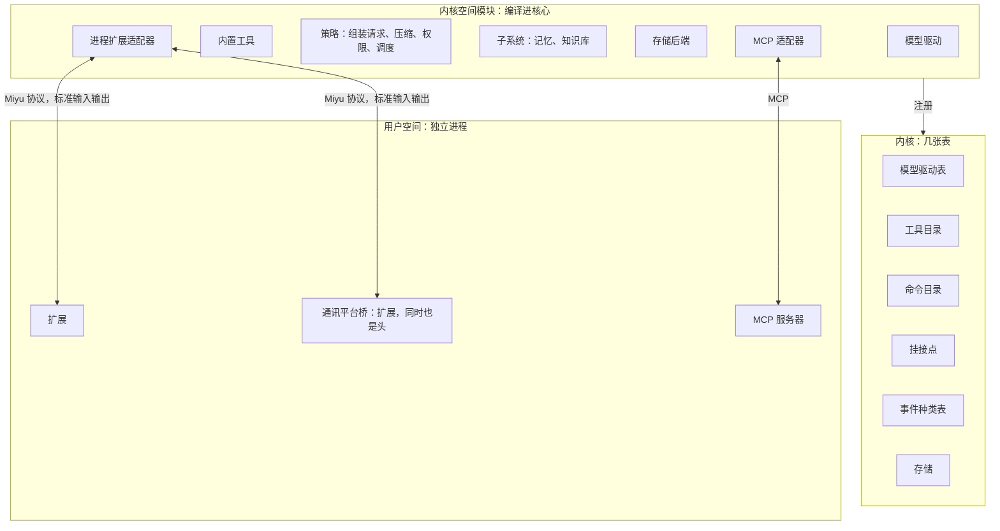
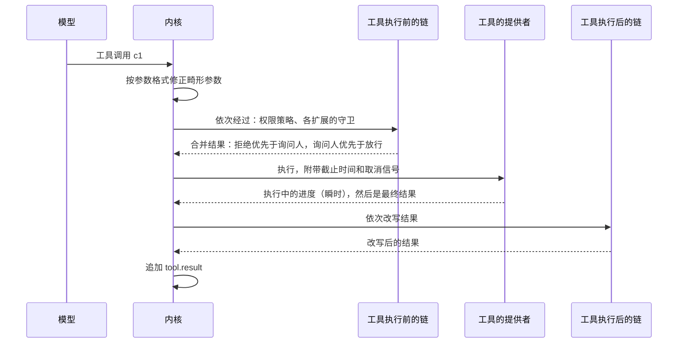
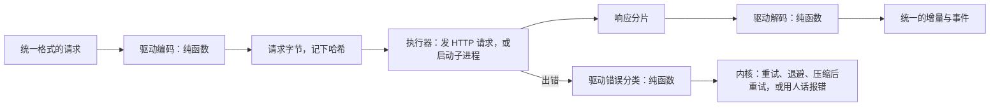
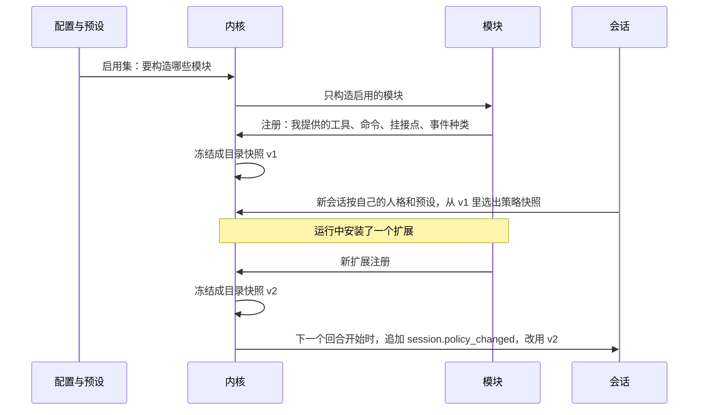
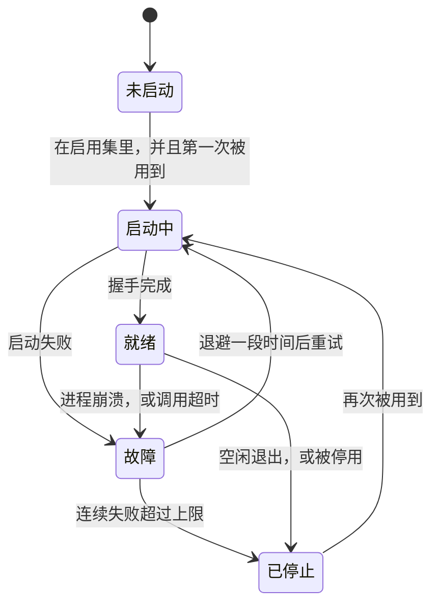

## 内核接口（草案）

状态：I1 到 I8 已定（2026-09-25）。其余内容为草案。

内核接口规定模块怎么插到内核上。它相当于 Linux 的驱动接口，加上可加载模块的机制。

一个前提：Miyu 是开源软件，扩展会来自陌生人。所以这套接口有两个目标：让内置功能即插即用，同时让第三方扩展只能做它被允许做的事。

### 一、一种模块，多种贡献

内核里有几张表，也就是插槽。模块往表里登记自己提供的东西。

每个模块都是同一个形状：**一份清单，加一次注册**。

- **清单**：我是谁，我需要哪些能力。
- **注册**：我提供什么。

内置模块和外部扩展是同一个形状，内置模块不开后门（`00-设计理念.md` 高质量代码第 4 条）。

模块可以提供的东西：

| 贡献 | 登记到 | 例子 |
|---|---|---|
| 模型驱动 | 模型驱动表 | DeepSeek、Anthropic、借用别的 agent CLI 的订阅 |
| 工具 | 工具目录 | 读写文件、运行命令、发群消息 |
| 斜杠命令 | 命令目录 | `/undo`、扩展自带的命令 |
| 挂接点的实现 | 挂接点 | 记忆召回、权限规则、重复调用提醒 |
| 事件种类 | 事件种类表 | `ext.memory.recalled`，连同它的显示规则和进上下文的规则 |
| 存储后端 | 存储 | 默认的本地存储 |
| 场所驱动 | 场所子系统 | QQ 桥、语音 worker（`18-通讯平台.md` 第二节、`20-语音.md` 第四节） |
| 线路规程 | 场所子系统 | 每条都回、叫她才回、看情况插话、唤醒（`18-通讯平台.md` 第六节） |
| 进站链、出站链的规则 | 场所子系统 | 按关键词拦广告（`18-通讯平台.md` 第五节、第八节） |
| 网页页面 | 页面目录 | 记账、表情包这类仪表盘（`21-网页.md` 第五节） |



### 二、清单

两个例子。第一个是内置的记忆模块，第二个是第三方写的天气扩展：

```toml
[module]
id = "memory"
version = "0.1.0"
kind = "builtin"
name = { en = "Memory", zh-CN = "记忆" }

[provides]
tools = ["memory_search"]
hooks = ["turn.start", "turn.end"]
events = ["ext.memory.recalled"]

[needs]
capabilities = ["tools", "context.inject", "events.read", "events.write"]

[depends]
workers = ["embedding"]
```

```toml
[module]
id = "weather"
version = "1.2.0"
kind = "process"
command = ["python3", "weather.py"]
name = { en = "Weather", zh-CN = "天气" }

[provides]
tools = ["weather_now", "weather_forecast"]

[needs]
capabilities = ["tools", "network"]

[settings.units]
type = "choice"
choices = ["metric", "imperial"]
default = "metric"
label = { en = "Units", zh-CN = "单位" }
```

清单里的文字也分两槽：`id`、工具名这类给程序和模型看的，恒为英文；`name` 给人看，跟随界面语言。

扩展的配置项写在 `[settings]` 里，和内置模块的配置项合进同一份配置清单，校验、设置页、编辑器补全都从那里生成（`14-配置.md` 第二节）。

`[depends]` 写依赖的软件包，例如 embedding worker。它们照软件包安装，不算扩展能力（第三节）。

### 三、扩展能力：扩展只能做被批准的事

仿照 Linux 的 capabilities：清单声明需要哪些扩展能力，安装时由人批准，核心强制执行。给人的那一种叫「管理能力」，见 `06-多用户与身份.md` 第四节。

| 扩展能力 | 允许做什么 |
|---|---|
| `tools` | 向工具目录提供工具 |
| `commands` | 提供斜杠命令 |
| `context.inject` | 回合开始时往上下文注入内容 |
| `tool.guard` | 工具执行前放行、拒绝，或要求询问人 |
| `tool.rewrite` | 工具执行后改写结果 |
| `events.read` | 读取会话的原始事件 |
| `events.write` | 追加自己命名空间下的事件 |
| `sessions.drive` | 用命令驱动会话，例如发消息、创建子会话 |
| `act_for_external` | 代表平台上的外部用户发命令。只给通讯平台桥 |
| `network` | 访问网络 |
| `fs.read`、`fs.write` | 读、写指定的路径 |

- 外部扩展运行在沙盒里，沙盒的范围来自它被批准的能力。各平台的沙盒怎么实现，在“权限与沙盒”一步设计。
- 内置模块也写能力清单。它们本来就被信任，写清单一是让所有模块形状相同，二是核心同样会检查，多一道防线。
- 扩展升级后要求更多能力时，要重新批准。

### 四、内核空间模块与外部扩展

- **内核空间模块**：编译进核心，在同一个进程里，直接实现内核接口。
- **外部扩展**：独立进程，由核心拉起，经标准输入输出说 Miyu 协议（`04-核心协议.md`），扮演“提供者”。核心里的**进程扩展适配器**替它实现内核接口，把调用转发给那个进程。这就像 Linux 的 FUSE：内核只认识文件系统接口，FUSE 把调用转给用户空间的进程。
- **MCP 服务器**：只提供工具。核心里的 **MCP 适配器**把它接进来，MCP 生态里现成的服务器都能直接用。
- **脚本**：最简单的外部扩展。一个可执行文件，头部写明它提供的那一件工具：名字、说明、参数、需要的能力；清单里是 `kind = "script"`。每次调用起一个进程，跑完就退出。核心里的脚本适配器把它接成工具，同样受能力和沙盒约束（2026-09-25 补）。
- **通讯平台桥**：一个外部扩展，同时扮演头。它把平台上的人接进会话（`act_for_external`、`sessions.drive`），也提供平台工具，例如发群消息、撤回消息。
- **头也可以同时扮演提供者**，例如终端无缝集成提供“读取刚才那条命令的输出”这样只有它做得到的工具。以本人身份连接的头，能力视同本人已经批准。

只有一套协议：头、扩展、桥说的都是 Miyu 协议，区别只在扮演的角色和被批准的能力。MCP 只作为兼容入口存在。

### 五、挂接点

挂接点有三种插槽。多个模块挂在同一个点上时，按插槽种类合并：

| 插槽 | 规则 |
|---|---|
| 独占 | 同一范围内只用一个实现。组装请求、压缩判断按会话选定，调度全局只有一个。都是同步纯函数 |
| 链式 | 按固定顺序逐个经过。每个实现能做什么，由挂接点决定 |
| 广播 | 全部执行，互不影响 |

全部挂接点：

| 挂接点 | 插槽 | 能做什么 | 外部扩展能否使用 |
|---|---|---|---|
| 命令进入 | 链式 | 放行、拒绝、改写 | 能 |
| 回合开始 | 广播 | 追加事件，也就是往上下文注入内容 | 能 |
| 组装请求 | 独占 | 生成请求 | 不能 |
| 压缩判断 | 独占 | 判断该不该压缩 | 不能 |
| 调度 | 独占 | 决定各会话使用模型的先后 | 不能 |
| 模型输出后 | 链式 | 打标记、追加事件 | 能 |
| 工具执行前 | 链式 | 放行、拒绝、要求询问人 | 能 |
| 工具执行后 | 链式 | 改写结果、追加事件 | 能 |
| 回合结束 | 广播 | 追加事件、发起辅助请求 | 能 |
| 订阅 | 广播 | 只读 | 能 |

四条规则：

1. **工具执行前的链，最严者胜。** 拒绝优先于询问人，询问人优先于放行。排在后面的实现只能收紧，不能放宽前面的决定。这是 dsh 的“单调守卫”。
2. **结果按声明顺序记录，不按到达顺序。** 回合开始时，多个模块并行召回、注入。核心等它们全部返回或超时，再按固定顺序（先按声明的优先级，再按模块编号）追加成事件。和工具结果一样，到达顺序不能影响请求字节。
3. **外部扩展只能挂异步的点。** 独占插槽必须确定、必须快，只对内核空间模块开放。外部扩展想往提示词里加东西，只有两条路：清单里写死的静态片段，进入策略快照（事件模型 E5）；或者回合开始时注入，成为事件（内核 K2）。两条路都保证字节稳定。外部扩展的每次挂接调用都有超时。工具执行前的守卫超时，按「拒绝」算，理由写明「守卫超时」。内核从不等某一个挂接调用，打断随时能进来（2026-09-25 补）。
4. **外部扩展的事件种类用模板声明。** 这些事件怎么显示、怎么进上下文，只能在清单里用模板声明。模板只做字段替换，不含逻辑。这样视图投影和上下文投影依然是确定的纯函数。模板之外，还能用几种现成的视图组件：键值、表格、进度、图片、链接。组件由核心定义，不够用就往核心里加组件，不让扩展把显示塞回消息正文（2026-09-25 补）。

一次工具调用经过的挂接点：



内核怎么等链的结论、怎么问人、人回答以后怎么走，见 `02-内核.md` 第六节「确认怎么走」（2026-09-26 补，施工 2-7 中）。

### 六、工具的规格

| 字段 | 给谁看 | 含义 |
|---|---|---|
| `name` | 模型 | 英文，稳定不变。工具名是最强的能力广告 |
| `description` | 模型 | 英文，不超过三句：是什么、什么时候用、最容易踩的坑 |
| `input_schema` | 模型 | 参数的 JSON Schema |
| `display_name` | 人 | 跟随界面语言。不进 tools 数组，放在软件包资源目录的 `human/<语言>.json` 里（2026-09-28 补，施工 4-5 上） |
| `summary` | 人 | 显示名后面跟哪一个参数的值，例如 `read` 跟 `file_path`，一起写成「读取 src/lib.rs」。视图投影用它生成工具条目。原来想写成「读取 {path}」这样的模板，可模板只做字段替换，写不了「给了 `offset` 才写第几行」，改成只挑一个参数，范围这类放进结果那一句（施工 4-5 上）。和 `display_name` 放在一起 |
| `access` | 内核 | 访问类别：只读、写文件、执行命令、访问网络、对外发消息，写成 `read`、`write`、`execute`、`network`、`outbound`。权限策略、能否并发、撤销前要不要存档，都看它。不认识的（新版本加的）原样留着，按最严的算：不和别的一起跑，只读时当写入拦下（2026-09-26 补，施工 2-7 中） |
| `timeout` | 内核 | 默认超时 |
| `venues` | 内核 | 哪些场所能用。例如对外的群聊里，不提供执行命令的工具 |
| `group` | 内核 | 按组加载时属于哪一组，默认是所在的软件包（`25-工具加载.md` 第二节） |

- **调用之后才用得上的知识，写进工具自己的输出，不写进描述。** 例如结果字段的含义、分页怎么继续。描述越短，每次请求越便宜。参数说明每个一句，只写名字看不出来的（`25-工具加载.md` W2，2026-09-28 改）。
- **能否并发不单独声明，由 `access` 推出。** 只读的工具可以并发。
- **畸形参数由内核统一修正。** 按参数格式，把被转成字符串的数组、对象、数字还原回去；声明为字符串的参数一个字节都不碰。报错只说自己真正知道的，例如“期望整数，收到字符串 "1"”。
- **执行时，工具拿到**：调用编号、参数、会话、身份、工作目录、沙盒范围、截止时间、取消信号。
- **规格一格一格来**（2026-09-27 补，施工 4-1）：第一批只有 `name`、`description`、`input_schema`、`access` 四格；`display_name`、`summary` 随 `miyu ask` 显示工具步骤（施工 4-5 上），`timeout`、`venues`、`group` 用得上时再加。
  - 工具名只用英文字母、数字、`_`、`-`，1 到 64 个字符：各家供应商对函数名的限制都是这样。不合的，登记时就拒绝，免得每次请求都被供应商拒收。
  - `input_schema` 必须是 `{"type":"object",…}`，理由相同。
- **工具返回**：状态（成功或失败）和内容块。执行中可以发出进度，作为瞬时事件推给头。
- **给人看的说法**（2026-09-28 补，施工 4-5 上）：工具还可以交回一份给人看的说法，就是用的哪一句（编号）、换进去的字段；字放在它的软件包资源目录的 `human/` 下，一种语言一份。说法记进 `tool.result`，不发给模型；头照自己的语言换成字（`26-提示词.md` 第三节「双槽」）。内核自己写的结果也带上说法。
- **要碰的路径**（2026-09-27 补，施工 4-3 下）：工具照一次调用的参数，报出它要碰的路径、是读是写，只看参数、不碰磁盘；默认一条都没有（例如执行命令）。换成真实的位置、查边界是执行前的链的事（`11-权限与沙盒.md` 第七节），工具不自己判。
- **执行这一步**（2026-09-27 补，施工 4-2）：交给工具的先只有修正过的参数和这一轮的工作目录，别的用到时再加（施工 4-4 上加了家目录：权限策略照它换 `~`，工具照同样的办法换，碰到的才是同一个文件；施工 4-4 下加了数据根：权限策略只核对工具报出的路径，往下走目录的工具从上面搜下来会走进去，要自己跳过；施工 4-6 上加了她看过的：每个文件她最后一次看到的内容哈希，写的工具改之前照它核对，`10-自带软件.md` 第五节）；工具交回内容块和出没出错，用时由执行器量；施工 4-6 上起还交回效果，改前改后连同内容本身，执行器存成 blob、换成哈希再交进内核。叫停就是不要了：执行器丢掉跑这件工具的任务，工具手里的东西随之收拾，不另给取消信号。活在阻塞线程里干的工具（走目录、搜内容），future 被丢掉时自己举旗，让阻塞线程里的活停下（施工 4-4 下）。一件一个任务，一起派的只读调用各跑各的。

### 七、驱动的规格

驱动是纯粹的翻译器：编码、解码、错误分类都是纯函数，真正发请求的是执行器。



| 字段 | 含义 |
|---|---|
| `family` | 驱动家族。用来认领属于自己的私有数据（事件模型 E2） |
| `models` | 每个模型的上下文窗口、最大输出、能否调用工具、能否看图、有没有思考 |
| `cache` | 缓存类型：契约型、尽力而为、无。压缩策略据此调整 |
| `transport` | HTTP，或者子进程（借用别的 agent CLI 的订阅） |
| `encode`、`decode`、`classify` | 三个纯函数 |

- 错误分类只有几种：可重试、限速（附带要等多久）、上下文超长、认证失败、被内容策略拦截、其他。内核按分类处理：重试、退避、压缩后重试、用人话报错。
- 因为编码是纯函数，每家供应商的请求字节都可以用固定的样本文件检查。改动让某个字节变了，测试当场变红。

**OpenAI 兼容的对话接口怎么编码**（2026-09-26 补，施工 3-4 上）：驱动家族 `openai-chat`，发到 `<base_url>/chat/completions`，流式。统一的请求照下表写成一个 JSON：字段的先后固定，同样的输入，字节一定一样。样本在 `docs/designs/samples/drivers/openai-chat/`；探针的每一次请求另存一份编码以后的（`docs/designs/samples/probe/terminal/openai-chat/`）。

| 统一的请求 | 线上怎么写 |
|---|---|
| 顶层 | `model`、`messages`、`tools`、`stream`、`stream_options`、输出上限，照这个先后。别的字段一概不发：`strict`、`prompt_cache_key`、`store` 这类字段，有的供应商不认识就拒收 |
| system | 第一条 `system` 消息；空的不发 |
| user 消息 | 全是文字的，拼成一个字符串：相邻两块之间补一个换行，前一块已经以换行结尾的不补（两句话合进一条消息时不粘在一起）。有图片、文件的，分成几段，连着的文字照样拼成一段 |
| assistant 消息 | 正文各块直接接上：它们本来就是同一段 `content`，照原样拼回去。没有正文、只有工具调用的，`content` 写 `null`。思考照供应商的写法回传，或者不传 |
| 工具调用 | `id` 用供应商自己的编号（在私有数据里），没有就用内核分的。参数原文照抄；不是合法 JSON 的（包括空的），写成 `{}`：有的本机服务要把历史里的参数解析出来 |
| tool 消息 | `tool_call_id` 和对应的那次调用写的一样。文字照 user 消息的拼法；一个字都没有的，写一句占位。图片、PDF 挪到这一串 tool 消息后面的一条 user 消息里：这类接口的 tool 消息只收文字 |
| 工具面 | `{"type":"function","function":{"name":…,"description":…,"parameters":…}}`，参数格式原样照抄。没有工具时不发 `tools`；可历史里有工具调用的，发 `[]` |
| 图片、文件 | 模型能收的，写成 data URL（文件只有 PDF 能发）；不能收的，换成一句占位 |
| 缓存标记 | 不用：这类接口按前缀自动缓存 |

- 供应商之间不一样的地方做成几个开关，跟着供应商定、会话里不变：输出上限写 `max_tokens` 还是 `max_completion_tokens`；思考回不回传、写进哪个字段、没有思考时要不要发空串（DeepSeek 要求每条 assistant 都带 `reasoning_content`）；要不要在流里报用量；会不会接着写被打断的回复（下面）。默认是最常见的写法：`max_tokens`，不回传思考，报用量，不会接着写。哪个供应商用哪一套，配置那一步再定。
- 给模型看的几句占位随核心附带（`26-提示词.md` 第八节）。
- 调研的出处：opencode v2 的 `packages/ai/src/protocols/openai-chat.ts`，pi-mono 的 `packages/ai/src/api/openai-completions.ts`。两家都把工具参数解析以后重新序列化，我们照抄原文，前缀缓存不受影响。

**接着写被打断的回复**（2026-09-27 补，施工 3-5 再补）：说到一半断了，内核带着半截、跟一句被打断的提示再请求（`02-内核.md` 第六节「回复怎么收」第 4 条）。会接着写的供应商，驱动把这一次改成前缀续写：模型从截断处接着生成，半截的思考也接得上。

- 统一的请求带一个记号 `continuation`：最后一条 user 消息只有被打断的那一句，前面那条 assistant 是半截。组装照有效历史的最后几条认：带 `interrupted` 的回复，后面只有一条 `reply_cut` 的事实，中间只隔着 `model.called`。在等的时候来了新消息的，最后那条 user 里不只有提示，不带记号。不带记号的请求，字节和以前一样。
- 驱动的开关：默认不会接着写，带记号的也照原样发，被打断的那一句里写着从断的地方接着说。会的，这一次不发最后那句提示，半截那条 assistant 加上供应商的字段，发到供应商的路径。编码交回这一次发到哪条路径，平时就是驱动的那一条。
- 出厂只给用真的请求实测过的供应商打开：现在是 DeepSeek，`prefix: true`，路径 `/beta/chat/completions`，半截的思考照常写在 `reasoning_content`（2026-09-27 实测：思考、回复都从截断处接着往下）。文档上支持的还有 Kimi、通义的 partial 模式和 Mistral 的 `prefix`，有 key 实测过了再开。用户自己加的供应商在配置里开（配置那一步）。不猜，也不发请求去探测。
- 接着写出来的，照常写成下一条 `message.assistant`。以后的请求里，半截那条换回普通的写法，后面是那句提示和接着写的那段：线上的前缀在半截那一条断一次（`08-上下文投影.md` 第七节登记的改写）。

**OpenAI 兼容的对话接口怎么解码**（2026-09-26 补，施工 3-4 下）：响应是 SSE 流，解成统一的四种增量（`03-事件模型.md` 第五节），外加说完时的用量和出错。

| 线上 | 统一的写法 |
|---|---|
| SSE：`data:` 行，空行结束一条；`:` 开头的是注释；`\n`、`\r\n`、`\r` 都算换行；一行收全了才按 UTF-8 解 | 分片从哪里切开都一样：一个字节一个字节地喂，和一次喂完，解出来的一样 |
| `data: [DONE]` | 说完了 |
| `choices[0].delta.content` | 正文块：第一次来时开始，以后都接在这一块上 |
| `delta.reasoning_content`、`reasoning`、`reasoning_text`，取第一个不是空串的 | 思考块，同上 |
| `delta.tool_calls[]`，按 `index` 认；工具名到了才开始这一块，参数先攒着 | 工具调用块；供应商的 `id` 写进私有数据 `{"id":…}`，编码时原样用回去 |
| `finish_reason` | `stop`、`tool_calls`、`length` 算正常说完；`content_filter` 算被内容策略拦截；别的算其他。空串当没有 |
| `usage`：哪一段都可能带，常在最后一段（`choices` 是空的）；Moonshot 放在 `choices[0]` 里 | 用量：命中缓存的先取 `prompt_tokens_details.cached_tokens`，没有再取 `prompt_cache_hit_tokens`（DeepSeek）、顶层的 `cached_tokens`；没命中的是 `prompt_tokens` 减去命中；输出是 `completion_tokens`，含思考 |
| 一段里有不是空的 `error` | 出错，照下面分类；`{"error":""}` 是网关的噪声，不理 |
| 流断了，没等到 `[DONE]`，也没有 `finish_reason` | 可重试：回复没收全 |

- 一次响应最多一个正文块、一个思考块：这类接口的正文、思考本来各是一整段，编码时照原样接回去。正常说完时，开着的块照编号一块块收全；出了错的不收，交给内核照出错处理。
- 工具名一直没来的调用丢掉：没有名字，执行不了。

**出错怎么分**（施工 3-4 下）：HTTP 状态、响应头、响应体（流里报的错没有状态）分成六类（内核的 `ErrorClass`），照这个先后，先对上的算：

1. 上下文超长：4xx 或者没有状态，错误码是 `context_length_exceeded`、`model_context_window_exceeded`、`request_too_large`，或者原话里有超长的说法（照 opencode、pi 收集的那一串，先排除限速的说法）；413 也算。
2. 被内容策略拦截：错误码 `content_filter`、`content_policy_violation` 这几个，或者原话里有内容策略、安全系统的说法。
3. 认证失败：401、403。额度用完（402，或者错误码、原话说额度）也算这一类：重试没用，要换 key 或者去充值。
4. 限速：429。要等多久依次看 `retry-after-ms`、`retry-after`（秒数）、原话里的 `try again in …`。
5. 可重试：408、409、5xx；没有状态的（连接断了、流里报的错）。响应头 `x-should-retry` 说了算。
6. 其他：别的 4xx。

- 原话留给查问题的人，不进上下文：取响应体里的 `error.message`，取不到就用响应体本身，最长 2000 字节。

**Anthropic 的消息接口怎么编码**（2026-10-03 补，施工 8-12）：驱动家族 `anthropic`，发到 `<base_url>/messages`，流式，认证头 `x-api-key` 加 `anthropic-version: 2023-06-01`。细节和为什么在蓝图 `drivers/anthropic.md`；样本在 `docs/designs/samples/drivers/anthropic/`，探针的每一次请求另存一份（`docs/designs/samples/probe/terminal/anthropic/`）。

| 统一的请求 | 线上怎么写 |
|---|---|
| 顶层 | `model`、`max_tokens`（一定写：调用的、模型资料的最大输出，都没有的 8192）、`system`、`tools`、`messages`、`"stream":true`、思考强度，照这个先后 |
| system | 一块 `text` 的数组；空的不发 |
| 工具面 | `name`、`description`、`input_schema`（原样）；空的、历史里也没调用的不发，历史里有调用的发 `[]` |
| user、tool | 都是线上的 `user`；相邻同角色的合成一条，一块都没有的不发 |
| 字、图片、PDF | 一块一块写：`text`、`image`（base64，`jpeg`、`png`、`gif`、`webp`）、`document`（带文件名）；发不了的照 openai-chat 换成字 |
| assistant | 正文、自己家带签名的思考（`thinking`、`redacted_thinking`）、`tool_use`；别家的、没签名的思考不写 |
| tool 的结果 | `tool_result`，里面照 user 的写法，图、PDF 放在里面；出错的写 `is_error` |
| 缓存标记 | 四处打点（工具和 system 的末尾、稳定区的末尾、上一次请求的末尾、这一次的末尾），`{"type":"ephemeral"}`，思考块不打 |
| 思考强度 | 没有的不加；档位 `thinking: adaptive, display: summarized` 加 `output_config.effort`；`off` 是 `thinking: disabled`；`on` 是 `adaptive` |
| 接着写 | 不会：照原样发 |

**Anthropic 的消息接口怎么解码**（2026-10-03 补，施工 8-12）：

| 线上 | 统一的 |
|---|---|
| `content_block_start` 的 `text`、`thinking`、`redacted_thinking`、`tool_use` | 开一块；别的种类不理，不占编号 |
| `text_delta`、`thinking_delta`、`input_json_delta` | 这一块的一段字 |
| `signature_delta`、`redacted_thinking` 的 `data`、`tool_use` 的 `id` | 这一块的私有数据 |
| `message_start`、`message_delta` 的 `usage` | 用量：`input_tokens` 是没命中的，`cache_read_input_tokens`、`cache_creation_input_tokens`、`output_tokens` |
| `stop_reason` | `refusal` 是被内容策略拦截，不认的是其他，别的正常说完；没有 `stop_reason` 也没有 `message_stop` 的是流断了，可重试 |
| `error` 事件 | 照出错分类分，没有状态 |

**OpenAI 的 Responses 接口怎么编码**（2026-10-03 补，施工 8-13）：驱动家族 `openai-responses`，发到 `<base_url>/responses`，流式，认证头 `Authorization: Bearer`。不存对话：每次带全部历史、`"store":false`。细节和为什么在蓝图 `drivers/openai-responses.md`；样本在 `docs/designs/samples/drivers/openai-responses/`，探针的每一次请求另存一份（`docs/designs/samples/probe/terminal/openai-responses/`）。

| 统一的请求 | 线上怎么写 |
|---|---|
| 顶层 | `model`、`instructions`、`input`、`tools`、`"store":false`、`"stream":true`、`max_output_tokens`（有才写）、思考强度，照这个先后 |
| system | `instructions`；空的不发 |
| 工具面 | `{"type":"function","name","description","parameters"（原样）,"strict":false}`；空的、历史里也没调用的不发，有调用的发 `[]` |
| user | `{"role":"user","content":…}`：全是字的照 openai-chat 拼成一个字符串，有图片、PDF 的分成 `input_text`、`input_image`、`input_file` |
| assistant | 照块的先后写成几项：连着的正文一项 `{"role":"assistant","content":<字>}`；自己家带加密内容的思考一项 `reasoning`；工具调用一次一项 `function_call`（不写 `id`） |
| tool 的结果 | `function_call_output`，内容照 user 的写法，图、PDF 放在里面；出错的标记不发 |
| 缓存标记 | 不用：自动缓存、按前缀 |
| 思考强度 | 没有的、`on` 不加；档位 `reasoning: {effort, summary: auto}` 加 `include: [reasoning.encrypted_content]`；`off` 是 `reasoning: {effort: none}` |
| 接着写 | 不会：照原样发 |

**OpenAI 的 Responses 接口怎么解码**（2026-10-03 补，施工 8-13）：

| 线上 | 统一的 |
|---|---|
| `response.output_item.added` 的 `message`、`reasoning`、`function_call` | 开一块（调用的 `call_id` 是私有数据）；别的项不理，不占编号 |
| `output_text`、`refusal`、`reasoning_summary_text`、`reasoning_text`、`function_call_arguments` 的 `delta` | 这一块的一段字；思考的第二段摘要先接一个空行 |
| `response.output_item.done` | 一个字都没流过来的照整段补；思考的 `id`、`encrypted_content` 是私有数据 |
| `response.completed`、`response.incomplete` 的 `usage` | 用量：`input_tokens` 减 `cached_tokens` 是没命中的，写入是 0 |
| 收尾 | `completed`、因为 `max_output_tokens` 不完整的正常说完；`content_filter` 是被内容策略拦截，别的原因是其他；没等到收尾的是流断了，可重试 |
| `response.failed`、`error` 事件 | 照出错分类分，没有状态 |

**HTTP 执行器**（2026-09-27 补，施工 3-5 上）：真正发请求的是它，驱动只管翻译。

- **发**：`POST <base_url><路径>`，路径是编码交回的（平时是驱动的那一条，接着写的另有一条，施工 3-5 再补）；请求体就是驱动编码好的字节，一个字节不改。头：`Authorization: Bearer <key>`、`Content-Type: application/json`、`Accept: text/event-stream`、`User-Agent: miyu/<版本>`，加上供应商另配的头。发之前先报「发出去了」，带上这串字节的哈希。
- **读**：边读边交给解码器，解出来的增量马上交出去；解码器说不用再读了（见到了 `[DONE]`，或者出了错），就停下、断开。
- **空闲超时**：多久没收到新的字节就算断了，初值 180 秒（`15-模型与供应商.md` M5，以后按思考强度放大）。算可重试的错。
- **出错**：不是 2xx 的，读最多 64 KiB 的响应体，连同状态、响应头交给驱动分类；连不上、读到一半断了，没有状态，交给分类，算可重试。
- **打断**：马上停，断开连接，之后什么都不报：内核叫停的时候就已经不要这次请求了。
- **一次只发一回**：重试和接着说是内核的事（施工 3-5 下），执行器每次只照一份请求字节发一回。
- **编码要的 blob 取不出来**（2026-09-27 补，施工 3-7 下）：丢了、坏了、读不了，这次请求直接出错，分类「其他」，原话写哪一个 blob 取不出来；不报「发出去了」，因为没发出去。重试也没用，内核照出错收场。
- **连接复用**：一个核心一个 HTTP 客户端，连接池里的连接跨请求复用。TLS 用 rustls，证书认系统的和 webpki 自带的两份；代理照环境变量 `HTTPS_PROXY` 这些。
- **密钥不进日志**：端点打印出来时，key 写成 `***`（`07-存储.md` 第九节）。

### 八、启用、注册与目录快照

> 软件的快速装卸、即插即用（注册都能撤回、等依赖、按变了什么选扰动最小的做法、在跑的调用认开始时的提供者）调研过 dsh 的做法和论文，记在 `docs/reviews/2026-09-30-dsh-即插即用调研.md`；做装卸那一段时从那里的三道题拍板起，再写进这一节（2026-09-30 项目主人让记一笔）。


- **启用集**：会话的预设决定打开哪些软件，人格只定记忆的范围和她能查的知识库；个人对它们的同名覆盖再改几项，而且只能在装了的里挑（`16-人格与预设.md` 第四节）。
- **只构造用得到的模块。** 核心只构造至少一个会话需要的模块。外部扩展第一次被用到时才拉起，空闲一段时间后退出。
- **外部扩展按账号分进程。** 每个账号用到某个扩展时，各自拉起一份。沙盒范围是这个扩展在那个账号下的数据目录 `home/<账号>/modules/<模块>/`，再加上 `fs.read`、`fs.write` 批准过的路径；密钥和会话日志永远不在里面。一个进程不会同时服务两个账号，扩展也就没有机会在账号之间串数据（`06-多用户与身份.md` U3）。
- **目录快照**：所有注册完成后，内核把各张表冻结成一份目录快照。每个会话从快照里按自己的人格和预设选出一份策略快照（事件模型 E5）。
- **目录变化**：安装、卸载、升级扩展会产生新的目录快照。正在进行的会话在下一个回合开始时切换（内核 K3）。
- **第一版的目录**（2026-09-27 补，施工 4-1）：核心起来时，内置的模块把工具登记进目录，登记完就冻结，核心跑着的时候不变。重名的、规格不合写法的，当场拒绝，核心起不来。还没有预设，目录里的全开；启用集随预设那一步。造会话时照目录把工具面存进策略快照，会话里一直照快照发；老会话换成新目录的工具面（K3），随扩展的安装、升级做。
- **外部扩展的工具目录缓存在磁盘上。** 核心启动时直接用缓存，不等扩展进程就绪。扩展握手后，如果实际目录和缓存不同，就产生新的目录快照。



### 九、模块的一生



- 内置模块构造完就处于就绪状态，没有进程，也就没有故障与重启。
- 外部扩展崩溃后退避重启。连续失败超过上限就停下，并在界面上说明原因。
- **模块故障时，它的工具仍然留在目录里。** 被调用时返回“暂时不可用”和原因。工具从目录里消失，会改变请求字节，还会被模型理解成“这个能力被拿走了”。旧版就出过这个问题。
  - 第一版（2026-09-27 补，施工 4-2）：内置的模块没有进程，「暂时不可用」只有一种来由：会话的快照里有这件工具，核心升级以后目录里没有了。执行器当场交回一条出错的结果，记一条 `WARN`。
  - 工具执行时崩了（panic），是它的 bug：交回一条出错的结果，说出了内部错误、可能做了一部分，记一条 `ERROR`，会话照常往下走。
- 重型 worker（embedding、语音、渲染）是某个模块私有的辅助进程，由核心统一看管，同样按需拉起、空闲退出。有的 worker 同时是场所驱动，例如语音 worker（`20-语音.md` 第四节）。

### 十、稳定性承诺

仿照 Linux：对用户空间的接口承诺稳定，内核内部的接口不承诺。

| 接口 | 承诺 |
|---|---|
| 内核空间接口：Rust 的 trait 与类型 | 不承诺稳定，随重构改动。只有编译进核心的模块用它，改的时候一起改 |
| Miyu 协议里提供者的部分、清单格式、能力名 | 承诺稳定，按协议版本演进（`04-核心协议.md` 第八节） |
| MCP | 跟随 MCP 规范 |

第三方扩展的作者只需要面对承诺稳定的那一层。

### 十一、决定

**I1. 模块的形状**

- **已定：一种模块，一份清单加一次注册。** 所有贡献都是“登记到某张表”。
- 未选：每类贡献各有一套独立的接口和配置。概念多一倍，一个同时提供工具和挂接点的扩展还得写两份。
- 重开条件：出现一种贡献，无法表达成“登记到某张表”。

**I2. 外部扩展说什么协议**

- **已定：Miyu 协议，扮演提供者；MCP 服务器经适配器接入。**
- 未选 A：外部扩展只能是 MCP 服务器。那样只能提供工具，挂接点、命令、事件种类都做不了。
- 未选 B：在 MCP 的实验字段里扩展出 Miyu 的能力。要依赖 MCP 规范和各语言 SDK 对自定义方法的支持，而且会和 Miyu 协议变成两套相似又不同的东西。
- 重开条件：MCP 规范原生支持了挂接点、命令这类能力。

**I3. 独占插槽对谁开放**

- **已定：只对内核空间模块开放。** 外部扩展改提示词只能走静态片段或回合开始时的注入。
- 未选：外部扩展也能实现组装请求。每次请求都要跨进程等待，确定性也只能靠扩展作者自觉。
- 重开条件：出现无法用静态片段或注入实现的合理需求。

**I4. 多个模块挂同一个点时怎么合并**

- **已定：分独占、链式、广播三种插槽；工具执行前的链最严者胜；结果按声明顺序记录。**
- 未选：按注册先后，后注册的覆盖先注册的。结果取决于加载顺序，而加载顺序谁都说不清。
- 重开条件：出现三种插槽都表达不了的合并需求。

**I5. 外部扩展的权限**

- **已定：清单声明能力，安装时由人批准，核心强制执行，进程在沙盒里运行。**
- 未选：完全信任扩展，这是很多插件系统的做法。开源之后，扩展来自陌生人。
- 重开条件：无。这一条不因方便而放宽。

**I6. 故障模块的工具**

- **已定：留在目录里，被调用时报“暂时不可用”。**
- 未选：从目录里移除。请求字节会变，模型也会误以为能力被拿走了。
- 重开条件：目录里的不可用工具多到明显浪费上下文。

**I7. 哪些接口承诺稳定**

- **已定：只对外部接口承诺稳定，也就是协议里提供者的部分、清单格式和能力名。**
- 未选：内核空间接口也承诺稳定。每次重构都会被兼容性绑住手脚。
- 重开条件：出现需要单独分发、不随核心一起编译的内核空间模块。

**I8. 外部扩展的工具目录**

- **已定：缓存到磁盘，核心启动时不等扩展进程就绪。** 旧版就因为启动时等待 MCP 服务器，整个程序卡住过。
- 未选：每次启动都等扩展报出目录。
- 重开条件：缓存和实际目录不一致，频繁造成调用失败。

**后续再定**

- 各平台的沙盒怎么实现：已定，见 `11-权限与沙盒.md` 第六节
- 扩展的打包、安装与更新：已定，见 `12-进程形态与分发.md` 第四节
- 模板的具体语法
