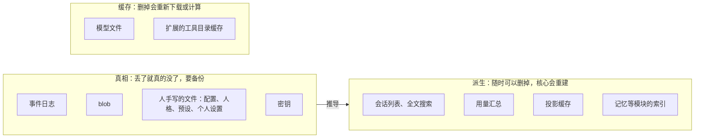
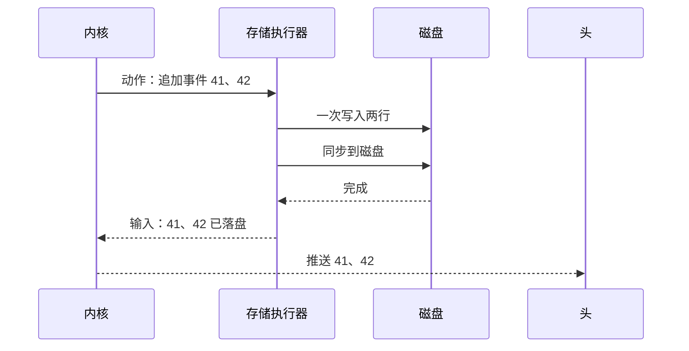

## 存储（草案）

状态：S1 到 S9 已定（2026-09-25；第六节删掉的会话怎么留用量，2026-09-30 补）。其余内容为草案。

### 一、真相只有四种



- 真相只有四种：事件日志、blob、人手写的文件、密钥（S1）。
- 其余一切都是从真相推出来的派生数据，或者是缓存。派生数据坏了、结构变了、版本对不上，直接删掉重建。
- 模块也遵守这一条：模块把自己的事实记成事件（`ext.<模块名>.<种类>`），模块自己的数据库只是索引。
- 备份只需要备份真相。

### 二、目录布局

仿照 Linux 的文件系统层次：系统区像 `/etc` 和 `/usr/share`，家目录像 `/home`，状态区像 `/var`。

```text
<数据根>/
├── .gqy-root                        标记：这是 GQY 的数据根（第一次用时写下）
├── system/                           系统区：管理员维护，对成员只读
│   ├── config.toml                   核心配置
│   ├── secrets.toml                  密钥，只有本人可读写
│   ├── accounts.json                 网页登录的用户名、argon2id 的密码哈希，只有本人可读写
│   ├── journal.jsonl                 系统日志：账号、邀请、组、权限、管理操作
│   ├── personas/<人格>/              共享人格，连同她的一般知识
│   ├── presets/<预设>.toml           共享预设
│   ├── venues.d/                     场所规则（`18-通讯平台.md` 第三节）
│   ├── sources.d/                    第三方软件源和它们的公钥
│   ├── packages.lock                 系统级软件包的锁文件
│   ├── tools/<工具>.toml             工具描述的同名覆盖（`25-工具加载.md` 第五节）
│   └── packages/<包>/                系统级安装的软件包
├── home/<账号>/                      家目录：这个人产生的一切
│   ├── settings.toml                 个人设置
│   ├── secrets.toml                  自己配的模型用的密钥，只有本人能用
│   ├── logins.json                   浏览器的登录令牌：只存哈希、什么时候过期
│   ├── profile.md                    “希望 AI 怎么认识你”
│   ├── allow.toml                    记住的放行规则：这个工作区以后都允许
│   ├── trust.toml                    信任过的项目配置：仓库路径加内容的哈希
│   ├── journal.jsonl                 账号日志：不属于任何会话的事实
│   ├── sessions/<会话编号>/          会话日志，一个会话一个目录，按段存
│   ├── blobs/<哈希前两位>/<哈希>     附件、大内容、策略快照
│   ├── personas/<人格>/              私有人格
│   ├── presets/<预设>.toml           私有预设
│   ├── kb/<名字>/                    自己的知识库：文档本身，索引在 index/ 里
│   ├── packages/<包>/                这个人自己安装的软件包
│   ├── packages.lock                 自己装的软件包的锁文件
│   ├── tools/<工具>.toml             自己的工具描述覆盖
│   ├── modules/<模块>/               各模块在这个账号下的数据：事件日志是真相，索引是派生
│   ├── workspace/                    成员工具的默认工作目录，也是沙盒边界
│   └── index/                        派生：会话列表、全文搜索、投影缓存
├── state/                            派生：全局索引、用量总表、运行日志（logs/，28-运行日志.md）
└── run/                              运行时：锁文件、套接字、本机令牌
```

默认位置：

| 平台 | 数据根 | 缓存 |
|---|---|---|
| Linux | `~/.gqy` | `$XDG_CACHE_HOME/gqy`，未设置时是 `~/.cache/gqy` |
| macOS | `~/.gqy` | `~/Library/Caches/GQY` |
| Windows | 用户目录下的 `.gqy`，也就是 `%USERPROFILE%\.gqy` | `%LOCALAPPDATA%\GQY\cache` |

- **数据根放在家目录的 `.gqy` 里**（2026-09-26 项目主人定，S6）：好找、好备份、好搬家，和 `~/.claude`、`~/.codex` 一个样子；三个平台一个说法。缓存还放系统的缓存目录：它能删、能重下，备份工具也认得它。

- 环境变量 `GQY_HOME` 可以把数据根指到别处。测试一律用它指向临时目录，绝不碰真实数据。旧版就出过测试误用真实数据目录的事故。
- **怎么找**（2026-09-26 补，施工 3-1）：
  - `GQY_HOME` 要写绝对路径，相对的拒绝：相对路径跟着当前目录变，同一个人在两个目录里启动，会找到两个数据根。空的当没设。
  - `XDG_CACHE_HOME` 是相对路径的，当没设，照 XDG 规范。
  - 家目录（Windows 的缓存要 `%LOCALAPPDATA%`）找不到，报错，不猜。
  - 别的类 Unix 系统照 Linux 的走。
- **认得出自己的数据根才动它**（2026-09-26 补，施工 3-1 补）：数据根的顶层有一个标记文件 `.gqy-root`。目录不存在、是空的，第一次用时建好骨架、写下标记；有标记的，照常用；**不是空的、又没有标记的，不碰它，报错停下**：「这里有别的东西，认不出是 GQY 的数据根（顶层没有 `.gqy-root`），不动它；设 `GQY_HOME` 指到一个空目录」。
  - 认不出的只有这一种说法，不去猜里面是什么（施工 3-1 再补）。旧版 GQY 也放在 `~/.gqy`，布局不一样，新版照样认不出、一个字节都不动；新版的代码里不认旧版，迁过来靠一个单独的迁移程序（2026-09-26 项目主人：不背旧版的兼容债，`27-从旧版迁过来.md`）。
  - `GQY_HOME` 写错了（例如写成了家目录本身）也一样：不会往一个不是数据根的目录里建东西。
- **数据根的顶层不放 `config.toml`**（配置在 `system/` 里）：在家目录下找项目配置时，`~/.gqy` 不会被当成一个仓库的项目配置（`14-配置.md` 的 `.gqy/config.toml`）。
- **第一次用时建骨架**（施工 3-1）：只建四个顶层目录 `system/`、`home/`、`state/`、`run/`，和标记文件 `.gqy-root`，别的用到时再建。Unix 上新建的目录权限 0700，只有本人能进；已经有的不改，权限不对由 `gqy doctor` 报告（`22-命令行.md` 第五节），数据根可能是人自己建、自己设的。Windows 上靠用户目录本身的访问控制。
- Linux 上的套接字放在 `$XDG_RUNTIME_DIR`，其他平台放在数据根的 `run/` 下（`04-核心协议.md` 第二节）。
  - 路径太长、放不下时改放 `$TMPDIR/gqy-<uid>/`：macOS 的上限只有 104 字节，`GQY_HOME` 指到很深的目录、测试用的临时目录都会碰到。这个目录权限 0700，用之前核对属主；实际位置记在数据根的 `run/` 里，头照着去连（2026-09-26 补）。
  - **怎么写**（2026-09-27 补，施工 3-8 下）：一个数据根一个核心，套接字按数据根分开，名字里带数据根的指纹（数据根绝对路径的 SHA-256 前 8 位）。Linux 是 `$XDG_RUNTIME_DIR/gqy-<指纹>/core.sock`（旧版用的是 `$XDG_RUNTIME_DIR/gqy/`，不撞）；没设 `$XDG_RUNTIME_DIR` 的，和别的平台一样放 `run/core.sock`；放不下的是 `$TMPDIR/gqy-<uid>/<指纹>.sock`。Windows 是命名管道 `\\.\pipe\gqy-<指纹>`，只对本人开放（`04-核心协议.md` 第二节）。核心每次起来把实际位置写进 `run/socket`，头读它去连。
  - **核对**（施工 3-8 下）：`$XDG_RUNTIME_DIR` 要是绝对路径、属于自己、组和别人没有任何权限的目录（XDG 规范就这么要求），不合的当没设，改放 `run/`：例如 `su` 成别的用户以后，它还指着原来那个人的目录。套接字所在的目录，核心绑之前、头连之前都核对：是目录不是链接，属主是自己，组和别人没有任何权限。新建的是 0700；已经有的不对就不用，报错，不去改它。
  - **旧套接字**（施工 3-8 下）：位置上已经有套接字文件的，先试着连一下。连不上的是上一个核心崩了留下的，删掉；连得上的（例如另一个数据根的指纹撞了，它的核心正在用）和不是套接字的文件都不动，报错。核心退出时先删套接字文件、再放锁。
  - **路径的上限**按字节算，不算结尾的零：Linux 107、macOS 103。
  - **Windows**（施工 3-8 补）：管道的安全描述符写成 `D:P(A;;GA;;;<当前用户的 SID>)`，受保护、不继承上一层的，只允许当前用户，每个实例都带上它；核心建第一个实例时声明「第一个实例」，名字被别的程序占了就报错、不动它。头连上以后问出管道服务端的进程，取它的用户 SID 跟自己的比，不是自己的不交令牌；管道忙（核心刚接走一个连接）歇 50 毫秒再连，最多等 5 秒。调 Windows 安全接口的几样在单独放开了 `unsafe` 的 `gqy-pipe` 里（2026-09-27 项目主人定）。
  - `run/socket` 一行，写的是套接字的路径。`run/token`、`run/socket` 每次起来都重写：先写临时文件再改名，读的人读不到半个；不同步，断电丢了，下次起来再写（施工 3-8 下）。
- **本机令牌**（2026-09-27 补，施工 3-8 下）：`run/token`，32 个随机字节写成 64 位十六进制，Unix 上权限 0600。核心每次起来换一个，旧的就作废了；头连的时候现读。
- 模型文件这类大缓存放在系统的缓存目录，整台机器共用，换了数据根也不用重新下载。
- 出厂的人格、预设、提示词随发行附带，放在资源目录里，只读，不在数据根里（`12-进程形态与分发.md` R3）。找人格和预设时，它排在最后：自己的家目录、系统区、出厂的（`16-人格与预设.md` 第四节）。

三条归属规则：

1. 人产生的数据，放进这个人的家目录。
2. 管理员发布的东西，放在系统区，对成员只读。
3. 机器运行产生的数据，放在状态区或缓存。

由此得到两个直接的好处：导出一个人的数据，就是打包他的家目录；删除一个账号，就是删除他的家目录，再在系统日志里记一笔。

数据里存的路径一律是相对路径。整个数据根拷到另一台机器、另一个平台，可以直接使用（`00-设计理念.md` 跨平台：数据可以搬家）。

### 三、事件日志：一个会话一个目录，按段存

- 每个会话一个目录：`home/<账号>/sessions/<会话编号>/`，里面按段存成几个 JSONL 文件。写满一段（初值 64 MB，实测再定）就开下一段，写完的段不再改。每行一条事件，格式就是 `03-事件模型.md` 里的格式，UTF-8 编码，行尾一律 `\n`，Windows 上也一样。分段是 2026-09-25 补的：群聊这类会话一直续下去，单个文件会一直长。
- **段怎么存**（2026-09-26 补，施工 3-2）：
  - 段文件叫 `<这一段第一条的序号，补零到 12 位>.jsonl`，例如 `000000000001.jsonl`；照文件名排，就是段的先后。
  - 写一批之前，这一段已经到了上限，就开下一段；一批不拆到两段里。新建段文件以后，Unix 上同步所在的目录，新文件本身才算落盘。
  - 刚建、还没写进一行的段是空的：打开时当没有，接着往里写。
- 只追加。唯一的例外是隐私抹除：把那一段重写到临时文件，再原子替换。抹除由这个会话的 actor 自己做：先停下写入，重写、替换，再重新打开文件。别的进程、别的代码都不直接改日志文件，免得 actor 还拿着旧文件，往一个已经被替换掉的文件里写。
- 一个会话只有一个写者，就是这个会话的 actor，所以不需要任何锁。
- 同一步里产生的多条事件，一次写入，一次同步。
- 系统日志和账号日志用同样的文件格式。系统日志记 `account.*`（注册、停用）、`invite.*`、`group.*`、`permission.changed`、`capability.*`（管理能力的授予与收回）、`package.*`、`config.changed`（系统配置那一层）、`secret.changed`（系统的密钥，只记名字）；账号日志记 `config.changed`（个人设置）、`profile.changed`、`rule.*`（放行规则）、`trust.changed`（项目配置的信任）、`secret.changed`（只记名字）。M8 做了 `config.changed`、`trust.changed`（蓝图 `config.md`「系统日志、账号日志」，施工 8-3），`secret.changed`（系统的密钥记进系统日志，施工 8-5）。
- 日志是纯文本，人和中等模型都能直接用文本工具查看。例如用 `tail -f` 实时看一个会话在做什么。
- **导出一个会话**（`session.export`）：会话日志、它引用的 blob 和策略快照，打成一个包；不含密钥，也不含派生索引。随 M8 做，先不做导入（2026-09-30 项目主人定）；各家怎么做见调研 `docs/reviews/2026-09-30-会话导出调研.md`。2026-09-30 项目主人定：
  - 第一批两种：原始包（ZIP：日志各段原文、引用到的 blob、全部子会话、清单，另附一份能直接看的 Markdown），存档、查问题、以后导入用；Markdown，给别的 agent、贴进网页版的聊天 AI、自己看。
  - 人先选给谁用（存档、给别的 agent、贴进网页聊天、自己看），每种一套默认，再选复制还是存文件，同时看到大小和 token 估算；命令行能再改开关。
  - 给别的 agent 默认带她现在的上下文（压缩过的从最近一次摘要起），要全部加开关。
  - Markdown 里的子代理只带交代和回报，要全文加开关。
  - 敏感内容只提醒，一个字都不改（原始包、Markdown 都不改）。
  - 不做分享链接，只导文件。
  - Markdown 里的图片、附件写占位，可以选连图一起导成一个文件夹，Markdown 里写相对路径。
  - 其余照调研第五节的推荐，M8 拆步时写进蓝图。

### 四、写入与崩溃



- **先落盘，后推送（S4）。** 持久事件同步到磁盘之后才算发生：才回应给命令的发送者，才推给头，才用于下一次请求。所以头见过的事件，崩溃之后一定还在。
- **先落 blob，再写引用它的事件。** blob 先写进临时文件并同步，再改名成它的哈希。改名是原子的，所以磁盘上不会出现写了一半的 blob。
- **打开日志时自检三件事**：最后一行完整（以换行结尾），每一行都能解析，序号连续。有投影缓存时，只查它记下的位置之后那一截；没有、或者对不上，才从头查。不完整的尾巴直接截掉。它一定从未被确认过，因为确认发生在落盘之后。
  - 只截最后一段末尾那半行（2026-09-26 补，施工 3-2）。别的不对：中间有一行读不出来、序号接不上、段的文件名和它第一条的序号对不上，一律报错，写明是哪一段第几行，不自动修：修错了就是丢了真相。
  - 截掉的半行之前，同一批里写全了的几行照留：它们没被确认过，可命令的编号记在它们的 `cause` 里，重发的命令照这些事件回应，不会再生效一次（`02-内核.md` 不变量 9）。
- 崩溃之后，未完成的回合按内核不变量 8 标记为中断；有计划的重启另有一条路，再起来时接着干（`02-内核.md` 第六节「载入、崩溃、重启」）。
- **写不进去**（2026-09-27 补，施工 3-7 中）：磁盘满了、没有权限这类，这个会话的 actor 停下，记一条 `WARN`（`28-运行日志.md`），等着回应的命令收到「会话停了」。没落盘的事件不算发生：没回应过，也没推送过，下次载入时照磁盘上的来。不在原地重试：内存里的会话已经往前走了，和磁盘对不上，从磁盘重新载入最清楚。

各平台的坑：

- macOS 的 `fsync` 不保证数据真正写到存储介质上，真正的保证要用 `F_FULLFSYNC`，但它慢得多。GQY 和 SQLite 的默认做法一样，用 `fsync`。所以在 macOS 上，突然断电可能丢掉最后一小段已确认的事件；程序崩溃不会丢。
- Unix 上，改名之后还要同步所在的目录，改名本身才算落盘。新建文件、新建目录也一样：上一层不同步，断电以后这一项可能没了（2026-09-26 补，施工 3-3）。
- Windows 上用 `FlushFileBuffers` 同步。

### 五、blob

- 路径：`home/<账号>/blobs/<哈希前两位>/<哈希>`，哈希算法是 SHA-256。
  - 文件名是内容哈希去掉 `sha256:` 以后的 64 位十六进制，前两位也照它取：Windows 的文件名里不许有冒号（2026-09-26 补，施工 3-3）。
- **写**（2026-09-26 补，施工 3-3）：先写进 `blobs/tmp/` 里的一个临时文件、同步，再改名成它的哈希、同步所在的目录。返回时它已经落了盘，这才写引用它的事件（第四节）。
  - 已经有了的不重写，只把修改时间刷成现在：回收的宽限期按修改时间算，刚又传了一遍、还没被引用的，不能当成旧的删掉。git 存对象也是这样做的。
  - 崩溃留在 `tmp/` 里的临时文件不影响读写，回收的时候一起清，只清比宽限期还老的。
- **读的时候核对哈希**（2026-09-26 补，施工 3-3）：读出来的内容和它的名字对不上，报错，写明是哪一个，不自动修，也不删。没有这个 blob，另报一种错。
- **按账号分开存，不跨账号去重（S5）。** 跨账号去重会泄露信息：上传一个文件时，如果“秒传”成功，就说明别人也有这个文件。
- 策略快照（`03-事件模型.md` E5）也是 blob，存在会话属主的家目录里。
- **回收**：删除会话之后，不再被任何日志引用的 blob 才会被删掉。引用关系从日志推出来，不单独记账。刚上传、还没被任何消息引用的 blob 有一段宽限期（例如 24 小时），防止误删。

### 六、派生数据

- 每个账号的派生数据放在 `home/<账号>/index/`，全局的放在 `state/`。
- 会话列表、全文搜索、用量汇总用 SQLite 保存（S3）。她按关键词翻历史（`history`）走全文索引，不扫日志文件。
- **删掉的会话，用量照样留在统计里**（2026-09-30，照推荐定）：用量汇总会被重建（结构变了、坏了），重建只读得到还在的日志，删掉的会话花的那部分就没了。所以会话被永久清掉的那一刻（从回收处清掉时；挪进回收处的时候不算，回收处里的日志重建时照样读），往账号日志 `journal.jsonl` 追加一条，带上这个会话的用量合计，写完整的值，不写增量。重建时照还在的会话、回收处、这些记录三处加起来，每个会话只在一处出现，不用去重。用量汇总因此不用备份，真相仍然只有事件（S1）；备份汇总的办法没选：它就成了第二份真相，而且从备份恢复照样补不上备份之后删掉的那几个会话。
  - 施工 8-15 照这一条做了（`docs/blueprint/models.md`「怎么走」第九条第 4、5 条）：汇总在 `state/usage.db`；清回收处之前写的那一条叫 `usage.purged`，按（供应商、模型、用途、UTC 的整点小时）分好四项用量、请求数、没金额的次数，金额照币种各写各的；写进去了才删目录。按小时存，分天时整点时区的一分不差，半点时区照小时的开头归到哪天（2026-10-02 施工时定）。
  - 不属于哪个会话的一次性调用（协议的 `model.call`、替看图）也照这个办法：每发出去一次往调的那个账号的 `journal.jsonl` 追加一条 `usage.oneshot`，再写进汇总；汇总重建时照账号日志读回来（2026-10-02 施工时定：会话的日志装不下不属于会话的请求，只写进汇总的话表一重建账就没了）。
- **投影缓存**：打开一个长会话时，先读投影缓存，再重放它之后的事件。它记着覆盖到哪一段的哪个位置，以及到那里为止的累积哈希。投影缓存和程序版本绑定，版本对不上就丢弃重建。它和压缩的检查点（`09-压缩.md`）不是一回事：压缩检查点是日志里的事件，投影缓存只是派生数据。
- **结构变了就删掉重建，不写迁移。**
- 派生数据不需要备份。如果非要复制正在使用的 SQLite 文件，只能用 `VACUUM INTO`，不能直接复制文件。旧版就因为在同一个进程里打开又关闭活库文件，丢掉了 SQLite 依赖的文件锁，把数据库弄坏过。

### 七、会话按需载入

- 核心启动时不载入任何会话，只读会话列表索引。
- 头订阅某个会话，或者有消息发给它时，这个会话的 actor 才启动：读投影缓存，重放尾部，然后就绪。
- 会话空闲一段时间后，actor 退出，释放内存。
- **活动的会话在内存里只留两样**（2026-09-26 补）：追加时查规矩用的账本，它不留事件，只随回合数长，一轮 8 个字节（`02-内核.md` 第九节，施工 6-9）；最近一次压缩以后的事件，投影要用，压缩一次就丢掉更早的；撤掉的回合留到下一轮开始，这之前还能恢复（`03-事件模型.md` 第七节）。更早的只在磁盘上：界面翻历史按页读（`view.page`），`history` 从磁盘读（M6 先每次从头读，索引以后做，`10-自带软件.md` 第三节）；撤销越过压缩时，要用的那一段临时从磁盘读回来（`09-压缩.md` 第九节，2026-09-29 补）。所以会话再长，占的内存也只随上下文窗口走，不随日志走。每个活动会话的预算是 5 MB（`23-性能预算.md`），窗口大的模型要照那里的量法实测。
- 所以就算有几千个会话，占内存的也只有正在活动的那几个。

### 八、没有数据库迁移（S7）

- **事件**：靠 `03-事件模型.md` 第八节的格式演进规则。旧日志永远原样可读，不需要迁移。
- **派生数据**：结构变了就删掉重建。
- **人手写的文件**：用 TOML（S9）。程序修改它们时，用保留格式的方式读写，注释、排版、不认识的字段全部原样保留。所以新旧两个版本可以读写同一份配置，而不会互相抹掉对方的字段。

旧版最脆弱的地方，就是数据库迁移和按列序读取的查询。这套设计里，它们不再存在。

### 九、密钥

- 模型供应商的密钥等，单独放在 `system/secrets.toml`。文件权限只允许本人读写，Windows 上用对应的访问控制（施工 8-5：Unix 上 0600，Windows 上照数据根继承的；经 `gqy login` 存，蓝图 `config.md` 第九条）。
- 成员配了只给自己用的模型时，密钥放在自己家目录的 `secrets.toml`，只有这个成员的会话能用（`15-模型与供应商.md` M6）。
- 密钥永远不进入日志、blob、策略快照，也永远不经过视图流和事件流。策略快照里只写密钥的名字。
- 所以把日志和快照附进 bug 报告，不会泄露密钥。

### 十、单实例与锁

- 同一个数据根上只能运行一个核心。核心启动时对 `run/core.lock` 加文件锁，用 Rust 标准库自带的跨平台文件锁。
- 拿不到锁，说明已经有一个核心在运行，新启动的进程直接连上它，不再另起一个。旧版出过“两个核心同时运行，各自以为自己是唯一的”这种事故。
- 锁一直拿到核心退出：进程没了，操作系统替它放开，崩了也不会留下一把死锁（施工 3-8 下）。
- 起来的先后（施工 3-8 下）：算出套接字放哪，拿锁，换本机令牌，绑套接字，记下位置。令牌在套接字能连之前就换好了，连上的头读到的一定是新的。

### 十一、决定

**S1. 真相与派生分离**

- **已定：真相只有四种（事件日志、blob、人手写的文件、密钥），其余全是可以重建的派生数据或缓存。模块的事实也记成事件。**
- 未选：各模块各自维护自己的数据库作为真相。备份、迁移、删除账号时，都要逐个模块处理。
- 重开条件：出现无法表达成事件的模块数据。

**S2. 会话日志的格式**

- **已定：每个会话一个只追加的日志，按段存成 JSONL 文件（分段是 2026-09-25 补的）。**
- 未选 A：SQLite 表，也就是旧版的做法。结构一变就要写迁移，查询依赖列的顺序，活库还不能直接复制，这些正是旧版最脆弱的地方。
- 未选 B：纯 Rust 的嵌入式键值库。不依赖 C 编译器，但人和中等模型都无法直接查看里面的数据。
- 重开条件：实测按段存的日志在某种访问模式下成为瓶颈，例如需要频繁随机读取很老的历史。

**S3. 派生索引用什么**

- **已定：SQLite。** 放在各账号的 `index/` 和全局的 `state/` 里，随时可以删掉重建。
- 未选：纯 Rust 的全文搜索库。体积大得多。
- 重开条件：SQLite 的 C 依赖在某个平台上造成无法解决的构建问题。

**S4. 先落盘还是先推送**

- **已定：先落盘，后推送。**
- 未选：先推送，后落盘。能快几毫秒，但崩溃之后，头见过的事件可能消失。
- 重开条件：实测同步磁盘的延迟可以被人感知。

**S5. blob 是否跨账号去重**

- **已定：不去重，按账号分开存。**
- 未选：全局去重。更省空间，但会泄露“别人也有这个文件”。
- 重开条件：无。

**S6. 数据放在几个地方**

- **已定：一个数据根。** 全部真相和派生数据都在里面，内部路径全是相对路径；只有大缓存放在系统的缓存目录，整台机器共用。
- 未选：按 XDG 规范，把配置、数据、状态拆到不同目录。备份和搬家时要找好几个地方。
- **已定（2026-09-26 项目主人定）：数据根默认放在家目录的 `.gqy` 里，三个平台一样；顶层放一个标记文件，认不出是自己的就不碰。**
- 未选：照 XDG 放 `~/.local/share/gqy`（macOS 的 `~/Library/Application Support/GQY`，Windows 的 `%LOCALAPPDATA%\GQY`），施工 3-1 起先这样做过。配置也跟着在 `~/.local/share` 里，找起来绕：我们本来就不照 XDG 把配置拆到 `~/.config`。
- 未选：默认 `~/.gqy`，设了 `XDG_DATA_HOME` 的照它。同一台机器上，设没设这个变量，数据会在两个地方。
- 重开条件：某个平台的规范强制要求拆分。

**S7. 数据库迁移**

- **已定：没有迁移。** 事件靠格式演进规则，派生数据删掉重建，配置文件保留格式读写。
- 重开条件：出现必须迁移的真相数据。

**S8. 密钥放在哪里**

- **已定：单独的文件，只有本人可读写。**
- 未选：交给系统钥匙串（macOS 钥匙串、Windows 凭据管理器、Linux 的 Secret Service）。三个平台行为不一，而且 Linux 的精简环境常常没有钥匙串服务。以后可以作为可选项加入。
- 重开条件：有人需要把密钥交给系统钥匙串保管。

**S9. 人手写的文件用什么格式**

- **已定：TOML。** 程序修改时保留注释、排版和不认识的字段。
- 未选：JSONC，旧版的配置格式。它也能写注释，但 TOML 是 Rust 生态的标准配置格式（Cargo 就用它），扩展清单（`05-内核接口.md`）也已经用了 TOML，统一成一种。
- 重开条件：无。

**后续再定**

- 系统日志、账号日志里的事件种类：已定，见第三节
- 超长会话的日志要不要分段：已定，按段存，见第三节
- 备份的具体命令。导出一个会话已定，见第三节
