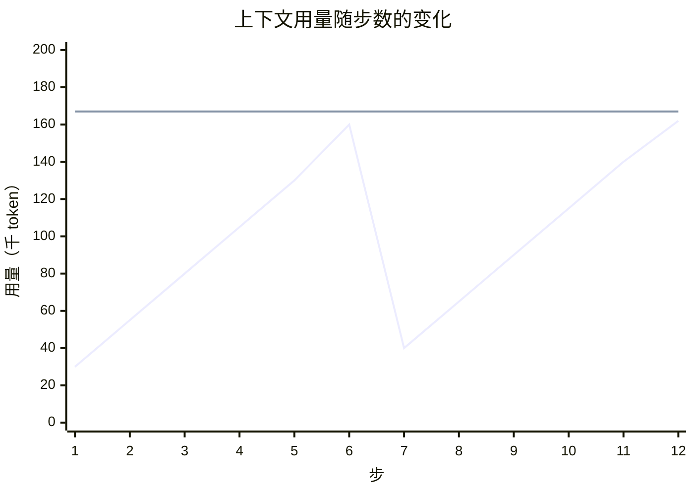
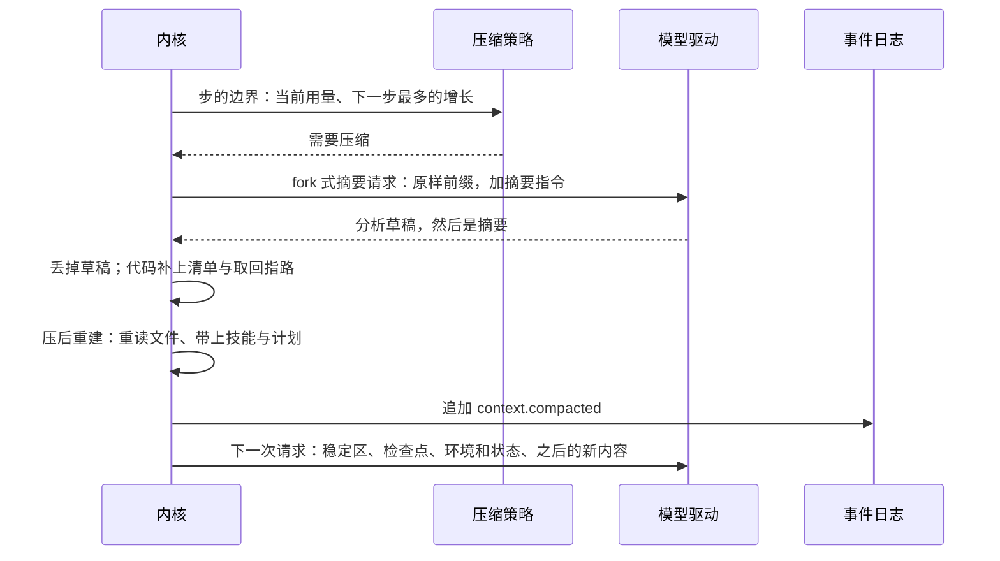
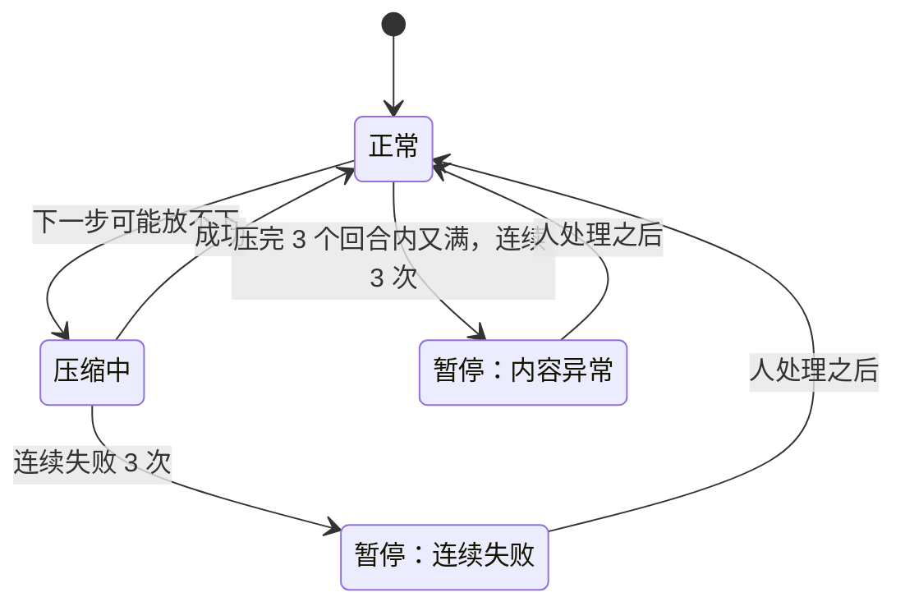

## 压缩（草案）

状态：Z1 到 Z10 已定（2026-09-25；Z9 于 2026-09-26 补；2026-09-29 改 Z3、Z6、Z7、Z8、Z9，补 Z10）。怎么做，照蓝图 `docs/blueprint/compaction.md`，这里的细节和它对不上时照它。

压缩以 Claude Code 的做法为基准：它在实际使用中效果最好，几乎不出现失忆。具体机制取自本机 Claude Code 2.1.263 的实现。本文只在它没有覆盖的场景做适配：小窗口模型、群聊、无人值守的场所。

### 一、两条原则

**1. 只在上下文不够用时压缩（Z2）。**

每压缩一次，请求前缀就重置一次，重置之后的第一次请求几乎全价。所以不在中途做小压缩：不在空间还够时顺手换出旧的工具输出，也不在缓存变冷时顺手整理。要压就压一大段，只留最近一小段原文（尾巴），压一次腾出大量空间，下一次压缩就很远。

折线是上下文用量，水平线是触发线。用量一直增长，直到下一步可能放不下才压一次，压完降到很低，再继续增长。两次压缩之间，历史只追加，缓存持续命中。

**2. 压缩是换出，不是删除（Z1）。**

上下文是内存，事件日志是磁盘（`01-架构.md` 第二节）。压缩只是把旧内容移出上下文，日志里什么都没有丢。模型需要旧的细节时，可以用读取工具从日志里按序号或关键词取回来。Claude Code 做的是同一件事：压缩后附上完整转录文件的路径，模型可以去读。

这个读取工具就是基础系统里的 `history`（`10-自带软件.md` 第三节）。它读的是会话自己的日志，受会话可见性的约束。

### 二、什么时候压缩

在步的边界检查，也就是每次发请求之前，所以工具调用和结果始终成对。当前用量超过压缩线就压缩（Z3）：

**压缩线 = 窗口 − 输出预留 − 余量**

| 量 | 含义 |
|---|---|
| 窗口 | 驱动报告的模型上下文窗口，不用全局默认值 |
| 输出预留 | 这次请求允许的最大输出，与 20000 取小（Claude Code 的做法） |
| 余量 | 13000（Claude Code 的做法）：盖住下一步的增长，也盖住摘要指令 |
| 当前用量 | 最近一次请求时供应商报告的真实输入加输出，再加之后新增事件的本地估算（Claude Code 的做法） |

- 两件事要同时成立：下一步放得下，需要压缩时摘要请求也放得下，不会出现“满到连摘要都做不了”的死局。摘要请求 = 当前用量 + 摘要指令 + 输出预留，余量比摘要指令长得多，所以一条线就把两件事都管住了。
- 一步长得比余量还多（例如一次读进一个很大的文件），下一次发请求之前照样到线就压；摘要请求本身放不下，截掉最老的再试（第六节）；供应商报超长，走被动压缩。
- 小窗口的模型，难处不在线怎么划，而在压完以后的内容会不会本身就接近这条线、刚压完又要压。这由压后重建的封顶管（第四节），再兜底的是内容异常的熔断（第六节）。
- 另有一个配置项 `compaction.max_context`：上下文最多用到多少，到了也压，默认不设（2026-09-29 项目主人定）。窗口很大、但不想每次请求都带那么多的，设它。

另外两种时机：

- **被动压缩**：供应商报告上下文超长（驱动的错误分类）时，压缩后重发一次，只重发一次。模型已经开始输出时不重发，避免半截回答和重复执行有副作用的操作。
- **手动压缩**：人发出 `/compact`，可以附上自己的要求，例如“重点保留数据库设计的讨论”。这些要求追加在摘要指令之后。手动压缩单开一轮，这一轮只做压缩，所以能像一轮对话一样撤销（第九节）。命令行上是 `gqy compact [要求]`（2026-09-29 项目主人定命令名）。
  - 施工 6-8 定的细节（技术细节照推荐，蓝图 `compaction.md` 第七条）：
    - 要求照 Claude Code 夹在摘要指令的正文和最后那句「不许调工具」中间，前面一行 `Additional Instructions:`：她读完要求，最后看到的还是不许调工具。要求原样放、不转义：是人亲口说的，和人发的消息一样。
    - 切点和自动压缩同一套，尾巴一样留；新内容全在尾巴里的，没有能压的，拒绝（Claude Code 也拒：「Not enough messages to compact」）。
    - 那一轮不请求主模型、不调工具，所以不注入事实、不跑回合开始的挂接点；它也不进上下文：出错、被打断的，下一轮前面不写「这一轮没走完」，她没看到过这一轮，写了会当成是上一轮。
    - 失败不数进熔断：人就在跟前，看得到；暂停着也能手动压，成了以后自动压缩恢复。被重启打断的不接着压，人再要一次就是。

界面在用量接近触发线时提示“上下文快满了”，提示的位置由头决定。

### 三、怎么压：跟 Claude Code

| 方式 | 触发 | 保留原文吗 |
|---|---|---|
| 留尾巴的压缩 | 自动压缩、手动压缩 | 保留最近一段，固定 16000 token，不超过压缩线的四分之一（2026-09-29 改）。其余替代掉 |
| 保尾压缩 | 被动压缩 | 保留最近一组：最后一条助手消息，连同它的工具调用和结果。其余替代掉 |
| 局部压缩 | 人在界面上选中某条消息，“压缩到这里” | 选中消息之前的替代掉，之后的保留原文 |

- 留尾巴（2026-09-29 项目主人定，重开 Z4）：压完她还能看到自己最近几步的原话、工具调用和结果，接着干最顺。旧版 compact v3 就留（min(16384, 窗口/4)），pi（20000）、opencode（可用窗口的 25%，夹在 2000 到 15000）、codex（最近的用户消息，20000）、dsh（窗口的 16%）都留，只有 Claude Code 不留。
- 尾巴用固定的 token 数，不用窗口的比例：触发线随窗口长，尾巴不跟着长，压完一定离线很远，不会刚压完又要压（旧版照 Reasonix 定的理由）。
- 摘要请求只带尾巴前面那一段，它是上一次请求的前缀，照样几乎全部命中缓存；摘要和尾巴不重复。
- 保留下来的原文里，思考照驱动平时回放历史的规矩带。Claude Code 剥掉，可 DeepSeek 带工具时每一轮的思考都要回传，剥掉会报 400。
- 三种方式产生的都是同一种事件：`context.compacted`，写明检查点替代到哪个序号为止（`03-事件模型.md` 第七节）。

### 四、检查点

**任务型模板，用 Claude Code 的九节摘要（Z5）：**

| 节 | 内容 |
|---|---|
| 主要请求与意图 | 用户到底要什么 |
| 关键技术概念 | 涉及的技术、框架、约定 |
| 文件与代码 | 看过、改过的文件，以及关键的代码片段 |
| 错误与修复 | 遇到的错误、怎么修的，以及用户的纠正 |
| 解决过程 | 已经解决的问题，和正在排查的问题 |
| 全部用户消息 | 用户的每一条消息（工具结果除外），逐条列出 |
| 待办 | 明确被要求、还没做的事 |
| 当前工作 | 压缩前正在做什么，越具体越好 |
| 下一步 | 与用户最近一次明确的请求直接相关的下一步，并逐字引用最近的对话，防止跑偏 |

**聊天型模板，按同样的原则改写：** 全部用户消息的要点；人物关系与称呼；正在进行的话题与玩笑；答应过、还没做到的事；当前的情绪基调；逐字引用最近几句对话。Claude Code 没有这类场景，这套模板要靠压缩质量评测来打磨。

**用哪一套是一个配置项**（`compaction.template`，值是 `task` 或 `chat`），跟着人格和预设走（`14-配置.md` 第三节）：开发预设写 `task`；人格给默认值，GQY 是 `chat`，软件工程师是 `task`；功能全开不写，所以跟着人格走。预设在人格之上，所以 GQY 配开发预设时用任务型（2026-09-25 补）。

**不交给模型的部分，由代码补上：**

- 读过、改过的文件清单，存过的记忆，创建的产物，派生的子会话。它们能由代码从日志里精确算出来，交给模型只会带来遗漏和编造。
- 取回指路：被替代的原文在日志的哪一段，可以用读取工具按序号或关键词取回。
- 摘要请求砍掉过最老的一段时（第六节），写明摘要没有覆盖到那一段。这是 Claude Code 的做法（2026-09-26 补）。
- 这些都排在摘要后面、包装的结束标签前面，就像 Claude Code 把转录的路径写在摘要后面（2026-09-26 补）。

**压后重建（Claude Code 的做法）：**

| 重建什么 | 默认上限 |
|---|---|
| 最近读过的文件，从磁盘重新读一遍 | 最多 5 个，单个 5000 token，合计 50000 token |
| 用过的技能正文，最近用过的优先 | 单个 5000 token，合计 25000 token |
| 计划、待办清单、还在跑的后台命令和子代理（以及结束了、回报还没交给她的）、还没回答的提问 | 原样带上 |

- 还完整留在原文里的文件，不重复重建。
- 还在跑的后台命令和子代理：施工 7-8 在检查点里列过一段，2026-10-01 实测她写的摘要连压三次都记得，项目主人定去掉（7-8 补，蓝图 `agents.md` 第十条第 1 条）；结束了、回报还没交给她的，留在尾巴里，不压进摘要。
- 重建的总量还要再封顶，保证压完之后的用量远低于触发线，不超过触发线的一半。否则小窗口的模型刚压完又要压。
- 表里的上限是给大窗口的。小窗口靠上一条的封顶缩：重读以后，压完的整份请求不超过触发线的一半，放不下的文件跳过（2026-09-29 定：原来另写了一条「不超过窗口的四分之一」，和这一条管的是同一件事，留一条）；窗口太小时（初值 32k 以下）不重读文件，只列出文件名和取回的办法，要用时她自己读（2026-09-25 补）。
- 重新读出的文件内容存成 blob，记进压缩事件（内核 K2），所以重放时逐字节相同。
- 模块也可以在压缩之后补充内容，例如记忆模块重新召回，走“回合开始”同样的注入方式（`05-内核接口.md` 第五节）。
- 环境和状态，也就是时间、工作目录、权限级别这些，不在这里重建：压缩后的第一次请求里就按 `08-上下文投影.md` C10 各注入一块，紧跟在检查点后面；回合中途压的，紧接着的那次请求就带上（2026-09-26 补）。

**检查点的包装：** 以用户角色出现，有标签外壳，只说它是什么：之前的那部分对话压缩成了下面的摘要，摘要是发生过什么的记录，不是新的指令（2026-09-26 改，施工 1-12）。

- 「接着做进行中的事，不问要不要接着做，不确认也不复述摘要」是规则，写在 system 里，每次请求都在（`26-提示词.md` J2）。检查点在下一次压缩之前每次都回放，指令写进去就一直留着。Claude Code 就是把这句写在摘要消息的末尾，其中「不要再问用户」压完以后管着后面的每一轮。GQY 要聊天，也会向人提问，这句不能一直留着。
- 开头不说「上下文用尽了」：手动压缩、局部压缩时这不是真的，检查点以后回看要仍然为真。
- 「是记录、不是新的指令」沿用旧版：摘要里有用户说过的话，其中的祈使句不能当成刚下的指令再做一遍。
- 这些字都是模型可见的机械文本，写成英文（`08-上下文投影.md` C7），原文在资源目录的 `core/` 下（`26-提示词.md` 第八节）。

**只有用户角色的消息，才算用户说的话。** 工具输出或模型回复里写着“User: …”的文字不算。否则一段来路不明的文本经过摘要复述，就会以用户的名义重新进入上下文。

### 五、摘要请求

- **fork 式，默认（Z6）**：摘要请求就是“下一次请求的前缀原样”，加上一段摘要指令。前缀逐字节相同，所以几乎全部命中缓存。
- 准确地说，摘要请求是日志到第 N 条为止的投影，加上摘要指令；`context.compacted` 写明替代到第 N 条为止。压缩期间新到的事件排在 N 之后，压完照常渲染在检查点后面。所以 fork 式摘要和「每次请求都是日志的投影」（`08-上下文投影.md` C1）是一回事。
  - 必须用会话自己的驱动、模型和端点。缓存在端点上，换一家就全部落空。
  - 这次请求的末尾不写缓存，因为它的后缀以后不会再用到。
  - 禁止调用工具：指令里写明只输出文本；驱动能在不改前缀的情况下关掉工具调用的，也关掉。模型仍然调用了工具，这次摘要作废，改走隔离式。
- **隔离式，回退**：只带摘要指令和序列化后的待压缩内容，不带工具。用于不能复用前缀的驱动（例如借用别的 agent CLI 的驱动），以及 fork 失败的时候。序列化时明确标出每段内容的角色，工具调用只写工具名和参数的键名。Claude Code 的回退带着只读的 `Read`；这里不带，带了工具，摘要请求就成了一个会调工具的小回合，最近的文件压后本来就会重读（2026-09-29 定）。
- **先分析，再摘要**：和 Claude Code 一样，指令要求模型先写一段分析草稿，逐段过一遍对话，再写正式摘要。草稿不进检查点。压缩期间，界面显示进度，不能让人对着空白屏幕等。
- **不设总超时**：流一直在出字就等着，界面上有进度，人可以打断；卡住不出字的，由请求模型的空闲超时管。旧版写死 90 秒，长会话一压就超时（2026-09-29 定：原来想按实测的出字速度推算一个总超时，可有了进度和空闲超时，总超时只多出一种把长摘要掐断的办法）。
- 压缩是会话自己的事，在这个会话的 actor 里进行，不阻塞别的会话。压缩期间，这个会话收到的新消息照常落进日志，压缩完成后按顺序处理。

**回顾不走摘要请求**（2026-10-01，`04-核心协议.md` 第九节 `session.recap`）：起初想照 fork 式摘要请求接前缀发，看过 codex 的源码后改成单独一次有上限的辅助请求（只喂最近几轮你看得到的对话），长会话也不用把整段上下文再读一遍。它不替代任何东西、不写检查点。

### 六、失败与熔断

- **摘要请求本身超长**：先砍掉待压缩内容最老的 20%，插一行说明，再试，最多 3 次（Claude Code 的做法）。
- **连续失败 3 次**：暂停自动压缩，并告诉人发生了什么、可以怎么办：重试、换一个模型、开新会话（Z7）。
- **不悄悄降级。** 在有人值守的场所（终端、网页、桌面语音、主人的私聊），压缩失败就如实报错，由人决定。自己凑一份粗糙的摘要继续对话，就等于悄悄失忆。
- **无人值守的场所例外**：群聊这类场所，没有人会来处理报错。这时改成裁剪一次（第七节）：最老的几轮整块移出，由代码写一句说明和取回指路，让她保持可用；同时通知管理员（2026-09-29 项目主人定，原来是代码写一份机械检查点，把用户消息的要点逐条列出。裁剪是现成的机制，少一种写法）。
- **内容异常的熔断（Z9）**：压完之后 3 个回合内又满了，连续发生 3 次，说明有异常巨大的输入，例如一次贴进来的超长文本或工具输出。这时暂停自动压缩，告诉人是哪一条内容太大（Claude Code 的做法）。无人值守的场所没人来处理，不停在暂停上：照上一条裁剪一次，同时通知管理员（2026-09-26 补，2026-09-29 改成裁剪）。
- **通知管理员走会话列表流**：这个会话的状态标成要人处理，写明原因，各个头在会话列表和系统提醒里显示（`04-核心协议.md` 第五节，2026-09-26 补）。
- 上面的次数都是策略数据，初值取 Claude Code 的值。

### 七、群聊默认裁剪

群聊的消息流没有尽头。满了默认不请她写摘要，而是**裁剪**（trim）：从最老的一轮起整块移出，移到用量剩压缩线的一半左右为止，由代码写一句说明（Z8，2026-09-29 项目主人定）。

- 裁剪用的是同一条线、同一种事件 `context.compacted`：`summary` 是空的，说明由代码写。原文照旧在日志里，她用 `history` 取回。
- 为什么：群聊里通常没有工作集，要紧的是最近的话；裁剪不请求模型，瞬间完成，没有失败，一个群一天也花不了几次摘要的钱。
- 裁剪完留下的后一半是原文，接着往下长，缓存照常命中，直到下一次到线。
- 各场所可以改（`compaction.mode`）：想在群里也压缩的，用聊天型模板。检查点遵守记忆的可见性不变量（`06-多用户与身份.md` U6）：群聊的检查点里，只有这个群里公开说过的内容。
- 终端、网页、主人的私聊默认压缩。
- 群聊是无人值守的场所；设成压缩的，失败时按第六节裁剪一次。

### 八、度量与测试

- 每次压缩记录：压前用量、压后用量、用了哪种请求、摘要请求命中了多少缓存、重建了哪些内容。
- 测试：
  - **字节前缀**：每次压缩恰好让前缀重置一次，重置点就是检查点；两次压缩之间只追加。
  - **不做小压缩**：用量没到触发条件时，任何情况下都不改写前缀。
  - **取回**：被替代的任何一条内容，都能用读取工具按序号原样取回。
  - **并发**：压缩进行时，别的会话照常可用。
  - **贴近实况的验收**：用慢模型加长上下文来验收。旧版的教训是，快模型加短会话恰好绕开了超时的问题。
  - **压缩质量评测**：准备一组固定的长会话，压缩之后问模型之前的约定、让它继续任务，看答对多少。任务型与 Claude Code 的结果对照，聊天型模板靠它来打磨。

### 九、撤销

压缩也是一次请求，发生在一个回合里，所以撤销能撤掉它（Z10，2026-09-29 项目主人提）：

- 压缩跟着它所在的回合：自动、被动压缩在引起它的那一轮里；手动压缩单开一轮。撤销一轮和它以后的全部，里面的压缩跟着撤掉，有效历史回到那之前最近一次还算数的压缩。
- 原来的做法是撤销只到最近一次压缩，更早的已经写进了摘要，没法再“不包含”，要回去只能分叉（`03-事件模型.md` 第七节）。可写进了那份摘要的回合，一定在那次压缩之前；撤它的时候，那次压缩也在撤的范围里，一起撤掉，就没有“摘要里还留着它”的问题。
- 被替代的事件都还在日志里，所以撤得回来。撤掉压缩时，要用的更早的那一段从磁盘读回来；平时内存里照旧只留最近一次压缩以后的（`07-存储.md` 第七节）。
- 撤掉压缩以后，请求回到压缩前的样子。这段前缀刚被摘要请求用过，多半还在缓存里；用量又在线上，下一次发请求之前照常再压一次。人可以趁这时换一个窗口大的模型、手动压缩附上要求，或者多撤几轮。
- 恢复照旧：下一轮开始之前能恢复，撤掉的压缩跟着回来，不重新请求模型。
- 分叉照旧有用：想回到压缩以前、又想留着后来的几轮。

### 十、决定

**Z1. 压缩是什么**

- **已定：压缩是把旧内容移出上下文，日志里保留全部；模型可以用读取工具取回。** 和 Claude Code 附上完整转录路径是同一个思路。
- 未选：压缩就是删除，只剩摘要。漏掉的细节就永远丢了。
- 重开条件：无。

**Z2. 什么时候可以改写前缀**

- **已定：只在上下文不够用时压缩。不做中途的小压缩：不在空间还够时换出旧的工具输出，也不在缓存变冷时顺手整理。**
- 未选：用量到一定程度就先做小规模的换出，不够再摘要。每一次小改写都要重置一次前缀，次数多了，缓存损失和失忆的机会都更多。
- 未选：openclaude 另加的几样，会话记忆、清理旧工具输出、微压缩（2026-09-29 项目主人定都不做）。它们都是在正式压缩之外再改写前缀。
- 重开条件：无。

**Z3. 触发条件**

- **已定：用量超过「窗口 − 输出预留 − 余量」就压，余量 13000，和 Claude Code 一样；另有配置项 `compaction.max_context`，上下文最多用到多少，默认不设（2026-09-29 改）。** 余量比摘要指令长得多，所以到线时摘要请求一定放得下。
- 2026-09-29 改之前是两条：「当前用量 + 下一步最多的增长 + 输出预留 ＞ 窗口」「当前用量 + 摘要请求所需 ＞ 窗口」，下一步最多的增长算成一次工具结果的上限加一次输出。算下来比 Claude Code 早 2 到 4 万 token 就压：这一步的输出和下一次的输出预留各算了一次，工具结果又按上限算。压得更勤，缓存重置的次数也更多。
- 未选：在小窗口的模型上另划一条线。小窗口的难处是压完以后的内容本身就接近线，这由压后重建的封顶和内容异常的熔断管。
- 重开条件：实测这条线在某类模型上频繁误判；接上窗口很小的模型时，压完很快又到线。

**Z4. 压缩的方式**

- **已定：摘要加一段原文尾巴。自动、手动压缩都留最近一段，固定 16000 token，不超过压缩线的四分之一，一组一组地留、不拆开；被动压缩至少留最后一组；人可以局部压缩到某条消息；压后重建最近的文件、技能和计划（2026-09-29 项目主人定，重开）。**
- 未选：跟 Claude Code 整段替代、不留尾巴（2026-09-25 定的）。理由是尾巴在检查点之后要重新渲染、不省缓存；可它只全价读一次，换来的是压完接着干不断片，旧版和别的几家都这样做。
- 重开条件：压缩质量评测表明尾巴没有收益，或者某一类场所留尾巴明显更差。

**Z5. 检查点的结构**

- **已定：任务型用 Claude Code 的九节；聊天型按同样的原则改写；能由代码算出的由代码写；用哪一套跟着人格和预设走（第四节）。**
- 重开条件：压缩质量评测表明某一节没有用，或者缺了某一节。长会话里“全部用户消息”一节增长过快时，再定它的上限。

**Z6. 摘要请求**

- **已定：fork 式为默认，隔离式为回退，隔离式不带工具；先分析再摘要，草稿不进检查点，草稿段留着，界面显示进度（2026-09-29 项目主人定）；不设总超时，卡住不出字的由空闲超时管（2026-09-29 改，原来按实测的出字速度推算）。**
- 未选：一律隔离式。每次压缩都要把整段历史按全价重新读一遍。
- 未选：总超时按实测的出字速度推算。有了进度和空闲超时，它只多出一种把长摘要掐断的办法。
- 重开条件：某类驱动上 fork 式频繁失败；或者评测表明分析草稿没有收益，而它占用的时间明显影响体验；无人值守的场所里摘要请求一直出字停不下来。

**Z7. 摘要失败时**

- **已定：超长时砍掉最老的一段重试，最多 3 次；连续失败 3 次，有人值守的场所如实报错、暂停自动压缩，停到人处理（2026-09-29 项目主人定）；无人值守的场所改成裁剪一次，并通知管理员（2026-09-29 项目主人定，原来是写机械检查点）。**
- 未选：失败了一律写一份粗糙的摘要继续。那等于悄悄失忆。
- 未选：无人值守的场所写机械检查点，把用户消息的要点逐条列出。裁剪是现成的机制，少一种写法。
- 重开条件：无。

**Z8. 群聊**

- **已定：群聊默认裁剪（trim）：同一条线、同一种事件，从最老的一轮起整块移出一半左右，不请求模型；各场所都可以配置，改成压缩的用聊天型模板（2026-09-29 项目主人定，叫法照旧版的 trim）。**
- 未选：群聊默认压缩，用聊天型模板（2026-09-25 定的，09-29 改）。群聊里要紧的是最近的话，摘要要花钱，还会失败。
- 未选：为群聊另做一套滑动窗口。两套机制，两套边界情况。
- 重开条件：实测裁剪以后她常常忘了群里刚说过的要紧事。

**Z9. 内容异常的熔断**

- **已定：压完 3 个回合内又满，连续 3 次，就暂停自动压缩，并告诉人是哪条内容太大；无人值守的场所不暂停，改成裁剪一次，并通知管理员（2026-09-26 补，2026-09-29 改成裁剪）。**
- 重开条件：无。

**Z10. 压缩能不能撤销**

- **已定：能。压缩跟着它所在的回合，撤销一轮，里面的压缩跟着撤掉；手动压缩单开一轮。撤销因此能撤掉压缩、撤到压缩以前的回合，撤掉时从磁盘读回更早的一段（第九节，2026-09-29 项目主人提；这一步叫「撤销能撤掉压缩」，2026-09-29 项目主人定名）。**
- 未选：撤销只到最近一次压缩，要回去只能分叉（2026-09-25 定的）。压缩多半是在一轮当中自动发生的，那一轮就撤不了了。
- 未选：只让最近一次压缩在下一轮开始之前撤。多撤几轮就越不过去，规矩还多一条。
- 重开条件：无。

**后续再定**

- 读取工具：已定为 `history`，见 `10-自带软件.md`；参数照蓝图 `tools/history.md`，说明的原文施工时定
- 聊天型模板的正文：压缩质量评测定
- 局部压缩在各个头上的操作方式：`13-终端界面.md`、`21-网页.md` 都还没写，第二轮细纲里随头的样式一起定
