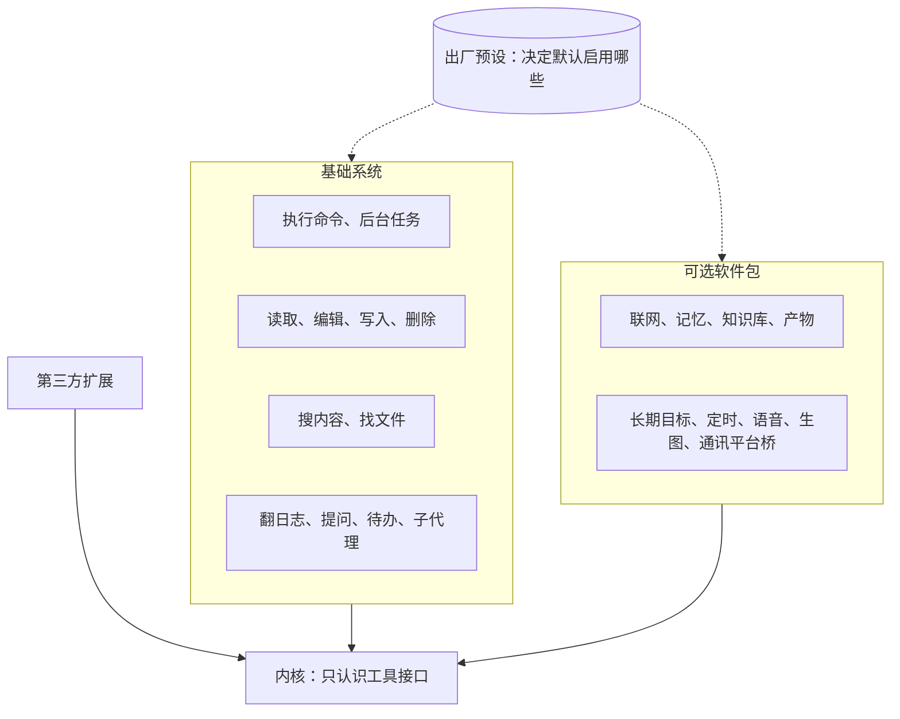
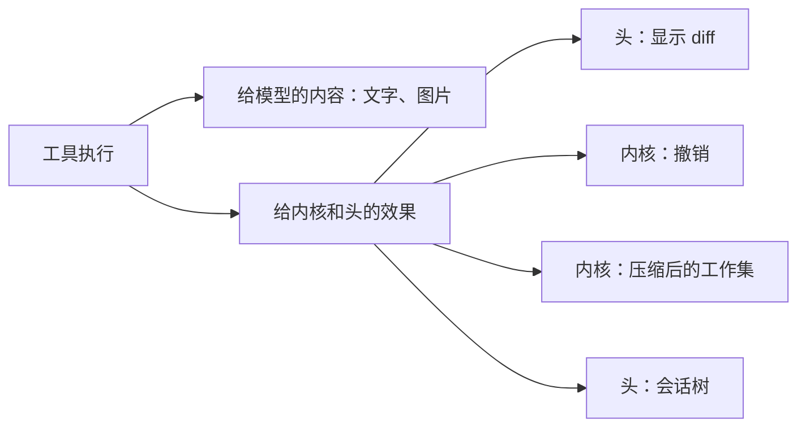

## 自带软件（草案）

状态：B1 到 B12 已定（2026-09-25；B3 于 2026-09-26 改，B7、B8 于 2026-09-27 补，B11 于 2026-09-27 定，B12 于 2026-09-28 定，B3、B6、B11 于 2026-09-28 补；`ask_user` 挪到 M8，2026-09-28）。其余内容为草案。

### 一、内核不内置工具，发行版自带软件

工具也是内核之外的软件，可以自由更换。所以这里要回答的问题不是“内置哪些工具”，而是“发行版自带哪些软件”，就像 Linux 发行版通常自带 GNU 的软件（B1）。

| Linux | Miyu |
|---|---|
| 内核只提供系统调用 | 内核只认识“工具”这个接口：派发、权限、记录结果（`05-内核接口.md`），不内置任何具体工具 |
| GNU coreutils、bash | 基础系统：几乎每个预设都打开的软件 |
| 发行版仓库里的软件包 | 可选软件包：随发行附带，由预设决定是否启用 |
| 第三方软件 | 第三方扩展：用户自己安装 |
| 发行版的默认安装清单 | 随发行附带的软件；出厂预设决定默认打开哪些 |

三层软件用同一套接口，自带的软件不开后门。任何一件都可以被替换，只要替换品遵守同样的接口，并报出同样的效果（第五节）。

### 二、判定规则：只问内核看不看得懂

shell 能做成所有的事。但 harness 需要的不只是把事做成，内核和头还要看懂发生了什么。一条 shell 命令在内核眼里只是一串文字。

所以判断一个能力要不要做成结构化工具，只问一个问题（B2）：

> **内核或头需不需要理解这件事的结果？** 需要，就做成结构化工具；不需要，就交给 shell。

“理解”具体指这六件事：

| 需要理解的事 | 为什么 shell 做不到 |
|---|---|
| diff 与撤销 | 内核只知道跑了一条命令，不知道改了什么 |
| 看图 | 命令输出只是文本，图片无法变成模型能看的内容 |
| 压缩后的工作集 | 内核看不见模型读过哪些文件。旧版的实证：读文件全走 `cat`，压缩后要重新读回的文件恒为空 |
| 权限粒度 | 每条命令都可能危险，只能要么全问、要么全放 |
| 三平台一致 | bash 和 PowerShell 的差异直接暴露给模型 |
| 中等模型的可靠性 | 用 sed、heredoc 改文件，引号和转义很容易写错 |

还有一条独立的理由：**有的场所根本不能给 shell**，例如通讯平台上的外部用户。这些场所照样需要的能力，比如翻回日志，就不能只存在于 shell 里。

### 三、基础系统：14 件

| 名字 | 显示名 | 做什么 | 为什么不能只靠 shell | 谁能用、在哪能用 |
|---|---|---|---|---|
| `shell` | 执行命令 | 前台或后台执行命令 | 它就是广度本身 | 本人、成员（成员在沙盒里） |
| `jobs` | 后台任务 | 查看后台命令和子代理的状态和输出，或停止它们 | 后台任务跨越多个步骤，内核要追踪，界面要显示，压缩后要重建 | 同 `shell` |
| `read` | 读取 | 读文本（按行分页）、图片、PDF；读目录时列出条目 | 看图；工作集；三平台一致 | 本人、成员 |
| `edit` | 编辑 | 在已有文件里做精确替换，一次可以改多处 | diff、撤销、权限 | 本人、成员 |
| `write` | 写入 | 新建文件，或整体覆盖一个文件 | diff、撤销、权限 | 本人、成员 |
| `trash` | 删除 | 把文件移进系统回收站 | 撤销；删除是最需要确认的操作 | 本人、成员 |
| `grep` | 搜内容 | 在文件里搜索文本，遵守 .gitignore | 三平台一致，不依赖系统里装没装 rg | 本人、成员 |
| `glob` | 找文件 | 按名字模式找文件，遵守 .gitignore | 三平台一致 | 本人、成员 |
| `history` | 翻日志 | 按关键词找、按序号读本会话更早的内容，能按时间、谁说的筛 | 压缩后的换入（`09-压缩.md` Z1）；外部场所也需要 | 所有场所 |
| `ask_user` | 提问 | 向人提问，可以附选项；一次一组题，不设上限（2026-09-26 项目主人定） | 界面要弹出提问面板 | 有提问界面的场所：终端界面、网页，随 M8 的抽屉一起做。`miyu ask`、QQ 和桌面语音里没有，她有问题就在对话里直接问（2026-09-26 项目主人定；`miyu ask` 是 2026-09-28 定的，`22-命令行.md` O3） |
| `todo` | 待办 | 维护当前工作的待办清单 | 界面要显示；压缩后要重建 | 本人、成员 |
| `subagent` | 子代理 | 派生一个子会话去做一件事。它在后台跑，做完了，回报会叫醒她（`02-内核.md` 第七节）；按活的难易挑模型挡位（`15-模型与供应商.md` 第四节） | 子会话是内核的对象 | 本人、成员。场所会话里没有：第一版群里不能派子代理（2026-09-26 项目主人定） |
| `sessions` | 列会话 | 列出你别的主会话：短编号、标题、工作目录、忙不忙、最近一次动静，最近有动静的在前（2026-10-01 加，跨会话，蓝图 `cross-session.md`、`tools/sessions.md`） | 会话表在核心里，shell 读不到；她要先知道有哪些会话，才能读、发给它们 | 本机的主会话。子会话、场所会话里没有（`cross-session.md` 第九条） |
| `send_message` | 发话 | 给自己派出去的子代理追加一条消息：它还在跑，下一步就看到；已经做完，就在它的子会话里另起一轮，结束时照样回报。子代理也用它给自己的父留言（`to: parent`）。父子之间只在相邻的两层之间（2026-09-29 项目主人定，`02-内核.md` 第七节）。施工 C-5 从 `message_agent` 改名（照 Claude Code 的 `SendMessage`），多发得到不在这棵树上的别的会话（`to` 写会话编号），受防刷屏管（`cross-session.md` 第五条），父子之间不受；旧会话冻着的 `message_agent` 照认 | 同 `subagent`；到了深度上限、没有 `subagent` 的会话里也有，只能发给父、别的会话；场所会话（群）没有 | 本人、成员 |

六点说明：

- **没有单独的列目录工具。** `read` 读到目录时直接列出条目。
- **技能不单独设工具。** 技能的清单写在系统提示词里，模型用 `read` 读技能正文。内核从读取的路径认出“用过哪个技能”，压缩后据此重建（`09-压缩.md` 第四节）。
- **`history` 独立成一个工具，不藏进 `read` 的某种路径前缀里（B10）。** 工具名是最强的能力广告。旧版实测过把一种能力藏进 `read` 的 `kb:` 前缀，模型常常想不起来用它。
- **基础系统本身是一个软件包**，编号是 `basesystem`，借的是 Fedora 里那个同名的包：最先装上，几乎每个预设都打开（`16-人格与预设.md` 第三节）。
- **`history` 只读本会话自己的日志**。场所会话的日志里本来只有这个场所的人看得到的东西，所以不另外过滤。
  - 检索和记忆、知识库是同一套：关键词一路加向量一路，两路的排名合并（`17-记忆.md` 第四节）。M6 先做关键词加筛选（时间、谁说的、序号范围），参数照两路定好，以后接上向量一路参数不变；向量那一路随记忆做（2026-09-29 项目主人定）。混合召回以关键词匹配为主、向量为辅；embedding 怎么接、开关怎么设，做记忆、知识库时再详细讨论（2026-09-29 项目主人定）。
  - M6 不建索引，每次从头读日志，先量；慢了再建，全文索引随记忆、知识库那一套一起做。
  - 参数、输出照蓝图 `tools/history.md`。
- **`read` 输出的写法**（2026-09-27 补，施工 4-4 上；2026-09-28 照第十节改，施工 4-4 下）：
  - 每行是行号、一个制表符、原文，行号前不补空格（Claude Code 现在的写法）；说明里照它写 cat -n format。
  - 一次最多 2000 行，一行最长 2000 个字（多的截掉、补一个 `…`），一次的输出最多 64 KiB。没读完的，最后写显示的是第几行到第几行、一共几行、下一次从哪一行接着读。
  - 读到目录：照名字列出每一项，目录后面带 `/`；和文件一样照 `offset`、`limit` 分页。
  - 认 UTF-8 和带 BOM 的 UTF-16；前 8 KiB 里有 NUL 字节的当二进制文件，不读。
- **`glob`、`grep` 输出的写法**（2026-09-28 补，施工 4-4 下）：
  - 走目录遵守 `.gitignore`、`.ignore`：在 git 仓库里时，仓库根到搜的那个目录之间的也算；不在仓库里时，只认搜的那个目录往下的（家目录里要是有一份写着 `*` 的 `.gitignore`，往上找就什么都搜不到了；pi 也这样分）。隐藏文件照找，`.git` 这类版本库目录不进；链接一律不跟：链接到的目录不进，链接到的文件不列不搜，和 ripgrep 不加 `-L` 一样（2026-09-28，施工 4-9 再补二）。链接可能指到工作区外面，而权限策略只判了要搜的那个目录。
  - Miyu 的数据根不进：权限策略只核对搜的那个目录，从上面搜下来会走进去。这一轮的工作目录在数据根里的（账号自己的工作区），照样进，和权限策略的先后一样（`11-权限与沙盒.md`）。
  - 路径在这一轮的工作目录里的写相对路径，在外面的写绝对路径；按修改时间排，新的在前。
  - `glob` 只列文件，最多 100 个，多的说一共几个、怎么缩小。
  - `grep` 三种输出：只列文件（默认）、`路径:行号:内容`、`路径:个数`；默认 250 条，照 `head_limit`、`offset` 分页；一行最长 500 个字。
  - 没找到不算出错：`No files found`、`No matches found`。
- **`write` 的细则**（2026-09-28 补，施工 4-6 上）：
  - 参数 `file_path`、`content`，照 Claude Code。新建一个文件，或者整体覆盖一个文件；只改一部分的用 `edit`。
  - 已经在了的文件，要她看过、而且现在的内容和她看到的一样才写（第五节「她看过的」）：没看过的说先读，读过以后被改了的说重读。
  - 覆盖已有的文件照它原来的编码、BOM 和换行写：原来是 CRLF 的，单个换行换成 CRLF；带 BOM 的照带；UTF-16 的照 UTF-16。新文件写成 UTF-8、不带 BOM。
  - 上级目录没有的建上；先写进同一个目录里的临时文件、同步，再改名盖上去，中途崩了不留下写了一半的文件；原来的文件权限照留。
- **`trash` 的细则**（2026-09-28 补，施工 4-6 下）：
  - 参数 `file_path`（`path` 也认）。文件、目录都能删；工作目录本身和它的上级、系统的家目录、根目录不许删。链接删的是链接本身。
  - 删之前不用先读：进了回收站撤销得回来。
  - Linux 照 freedesktop 回收站规范自己放（家目录的回收站，别的盘上的 `.Trash-<uid>`），macOS 用系统的 `trashItemAtURL:resultingItemURL:`，Windows 用 `trash` 这个 crate 删、再读回收站里的 `$I` 记录找回它。记下的位置三个平台都是回收站里的真实路径（Windows 是 `$R` 开头的那个），撤销时把它移回原处。
  - Windows 回收站列表里的名字是给人看的显示名：「隐藏已知文件类型的扩展名」开着的时候（Windows 默认开着）没有扩展名，`a.txt` 列成 `a`（施工 4-6 下在 CI 上查实）。所以不照它拼原来的路径，读 `$R` 旁边的 `$I` 记录，里面有完整的原路径和精确到 100 纳秒的删除时间。那个 crate 的 `restore_all` 也用这个显示名当恢复后的名字，撤销（4-7）不能照搬。
  - 回收站收不了的（网络盘、没有回收站的盘）：不删，说为什么（2026-09-28 项目主人定）。当场确认做出来以后（M8 的终端界面，2026-09-28 从 4-9 挪过去），在这上面加一步问人：放不进回收站，要不要永久删除；没人能确认的，照样不删。Windows 上盘的根目录下没有 `$Recycle.Bin` 的就当收不了：没有回收站的盘上，那个 crate 会直接永久删掉。
  - 还没验证的（2026-09-28）：Windows 的回收站设成了「立即删除」，或者文件比回收站的容量上限还大。这两种情况下 `$Recycle.Bin` 在，那个 crate 设了「要永久删除时先警告」的标志，没有桌面、警告框弹不出来时是卡住、中止还是直接删，还不知道。接上 Windows 虚拟机以后先测，会直接删的，就在删之前查这两个设置，查到了当收不了。
- **`shell` 的细则**（2026-09-28 补，施工 4-8）：
  - 参数 `command`、`description`、`timeout`（毫秒，默认 120000，最多 600000，照 Claude Code）。`description` 是这条命令在做什么的短标题，必填，前端显示用（2026-09-28 项目主人定，施工 4-13）；`run_in_background` 还不声明（第十节），要放后台的不跑，让她在前台跑。
  - 每次调用起一个新的 shell，从这一轮的工作目录起，`cd`、变量不带到下一次。不读用户的启动文件（bash 的 `--noprofile --norc`、zsh 的 `-f`、PowerShell 的 `-NoProfile`）：启动文件里可能 `export` 了密钥，环境变量的白名单就白设了。PowerShell 的命令编成 `-EncodedCommand`，先把输出编码设成 UTF-8、关掉进度条。
  - 环境变量只传白名单上的（`11-权限与沙盒.md` 第四节），另外设上 `GIT_TERMINAL_PROMPT=0`；标准输入接空的，要人输入的命令读到结尾就退出。
  - 标准输出、标准错误合进一根管道，照写出来的先后。最多 30000 个字，多了留头尾各一半、截在行尾，中间一行说省了多少，末尾照截断的规矩说一共多少、怎么看全；`\r\n` 换成 `\n`。什么都没输出、退出码是 0 的，说 `No output`。
  - 退出码不是 0 的，结果标成出错，末尾写 `Exit code N`；被信号杀掉的（Unix）写 `Killed by signal N`。
  - 超时、叫停时整组杀掉：Unix 上命令自成一个进程组，命令退出以后组里剩下的（`&` 放到后台的）也杀掉；Windows 上用 `taskkill /T` 杀整棵进程树，只在命令还在跑的时候杀，退出以后按编号杀可能杀错。
- **`send_message` 单独一件，不做成 `subagent` 的一个参数**（2026-09-26 项目主人提）。旧版两样都有：`subagent` 带上会话编号就能接着派，另外还有一件 `send_subagent_message`。重制只留单独的这一件，一件事一个办法；工具名本身就是能力的广告（B10）。`subagent` 的返回只写派出去了、编号是什么，回报会自己送来。施工 C-5 从 `message_agent` 改名（照 Claude Code 的 `SendMessage`，2026-10-01 项目主人定：在 Miyu 里「agent」可能指她自己、子代理、别的会话，叫 `send_message` 一看就知道是发话），同一件事多认一种对象（父子之外的别的会话），不单独开新工具。

还有两样东西属于机制，不算软件：

- **契约获取**：只在有工具是存根时出现，按组加载（`25-工具加载.md` 第二节），由工具系统自动提供。
- **替不能看图的模型看图**：图片内容遇到不能看图的模型时，由一次辅助请求交给能看图的模型转成文字描述，属于上下文投影的策略。走法（2026-09-27 项目主人问起时补，细节到做的那一步再画）：
  - 替它看的是配置里的 `vision` 用途，可以是一个模型，也可以是一个池子（`15-模型与供应商.md` 第四节）。旧版把这件事做成了一件 vision 工具，这里不做工具（B11）。
  - 日志里记的始终是原图。请求要发给看不了图的模型、历史里又有还没转述过的图，就先转述：画面里有什么，图上的字照原样抄下来。
  - 转述记进日志，挂在这张图上，同一张图只转述一次；以后每次请求原样带着，前缀不变。
  - 发给看不了图的模型时，图的位置换成这段转述；看得了图的模型收到的还是原图。一个模型都看不了、也没配看图模型的，照旧是一句占位。
  - 人直接发进对话的图（附件、通讯平台上发的图）不经过工具，走的是同一条路。
  - 头看得见：转述是日志里的一条事件，界面照它画。时间线上读图的那一步可以挂一个「视觉分析」的标签，点开是转述原文、用的哪个模型（2026-09-27 项目主人提）；样子随前端设计。
  - 还没定的：转述是通用的，不是冲着她要找的东西写的，细节可能漏掉，她又没法再看一眼。到那一步用真的看图模型实测再定，先记两个办法：写转述时带上人最近说的那句话；给她留一个追问的口子。

### 四、可选软件包

随发行附带，默认启用与否由预设决定（B4）：

| 软件包 | 包含 | 开发预设里开不开（功能全开里全开，`16-人格与预设.md` 第八节） |
|---|---|---|
| 联网（`net`） | `web_fetch` 抓取网页、`web_search` 搜索、链接卡片 `link.preview` | 开。搜索需要配置搜索来源 |
| 画 mermaid（`mermaid`） | 把 mermaid 源码画成 SVG（`mermaid.render`），给头用，不进模型的工具面 | 不是工具开关；随包编译，发行版默认打开 |
| 记忆 | 记忆的写入、查询，回合开始时的召回 | 不开。记下的内容跟着人格走（`17-记忆.md`） |
| 知识库 | 文档入库与检索 | 不开。她能查哪几个库，跟着人格走 |
| 产物 | 在网页上展示的文档、图表 | 不开 |
| 长期目标 | 跨回合持续推进的目标 | 开 |
| 定时 | 定时消息与提醒 | 不开 |
| 语音 | 桌面语音助手、听写、QQ 语音（不朗读回复，`20-语音.md` V1） | 不开。声音跟着人格走 |
| 生图 | 生成图片 | 不开 |
| 通讯平台桥 | 例如 OneBot（QQ） | 桥本身由管理员接入平台时启用；它的平台工具在哪些会话里开，由预设决定，开发预设里不开（`18-通讯平台.md` Q16） |

这些软件包各自的设计，在“子系统”一步进行。

### 五、效果：内核和头看得懂的标准接口

工具的结果分两部分（B5）：

- **给模型看的**：文字、图片等内容块。
- **给内核和头看的**：一组结构化的“效果”。它们随 `tool.result` 事件一起记录（`03-事件模型.md`），不发给模型。

| 效果 | 内容 | 谁用 |
|---|---|---|
| `file.read` | 路径，读了哪几行，读的时候整份文件的内容哈希 | 工作集；路径是技能文件时，登记为“用过的技能”；改之前核对 |
| `file.changed` | 路径；改前的内容（blob，新建时为空）；改后的内容（blob） | 显示 diff；撤销；工作集；改之前核对 |
| `file.trashed` | 路径，回收站里的位置 | 撤销 |
| `job.started` | 任务编号，对应的命令或子会话 | 会话树（`13-终端界面.md` 第七节）；压缩后重建。命令在这次调用返回以后才结束，结束记成事件 `job.reported`（`03-事件模型.md` 第三节） |
| `peer.watch` | 被等的会话的整个编号（施工 C-6，`send_message` 的 `notify_when_idle`） | 内核的账本照它算在等哪几个会话；执行器照它去订、计时；那个会话空下来记 `peer.idle`（`docs/blueprint/cross-session.md` 第六条） |

- 效果类型是标准接口，作用相当于 Miyu 自己的 POSIX。第三方编辑器只要报出 `file.changed`，diff 显示和撤销照样能用。替换自带软件因此是安全的。
- **字段**（2026-09-28 补，施工 4-6 上）：事件里怎么写见 `03-事件模型.md` 第三节。路径都是换成真实位置以后的绝对路径，撤销、核对都要找到同一个文件。改前改后的内容由工具连同内容本身交回，执行器存成 blob、换成哈希再记进事件：工具不碰存储，以后第三方的编辑器在另一个进程里，也走这一条路。
- **她看过的**（2026-09-28 补，施工 4-6 上，照 Claude Code）：会话记下每个文件她最后一次看到的内容哈希，读过的（`file.read`，读了哪一段都算）、自己写过的（`file.changed` 的改后）都算，载入时从日志里重建。写的工具改一个已经在了的文件之前，照它核对：没看过的不改，说先读；现在的内容和她看到的不一样（被人或者别的程序改过了），不改，说重读。用内容哈希比，不用修改时间。经过 `shell` 改过的文件，她看过的那一份就对不上了，改之前要重读。
- `shell` 报出退出码和耗时。命令改动了哪些文件，它不报：内核看不懂，这正是第二节说的。

### 六、编辑的格式

**精确替换（B6）**：参数是 `file_path`，加一组 `edits`，每项是 `old_string` 和 `new_string`（字段名照 Claude Code，第十节）。

- 每一处都对照**原文件**匹配，不是改完一处再对照一次。所以每处的 `old_string` 必须在原文件里唯一，而且互不重叠。
- 先精确匹配。找不到时再做宽松匹配：忽略行尾空白，把弯引号当直引号，做 Unicode 规范化。宽松匹配只影响“找位置”，写回时保留文件原来没被改动的部分。
- 保留文件原来的换行风格（LF 或 CRLF）、编码和 BOM。
- 同一个文件的修改排队执行，不同文件之间照常并行。
- 失败时，报错说清是哪一处没找到，或者哪一处不唯一，并给出最接近的候选位置，让模型下一次自己改对。

选精确替换而不选补丁格式的理由：精确替换是各家模型都训练过的格式，参数就是普通的 JSON；补丁格式要解析一套自定义语法，主要是一家模型在训练。这一节的几条具体规则参考了 pi 的实现。

**`edit` 的细则**（2026-09-28 补，施工 4-6 中）：

- 每一项还有 `replace_all`（不写是 `false`），照 Claude Code：写了的那一项，对得上的每个地方都换，用不着唯一。
- 照 Claude Code 的习惯写成一处的（顶层直接写 `old_string`、`new_string`、`replace_all`），当成只有一项认；`edits` 写成一个对象的也认。
- 精确这一层只把文件里的 CRLF 当 LF 看：她读到的每一行已经去掉了行尾的 `\r`。宽松这一层另外不管每一行末尾的空白，弯引号、破折号、各种空格当成普通的，做 NFKC 规范化。哪一层对得上几个就是几个，精确的不唯一不往宽松那一层找。
- 对上的那一段换成 `new_string`，`new_string` 里的换行照文件的换行写，别的地方一个字节不动。有一处出错、有两处重叠的，一处都不改。
- 和 `write` 一样改之前核对她看过的（第五节）。不是 UTF-8、也不是带 BOM 的 UTF-16 的不改：解不开的字节写回去就坏了。
- 没对上的，拿 `old_string` 第一行不空的那一行跟文件里每一行比像不像，最像的过了一半，就把那几行带上行号给她；不唯一的，列出在哪几行。

### 七、撤销

- 撤销一个回合时（`turn.reverted`，`03-事件模型.md`），这一回合里经过 `edit`、`write`、`trash` 的改动，按相反的顺序恢复：用 `file.changed` 里改前的内容写回，从回收站里把 `file.trashed` 的文件移回来（B7）。
- 恢复前先核对：文件现在的内容如果已经不等于当时改后的内容，说明之后又被别的东西改过。这时不覆盖，而是把冲突和 diff 交给人处理。
- 经过 `shell` 的改动无法撤销，界面上要写明这一点。
- 撤销以后又恢复的（`turn.unreverted`，`02-内核.md` 第六节「撤销与恢复」），文件跟着改回撤销前的样子，同样先核对：撤销以后文件又被别的东西改过的，不覆盖，把冲突交给人处理（2026-09-27 项目主人定）。和撤销时恢复文件一起做（施工 4-7）。
- 这一回合派出去的子代理和放到后台的命令一起停下；它们已经做的改动不在撤销范围里，撤销前头会列出来（`02-内核.md` 第七节）。
- **改回文件的细则**（2026-09-28 补，施工 4-7 上）：
  - 撤销：撤掉的那几轮里每一条工具结果的效果，照先后排好，倒过来一步步改回。`file.changed` 有改前的，写回改前的内容；新建的（改前是 `null`），移进回收站，不直接删；`file.trashed`，从回收站移回原处。`file.read` 和不认识的种类不用改回。
  - 恢复：同样那些效果，照先后正着再做一遍。改前的写回改后的；新建的，原处空着才写；上一次撤销真移回来了的，再移进回收站。
  - 每一步先核对再动手：写回的，现在的内容要是当时改后的（恢复时是改前的）；移回来的，原处要空着、回收站里要还在；对不上的不动，记下是哪一种。现在已经是要改成的样子的，算改回了，不重写。
  - 结局记成一条 `files.restored`（`03-事件模型.md` 第三节）。恢复时再移进回收站，位置变了，下一次撤销照它记下的新位置移回来。
  - 移回来：改名移回原处，上级目录没了的建上；Linux 删掉 `.trashinfo`，Windows 删掉 `$I` 记录。
  - 在哪儿改：内核照日志算出几步，会话当场做完、交回结局，做的时候不接别的命令，不开新的一轮。写回文件、进出回收站放在 `miyu-fs`，写的工具和撤销共用：撤销照的是效果，第三方的编辑器报的效果也撤得回。
  - 她看过的照有效历史算（第五节）：撤掉的那几轮里读过、改过的不算，恢复以后又算。

### 八、三个平台

- **`shell` 在各平台用的是哪个**（B8）：

  | 平台 | 使用的 shell |
  |---|---|
  | Linux | bash |
  | macOS | zsh，系统的默认 shell |
  | Windows | PowerShell：装了 PowerShell 7 就用它，否则用系统自带的 Windows PowerShell |

  工具的描述里写明当前是哪种 shell，模型据此写命令。Windows 上装了 Git Bash 的用户，可以在配置里改用 bash。

- **`grep` 和 `glob` 用自带的实现**，不调用系统命令，所以三个平台的行为和输出格式完全相同（B9）。
- 路径两种分隔符都接受，输出用平台原生的形式。工具输出里的路径，在这一轮的工作目录里的写相对路径，在外面的写绝对路径（第十节）。
- `read` 自动识别 UTF-8 与 UTF-16 编码。

### 九、工具面的预算

- 每件工具的描述不超过三句：是什么，什么时候用，最容易踩的坑。调用之后才用得上的知识写进工具自己的输出（`05-内核接口.md` 第六节）。
- 基础系统整面的 token 总量有预算，由测试守住。预算的初值由原型实测决定。

  2026-09-28 施工 4-10 实测（DeepSeek `deepseek-flash`）：七件的边际份量合计 1076 个 token，说明合计 3998 字节，约 3.7 字节一个 token；请求里带了工具，DeepSeek 另加约 211 个 token 的模板。预算是实测加一成，1184 个 token。仓库里没有分词器，测试照字节守：七份说明加起来不超过 4400 字节（2026-09-28 项目主人定）。
  施工 4-13 重量（同一天）：`read` 的说明加上图片（+13）、`shell` 加必填的 `description`（+30），七件合计 1119 个 token，说明合计 4149 字节；预算照同一个办法改成 1231 个 token，合 4600 字节。换了模型或者分词器，重新量再改。
  施工 6-4 加了 `history`（2026-09-29 照项目主人给的端点、`deepseek-v4.1-flash` 量，同一个办法）：它的边际份量 197 个 token、683 字节，八件合计 1306 个 token，说明合计 4832 字节；预算改成 1437 个 token，合 5400 字节。
  施工 7-5 加了 `agent`（2026-09-30 同一个端点、同一个办法）：它的边际份量 140 个 token、537 字节，九件合计 1444 个 token，说明合计 5369 字节；预算改成 1589 个 token，合 6000 字节。
  施工 7-3 给 `shell` 声明 `run_in_background`（2026-09-30 同一个端点、同一个办法）：`shell` 的边际份量 152 → 183，和 7-5 的 `agent` 一起九件合计 1476 个 token，说明合计 5494 字节；预算改成 1624 个 token，合 6100 字节。
  施工 7-4 加了 `jobs`（2026-09-30 同一个端点、同一个办法）：它的边际份量 127 个 token、447 字节，十件合计 1603 个 token，说明合计 5941 字节；预算改成 1764 个 token，合 6600 字节。
  施工 7-7 加了 `message_agent`（2026-09-30 同一个端点、同一个办法）：它的边际份量 153 个 token、555 字节，十一件合计 1756 个 token，说明合计 6496 字节，整个 tools 数组 1966；预算改成 1931 个 token，合 7200 字节。施工 C-5 从 `message_agent` 改名 `send_message`，说明第一句多了「or to another of your sessions by its id」：整份文件 555 → 608 字节；2026-10-01 主会话照开发端点、`deepseek-v4.1-flash` 量（同一个办法）：`send_message` 的边际份量 153 → 165，`sessions` 第二句点名 `send_message`、`history`，95 → 101，十二件合计 1879 → 1897 个 token，说明合计 7048 字节，整个 tools 数组 2090 → 2108；还在预算里，预算不改。
  施工 7-5 再补把 `agent` 改名 `subagent`（2026-10-01 同一个端点、同一个办法）：说明的字节不变，它的边际份量 140 → 141，十一件合计 1757 个 token，整个 tools 数组 1967 → 1968；还在预算里，预算不改。
  施工 C-3 加了 `sessions`（2026-10-01 主会话照开发端点、`deepseek-v4.1-flash` 量，同一个办法）：它的边际份量 95 个 token、362 字节，十二件合计 1852 个 token，说明合计 6858 字节，整个 tools 数组 1968 → 2063；预算改成 2037 个 token，合 7600 字节。
  施工 C-4 给 `history` 加了 `session`（2026-10-01 主会话照开发端点、`deepseek-v4.1-flash` 量，同一个办法）：`history` 的边际份量 197 → 224、字节 683 → 791，十二件合计 1879 个 token，说明合计 6966 字节，整个 tools 数组 2063 → 2090；预算改成 2067 个 token，合 7700 字节。
  施工 C-6 给 `send_message` 加 `notify_when_idle`、`message` 改成可以不写（2026-10-01 主会话照开发端点、`deepseek-v4.1-flash` 量，同一个办法）：`send_message` 的边际份量 165 → 204、字节 608 → 760，十二件合计 1936 个 token，说明合计 7200 字节，整个 tools 数组 2108 → 2147；还在预算里，预算不改。
  施工 8-8 给 `subagent` 加 `tier`（2026-10-01 主会话照开发端点、`deepseek-v4.1-flash` 量，同一个办法）：`subagent` 的边际份量 141 → 189、字节多 160，十二件合计 1984 个 token，说明合计 7360 字节，整个 tools 数组 2147 → 2195；还在预算里，预算不改。
  施工 8-8 补把 `subagent` 的 `tier` 换成 `pool`（2026-10-02 主会话照开发端点、`deepseek-v4.1-flash` 量，同一个办法）：`pool` 那一格会话开局时照配置拼。一个池都没列的，`subagent` 的边际份量 189 → 141，整个 tools 数组 2195 → 2147，和 8-8 以前一样；列一个带说明的池是 182，tools 数组 2188，每多一个池约再多十几个 token。资源文件 697 → 628 字节，说明合计 7360 → 7291 字节；还在预算里，预算不改。
- **工具怎么加载**：第二轮已定，见 `25-工具加载.md`。三个状态：全量、存根、关；存根按组加载；出厂是常用的全量、其余存根，可以配置；描述也能改。每个参数一句说明，只写名字看不出来的（W2，2026-09-28 改）。

  起因是功能全开装的软件一多、再加上平台工具，工具面会很繁杂（`18-通讯平台.md` 第九节）。旧版的实测可以当证据：有的模型解码时受声明的参数格式硬约束，懒加载的空壳会让它只能发出空参数；旧版为此改成按模型选全量或懒加载，后来又删掉了混合方式。

### 十、工具的规范

工具的名字、参数和输出照成熟的 harness 来，不自己另起一套（B12，2026-09-28 项目主人定）。模型见得最多的就是它们的工具，照着走，她不用现学。

对照的是 Claude Code 2.1.280（本机的二进制）、openclaude 0.31.0、opencode（2026-09-25 的开发版）、codex 和 pi（都是 2026-09-25 的源码）。

**以 Claude Code 为主。** openclaude 就是它换了供应商；opencode 的 `glob` 说明几乎逐字照抄它；Kimi、GLM、DeepSeek 这些模型都主推配它用。几家说法不一样的时候照它，它没有的工具照它的起名习惯。codex 这一版没有读文件、找文件、搜内容的专用工具，靠 shell 里的 `rg`；它改文件用补丁格式（B6 未选）。

| 哪一样 | 规范 |
|---|---|
| 工具名 | 小写，跟 opencode、pi 一样；Claude Code 自己是大写开头（`Read`、`Bash`）。**`read`、`shell` 这两个名字不改**：opencode Zen 的免费模型认的是工具里有没有 `shell`（或 `bash`）和 `read`（`15-模型与供应商.md` 第二节） |
| 参数名 | 照 Claude Code，下划线连写：读写改的那个文件叫 `file_path`，搜的目录叫 `path`；还有 `pattern`、`offset`、`limit`、`old_string`、`new_string`、`command`、`description`、`timeout`、`run_in_background` |
| 参数说明 | 每个参数一句，只写名字看不出来的：从第几行数起、默认多少、不填时是什么；默认值统一写成 `Default 100.`；名字加上可选值已经说清楚的，可以不写（`25-工具加载.md` W2） |
| 读文件的行号 | 行号、一个制表符、原文；说明里写 cat -n format |
| 结果里的路径 | 在这一轮的工作目录里的写相对路径，在外面的写绝对路径 |
| 没找到 | 不算出错，说一句：`No files found`、`No matches found` |
| 截断 | 末尾用括号说一句：显示了哪一段、一共多少（知道的话）、怎么看剩下的（`offset=` 或者把模式写窄） |
| 出错 | 一句话，带上她照着能改对的东西；工具结果标成出错 |
| 上限 | 读文件一次 2000 行；找文件 100 个；搜内容默认 250 条 |

不照 Claude Code 的地方，每一处都写明为什么：

- **`read` 兼列目录**：Claude Code 读到目录就报错，让她用 shell。有的场所没有 shell，技能正文也要靠 `read` 读；opencode 也是这么做的。
- **`read` 没读完时，末尾说下一次从哪接**：Claude Code 不说，opencode、pi 都说。这是调用之后才用得上的知识（`05-内核接口.md` 第六节）。
- **`glob` 遵守 `.gitignore`**：Claude Code 的 `Glob` 默认不遵守。opencode、pi 都遵守；不然 `target/`、`node_modules/` 里的文件会把那 100 个名额占满。
- **`glob` 新的在前**：Claude Code 的 `Glob` 是旧的在前，截断时丢掉的是最新的；它的 `Grep` 是新的在前，照这个。
- **`grep` 超长的行截掉，不整行省掉**：Claude Code 交给 ripgrep 整行省掉，她就看不到那一行在说什么了；照 pi 截到 500 个字。
- **`grep` 只声明常用的几个参数**：`pattern`、`path`、`glob`、`output_mode`、`-i`、`context`、`head_limit`、`offset`。Claude Code 另有的 `-A`、`-B`、`-n`、`type`、`multiline` 不声明；模型照它的习惯写了 `-A`、`-B` 照样认，写了 `-C` 当 `context` 认。
- **`edit` 一次改多处**（B6）：Claude Code 一次改一处，2026-09-28 项目主人定维持 B6，字段名照它。
- **`ask_user` 不设上限**：Claude Code 一次 1 到 4 道题、每题 2 到 4 个选项；2026-09-26 项目主人定不设上限，09-28 维持，字段名照它。
- **说明不超过三句**（第九节）：不照它的长说明。它自己也对一部分模型换用短说明。
- **`shell` 不记 `cd`**：Claude Code 会把 `cd` 带到下一次调用。这里每次都从这一轮的工作目录起：工作目录是回合开始时定的，权限策略也照它判；opencode、pi 也不记（施工 4-8）。
- **派子代理的那件叫 `subagent`**：Claude Code 叫 `Agent`。在 Miyu 里「agent」可能指她自己、子代理，以后跨会话还有别的会话，叫 `subagent` 一看就知道是派子代理（2026-10-01 项目主人定，施工 7-5 再补从 `agent` 改名）。改名以前造的会话，快照里冻着 `agent`，照旧名字调照样认（`tools/subagent.md`「以前的名字」）。
- **`shell` 的 `description` 必填，`run_in_background` 先不声明**：`description` 是短标题，前端要显示，名字照 Claude Code、opencode（2026-09-28 项目主人定，施工 4-13；原来打算 M7、M8 再加）；`run_in_background` 随 M7 的后台命令（施工 4-8）。

### 十一、决定

**B1. 内核内置工具吗**

- **已定：不内置。发行版自带软件，分基础系统和可选软件包；它们和第三方扩展用同一套接口。**
- 重开条件：无。

**B2. 什么能力要做成结构化工具**

- **已定：只问内核或头需不需要理解它的结果；以及有没有不能给 shell 的场所需要它。**
- 未选 A：只给一个 shell。diff、撤销、看图、工作集、权限粒度都无从谈起。
- 未选 B：尽可能多地做成专用工具。工具越多，模型越难选，token 越贵，而且大多数都是 shell 干得更好的事。
- 重开条件：无。

**B3. 基础系统有哪些**

- **已定：第三节那 14 件（2026-09-26 加上 `message_agent`，2026-10-01 加上 `sessions`：跨会话，`cross-session.md`「起草时定的」第 1 条）。**
- 2026-09-28 项目主人问过读的几件能不能不做、只靠 shell，定了三件都留：`read` 省不掉（看图、技能正文、压缩后重读、只读级别下不用问、Windows 上没有 `cat`）；`glob`、`grep` 在 Windows 上、只读级别下有用，也不用指望机器上装了 `rg`。4-10 实测时数一下 `glob`、`grep` 用得多不多。
- 不单做一件 `python` 工具（2026-09-28 项目主人问起，照推荐定）：在 `shell` 里跑 Python 就行，一行的直接跑，长的先用 `write` 写成脚本再跑。一件事一个办法。
- 重开条件：原型实测表明某一件几乎没有被用到，或者某个常见任务反复要靠 shell 绕路完成；她在 `shell` 里写长段 Python 常常因为引号、转义出错。

**B4. 可选软件包有哪些**

- **已定：第四节的初始清单。** 各包的内容在“子系统”一步细化。
- 重开条件：子系统设计时发现需要拆分或合并。

**B5. 工具怎么让内核看懂自己**

- **已定：结果里带结构化的效果，效果类型是标准接口。**
- 未选：内核从结果文本里猜。换一个编辑器，猜法就全错。
- 重开条件：出现现有效果类型表达不了、又确实需要内核理解的结果。

**B6. 编辑用什么格式**

- **已定：精确替换，一次多处，对照原文件匹配，精确优先、宽松兜底。字段名照 Claude Code：`file_path`，`edits` 里每项是 `old_string`、`new_string`（2026-09-28 项目主人定维持一次多处）。**
- 未选：补丁格式。要解析自定义语法，而且主要是一家模型在训练。
- 未选：照 Claude Code 一次改一处（2026-09-28 问过项目主人）。它退役了一次多处的 `MultiEdit`，opencode 也没有；pi 的数组常被模型写成字符串，要专门兜底。
- 重开条件：实测某类常用模型用精确替换的失败率明显偏高。

**B7. 撤销的范围**

- **已定：只撤销经过编辑类工具（`edit`、`write`、`trash`）的改动；文件在之后被改过时，不覆盖，交给人处理。撤销以后又恢复的，文件跟着改回去，同样先核对（2026-09-27 项目主人定）。**
- 未选：连 `shell` 的改动一起撤销。要在每条命令前后给文件系统拍快照，代价太大。
- 重开条件：出现轻量又可靠的快照手段。

**B8. 各平台的 shell**

- **已定：Linux 用 bash，macOS 用 zsh，Windows 用 PowerShell；Windows 上可以改用 Git Bash。**
- 未选：Windows 上要求安装 Git Bash。三个平台的命令写法会一致，但 Windows 用户要多装一样东西，不再是开箱即用。
- 未选：macOS 用系统自带的 bash。它停在 2007 年的 3.2：之后的版本改用 GPLv3，苹果不带，2019 年起默认 shell 换成了 zsh。模型常写的 `mapfile`、关联数组、`${var,,}`、`**` 递归通配，3.2 上都没有；自己用 Homebrew 装的新 bash，有的机器有、有的没有（2026-09-27 项目主人问起时记）。
- 重开条件：实测常用模型写 PowerShell 命令的失败率明显偏高。

**B9. 搜索用什么实现**

- **已定：自带实现，不调用系统命令。**
- 未选：调用系统的 rg、grep、find。各平台装没装、版本和输出格式都不一样。
- 重开条件：无。

**B10. 翻日志放在哪里**

- **已定：独立成 `history` 工具。**
- 未选：藏进 `read` 的某种路径前缀。模型常常想不起来用它。
- 重开条件：无。

**B11. 看图做不做成单独的工具**

- **已定：不做。`read` 兼做看图；看不了图的模型，走替看图的机制（第三节末尾）（2026-09-27 项目主人定：照 Claude Code、opencode、pi 直接用 `read` 的做法）。**
- 未选：单做一件看图工具，也就是旧版的 vision：多模态模型调它直接看，别的模型经配置好的多模态模型池看。人直接发进对话的图不经过工具，看不了图的模型要能看它们，替看图的机制怎么都得有；有了这个机制，看图工具就和 `read` 重了，一件事两个办法。Claude Code、opencode、pi 都是 `read` 兼管图片，Codex 单做了一件 `view_image`。
- 视频、音频先不读，以后再议（2026-09-28 项目主人问起，照推荐定）。`read` 读文本、目录和图片（PNG、JPEG、GIF、WebP，施工 4-13：DeepSeek 2026-08-21 起收图，项目主人 2026-09-28 定排在 M5 前）；PDF 另算。
- 重开条件：实测看不了图的模型常常缺转述里没写到的细节，追问的口子又做不好。视频、音频：常用的模型里能直接看视频、听音频的多起来，或者实测时常要她看视频、听音频。

**B12. 工具照谁的规范**

- **已定（2026-09-28 项目主人）：照成熟的 harness，以 Claude Code 为主。工具名小写，`read`、`shell` 不改；参数名、参数说明、输出写法、上限、排序照它；它不合理的地方改掉，写明为什么（第十节）。**
- 未选：逐项取多数。codex 没有文件工具，实际是三家投票，常常三家三个说法。
- 未选：以 opencode 为主。参数名是驼峰写法（`filePath`、`oldString`），`glob`、`grep` 这几个月还在改来改去。
- 重开条件：实测某类常用模型照这些名字调用，反而出错多。

**后续再定**

- 每件工具的参数与描述正文：各件施工时照第十节定，受第九节的预算约束
- `shell` 命令改动了哪些文件的检测：以后有轻量快照手段时再议
- 查用量的工具：零参数、只查这个会话，一件还是两件见 `15-模型与供应商.md` 第八节（2026-09-30 项目主人定）；放进基础系统还是做成可选软件包，做的那一步定
- 权限怎么向人确认、各平台的沙盒怎么实现：已定，见 `11-权限与沙盒.md`
- 替看图写出来的转述不够细怎么办：做到那一步，用真的看图模型实测再定（第三节末尾）
- macOS 上 zsh 遇到没匹配到的通配符直接报错（没加引号的网址里的 `?`、`pip install foo[bar]` 里的方括号），bash 会原样传下去：已定，照 bash 原样传下去，zsh 带 `+o nomatch`（2026-09-28，施工 4-9 再补二）
