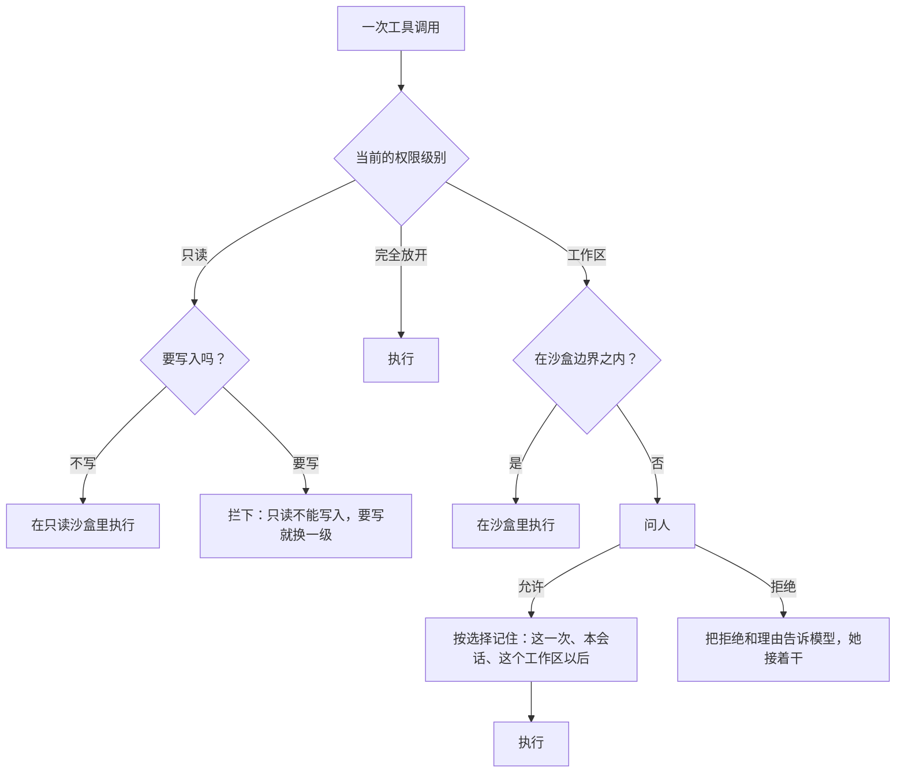
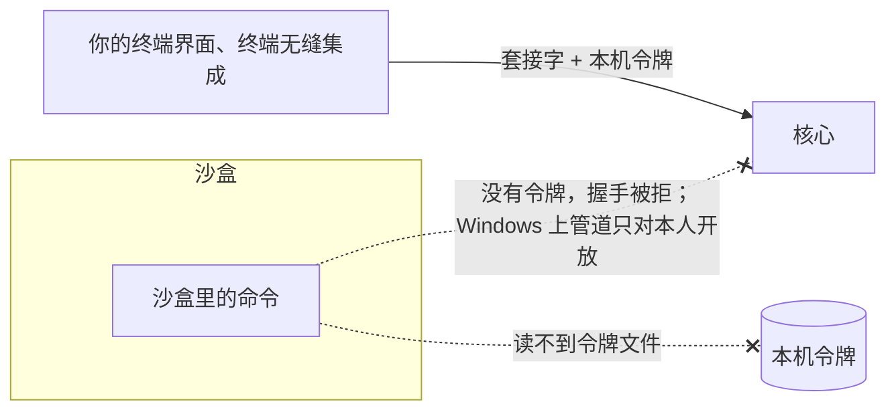

## 权限与沙盒（草案）

状态：A1 到 A13 已定（2026-09-25；A2、A5、A11、A12 于 2026-09-26 改，A13 于 2026-09-26 定，A2 于 2026-09-27 补 M5 之前的做法，A11 于 2026-09-28 补 `miyu ask`；2026-09-28 拆 M5 时 A2 确认、A5 改、A3 补装的时机）。其余内容为草案。

### 一、两道防线

- **沙盒**：由操作系统强制执行的边界。模型怎么写命令都绕不过去。
- **确认**：由人来判断。只处理沙盒管不住、或者需要越过沙盒的事。

原则只有一条（A1）：**沙盒管得住的，不问人；要越过沙盒的，才问人。** 问得越多，人越会不看就点同意，确认也就失去了意义。

两道防线都由代码执行。提示词里的任何文字都不授予权限（`06-多用户与身份.md` 第五节）。

放到 Linux 的框架里看：沙盒是强制策略，相当于 AppArmor；确认相当于 sudo，“本会话都允许”像 sudo 的免密时限，“这个工作区以后都允许”像 sudoers 里写好的规则。

### 二、三个权限级别

2026-09-26 项目主人定：只留三级（A2）。原来还有一级「逐个确认」，去掉了，理由见下：

| 权限级别 | 沙盒 | 什么时候问人 | 平台 |
|---|---|---|---|
| **只读** | 有，全盘只读 | 沙盒里的读、搜、不写文件的命令都不问；任何写入都会被拦下，临时目录也写不了 | 全部平台 |
| **工作区**（默认） | 有 | 要越过沙盒时：写工作区之外的文件、读系统家目录（`~`）里没有开放的地方 | 全部平台 |
| **完全放开** | 无 | 从不问 | 全部平台。只有管理员能用，改成完全放开时要明确确认一次 |

- **只读是叠在上面的一道开关。** 会话有一个常用的级别，工作区或完全放开，开始时取预设里的（`16-人格与预设.md` 第三节）。只读开着，实际的级别就是只读；关掉，就回到常用的那一级。
  - 终端界面里用 `Shift+Tab` 开关只读（`13-终端界面.md` H11），命令是 `/readonly`。
  - 常用的那一级用命令 `/level workspace`、`/level full` 或设置改。改成完全放开时确认一次，之后从只读切回来不再问。预设里写的是完全放开时，新会话一开局确认一次；成员用了这样的预设，退回工作区（`06-多用户与身份.md` U5）。
  - 项目主人的理由（2026-09-26）：开了完全放开的人，多半一直用它，只需要在只读和它之间来回；选工作区的人要的是安全，不会去开完全放开。
- **为什么去掉逐个确认**：它和工作区都是给要安全的人用的。三个平台又都有沙盒（A3），留两个只是多一道选择。
- **某台机器上沙盒用不了时**，例如 Windows 上没有用管理员权限装好沙盒，工作区这一级照样在，只是沙盒该拦的改成问人：执行命令、改文件、删文件之前都问，读取与搜索不问。界面上写明原因。这就是原来逐个确认的做法，只是它不再是一个能选的级别。
- **沙盒能用时**（施工 5-4 起）：工作区、只读这两级执行命令都不问，在沙盒里跑；完全放开不进沙盒。文件工具照旧由内核检查路径（第七节），读整盘放开、数据根碰不到，写越出工作区的照常问。**沙盒用不了时**改成问人（2026-09-28 项目主人确认）：`miyu ask` 问不了就拒绝，开头说一句原因和怎么修。M5 之前沙盒还没做出来，工作区这一级执行命令不问人，直接以本人的身份跑（2026-09-27 项目主人定）；施工 5-4 上起照上面的办。
- **只读用来做计划**：先让她调查、写计划，保证这期间不会改动任何文件。计划写好后，她只能提醒你；关掉只读由你按 `Shift+Tab`，回到常用的那一级（A12，2026-09-26 项目主人定）。
- 对应 Linux：只读像把工作区以只读方式挂载；工作区像普通用户外加 AppArmor 这类强制策略；完全放开就像你自己在终端里直接敲命令。
- 权限级别是会话的属性，可以随时切换。收紧当场生效：这一步里还没派发的调用按新的级别判，正停在确认上的也按新的级别重判；放宽等到下一步才生效（2026-09-26 补）。叫法是项目主人 2026-09-25 定的：权限的叫「权限级别」，「挡位」只留给模型（`15-模型与供应商.md` M3）。
- 模型需要知道当前的权限级别，否则它会反复尝试被禁止的事。级别变了，就在下一个边界注入一条，记成事实、以后原样回放；没变就不再写（`08-上下文投影.md` C10）。它追加在后面，前缀一个字节都不动。第一轮的写法是放进浮动尾巴，每次请求都带（2026-09-26 改）。
  - 切换时她看到的，是紧挨着下一句话（或者这一步的工具结果后面）的一块 `<permission level="full" previous="workspace">The user changed the permission level.</permission>`：现在是哪一级、从哪一级切过来、是人切的。只写一行 `<permission level="full"/>` 时，她看不出是切换，问起来往坏处想，当成是有人夹进来的（2026-10-01 网页验收时撞见，项目主人要改，施工 2-7 补）。会话第一轮、压缩和撤销以后她看不到上一块了，照旧写一行。`history` 也列出每一次切换，「谁」是 `user`（`tools/history.md`）。每一级能做什么、只有人能切的那一句（`core/permission-rule.txt`）同时拼进有工具的会话的 system：主会话 A/B 实测，只有切换那一块时她 4 遍里 2 遍起疑、去试探权限到哪，加上这一句 0 遍（2026-10-01，`26-提示词.md` 第十节）。
- 子代理继承父会话的权限级别和放行规则，不能比父会话更宽。子代理实际的级别，取它自己的和父会话的当中更严的那个：父会话开了只读，子代理下一步也只读。后台命令保持它启动时的权限级别：已经在跑的进程，沙盒收不紧。
  - 派生时，子会话抄下父会话常用的那一级和工作区。只读开关不抄，一直跟着父会话：父会话开关只读，子会话跟着变，并照 `08-上下文投影.md` C10 在子会话里注入一条。人切进子会话按 `Shift+Tab` 只能收紧：可以只给它开只读，父会话开着只读时关不掉（2026-09-26 补）。

**第一版的权限策略怎么判**（2026-09-27 补，施工 4-3 下）：执行前那条链的默认实现，模块编号 `permissions`。工具报出这次调用要碰的路径（`05-内核接口.md` 第六节），换成真实的位置、查边界表（第四节），每一条照下表判，合起来照最严的：有一条拒绝就拒绝，有一条要问人就问人。施工 5-4 上起读哪儿都放行（数据根除外），执行命令照沙盒能不能用：

| 这一条是 | 完全放开 | 工作区 | 只读 |
|---|---|---|---|
| 数据根里的 | 拒绝 | 拒绝 | 拒绝 |
| 能读能写那几片里的读、写 | 放行 | 放行 | 读放行，写拒绝 |
| 只能读那几片里的读 | 放行 | 放行 | 放行 |
| 只能读那几片里的写 | 放行 | 问人 | 拒绝 |
| 边界以外的读 | 放行 | 放行 | 放行 |
| 边界以外的写 | 放行 | 问人 | 拒绝 |
| 执行命令 | 放行 | 沙盒能用：放行（在沙盒里跑）；用不了：问人 | 沙盒能用：放行（在只读沙盒里跑）；用不了：问人 |

- 路径换不成真实的位置（指向不存在处的链接、没有家目录却写了 `~`）：拒绝，写明是哪一条、为什么。连它落在哪都说不清，没法问人。
- 问人时提的放行规则：越界的那几条，照是读是写列出它们所在的目录，放行的就是这些目录。执行命令的规则照命令开头记，随 `shell`（施工 4-8）。
- 给头看的说明：哪件工具，每一条路径、是读是写、在哪一片。

**问人时的四个选项**：允许这一次；本会话都允许；这个工作区以后都允许；拒绝（可以附上理由，理由会告诉模型）。记住的放行规则是策略数据，按“工具 + 匹配规则”记录，例如“`shell` 里以 `git status` 开头的命令”“`write` 写 `/srv/data` 下的文件”（A10）。联网不问人，不记放行规则（第四节 A5）。

- **放行规则管多大**（2026-09-28 定，M8 做当场确认时照做）：
  - 本会话都允许的，放行越界的那几条所在的目录，连同它下面的；那个目录是家目录本身、或者更上面的，只放行那几条本身：家目录里有钥匙。
  - 允许读的，读取、找文件、搜内容都算；允许改的，写入、编辑、删除都算。
  - 只读时执行命令只给「这一次」「拒绝」两项：照命令开头放行，得先拆得开 `a && b` 这样连在一起的命令，随 M5。
  - 「这个工作区以后都允许」要存进工作区的配置，随 M5 再加：现在没地方存，也没地方查看、收回（2026-09-28 项目主人定）。

**拒绝以后她接着干**（A13，2026-09-26 项目主人定）：她看到被你拒绝了，写了理由就带上理由，自己换个办法接着做。要她停下，就打断。先读了三家的源码：codex、opencode v2、Claude Code 不写理由的拒绝都让这一轮停下；写了理由的，后两家接着干，codex 没有写理由这一项。内核怎么走见 `02-内核.md` 第六节「确认怎么走」。

**没有确认界面的场所**：QQ（群聊和主人的私聊）、桌面语音。需要确认的操作一律拒绝，并告诉模型“这里不能做需要确认的操作”；她会在对话里说明，请人到终端或网页上做（A11）。这些场所也没有提问工具，她有问题就在对话里直接问。联网是例外：公开网站直接放行，拦本机、内网和元数据地址照旧（第四节）。

`miyu ask` 也没有确认的界面、没有提问工具（2026-09-28 项目主人定，`22-命令行.md` O3）：要确认的一律拒绝，告诉她原因，退出码 4。联网和别处一样，公开网站直接通（A5）；事先放行的目录用 `--add-dir`，加进来的能读能写，照 Claude Code、codex（2026-09-28 项目主人定）。

### 三、谁能用什么

| 身份 | 可用的权限级别 | 工具 |
|---|---|---|
| 管理员 | 三级都能用 | 全部 |
| 成员 | 只读和工作区，沙盒边界是成员自己的工作区 `home/<账号>/workspace/` | 全部，都在沙盒里 |
| 外部身份 | 不适用 | 碰不到主机：没有 `shell`，也没有文件类工具，也不能派子代理。只有翻日志、联网这类工具 |

- 成员可以批准自己的越界请求，但只能在管理员设定的上限之内。例如管理员放行过的网站。自己工作区之外的路径，成员无权批准：Miyu 的家目录里放着密钥和会话日志（`07-存储.md` 第二节）。
- **成员不能使用完全放开**（2026-09-25 确认）。这一级不进沙盒，而核心是以管理员的系统账号运行的：成员的命令会以管理员的身份执行，能读到管理员的密钥和其他成员的对话。
- 某台机器上沙盒不可用时，这台机器上的成员不能执行命令；文件类工具仍然可以用，由内核检查路径，只能碰自己的工作区（第七节）。界面上写明原因（`00-设计理念.md` 跨平台：显式声明缺失，给出降级行为）。

### 四、工作区这一级的沙盒边界

**沙盒只管写，读整盘放开，数据根除外**（2026-09-29 项目主人定，照 DeepSeek 的 dsh：一层很轻的文件系统沙盒）：沙盒里的命令哪儿都能读，只能写工作区、临时目录这些；Miyu 的数据根读写都不行，里面有本机令牌（读到就能冒充本人，第五节）、以后的 key、别的成员的会话。`.git` 不另外护。下面这张表和清单是核心里的文件工具照的边界（施工 4-3），施工 5-4 照这一条对齐：读也整盘放开，数据根除外。

边界是策略数据，下面是默认值（A4）：

| 范围 | 读 | 写 |
|---|---|---|
| 工作区 | 可以 | 可以 |
| 临时目录 | 可以 | 可以 |
| 系统目录：程序、库、系统配置 | 可以 | 不可以 |
| 工具链的目录与缓存，例如 `~/.cargo`、`~/.rustup`、`~/.npm`、`~/.gitconfig` | 可以 | 不可以（沙盒里的缓存用自己的一份） |
| 系统家目录（`~`）的其余部分 | 可以（2026-09-29 起，沙盒整盘能读） | 不可以 |
| Miyu 的数据根：日志、密钥、别的会话、本机令牌 | **不可以** | 不可以 |
| 工作区里会在沙盒外被执行的东西，例如 `.git/hooks`、`.git/config` | 可以 | 可以（沙盒不另外护，2026-09-29；文件工具照旧只读） |

- **写是白名单，读整盘放开**（2026-09-29 改，原来读也是白名单、家目录不可读）：数据根读写都不行。代价：家目录里的密钥读得到，网络又不管，就能被发出去；项目主人照 dsh 接受。
- **几片重叠时谁说了算**（2026-09-27 补，施工 4-3 上）：照这个先后，先对上的算。
  1. 工作区里：能读能写；里面的 `.git/hooks`、`.git/config` 只能读。
  2. 数据根：谁都不能碰。工作区退回到了数据根里的 `home/<账号>/workspace/` 的，那一片照第 1 条算。数据根可能就在临时目录里（测试、`MIYU_HOME` 指到那里），所以排在临时目录前面。
  3. 临时目录：能读能写。
  4. 系统目录、工具链目录：只能读。
  5. 别的：边界以外。
- **第一版的清单**（2026-09-27 补，施工 4-3 上）：是策略数据，配置那一步能改。
  - 系统目录：Linux 是 `/usr`、`/bin`、`/sbin`、`/lib`、`/lib32`、`/lib64`、`/etc`、`/opt`；macOS 是 `/usr`、`/bin`、`/sbin`、`/System`、`/Library`、`/Applications`、`/opt`、`/etc`；Windows 是 `%SystemRoot%`、`%ProgramFiles%`、`%ProgramFiles(x86)%`。
  - 工具链目录：家目录下的 `.cargo`、`.rustup`、`.npm`、`.gitconfig`，以及 `CARGO_HOME`、`RUSTUP_HOME` 指到的地方。
- **工具链的缓存，沙盒用自己的一份**（2026-09-28 项目主人定，改掉原来的「缓存可以写」）：沙盒里的命令下载、编译依赖时，缓存经各工具链自己的环境变量（例如 `CARGO_HOME`、`npm_config_cache`、`PIP_CACHE_DIR`、`GOMODCACHE`）指到只给沙盒的目录，放在数据根外面；你的 `~/.cargo`、`~/.npm` 照旧只读。为什么：缓存里有已经解开的依赖源码，沙盒能写，改过的代码就在你下次沙盒外编译时执行了，和 `.git/hooks` 是同一类口子。代价是第一次要重新下载、多占一份磁盘，cargo 的全局配置要带过去。
  - 第一版清单（施工 5-4 下）：cargo（`CARGO_HOME`；全局配置经链接带过去，发布用的令牌不带）、npm（`npm_config_cache`）、pip（`PIP_CACHE_DIR`）、go（`GOMODCACHE`、`GOCACHE`）。别的用到再加。
  - 放在缓存目录下的 `sandbox/<账号>/`（`store.md`）：和数据根分开，不跟着 `MIYU_HOME` 变；按账号分开，成员的命令写不进别人的缓存。
  - 只在工作区这一级设：只读哪儿都写不了，照你原来的缓存读。
- **被沙盒挡住的命令，结果里不另加提示**（2026-09-29 项目主人定，照实测）：`miyu ask` 里让她往工作区外写，新建文件、`git init` 两种各两次，没有提示也 4 次都认得出是沙盒挡的，一次都没绕，都给了办法（写进工作区、你来跑、换级别）；2 次多查了一两轮（输入约多 5k token，九成命中缓存）。真出现绕沙盒、反复试的，再加。
- **`.git` 不另外护**（2026-09-29 项目主人定，照 dsh）：沙盒里的命令能写工作区里的 `.git/hooks`、`.git/config`，下次你在沙盒外执行 git，写进去的东西就在沙盒外执行了。Codex 护着 `.git`；要护，Linux 上得用挂载命名空间，Ubuntu 上还要装 AppArmor 配置，太重。核心里的文件工具照旧不许改这两样。
- **网络**（A5）：沙盒不管网络，沙盒里的命令想连哪就连哪，和你在终端里跑一样（2026-09-29 项目主人定：沙盒的意义是控制读写权限，不是完全隔离）。
- **能替命令在沙盒外读写的系统服务照样挡**（2026-09-29 项目主人定）：不然读写的限制一条命令就绕过去。Linux 上是 D-Bus（`systemd-run --user` 能在沙盒外起命令）、Docker 的套接字，由 Landlock 拦（连路径上的套接字要内核 7.1 起，抽象套接字要 6.12 起，更老的内核拦不住）；macOS 上是 `osascript`、`launchctl`、`open`、钥匙串这些，由 Seatbelt 拦；Windows 上沙盒用户不是本人，本来就连不上本人的服务。本机的 TCP 端口不管（例如你自己开着的服务）。代价：沙盒里要 ssh-agent 的 `git push`、桌面通知这类会失败。
- **环境变量**：沙盒里的命令只拿到白名单里的变量，例如 `PATH`、`LANG`、`TERM`，以及工具链要用的那几个；其余一律不传。确实需要的，在策略里单独放行。原来的写法是按名字后缀去掉密钥类变量，会漏掉 `AWS_ACCESS_KEY_ID` 这种（2026-09-25 改）。
- **会话的工作区**：开会话时定。在终端里开的（终端界面、`miyu ask`），是开会话那一刻的当前目录；网页上开的，新建会话时选，默认是 `home/<账号>/workspace/`。成员只能选自己工作区之内的目录。
  - **当前目录太宽，就不拿它当工作区**：是系统家目录（`~`）本身、根目录 `/`，或者包含 Miyu 的数据根时，退回 `home/<账号>/workspace/`，并在界面上说一句。否则装完第一次在新终端里敲 `miyu`，整个家目录都进了沙盒边界。旧版 09-23 起就是这么做的（2026-09-26 补）。
  - **终端无缝集成每一轮换一次**：工作区是你说这句话时 shell 所在的目录（`22-命令行.md` 第七节）。沙盒的边界和放行规则，都按这一轮的工作区算（2026-09-26 补）。
  - **场所会话**（QQ、桌面语音）默认也是 `home/<账号>/workspace/`，场所规则的 `workspace` 可以改（`18-通讯平台.md` 第三节，2026-09-26 补）。
- **别人分享来的工作区**：会话开始时，按分享的权限加进沙盒边界，只读的分享就只读（`06-多用户与身份.md` U12）。

### 五、堵上“冒充本人”的口子

`04-核心协议.md` 原先的规则是：能连上本人的套接字，就是本人。但沙盒里的命令也是以本人这个系统用户在运行，它同样能连上核心的套接字，然后冒充你，让核心去做沙盒外的事。Codex 在 Linux 上放弃 Landlock、改用 bubblewrap，给出的理由之一就是 Landlock 隔离不了 Unix 套接字。

两层修法（A6）：

1. **本机连接还要出示本机令牌。** 令牌文件放在数据根里，只有本人可读。头启动时自动读取它，人不需要操作。沙盒读不到数据根，所以沙盒里的进程拿不到令牌。
2. **沙盒里的命令拿不到令牌，连得上也冒充不了。** Linux 内核 7.1 起它连不上核心的套接字（第四节，系统服务那一条）；macOS 上一般也连不上：Unix 套接字只连得上能写的地方，核心的套接字在藏着的数据根里（施工 5-7）；更老的 Linux 内核上、macOS 上数据根的路径太长、套接字挪到了临时目录里的，连得上，但握手要出示本机令牌，它读不到（数据根藏着），第一步就被拒（`04-核心协议.md`）；Windows 上，沙盒用户不是本人，连不上只对本人开放的命名管道（第六节）。

### 六、各平台的实现

| 平台 | 管读写的 |
|---|---|
| Linux | Landlock：读整盘放开（数据根除外），写照规格，顺带拦连系统服务的套接字 |
| macOS | Seatbelt 一份配置：读整盘放开（数据根除外），写照规格，挡替命令读写的系统服务 |
| Windows | 专用的沙盒系统用户，加访问控制列表；每个会话一个受限令牌；命令运行在单独的桌面上 |

**Linux（A7）**：

- **文件用 Landlock。** 它在内核里，不需要任何特权，也不依赖用户命名空间。我们支持的最老内核是 6.8，已经带有文件的规则。Landlock 只能做白名单，不能在开放的范围里再挖掉一块：读整盘放开时，数据根照目录一级级绕开不放（施工 5-3）。
- **沙盒助手单独一个小程序**：只做一件事，按核心给的规格先把自己收紧，再执行命令。它只接受核心写好的规格，核心之外没有别的调用方。和 DeepSeek 的 dsh 的 `landlock-run` 是同一个路子。

**macOS（A8）**：用 Seatbelt，一份配置管文件：读整盘放开，数据根藏起来，写照规格。网络不管；能替命令在沙盒外读写的系统服务（`osascript`、`launchctl`、`open` 这些）照样挡（2026-09-29 项目主人定）。Seatbelt 的接口被苹果标为过时，但它仍然可用，Codex 和 Chrome 都在用它。

- 助手照规格写好配置，装到自己身上，再换成命令；不经 `/usr/bin/sandbox-exec`：它自己出了错，印它自己的话、用它自己的退出码，核心分不出是没关进去，还是命令自己失败了（施工 5-7）。

**Windows（A3）**：照 Codex 的做法，它已经在生产环境里验证过。单独的桌面那一关改照 srt-win（2026-10-01 项目主人定，见本节末尾「Windows 照 srt-win 的做法」）。

- **专用的沙盒用户**：安装时创建一个专用的本地系统用户，沙盒里的命令以它的身份运行。它不是管理员，也不是你，所以默认碰不到你的系统家目录，也连不上只对你开放的命名管道。这个用户不在登录界面上显示。
- **文件**：用访问控制列表给沙盒用户授权：你整个家目录能读，装的时候加一条（数据根另外拒绝，和第四节「读整盘放开」一致；2026-09-29 项目主人定），工作区能写，其余照第四节的规则设置。
- **施工 5-9 暂停**（2026-09-29 项目主人定）：虚拟机上的实验跑通了读写这一层，单独的桌面还没找到在两种会话里都能用的办法（`docs/construction/5-9-Windows：跑.md`）。接上以前，Windows 上沙盒照旧用不了，照第二节每步问人。
- **成员之间的隔离**：所有沙盒命令共用同一个沙盒用户，所以每个会话的命令再套一个受限令牌，令牌里带一个只属于这个成员的“限制 SID”。Windows 检查受限令牌的权限时，要求普通身份和限制 SID 两边都被授权。所以一个成员的命令碰不到另一个成员的家目录，即使它们同时在运行。成员注册时，由核心给他的工作区设访问控制：核心是这些文件的属主，改访问控制不需要管理员权限。受限令牌在每次起沙盒命令时现生成。
- **桌面**：命令运行在单独的桌面上，不能给你的窗口发送按键，也不能读取你的屏幕。
- **git**：仓库属于你，命令却以沙盒用户的身份运行，git 默认拒绝操作别人的仓库。所以要为沙盒用户登记 git 的 `safe.directory`。
- **安装需要一次管理员权限**：创建系统用户需要管理员权限，装 Miyu 时弹出一次 Windows 的权限确认（2026-09-28 项目主人定）。安装脚本做出来以前，先由一个能单独调起的动作做，安装脚本到时候调它。没有管理员权限的机器上，沙盒不可用，按第二节降级。
- 微软较新的 MXC 容器接口不需要创建用户，也不需要管理员权限，但要看具体的 Windows 是否支持，Codex 也还只把它作为可选项。它是以后的备选后端。

**Windows 照 srt-win 的做法**（2026-10-01 项目主人定，调研见 `docs/reviews/2026-10-01-Windows命令沙盒调研.md`）：

- 身份、装法照旧（专用的沙盒用户，只在装的时候要一次管理员，5-8 不改）。卡住 5-9 的「单独的桌面」照 Anthropic sandbox-runtime 里 `srt-win` 的办法过：在当前窗口站上另开桌面（窗口站的名字读出来，不写死 `WinSta0`），访问控制明写本人、沙盒用户、SYSTEM，给沙盒用户在当前窗口站上加一条授权；助手查自己不在 `Default` 桌面上才跑。
- SSH、服务这类会话里另开桌面还是不通时：共用这个会话的桌面，给沙盒用户加授权，再用作业对象的界面限制禁掉剪贴板、碰别的窗口这些。这种会话和人登录的桌面本来隔着会话，发按键、截屏过不去（项目主人定）。
- 照它补的两条技术细节（主会话定，实验时一起验）：令牌里的登录 SID 改成只用于拒绝，不然沙盒里的命令读得到同一会话里核心的内存、拿到本机令牌（A6）；「每个成员一个限制 SID」重新核对，srt-win 说限制 SID 会弄坏系统自带的 HTTPS，照 codex 只管写（`WRITE_RESTRICTED`）、读的隔离靠访问控制，还是不用限制 SID，实验时连 HTTPS、git 一起验了再定。
- 什么时候：先在空档做一两天虚拟机小实验（一次性程序，不进仓库），在本地登录、远程桌面、SSH 三种会话里跑 cmd、PowerShell、git、cargo、HTTPS；过了以后 5-9 排在 M8 之后、对外说支持 Windows 之前（项目主人定）。

### 七、核心进程里的文件工具

`read`、`edit`、`write`、`trash`、`grep`、`glob` 跑在核心进程里，不在操作系统的沙盒里（A9）。所以内核要用同一份边界，自己检查它们的路径：

- 路径先解析到真实位置，再和边界比较。符号链接、Windows 的目录联接，都按它们指向的真实位置判断。
- 打开文件时不跟随符号链接，防止检查完之后，文件被换成指向别处的链接。
- 只打开普通文件。遇到 FIFO、设备文件、套接字，一律不打开，报错说明是什么；打开时加上非阻塞，免得卡在一个 FIFO 上（2026-09-25 补）。
- 在工作区之外的几级，这些检查也照样生效，用来执行“成员只能碰自己的工作区”“谁都不能碰数据根”这类规则。
- **第一版怎么做**（2026-09-27 补，施工 4-3 上）：
  - 相对路径照这一轮的工作目录接上；以 `~` 开头的当家目录。
  - 换成真实的位置再比；边界表里的每一片也换过一次。按路径一段一段比，`/a/bc` 不在 `/a/b` 里。
  - 还不存在的路径（要新建的），照最近的、已经存在的上级目录换，再接上后面几段；后面几段里有 `..` 的不认。Windows 找文件之前先照字面把 `..` 消掉，落在哪是定的，这一条只在 Unix 上有。
  - macOS、Windows 上判「是不是在数据根里」不分大小写，免得换个大小写就绕过去；判「是不是在工作区里」照原样比，拿不准的算在边界以外。
  - 打开时不跟随最后一层的符号链接，不阻塞；开了以后看是不是普通文件。
  - 检查完、打开前，上级目录被别的进程换成了符号链接：Linux、macOS 上按真实位置逐层打开挡住了（Linux 的 `openat2`、macOS 的 `O_NOFOLLOW_ANY`；写文件时上级目录也这样打开，临时文件、改名都相对它，施工 5-10 下）。Windows 上照旧挡不住，和 Windows 上的沙盒（施工 5-9 暂停）一起记着。

### 八、决定

**A1. 两道防线怎么分工**

- **已定：沙盒管得住的不问人；要越过沙盒的才问人。**
- 未选：每个有副作用的操作都问人。问得越多，人越会不看就点同意。
- 重开条件：无。

**A2. 权限级别**

- **已定：只读、工作区、完全放开三级（2026-09-26 项目主人定）。只读是叠在常用级别上的开关；默认工作区；沙盒用不了的机器上，工作区里沙盒该拦的改成问人（M5 之前还没有沙盒，执行命令不问，2026-09-27 项目主人定；2026-09-28 项目主人确认沙盒用不了时执行命令问人，施工 5-4 上照做）；成员只能用只读和工作区；级别变了才注入一条（`08-上下文投影.md` C10）。叫「权限级别」，「挡位」只留给模型（2026-09-25 项目主人定）。**
- 未选：四级，多一级「逐个确认」：不进沙盒，执行命令、改文件之前都问（2026-09-25 的定论）。项目主人：三个平台都有沙盒，这一级就没有意义了。
- 重开条件：实测出现三级之外的常见需求。

**A3. Windows 的沙盒**

- **已定：Windows 也做沙盒（2026-09-25 确认）。照 Codex 的做法：专用的沙盒系统用户、访问控制列表、每个会话一个受限令牌、单独的桌面；安装时需要一次管理员权限。**
- 未选 A：第一版不做 Windows 沙盒。三个平台就不再是同一个产品。
- 未选 B：AppContainer。不需要管理员权限，但开发工具在里面能不能正常运行没有验证过。
- 2026-10-01 改：单独的桌面照 Anthropic sandbox-runtime 的 srt-win（在当前窗口站上另开、给沙盒用户加窗口站授权），SSH 这类会话开不出来时共用这个会话的桌面加作业对象的限制；登录 SID 改成只用于拒绝；限制 SID 实验时再定（项目主人定，调研 `docs/reviews/2026-10-01-Windows命令沙盒调研.md`）。
- 重开条件：MXC 在我们支持的 Windows 版本上普遍可用时，改用它，或者把它加为第二个后端。

**A4. 沙盒的读写范围**

- **已定：写是白名单，读整盘放开，数据根读写都不行；`.git` 不另外护（2026-09-29 项目主人定，照 DeepSeek 的 dsh）。**
- 未选：读也走白名单，系统家目录（`~`）默认不可读，`.git` 里会被执行的部分只读（2026-09-25 起的定论）。多一道挡密钥的墙，可常用工具读不到自己的配置就坏，要补的清单多；`.git` 只读在 Linux 上要挂载命名空间和 AppArmor 配置。
- 重开条件：沙盒里的命令读走密钥、或者经 `.git` 在沙盒外执行的事真出现了。

**A5. 沙盒里的网络**

- **已定：沙盒不管网络。沙盒的意义是控制读写权限，不是完全隔离；能替命令在沙盒外读写的系统服务照样挡（2026-09-29 项目主人定）。**
- 未选：只经 Miyu 自带的代理，公开网站直接通，本机、内网、元数据地址一律拦（2026-09-28 的定论）；更早是按网站问一次并记住（2026-09-25）。要做代理、各平台的网络隔离、禁 Unix 套接字，本机开着的服务（Docker、数据库）能被连上这类口子，不在沙盒的职责里。
- 重开条件：出现沙盒必须管网络的真实需求。

**A6. 防止沙盒里的命令冒充本人**

- **已定：本机连接要出示本机令牌；沙盒读不到令牌，连得上核心的套接字也冒充不了本人；Windows 上沙盒用户连不上只对本人开放的命名管道（2026-09-29 改：不再单靠禁套接字，Linux 内核 7.1 起照样连不上）。**
- 重开条件：无。

**A7. Linux 的沙盒实现**

- **已定：只用 Landlock（照 DeepSeek 的 dsh 的 `landlock-run`）：读整盘放开，数据根照目录一级级绕开不放，写照规格；顺带拦连系统服务的套接字（第 9 版连路径上的，第 6 版抽象的）。不要命名空间、不要 AppArmor（2026-09-29 项目主人定）。**
- 未选 A：挂载命名空间把 `.git` 挂成只读、藏住落在能写范围里的数据根（2026-09-28 的定论）。Ubuntu 24.04、Mint 22 上要装 AppArmor 配置，要 root，实现也复杂得多。
- 未选 B：整套用 bubblewrap，也就是 Codex 的做法，dsh 也先试它。同样依赖用户命名空间，在 Ubuntu 上一样受 AppArmor 限制；而且要么依赖系统里装有 bubblewrap，要么自带一份。
- 重开条件：Landlock 在某个目标发行版上用不了。

**A8. macOS 的沙盒实现**

- **已定：Seatbelt。助手在自己身上装配置，再换成命令（施工 5-7）。**
- 未选：经 `/usr/bin/sandbox-exec` 起命令。不用 `unsafe`，可它自己出了错，印它自己的话、用它自己的退出码（施工 5-7）。
- 重开条件：苹果移除 Seatbelt。

**A9. 核心进程里的文件工具**

- **已定：内核用同一份边界检查路径，按真实位置判断，打开时不跟随符号链接。**
- 重开条件：无。

**A10. 放行规则**

- **已定：按“工具 + 匹配规则”记录，范围是这一次、本会话、这个工作区以后；成员只能在管理员设定的上限内批准。**
- 重开条件：无。

**A11. 没有确认界面的场所**

- **已定：QQ（群聊和主人的私聊）、桌面语音里，需要确认的操作一律拒绝，并告诉模型原因；这些场所没有提问工具，有问题就在对话里问（2026-09-26 项目主人定，改掉 09-25 的「主人的私聊在聊天里问确认」）。`miyu ask` 也一样，是不是终端都没有确认的界面、没有提问工具（2026-09-28 项目主人定）。**
- 未选：在聊天里发一条带编号的确认，回数字才算；语音里口头回答。这些场所正常对话就够了，不要这种要人交互的工具。
- 重开条件：常见场景里，人在这些场所频繁需要越过沙盒。

**A12. 只读**

- **已定：沙盒里全盘只读，临时目录也写不了，只留 `/dev/null`（2026-09-29 项目主人定，照 dsh；原来是只有临时目录可写）。只读的检查命令照常能跑，要写文件的命令（包括编译、要临时文件的）会失败；文件类工具只能读；她只能提醒，只读由人按 `Shift+Tab` 关掉，回到常用的那一级（2026-09-26 项目主人定）。沙盒不可用的机器上，只读这一级里 `shell` 的每条命令都要确认。**
- 重开条件：实测只读频繁挡住做计划时必需的操作。

**A13. 拒绝以后**

- **已定：她接着干。她看到被你拒绝了，写了理由的带上理由，自己换个办法；要她停下就打断（2026-09-26 项目主人定）。**
- 未选：不写理由就停下、写了理由接着干（Claude Code、opencode v2 的做法）；一律停下（codex 只有这一种）。
- 重开条件：实际用下来，她被拒绝以后常常换个说法再来问同一件事。

**后续再定**

- 工具链目录白名单的具体清单：按三个平台分别在原型阶段整理
- 成员、外部场所用的联网工具（`web_fetch` 这些）能不能碰本机、内网：做联网工具时再定（沙盒不管网络，2026-09-29）
- macOS 上 `/tmp`、`~/Library/Caches` 能不能写：施工 5-7 定。规格里的路径施工 5-4 上起由执行器换成真实的位置，藏起来的本身是链接时由各平台的助手挡；`.git` 不另外护（2026-09-29），不再挡新建 `.git`
- 联网工具（访问类别 `network`）问不问人：权限策略现在是工作区这一级问、完全放开不问（施工 4-3，照当时的设计）；做联网工具时照 A5 再定
- Windows 上 MXC 后端的可行性：原型阶段实测
