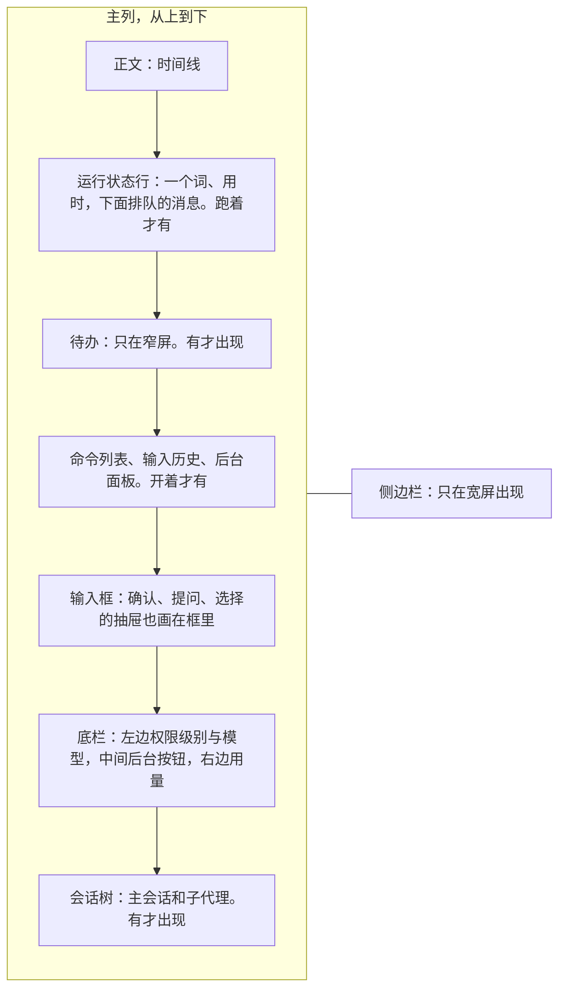

## 终端界面（草案）

状态：H1 到 H14 已定（H1 到 H10 于 2026-09-25，H11 到 H14 于 2026-09-26；H5、H7 于 2026-09-26 改；H2、H3、H6、H7、H8、H10 到 H14 于 2026-09-29 照终端界面演示改；同一天验收演示时又定了第二批：粘贴占位、思考的颜色、进行中那一段封顶、跟着最新的往下走、命令列表和后台面板、输入历史列表的标题、撤销以后那一行、侧边栏的限额和计数、回答的 Markdown、窄窗口的边距）。其余内容为草案。

效果图在作者私有的 claude.ai 画布上（最上面两排「定稿」），读者看不到，现在由演示程序代替（`README.md` 第二轮细纲一节）。下文的「图 F1」「图 J1」指画布上的图，和各文档的决定编号不是一回事。

能跑的演示程序在分支 `proto/tui-demo` 的 `tui-demo/` 里，它现在的样子写在同一分支的 `docs/blueprint/tui.md`。2026-09-29 项目主人验收通过了这个演示，演示的做法就是定论，本文照它改过（2026-09-29 项目主人验收终端界面演示时定）。画布上的图是 09-25 画的，和本文对不上的地方以本文为准。

### 一、它是什么

- 终端界面（TUI）是一个头：连上核心，订阅一个会话的视图流，把条目画出来，把按键变成命令（`01-架构.md` 第五节）。
- 它不写业务逻辑。显示哪些条目、条目里写什么字、哪些默认收起，都由核心的视图投影决定，终端界面只决定怎么画（`04-核心协议.md` P3）。
- 全屏运行（H1）。住在 shell 里、随手问一句的场合，归另一个头「终端无缝集成」，另写一份。
- **样子的三个来源**（项目主人 2026-09-26 说清的；外观一条 2026-09-29 照演示改）：
  - 外观：底下一个圆角输入框，框下面一行左边是权限级别和模型，右边是用量（第八节）；
  - 交互取 Claude Code 的会话树和后台按钮：子代理一行一行列着，秒切过去，还能跟它说话；后台命令收进一个按钮（第五节、第七节）；
  - 输出用 Miyu 的时间线和收起式输出，不照搬 Claude Code 的。要显示图片和 mermaid，所以全屏，滚动和回放自己做（第三节、第九节）。
- 同一个会话可以同时开几个终端界面，像 tmux 的多个客户端。各自的焦点和展开状态留在各自那里，不回传核心。

### 二、界面分区



- **宽屏（终端不少于 120 列）**：主列右边加侧边栏，从上往下是吉祥物、会话名称和短编号、工作目录、上下文（带进度条）、用量、待办（H2）。底栏的用量照写，和侧边栏重复也留着。
  - 上下文的窗口照核心在订阅回应里给的限额（`04-核心协议.md`、蓝图 `protocol.md` 的 `subscribe`，施工 6-3 补）。
  - 压缩过的加一行「压缩 N 次」；意外断过缓存的加一行「缓存断裂 N 次」，照请求记录的「第一处不同」，压缩、撤销以后那一次和摘要请求不算。没有就不写。
  - 吉祥物转头时把看的距离放远，跟得上输入光标（2026-09-29 项目主人验收终端界面演示时定）。
- **窄屏**：没有侧边栏。有待办时，待办默认展开，常驻在输入框上面，只是看的，焦点照旧在输入框；底栏不写待办（H2）。
- **空会话的首页**没有侧边栏，见第十节。
- **少于 80 列**（手机 ssh 这类）：不留左右边距，输入框的圆角框照留（2026-09-29 项目主人验收终端界面演示时定）。
- 正文以外的几块都贴着屏幕底部。抽屉、列表、会话树出现时，正文往上推，不盖住正文（H4）。
- 运行状态行单独一行，在正文和输入框之间，上下各空一行（H12）。抽屉画在输入框里，在它下面。

### 三、时间线

沿用旧版的样子（H3），细节 2026-09-29 照演示改过。规则如下：

1. **一步一行**：`图标 显示名 · 对象`，整行暗色，太长就截掉，不折行。普通工具不写用时，只有思考写。编辑、写入的后面接 `+加 -减`，加的绿、减的红。
2. **每一步前面一行连接线**：竖线 `│` 和步骤的图标在同一列，单独占一行，展开时从第一步前面就开始。步骤的正文（命令原文、输出、diff）挂在那一步下面，前面加 `│ `，竖线穿过去。
3. **说话就收起**：一段步骤之后，AI 开口说话，这段步骤就收成一行。收起那一行不带箭头，展开、收起都是这一行，点它切换。正在进行的那一段不收。
4. **收缩行的语言**：界面语言跟着系统走（auto）时用英文，手动定了语言的用那种语言（2026-10-01 项目主人改，原来一律英文）。按类打头，用时挂在最后：
   - 跑过命令：`Ran 2 commands`；没跑命令、用过别的工具：`Used 2 tools`；只编辑过：`Made 2 edits`；只想过：`Thought for 3s`。
   - 做事的只有一条命令、它有短标题时，用短标题打头。
   - 后面依次接 edits、tools、thoughts、err；编辑那一格后面接 `+加 -减`，例如 `Ran 2 commands · 1 edit +3 -1 · 5s`。是 0 的不写。
   - 英文的写法如上；中文、日文照各自的字，例如「执行了 2 条命令 · 1 处编辑 · 12s」「コマンドを 2 件実行 · 編集 1 件 · 12s」。auto 时用英文，是为了和正文区分开（2026-09-25 确认）；手动定了语言的人要的是看得懂（2026-10-01 项目主人改）。
5. **思考**：进行中是「思考中 · 用时」，下面滚动显示最后 15 行。想完是「已思考 · 用时」，滚动的预览不收起，停在最后几行。思考的字单独一个青色 `#41a6b5`（悬停 `#6db3cb`），正体：暗色和别的暗字分不出来。同一时刻只有一处在转（2026-09-29 项目主人验收终端界面演示时定）。思考用了多少词元，核心还不报，先不写。
6. **失败**：出错的那一步图标换成叉、整行红；竖线从这一步一路红到下一步的标题。
7. **用户的消息**框在一根 `┃` 里，上下各多一行竖线，颜色是发出去那一刻的权限级别；之后换了级别，已经发出去的不变。AI 的正文平铺，不加框。
8. **通知**：一行，记号有颜色、字是原色，能点开看全文。后台命令、子代理结束时：
   - `✓ 后台命令完成 · 命令 · 20s`、`✓ 后台任务完成 · 名字 · 40s`（子代理），`✓` 绿；
   - `✗ 后台命令失败 · 命令 · 退出码 1`，`✗` 红；
   - `后台命令已停止 · 命令`，暗色，没有记号。
   - 点开铺底色：命令是它的全部输出，子代理是它交回来的报告全文。
   - 发生了压缩、换了模型，也是一行通知。
9. **图标**用 Nerd Font，每类工具一个。没有 Nerd Font 时只用 `$`、`?`、`⚙` 三个符号。
10. **进行中那一段封顶**：开关「限制工具时间线滚动区域」（`limit_live`），默认开。进行中那一段最多露够一步完整的思考或命令的高度（现在 16 行），超出的只露最新的；里面的步点不开，做完收成一行以后照常点。关掉就是全部展开（2026-09-29 项目主人验收终端界面演示时定）。
11. **跟着最新的往下走**：
    - 跟着最新的时只往下走、不往回退：一段收起、一轮结束（运行状态行收起）都不把顶上去的内容落回来，空出来的由接下来的字填上。
    - 她的一段正文长过视口时，第一行顶到最上面就停住，她开始下一步再接着跟。
    - 一轮开始、第一个字来之前，正文末尾一行只有转圈，第一步落在这一行（2026-09-29 项目主人验收终端界面演示时定）。
12. **回答按 Markdown 画**（2026-09-29 项目主人验收终端界面演示时定）：
    - 标题不写 `#`，一级加下划线；引用暗灰蓝斜体；链接一律暗蓝 `#6a8fd8`；粗体原色加粗；行内代码淡橙 `#e5a07a`；无序列表 `▪` `•` `◦`。
    - 代码块按语言着色（23 种）。
    - HTML 认 `<details>`（能点开收起）、``（带宽高）、`<svg>`（画成图）和常见的行内标签，别的原样写。
    - 细节照终端界面演示的蓝图（`proto/tui-demo` 的 `docs/blueprint/tui.md`「她的回答：Markdown」「代码着色」两节）。

| 核心的视图投影决定 | 终端界面决定 |
|---|---|
| 条目的种类与状态；显示名、一句话摘要、收缩行的文字 | 图标、连接行、颜色、折行 |
| 哪些默认收起，包括「说话就收起」这条规则。旧版在终端、网页、子代理三处各写了一份 | 人手动展开、收起 |

### 四、确认、提问和选择：抽屉

- 需要人回应的东西都用抽屉（H4）：权限确认、模型的提问（`ask_user`）、`/models` 这类选择。抽屉画在圆角输入框里，照旧版的提问面板：几道题时顶上一排标签，问题加粗，每个选项一行标题一行暗色说明，选中的那项用强调色，最下面一行按键提示。输入框往上长，把正文往上推（2026-09-26 项目主人拿截图对过）。
- 抽屉打开时焦点在抽屉里：`↑` `↓` 选，`Enter` 确定。抽屉最高占半屏，内容多了在抽屉里滚动。
- **两下 `Esc` 取消，没有「收起」**（2026-09-29 项目主人看了演示以后定，照旧版；取消原来的「`Esc` 收起、再按 `Enter` 打开」：收起没有意义）。两下之间的时限和别处的两下 `Esc` 一样；按了第一下，按键提示那一行换成黄色的「再按一次 Esc 取消」。取消就是打断这一轮（`session.interrupt`，排着队的接着发）：在等的提问算没回答，确认算跳过，照打断的规矩补结果（`02-内核.md` 第六节「提问怎么走」第 4 条）。
- 抽屉开着时输入框不能打字。
- **提问的抽屉里没有「不回答」**（2026-09-29 项目主人看了演示的抽屉以后定，取消 09-26 的「不回答就是打断」）：不想答的那道就不答，交的时候没答的就是没回答；有别的话写在「其他」里。想停掉这一轮，在抽屉里按两下 `Esc` 取消（上一条）。
- **选项右边可以画一段预览**（`preview`，一段文字画，照 Claude Code 的 AskUserQuestion）；**每道题都能补一句备注**（`notes`），不选「其他」也能写，照 Claude Code 按 `n`（2026-09-29 项目主人定，`03-事件模型.md` 第三节「提问的事件怎么写」）。
- **确认抽屉里选了允许，时间线上不留字**；不允许、跳过的照留（2026-09-29 项目主人定）。
- 别的头、命令行在这时发来一句话，等着的那个照旧作废：提问算没回答，确认算跳过（`02-内核.md` 第六节「提问怎么走」第 5 条）。这个头上抽屉开着时打不了字，原来的「抽屉收起来的时候直接发了一句话」（2026-09-26）随「收起」一起取消。
- 几个头同时开着同一个会话时，先答者胜（`04-核心协议.md` 第六节）。其余头上的抽屉自动收起，时间线上写明是谁答的。
- 子代理和后台命令要确认时用同一个抽屉，标题写明是谁在问。
- **切进一个在等你确认的会话，确认抽屉自己打开**（照演示程序，2026-09-26 补）。
- **给 `miyu ask` 定过的一行一行的样子**（2026-09-28 项目主人定；同一天改成 `miyu ask` 里没有提问的工具、也没有确认的界面，`22-命令行.md` O3；做抽屉时参考）：
  - 确认：一项一行，输入编号回车；拒绝的，编号后面可以接着写理由。
  - 提问：输入编号就是选，能多选的用空格隔开；编号后面的字、不以编号开头的一整行，是你自己的话；只按回车，跳过这一道。

### 五、子代理

- **子代理都在后台跑**（H5，`02-内核.md` 第七节）。时间线里是派出去的那一步（图 F4）：一行写任务、状态和用时，下面一行是它最新的一步；展开后是它自己的时间线，往里缩一级。它回报了，时间线里出一条通知（第三节第 8 条）。它还在跑，会话树里就有它一行（第七节）。
- **切进子会话**：在会话树里选中它按 `Enter`，或者在时间线里点那一步（图 F5）。顶上两行写明从哪来、它是谁：`↑ 主会话 · 标题` 和 `子代理 · 任务 · 状态 · 模型挡位`。`Esc` 回主会话。
- **切换下一帧就画完**（`23-性能预算.md`）。终端界面订阅着会话树里每个会话的视图，切过去只是换一份来画，不用再向核心要。
- **输入框跟着人走**：输入框属于这个终端界面，不属于哪个会话。打了一半的字，切过去还在（2026-09-26 项目主人定）。
- **跟子代理说话**：切进去以后，输入框里的话发给它。它还在跑，就在下一步看到；做完了，就另起一轮。
  - 这些话记成你发的；父会话用 `message_agent` 留的言，记成另一个会话发的（`03-事件模型.md` 的 `by`）。
  - 你在子会话里自己开的那一轮，结束时不回报给父会话，你就在旁边看着；这一轮里进过父会话的留言的除外（`02-内核.md` 第七节）。

### 六、焦点与按键

焦点可以移动，靠 `↓` 从输入框往下走：输入框 → 后台按钮 → 会话树（H6）。正文不进焦点，展开、收起、复制都靠鼠标。焦点落在哪一块，按键就归哪一块（图 F6 是上一版）。

| 焦点 | 按键 |
|---|---|
| 任何地方 | `Tab`、`Shift+Tab` 轮换权限级别：工作区 → 开放权限 → 只读 → 工作区，不确认（H11）。打字时焦点自动回到输入框，字照打进去 |
| 输入框 | `Enter` 发送。命令列表开着时，`Tab` 补全命令。在第一行按 `↑`、在最后一行按 `↓` 翻输入历史；输入框空着时按 `↓`，焦点到后台按钮，没有后台按钮时到会话树。`Ctrl+R` 调出输入历史列表 |
| 后台按钮 | `Enter` 打开后台面板，`↓` 到会话树，`↑` 回输入框 |
| 会话树 | `↑` `↓` 选一行，`Enter` 切过去，`x` 停止 |
| 后台面板 | `↑` `↓` 选一条，`Enter` 展开或收起，`x` 停止 |
| 抽屉 | `↑` `↓` 选，`Enter` 确定 |

- `Esc` 由近及远，每按一次关掉一层：列表和后台面板，焦点回到输入框，退出子会话。什么都没开时，才打断正在进行的回合。抽屉不在这一层里：抽屉开着时，两下 `Esc` 是取消（第四节）。打断的只是你正在看的这个会话，子代理照常跑。
- **打断和排队的消息**（2026-09-26 项目主人定）：按两次 `Esc` 打断，排着队的消息马上发；`Ctrl+C` 打断，排着队的回到输入框（`02-内核.md` 第六节「排队的消息」）。和上一条「由近及远一层层关」怎么合在一起，做这一块时细抠。参考过的做法：codex、opencode v2、Claude Code（2026-09-26 查过源码）。
- **撤销与恢复**（`02-内核.md` 第六节「撤销与恢复」，撤销的键位随 M8）：撤掉的那一轮里你说的话放回输入框，改了再发（三家都这样）；你发下一句之前能恢复，只用 `/restore` 命令，没有键；撤销的命令是 `/undo`，也可以写 `/rewind`（2026-09-29 项目主人定：原来叫 `/redo`，改叫 `/restore`，`/undo` 加别名 `rewind`）。`Ctrl+R` 留给输入历史列表（2026-09-29 项目主人定）。有回合在进行时撤销，先打断再撤。撤销以后正文里一行 `↶ 已撤销 · /restore 恢复 · 你那句的预览`，不写几轮（只能一轮一轮撤）；点开看你那句的全文和改回了几个文件（2026-09-29 项目主人验收终端界面演示时定）。
- **输入历史列表**：`Ctrl+R` 打开，贴在输入框上面；打字就是搜索，`Enter` 把选中的那一条放进输入框，改了再发。样子照后台面板：标题写在横线上（条数、搜的字），选中的 `❯ ` 加底色，每条右边写多久以前发的，命令名上色，好几行的写「+N 行」，粘贴块照输入框的样子，搜到的字标出来，底下一行按键提示；`Tab` 展开的是那一条自己，光标移走照旧展开（2026-09-29 项目主人验收终端界面演示时定）。
- **`@` 补全文件路径**（H14，2026-09-30 项目主人定，演示已做，蓝图 `tui.md`「`@` 文件列表」）：
  - 光标前是 `@` 打头的词就开，和斜杠命令、输入历史同一个框。
  - 两种找法：词里带 `/`，或者以 `~`、`/` 打头的，像 shell 补全那样只读那一层目录，多大的目录都立刻出来；别的在工作目录里模糊找，后台建清单（认 `.gitignore`、跳过隐藏目录），最多 2 万个、最深 8 层，收满就停，框上提示「只列了一部分，打 / 按目录找」；隔 10 秒以上再弹就重建。这几个数写在数据里（上限 20000、深度 8、一屏 50 个、重建间隔 10 秒），不写死。
  - Enter 把那个词换成一块，和拖进来的文件一样；Tab 进目录。
- 鼠标：可点的行在悬停时提亮，点击展开或打开，滚轮翻正文。拖动选中文字，复制的内容不带左侧的 `┃`。
- 焦点离开输入框时，焦点所在的那一块自己标出来：后台按钮反色，会话树里那一行亮起来。
- **权限级别也有命令**：`/readonly` 开关只读，`/level workspace`、`/level full` 直接换级别，和按键一样不确认（`11-权限与沙盒.md` 第二节）。

### 七、会话树与后台命令

有子代理在跑时，底栏下方出现一棵会话树（H7），也叫子代理状态行。样子照 Claude Code 的后台代理状态行（项目主人 2026-09-26 给了两张截图）。在主会话里看是这样：

```text
● 主会话
○ 查旧版缓存（+2）  等子代理回报…                     Σ576.3k · 35m 38s
○ 找主题映射        读 v1-migrate.ts 的主题映射…      Σ260.7k · 3m 56s
```

切进第一个子代理以后：

```text
○ 主会话
● 查旧版缓存        翻子代理的记录…                   Σ577.5k · 38m 35s
  ├ ○ 查插件设置    回答 RealContextPluginSet…        Σ417.3k · 25m 55s
  └ ○ 查注入        追 one_shot 里的 context.notice…  Σ431.4k · 25m 25s
○ 找主题映射        列仓库里的截图文件…               Σ331.9k · 6m 52s
```

- **最上面一行是主会话。** 你正在看的会话前面是实心圆 `●`，其余是空心圆 `○`。
- **往里缩两格**，和底栏的字对齐（项目主人定）。
- **颜色**：各行默认暗色；你正在看的那一行亮，焦点在会话树里时改成选中的那一行亮（2026-09-26 项目主人定）。
- **主会话派出去的子代理**，各占一行，和主会话左对齐。后台命令不进会话树，收进底栏的后台按钮（下面「后台命令」，H7）。
- **更深的一层**，也就是孙代理，平时收成父亲那一行后面的「（+x）」。切进那个子代理时，它们在它下面展开，用 `├` `└` 连着，往里缩一级。
- **每行**：圆点、名字、（+x）、正在做什么、用掉的 token、用时，token 在用时左边（2026-09-29 项目主人定）。
  - 名字是派它时给的短标题。
  - 正在做什么，是它最新一步的一句话摘要，放不下就截断，加 `…`。
  - 名字和正在做什么各对齐成一列。
- **最多 5 行，不算主会话那一行**（2026-09-26 项目主人定）。多出来的收成一行「还有 N 个 · ↓ 查看全部」，这一行不算在 5 行里（照演示程序，2026-09-26 补）。焦点进来时列出全部。
- **等你确认的标黄**，写明要确认什么，不会被收进「还有 N 个」：在等的多了，超过 5 行也照样列出（照演示程序，2026-09-26 补）。它被收在（+x）里时，父亲那一行标黄，写明有几个在等你。
- **打开**：子代理切进子会话（第五节）；等你确认的打开确认抽屉。
- **结束时**：那一行消失，时间线里出一条通知（第三节第 8 条）。终端不在前台时弹系统通知。子代理的回报怎么交给父会话，见 `02-内核.md` 第七节。

**后台命令**（照 Claude Code 的后台按钮、后台面板，2026-09-29 项目主人验收终端界面演示时定）

- **后台按钮**：有后台命令在跑时，底栏中间（左边模型、右边用量之间的空当正中）写 `N 个后台命令`，强调色；悬停加粗。点它、或者焦点在它上面按 `Enter`，打开后台面板。没有在跑的命令，按钮不在。
- **后台面板**：在输入框上面，和命令列表同一个位置，把正文往上推。标题写在横线上：`── 后台 · N 个在跑的命令 ────`（2026-09-29 项目主人验收终端界面演示时定），下面一条命令一行：命令后面接状态（运行中、完成、失败和退出码、已停止）；这次启动以来结束了的也列着，排在在跑的后面。最下面一行按键提示。
- **点开一条**：不整屏，照时间线点开一步的样子，在这一行下面铺底色展开它最后的几行输出，在跑的跟着新输出走；再点收起，一次只展开一条（H8）。
- **结束时**：时间线里出一条通知（第三节第 8 条），点开是它的全部输出。终端不在前台时弹系统通知。

**两样共用的**

- **数据从哪来**：核心推送的会话状态里带着后台任务表，每一项写明父亲是谁（H9，`04-核心协议.md` 第五节）。终端界面照它画会话树和后台按钮，不轮询。
- **停止**是发给核心的一条命令，和终端界面当时在做什么无关。旧版的回合循环不看停止标记，AI 说话时按 `x` 停不掉。

### 八、输入框、运行状态行与底栏

- **输入框**是一个圆角框，居中，框里只有字。第一行左边是提示符 `❯`，颜色跟着权限级别：工作区蓝、开放权限红、只读暖金。跟着字长高，最多 8 行，再多在框里滚。
- **运行状态行**单独一行，在正文和输入框之间，上下各空一行（H12）：
  - 左边一个中性的词，不说具体在干什么，按这一轮跑了多久分档，一阵事件忙完才换；一道流光从左往右扫过，后面跟着三个轮换的点。
  - 再空一格，写这一轮的总用时，写法照旧版，例如 `12s`、`1m 05s`、`1h 02m 05s`。
  - 从这一轮开始到这一轮结束一直在，等工具、等你确认时也不停。空闲时不显示。
  - 重试这类临时的状态提示（`status` 事件，`03-事件模型.md` 第三节），跟在用时后面，过了就消失。
  - 在回答时发出去的话先排着，一条一行列在它下面，暗色的 `↳ ` 加这句话。
- **底栏左边**是 `图标 权限级别 · 模型 端点`，例如 `▣ 工作区 · deepseek-flash deepseek`（H13）。
  - 图标一档一个：工作区 `▣`，开放权限 `⏵⏵`，只读 `⏸`。图标和级别名用级别的颜色，和提示符 `❯` 同色。
  - 会话的预设不显示。
- **底栏中间**是后台按钮，有后台命令在跑时才有（第七节）。
- **底栏右边**是用量：每秒 token、上下文用了多少、窗口多大、占几成，加上累计用掉的 token 和缓存命中率，例如 `201 tok/s · 41.1k/1M(4.1%) · Σ1.4M(C89%)`。
  - 还是 0 的格子不写，全是 0 的右边整段空着。
  - 一行放不下时，从后往前丢：先丢速度，再丢累计，上下文用量留到最后。再放不下，右边整段让给后台按钮。
- 这些文字都来自核心推送的会话状态（`04-核心协议.md` P3）。

### 九、形态与性能

- **全屏**（H1）：程序自己管回翻、选区和复制。复制走 OSC 52，不依赖终端自己的选区。
- **只重画变了的行**，空闲时不重画。每一帧用同步输出包起来，支持的终端不会闪。重画由事件驱动，空闲时的心跳分几档放慢；转轮、动画只改它们自己那一两格（参考 jcode，2026-09-25 补）。
- **先画后连**：启动时先把界面画出来、能打字，同时去连核心；连上之前打的字照常显示，回车后排队，连上再发。查终端背景色这类要等回应的查询，和建连并行做。
- **图片**：认得 kitty、sixel、iTerm2 三种图片协议之一的终端直接显示，图片随正文滚动；其余终端显示文字占位。头在握手时声明自己能不能显示图片（`04-核心协议.md` 第五节）。
- **mermaid 也显示成图**（项目主人 2026-09-26）。旧版和 jcode 都是渲染成图片，不是用字符画，用的还是同一个纯 Rust 的库 mermaid-rs-renderer（它的作者就是 jcode 的作者）。SVG 由核心出，终端界面经 `mermaid.render` 取来，自己栅格化（视图投影做出来以前先这样取，`view.detail` 随 M9；`04-核心协议.md` 第五节，2026-09-26 补）。照旧版磨出来的三条规矩：
  - 先算出图要占几格、乘出像素数，用 resvg 一次渲到那个尺寸，不再缩放。旧版先出自然尺寸再缩，字糊成一团。
  - 不为塞进一屏而缩小，高的图就占几屏，只限宽度。
  - 核心出的 SVG 按「源码加尺寸」的哈希缓存在磁盘上。取图和栅格化放在后台线程，先画占位，渲好再换上：一张 24 个节点的图，旧版实测 139 ms，放进一帧就卡了。
- **图片协议认 kitty、sixel、iTerm2 三种**，都在进程里编码（jcode 用 ratatui-image 这样做）。旧版只直接认 kitty，其余终端靠外面装的 chafa 起子进程。三种都不认的终端显示源码，不用半格字符拼图：那样拼出来的图，字认不出来。网页直接用核心出的 SVG（`04-核心协议.md` 第五节），不另带 mermaid.js。
- **宽度变了就重新折行。** 折好的行按宽度和显示开关缓存，只画视口里看得见的那一段。
- **内存**：界面自身以 MB 计。旧版的全屏演示在 110×32 的终端里放五条长回复，实测不到 4MB。
- **三个平台**：Linux 和 macOS 的常见终端；Windows 以 Windows Terminal 为准。终端不支持的能力（鼠标、同步输出、图片）逐项降级。

### 十、沿用旧版的细节

下面这些是旧版磨出来的细节。按约定（`README.md`），旧版的产品口径要重新确认：2026-09-25 确认沿用（H10）；其中斜杠命令列表、提示、空会话的首页三条，2026-09-29 照演示改了。

| 细节 | 做法 |
|---|---|
| 输入框上方的浮动内容 | 命令列表、提示这类浮动内容画在输入框外面，不进框里 |
| 斜杠命令列表 | 输入 `/` 时锚在输入框上方，最多露 5 行，选中的那一条停在正中间，边打边筛，不写按键说明。回车时是一条没有的命令，不进正文，只弹提示「命令不存在」，字留在输入框里（2026-09-29 改）。顶上一行标题横线 `── 命令 N 条 ────`，一条一行，选中的 `❯ ` 加底色、别的名字强调色；别名写在名字后面，例如 `/undo (rewind)`（2026-09-29 项目主人验收终端界面演示时定） |
| 粘贴与图片 | 大段粘贴和图片在输入框里显示成占位符：粘贴是 `[已粘贴 120 行]`，不编号，品红字铺暗紫底；图片是 `[图片 1]`，不带文件名，编号整个会话一直往下排；PDF、音频、视频也收成附件：`[PDF 1]`、`[音频 1]`、`[视频 1]`（2026-09-30 项目主人定）。整块跳过、整块删除。发出去以后你说的话里也这样写、有底色，不画图、点了不展开。发出去以后，点正文里的粘贴块原地换成全文（2026-09-29 项目主人验收终端界面演示时定） |
| 提示 | 输入框上方一个圆角细边框的小框，停 2 秒；复制成了这类好消息框是绿的，别的框是暗色，字是原色。复制、按键提示、「命令不存在」都用它（2026-09-29 改） |
| 空会话的首页 | 输入框居中，上面一个会转头、有待机小动作的 3D 字符吉祥物（照 Cline），下面暗色写工作目录；占位文本固定写「Tab 切换权限级别」。不做星空开场（2026-09-29 改） |
| `Esc` 的顺序 | 由近及远一层层关，什么都没开时才打断回合。第六节已经按这个写 |
| 系统通知 | 终端不在前台时，回合结束、等你确认都弹通知并响一声；在 herdr 里由 herdr 来响 |
| 没有 Nerd Font | 只用 `$`、`?`、`⚙` 三个符号。新增一条提议：第一次启动时显示一个图标，问看到的是图标还是方块，记进设置 |

### 十一、决定

**H1. 全屏，还是跟着 shell 滚动**

- **已定：全屏。** 程序自己管回翻、选区和复制，抽屉、焦点移动、鼠标悬停才好做。旧版从 2026-09-11 起就是全屏。项目主人 2026-09-26 再次确认：要显示图片和 mermaid，全屏、自己做滚动和回放更好。
- 未选：跟着 shell 滚动（旧版最早的形态）。终端原生的回翻和复制能用，但每一块浮动界面都要按行号自己记账，旧版在这上面反复出过残影和错位。随手问一句的场合，由终端无缝集成这个头负责。
- 重开条件：出现全屏做不到、跟着 shell 滚动能做到的需求。

**H2. 布局**

- **已定：宽屏右侧加侧边栏，放吉祥物、会话名称和短编号、工作目录、上下文（带进度条）、用量、待办；底栏的用量照写。窄屏没有侧边栏，待办默认展开，常驻在输入框上面，底栏不写待办。宽窄的分界是 120 列；空会话的首页没有侧边栏（2026-09-29 项目主人验收终端界面演示时定）。**
- 未选 A：只做单栏，或者只做带侧边栏的。
- 未选 B：信息栏放会话标题、回合数与用时、待办、改动的文件，上下文用量不重复；窄屏只把待办进度收进底栏（图 A2 与 A1，2026-09-25 的定论）。收进底栏的待办只是一个数，要看在做什么还得点开；演示里侧边栏换成了工作目录、上下文和用量这几样常看的。
- 重开条件：120 列的分界在常见的终端尺寸下不合适。

**H3. 时间线**

- **已定：沿用旧版的样子，步骤之间有连接行，收缩行用英文（图 T1，2026-09-25 确认）；2026-10-01 改：只在界面语言跟着系统走（auto）时用英文，手动定了语言的用那种语言。** 理由：去掉连接行会很挤；收缩行用英文，和中文正文区分开。细节照演示改过（第三节，2026-09-29 项目主人验收终端界面演示时定）。
- 未选 A：去掉连接行（图 T2）。每段步骤能省三成的行。
- 未选 B：收缩行跟随界面语言（图 T3）。
- 未选 C：旧版的几处细节（2026-09-25 沿用的写法）：每一步都写用时；收起时行首 `›`、展开时 `⌄`；没跑命令的收缩行以 `Worked for 12s` 开头；思考结束收成一行、写词元数；失败只红那一行。演示里逐条试过，定了第三节现在的写法：思考想完就收起，正文会上下跳；收起以后看不到改了多少行。
- 重开条件：实际用下来，长回合里一屏看不到足够的内容。

**H4. 浮层**

- **已定：抽屉，出现在输入框上方，把正文往上推（图 B2，2026-09-25 确认）。确认、提问、选择都用它。**
- 未选 A：浮层盖在输入框上方（图 B1）。最新的输出就在输入框上面，盖住的正好是它。
- 未选 B：右侧抽屉（图 B3）。窄屏放不下，视线还要横着跳。
- 重开条件：矮终端里抽屉把正文挤得看不见。

**H5. 子代理**

- **已定：时间线里一张卡片，要细看时切进子会话（图 D2 加 D1，2026-09-25 确认）。子代理都在后台跑；切换下一帧画完，输入框里的字跟着过去（2026-09-26 项目主人定）。**
- 未选 A：分屏并排（图 D3）。终端的宽度装不下两份时间线。
- 未选 B：前台子代理，父会话停下来等它做完（第一轮的写法）。等的时候主会话被堵住，见 `02-内核.md` 第七节。
- 重开条件：常见场景里需要同时盯着两个子代理。

**H6. 焦点**

- **已定：焦点可以移动（图 E2，2026-09-25 确认），靠 `↓` 从输入框往下走：后台按钮、会话树；正文不进焦点，靠鼠标（2026-09-29 项目主人验收终端界面演示时定）。**
- 未选 A：焦点固定在输入框（图 E1）。后台按钮和会话树只能靠鼠标。旧版的后台任务行就只能用鼠标点开。
- 未选 B：`Tab` 在输入框、正文、会话树之间移动焦点，正文里 `↑` `↓` 在步骤间移动（2026-09-25 的写法）。`Tab` 改用来换权限级别（H11），正文改成靠鼠标。
- 重开条件：焦点移动带来的误操作，比它省下的操作还多。

**H7. 会话树**

- **已定：底栏下方一棵会话树，照 Claude Code 的后台代理状态行。主会话在最上面；当前的是实心圆，其余是空心圆；更深一层收成「（+x）」，切进去才展开；最多 5 行，不算主会话；等你确认的标黄，不被收起（2026-09-26 项目主人定）。每行是 `Σtoken · 用时`，token 在左；后台命令不进会话树，收进底栏中间的后台按钮（2026-09-29 项目主人验收终端界面演示时定）。**
- 未选 A：逐条平铺，最多 3 条，等你确认的排最前（2026-09-25 的定论，图 J1）。看不出谁是谁派的，一展开孙代理就放不下。
- 未选 B：一行汇总，要看再展开（图 J2）。永远只占一行，但看不出谁在跑，要确认什么也写不下。
- 未选 C：后台命令和子代理一样各占一行，每行 `用时 · Σtoken`（2026-09-26 的写法）。照 Claude Code，后台命令收进一个按钮，会话树只留能切进去、能说话的子代理。
- 重开条件：常见场景里 5 行不够用。

**H8. 打开一条后台命令**

- **已定：在后台面板里点开一条，照时间线点开一步的样子，在这一行下面铺底色展开它最后的几行输出，不整屏（2026-09-29 项目主人验收终端界面演示时定）。**
- 未选 A：在抽屉里显示输出的最后几行。
- 未选 B：整屏看输出，和切进子会话一个样子（图 J3，2026-09-25 的定论）。和时间线里点开一步的样子不一致；全部输出在结束的通知里点开看。
- 重开条件：常见场景里要一直盯着一条后台命令的长输出。

**H9. 后台任务表从哪来**

- **已定：核心在会话状态里推送后台任务表，头不轮询。停止任务是 `job.stop` 命令。**
- 未选：头定时去拉。旧版每秒拉一次，新开终端或换会话时会先闪出别的会话的任务，数字也慢一拍。
- 重开条件：无。推送是协议本来的形态（`04-核心协议.md` 第五节）。

**H10. 旧版的细节**

- **已定：第十节列的八条沿用，包括新提议的「第一次启动时问看不看得到图标」（2026-09-25 确认）。其中斜杠命令列表、提示、空会话的首页三条照演示改（2026-09-29 项目主人验收终端界面演示时定）。** 头是可以换的，设计得不好，以后直接重做。
- 未选：这三条照旧版：命令列表只占 4 行；复制提示是绿色细边框的小盒子，2.5 秒后消失；空会话的开场是星空动画、标志和一句开场白。演示里改过，验收时定用演示的写法：提示统一成一个框；首页照 Cline。
- 重开条件：用下来哪一条不顺手。

**H11. 权限级别的按键**

- **已定：`Tab`、`Shift+Tab` 都是三档轮换：工作区 → 开放权限 → 只读 → 工作区，不确认；命令列表开着时 `Tab` 照旧补全命令。会话的模式由预设定，没有切换的键。「完全放开」改叫「开放权限」（2026-09-29 项目主人验收终端界面演示时定）。**
- 未选 A：`Tab` 开关只读、`Shift+Tab` 轮换别的级别（2026-09-26 未选）。当时 `Tab` 要留给焦点移动；现在焦点改走 `↓`（H6）。
- 未选 B：`Shift+Tab` 只开关只读；常用的那一级（工作区或开放权限）用 `/level` 命令或设置改，改成开放权限时先确认一次（2026-09-26 的定论）。一个键三档轮换更直接，改级别不用再去敲命令。
- 重开条件：常见场景里在两级之间来回，嫌多按几下。

**H12. 运行状态行**

- **已定：单独一行，在正文和输入框之间，上下各空一行；左边一个中性的词加流光和三个点，接着是这一轮的总用时；排队的消息列在它下面（2026-09-29 项目主人验收终端界面演示时定）。** 正在做什么不写：时间线最下面那一步、会话树已经写了。
- 未选 A：写上正在做什么，例如「等子代理 · 1m20s」，和输入框隔一行（第一轮的写法）。
- 未选 B：画在输入框最上面那一行里，一段一直在动的动画加用时（2026-09-26 的定论）。输入框改成圆角框以后，框里只放字；排队的消息也要一个地方。
- 重开条件：常见场景里看不出她在干什么。

**H13. 底栏**

- **已定：左边是「图标 权限级别」，接模型、端点，预设不显示；中间是后台按钮；右边是用量：每秒 token、上下文用量、累计的 token 和缓存命中率，还是 0 的格子不写（2026-09-29 项目主人验收终端界面演示时定）。**
- 未选 A：右边放声波（第一轮的写法）。动画挪到了运行状态行。
- 未选 B：左边是模式（预设）、模型和供应商，只读和开放权限顶替模式的名字（2026-09-26 的定论）。按键换的是权限级别，左下角直接写它，和提示符 `❯` 同色，一眼看得出现在是哪一级。
- 重开条件：无。

**H14. `@` 补全文件路径**

- **已定：输入框里打 `@` 补全文件路径（2026-09-29 项目主人验收终端界面演示时定）；规则 2026-09-30 定，写在第六节。**
- 未选：不做 `@` 选文件，要给她文件就写路径或者粘贴（2026-09-26 的定论）。项目主人要做。
- 重开条件：补全常常补不到想要的文件。

**后续再定**

- 主题：核心按一个种子色生成整套语义色（`04-核心协议.md` P3），终端里怎么映射成 256 色和真彩色
- 设置页：照 `14-配置.md` 第九节，按配置清单画，具体样子另出图
- 会话树、运行状态行、底栏和工具设置页（`25-工具加载.md` 第六节）的效果图：已由演示程序代替，见本文开头
- 运行状态行的词库：现在是一份中性的中文词，以后挂在人格上，每个人格一份自己口吻的词。有一个方向待细聊（2026-09-28 项目主人提）：用拉丁语里织物、编织（tela）的意象，写拉丁语的动名词，例如 `Texendo...`（正在编织）、`Nectendo...`（正在连结）；加载动画也照这个意象做，网页一样（`21-网页.md`）
- 大的 mermaid 图能不能钉在侧边栏里看：jcode 有这个做法，出图时一起看
- 终端无缝集成、单次命令行、网页：已定，见 `21-网页.md`、`22-命令行.md`
