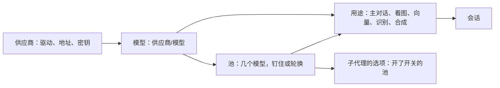
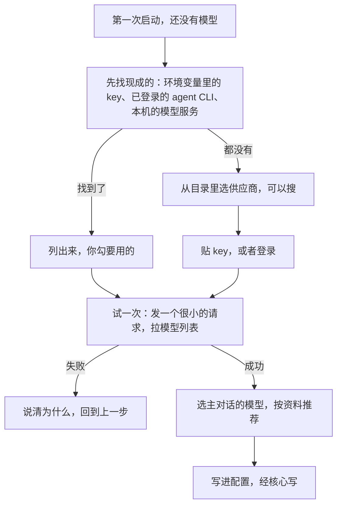

## 模型与供应商（草案）

状态：M1 到 M9 已定（2026-09-25；M2、M9 于 2026-09-30 改，M9 于 2026-10-01 补了币种、本机的服务、没有价格的怎么显示；M1、M3 于 2026-10-01 改：挡位去掉，池替了它）。其余内容为草案。蓝图 `docs/blueprint/models.md` 照这一份画（2026-10-01 起草）。

配置的通用规矩见 `14-配置.md`。本文讲模型这一块：怎么接上供应商、模型的资料从哪来、主对话和子代理各用哪个模型、几个模型怎么分请求、出错了怎么办、第一次启动怎么接入。

### 一、三个概念

| 概念 | 是什么 | 例子 |
|---|---|---|
| **供应商** | 一条通往模型的路：用哪个驱动、地址、凭据 | `deepseek`、本机的 Ollama、已登录的 Claude Code |
| **模型** | 某个供应商提供的一个模型，写成「供应商/模型」 | `deepseek/deepseek-v4` |
| **池** | 几个模型组成一组，按规则分请求；可以列进子代理的选项，带一句给模型看的说明 | 几家的免费额度组成一个池，轮着用；`flagship` 池给难的子代理任务 |

以前还有第四个概念「挡位」（轻量、便宜、普通、旗舰），2026-10-01 去掉了，池替了它（M3）。



配置里凡是要指定模型的地方，都有两种写法（M1）：

| 写法 | 指的是 | 例子 |
|---|---|---|
| `供应商/模型` | 一个模型 | `"deepseek/deepseek-v4"` |
| `@名字` | 一个池 | `"@free"` |

### 二、供应商

```toml
[providers.deepseek]
driver = "openai-chat"
base_url = "https://api.deepseek.com"
keys = [{ secret = "deepseek" }]

[providers.bigmodel]
driver = "openai-chat"
base_url = "https://open.bigmodel.cn/api/paas/v4"
keys = [{ env = "ZHIPU_API_KEY" }, { secret = "bigmodel-2" }]

[providers.claude]
driver = "claude-code"
```

- **模型驱动**决定怎么说话（`05-内核接口.md` 第七节）。常见的几类：

| 模型驱动 | 例子 |
|---|---|
| OpenAI 兼容的对话接口 | DeepSeek、智谱、OpenRouter、opencode Zen，本机的 Ollama、LM Studio |
| OpenAI 的 Responses 接口 | OpenAI 官方 |
| Anthropic 的消息接口 | Anthropic 官方 |
| 借用 agent CLI 的订阅 | Claude Code、Codex、Antigravity、CodeBuddy，走子进程 |

- **opencode Zen 的免费模型只让 opencode 自己的客户端用**，不合格的一律 `403 FreeTierError`。旧版 2026-09-20 对真端点做了上百次对照，三条同时成立才放行：
  - 流式；
  - 工具里同时有 `shell`（或 `bash`）和 `read`；说明和参数全清空照样放行，旁边多挂几件工具也不影响；
  - 至少带一个 `x-opencode-*` 头。
  
  所以重制的工具名 `read`、`shell` 不改（`10-自带软件.md` 第十节）。工具面里缺这两件时（没有 shell 的场所、不带工具的辅助请求），驱动在发出去之前补同名的占位声明，说明写明不要调用；她真调了，照没有这件工具处理，不会因此多出权限。接 opencode Zen 的那一步做（2026-09-28 项目主人提醒）。
  - 头和占位工具写成供应商的档案（数据，不进代码）。占位补在统一的请求上、驱动编码之前，所以 Zen 上走 Anthropic、Responses 接口的模型也成立（2026-10-01 主会话认，蓝图 `models.md` 第八条）。
- **密钥**照 `14-配置.md` 第七节：只写密钥的名字或环境变量的名字。
- **一个供应商可以配几个 key**，分摊限速。按会话分，不按请求轮：一个会话钉在一个 key 上，它出错了才换，否则契约型的缓存每次都掉（`08-上下文投影.md` C6）。每个 key 单独冷却（第五节）。
- 地址和凭据以外的东西，例如上下文多长、能不能看图，不用写，从模型资料里查（第三节）。
- **成员可以配只给自己用的供应商**（M6，2026-09-25 确认）。它写在成员自己的个人设置里，密钥放在成员家目录的 `secrets.toml`，只有本人能用。这不需要「配模型」能力，和成员可以装用户级软件包是同一个道理（`06-多用户与身份.md` 第四节）。管理员拥有这台机器，技术上看得到这些文件，界面上会写明这一点。

### 三、模型和它的资料

- **写法**：`供应商/模型`，模型名照供应商那边的叫法。
- **列出哪些**：默认列出供应商模型列表里的全部。也可以在配置里只挑几个，或者给模型起个别名。
- **资料**：上下文长度、最长输出、能收哪些输入（文字、图片、PDF、音频）、能不能调工具、能不能用存根（供应商用约束解码的就不能，`08-上下文投影.md` C5）、思考强度有哪几级、缓存属于哪一类（`05-内核接口.md` 第七节）、工具结果里能不能放图片、价格。

资料按下面的顺序查，前面的覆盖后面的（M2）：

| 来源 | 说明 |
|---|---|
| 手写 | 配置里 `[providers.<供应商>.models."<模型>"]` 下写的 |
| 用出来的 | 例如某个端点不收工具结果里的图片，撞过一次就记住。它是派生数据，删掉了会重新学 |
| 供应商的模型列表 | 驱动能拉到的，例如 OpenAI 兼容接口的 `/models` |
| models.dev 目录 | 社区维护的模型目录。缓存在系统的缓存目录里，后台定期更新；安装包里带一份快照，离线也能用 |
| 驱动的保守默认 | 都查不到时才用，例如当作不能看图 |

- **对目录分四层**，从上往下，对上了就停（2026-09-30 项目主人定，改 M2；原来是先按供应商的 id 对、再按地址对，对不上就不猜）：
  1. **手写指定**：模型的配置里写 `catalog = "deepseek/deepseek-v4.1-flash"`，照目录里这一个的资料。
  2. **供应商对上，模型名一样**：供应商先按 id 对，id 对不上的换几种写法再试（例如 `opencodego` 和 `opencode-go`，旧版 `canonical_provider_candidates` 的办法），再按地址对（models.dev 的每家供应商带着地址）。
  3. **只看模型名，一样的**：自己配的中转（例如 newapi）里的 `deepseek-v4.1-flash` 在这一层对上。同一个名字挂在好几家下面时，取原厂那一家。
  4. **模型名规整以后，取最长的前缀**：大小写不分，空格、下划线、点、横线当成同一种分隔，去掉 `deepseek/`、`models/` 这类前缀；目录里能当它前缀的名字里取最长的，而且要在分隔处断开。`deepseek-v4.1-flash-expire-xxxx` 对上 `deepseek-v4.1-flash`；`gpt-5-minimal` 对不上 `gpt-5-mini`，`minimal` 不是在 `mini` 后面断开的。
- 第 3、4 层是按名字对上的，资料不是每一格都借：

  | 资料 | 借不借 | 为什么 |
  |---|---|---|
  | 能收哪些输入、能不能调工具、思考强度有哪几级 | 借 | 模型本身的性质，换渠道不变 |
  | 上下文长度、最长输出 | 借，标明来源 | 中转可能限得更小；撞一次上下文超长，「用出来的」那一层记下真实的上限 |
  | 价格 | 借，取原厂那一家的 | 金额算的是「照官方价格花了多少」（第八节），要的正是原厂的价格 |

- 每一格资料都说得出来自哪一层、照的是目录里的哪一个（`14-配置.md`：说得出来源）。界面上写「照 models.dev 的 deepseek/deepseek-v4.1-flash，按模型名对上」，对错了用第 1 层改过来。
- **倍率**（2026-09-30 项目主人定）：对价格的调整值。为中转站这类自己定价的地方设计：它们多半在原厂价上乘一个倍率。官方的 API 也能写，算自定义的一部分。供应商和模型上都能写 `price_multiplier`，默认 1，也就是原价；模型上写的盖过供应商上写的（这一条照推荐定）。算金额时价格乘上它（第八节）。倍率和币种无关，照乘。
- **本机的模型服务当免费**（2026-10-01 项目主人定）：Ollama、LM Studio 这类，也就是「先找现成的」认出的本机服务、供应商档案里标了本机的，价格默认 0。手写了价格的照手写的，按名字对上的目录价不借：那是云端的价。
- 谁在用这些资料：压缩的触发线（`09-压缩.md`，用驱动报告的窗口）、看图的退路（第四节）、思考强度的菜单、工具结果里怎么放图、界面上的能力标记。
- 代码里没有模型表。出了新模型，更新目录就行，不用发新版（`00-设计理念.md` 第六节）。

### 四、用途与子代理选池

**用途**：

| 用途 | 做什么 | 没配时 |
|---|---|---|
| `chat` 主对话 | 新会话默认用的模型 | 必须有，第一次接入时定 |
| `vision` 看图 | 主对话的模型看不了图时，替它看图。M8 先只加 `models.vision` 这一格，替看图在 M8 里另开一步做（2026-10-01 主会话定） | 主对话的模型能看图就不需要；都不能看，就如实说看不了 |
| `embedding` 向量 | 记忆与知识库的检索 | 本机的小模型（`17-记忆.md` 第四节） |
| `speech_in` 识别 | 把语音转成文字 | 本机的 SenseVoice（`20-语音.md` 第七节） |
| `speech_out` 合成 | 把文字念出来；用哪个音色写在人格里 | macOS 上用系统的 `say`；别的平台要配一个云端引擎 |

**子代理选池**（M3，2026-10-01 项目主人定，取代 2026-09-25 的四个挡位）：

- **子代理**：主模型派子代理时，照池的名字挑。池多一个开关，开着、有成员的才进 `subagent` 的选项；池可以带一句给模型看的英文说明，她看到池名和说明。不写池的，子代理用父会话这时用的模型（2026-10-01 主会话定，和 M7 起的做法一样）。
- **选项在会话开局时定下**：池名和说明拼进工具的参数里，整个会话不变，前缀一个字节都不变。配置、开关改了的，新会话才看得到；会话里已经列着的池换了成员，照旧下一轮生效。同一个核心上开着的几个会话，这一格可以不一样，缓存照会话算。
- **模型本身没有开关**：想让子代理挑某一个模型，建一个只有它的池。
- **一开始就有三个池** `lite`、`standard`、`flagship`，第一次接入时写进配置，成员是空的，填了成员才出现在选项里（没选「填上当时选的主对话模型」）。除了是预先建好的，它们是普通的池：能删、能改名。
- **辅助请求**：起标题、整理记忆、解释选中的文字这类请求，各自默认用某个模型或池，可以逐项改。它们的缓存与主对话互不相干。
- **通讯平台**：判官、入群审批这几处辅助请求同上；群里的主对话用哪个模型，由场所配的预设决定（`18-通讯平台.md` 第三节）。旧版那六个层层继承的模型槽不再有。

```toml
[models]
chat = "deepseek/deepseek-v4"
vision = "bigmodel/glm-5v"

[pools.lite]
models = ["deepseek/deepseek-flash"]
subagent = true

[pools.flagship]
models = ["claude/opus"]
subagent = true
description = "Strongest model, for hard tasks."

[pools.standard]
models = []
subagent = true
```

### 五、池

```toml
[pools.free]
# 几家的免费额度
models = ["bigmodel/glm-5.3-flash", "deepseek/deepseek-v4.1-flash"]
strategy = "rotate"
```

**两种分法，每个池自己选**（M4，2026-09-25 确认）：

| 分法 | 怎么分 | 适合 |
|---|---|---|
| **钉住**（默认） | 新会话轮着分到池里的各个模型。一个会话钉住分到的那一个，它出错了才换到下一个 | 付费的模型。一个会话一直用同一个模型，前缀缓存保得住 |
| **轮换** | 每次请求都换下一个 | 几家的免费额度。要的是量，不在乎缓存 |

旧版只有轮换，是为了把各家的免费 API 轮着用（项目主人 2026-09-25）。钉住是新加的，给付费的模型用：换一次模型，前缀缓存整段变冷，长对话每次都要全价重读。

「新会话轮着分」用的指针是派生数据，放在 `state/` 里；丢了就从头轮，不影响正确性。

**出错了怎么换**（M5）。错误的分类见 `05-内核接口.md` 第七节：

| 错误 | 怎么办 |
|---|---|
| 限速、额度用完 | 这个端点冷却一段时间，换下一个 |
| 连不上、超时 | 冷却短一些，换下一个 |
| 认证失败 | 冷却很久，界面上提示去检查密钥 |
| 请求本身有错，例如参数不对 | 不换。换了还是一样错，白白烧掉别家的额度 |
| 上下文超长 | 不换，先压缩（`09-压缩.md`） |
| 被内容策略拦下 | 不换，如实告诉人 |

- 连续失败，冷却时间翻倍，有上限。冷却到期先试一次，真正成功一次才清零。旧版实测：固定的冷却时间，会让一个一直挂着的端点每两分钟就被重新信任一次。
- **已经给人看过的输出不回退。** 流式输出开始之后才出错，就不换端点重来，否则同一段话会说两遍。这一回合如实报错，人可以重试。
- **出错自动重试，最多 5 次**（2026-09-26 项目主人定）：5 次都不行，这一轮以出错结束，等人开口。
  - **说到一半断了，带上半截接着说**（2026-09-27 项目主人定）：收到的半截照打断的规矩留下来，写成她的回复：思考、正文收到多少留多少，没收全的工具调用丢掉。后面跟一句被打断的提示，再请求一次，她看到自己说了一半、被打断了，接着往下说。
    - 前面的请求原样都在，这一次是上一次的前缀延伸，缓存照样命中；她不用把说过的再说一遍。
    - 界面上那半截不收起来，下面标上断了、第几次，接着出。
    - 还没收到内容就断了的（连不上、限速、5xx），原样重发同一份请求，不用提示。
    - 断的只是那一次请求，不是整轮：这一轮前面调过的工具、说过的话都留着。重来的还是原来那个端点：上一条「已经给人看过的输出不回退」说的是不换端点重来。
    - 每家都能用的是这一套：被打断的那一句不说为什么断（断掉不一定是出错），写上从断的地方接着说、不重复（2026-09-27 试玩台实测：只说断了的 4 次都从头说，带上「怎么办」的 4 次都接着说）。不写进 system：常驻的每次请求多 39 个 token（`26-提示词.md` J12）。
    - 会接着写的供应商，再来的那次改成前缀续写，半截的思考也带上（2026-09-27 项目主人定，见下面 M5）。DeepSeek 会丢掉 user 消息之前的思考：光靠提示，断在思考里的要重想一遍；前缀续写实测接着往下想。哪家会，是驱动的一个开关，出厂只开实测过的（`05-内核接口.md` 第七节「接着写被打断的回复」）。
    - 等多久：供应商说了的照它，最多 2 分钟，更久的不等；没说的 1、2、4、8、16 秒。哪几类重试、在等的时候怎么办，见 `02-内核.md` 第六节「回复怎么收」第 4 条。
- **流式输出的空闲超时**：基数初值 180 秒，按这一次请求的思考强度放大：`high` 2 倍、`xhigh` 3 倍、`max` 4 倍，别的（连同 `off`、`on`、没写）照基数（施工 8-18，`models.md`「怎么走」第十一条第 6 条）。等第一个字的时候，核心定时给头发心跳；头的超时总比核心的长，所以总是核心先说清楚出了什么事（参考 jcode，2026-09-25 补）。
- **连接预热**：驱动可以趁人打字，先把连接和静态前缀准备好，例如 OpenAI 的 Responses WebSocket。jcode 的实测是首字快了 12% 到 27%（各 10 对，只测了一个模型）。预热没做完时，正式请求不等它。第一版可选，按驱动实测再开。
- 换到了另一个模型，时间线上出一条通知（`13-终端界面.md` 第三节），底栏跟着变。
- 池里的模型全在冷却：说清哪个模型为什么不能用、多久以后恢复。
- 每个端点的并发数、限速和优先级，由内核的资源调度器管（`02-内核.md` 第七节）。有人在等的回合，排在辅助请求这类没人等的工作前面。

### 六、会话里换模型

- 在会话里用 `/models` 换模型，打开的是抽屉（`13-终端界面.md` H4）：按供应商分组，标出能力，池也在里面。换完是 `session.configure`，下一个回合开始时生效（`02-内核.md` K3）。
- **会话钉着的模型没了**，例如供应商被删了、模型下架了：回到这个用途的默认模型，时间线上说明换成了哪个，不报错、不断开（M7）。旧版就出过这种事：核心直接断开连接，界面上只说「无效响应」。
- 压缩用这个会话自己的模型。fork 式的摘要要复用同一段前缀（`09-压缩.md`）。
- **`miyu ask --model` 接着已有的会话说时，永久换**，等于 `session.configure`，以后都用它（2026-10-01 项目主人定）。
- **思考强度**（照 opencode 的做法；施工 8-18，2026-10-02 项目主人定去掉会话那一层后是现在这样）：是每个模型的一项配置（`effort`），没写的请求里不带，照供应商的默认；覆盖只有配置自己的两层，系统配置兜底、个人设置压在上面，和窗口、价格这类字段一样。有哪几档照目录（`reasoning_options`），手写的 `reasoning` 能盖掉；能关的多一档 `off`，只有开关的是 `off`、`on`，不能关的没有 `off`，`off` 和没写是两回事。一次请求用真发给的那个模型配置的最终值，没有就不带；所以换模型不用「退」，轮换的池里每个成员用自己的。头上选强度写个人设置，所有会话下一轮都跟着变，新开的会话也一样。换模型、换强度都不出提示，头当场改底栏。2026-10-01 曾定过「会话里能给每个模型另记一格，只在这个会话里」，走了一步（施工 8-18）又收回（施工 8-18（补）：会话那一格压着配置，新会话又回到默认，以前改过的会话「改不动」）。别的几家怎么做的（终端界面的会话查过）：opencode 每个模型记自己的；Claude Code 一个全局的、每次请求照它解析；codex 选模型时紧接着选强度；pi 在一条固定的档位上取最近的。

### 七、第一次接入



- **先找现成的**（M8）：
  - 环境变量里的 key，例如 `DEEPSEEK_API_KEY`、`OPENAI_API_KEY`。找哪些环境变量，是一份数据，不写死在代码里。
  - 已经登录的 agent CLI，例如 Claude Code、Codex。
  - 本机跑着的模型服务，例如 Ollama、LM Studio 的默认端口。
- 环境变量里的 key 直接引用（`{ env = "…" }`），不复制进 Miyu。
- **配置系统做出来之前**（2026-09-27 项目主人定，施工 3-9）：只认环境变量 `DEEPSEEK_API_KEY`，设了就用 DeepSeek 官方的 `deepseek-flash`。key 不落盘，不写配置；这就是「先找现成的」那一步，列出来、勾选、写进配置留到配置系统（`14-配置.md`）。
- 选主对话的模型时，按资料推荐：要能调工具，上下文要够长。看图可以先不配。三个预设的池 `lite`、`standard`、`flagship` 一起写进配置，成员是空的，以后填（M3）。
- 引导只是一个界面（`14-配置.md` 第九节）。终端界面、网页、`miyu setup` 走同一组协议方法（第九节）。
- **核心看不到终端里的环境变量时**（2026-10-01 主会话定）：核心的环境是拉起它的那个头的，别的终端里后来设的它看不到。`miyu setup` 说清看不到哪个，给出让核心看到的办法（等它空闲退了，由这个终端再拉起），不复制 key。
- `miyu setup` 怎么问人，先照推荐写（交互式一步步选，参数能跳过对应的一步），做第一次接入那一步开工前再给项目主人看（2026-10-01）。管密钥的命令是 `miyu login`、`miyu logout`、`miyu login --list`（蓝图 `config.md`）。

### 八、用量与花费

- **用量永远记**：每次请求的输入（没命中缓存的、缓存读、缓存写）和输出，都记在那一次的 `model.called` 里（`03-事件模型.md` 第三节）。思考算在输出里，驱动解码时就是这样归的（`05-内核接口.md` 第七节）。2026-09-30 改：原来写思考单记一项，和事件对不上。
- **金额**（M9，2026-09-30 项目主人改）：金额说的是「照价格算，我花了多少」：价格是官方价，写了倍率的再乘倍率。它不是账单，也不是用来算还剩多少钱、还能用多久。所以用量和价格都有，算出来的就是准数，不写「约」。
  - 算法：没命中缓存的输入、缓存读、缓存写、输出，各乘各的价格，加起来，再乘倍率（第三节）。
  - 价格照第三节的资料来：手写的、供应商的模型列表、models.dev（按名字对上的也算，取原厂那一家）。
  - 这一次用到的那几项里，有一项查不到价格，这一次就不算金额，界面照样显示 token（照推荐定：缺的那一格拿别的价格顶，数字就不是官方价了）。
  - 供应商在响应里报的费用（例如 OpenRouter）不另算：金额只有一种算法，各家之间才比得了（照推荐定）。
  - **币种**（2026-10-01 项目主人定）：默认美元，models.dev 的价格就是美元。手写的价格可以写币种（例如中转站按人民币标价），不写是美元。金额照那一份价格的币种记。汇总照币种分开显示，例如「$0.42 + ¥1.30」，不换算，数字都是准的。另有一个显示用的币种设置，默认美元：不换算时它只定汇总里几种币种的先后。以后要换算另说。
  - **本机的服务**价格默认 0，当免费（第三节，2026-10-01 项目主人定）。
  - **真查不到价格的**（2026-10-01 项目主人定）：汇总照样显示有价的合计，注明「另有 N 次没有价格」。
- **钱在发生时冻结**：算出来的金额，连同用的是哪一份价格、乘的倍率，记进那一次的 `model.called`。以后目录更新了价格、人改了倍率，已经记下的不重算；和旧版记账冻结汇率是同一个道理。`model.called` 现在还没有这一格，照格式演进加字段（`03-事件模型.md` 第八节），做金额的那一步加上。
- **统计**：汇总是派生数据（`07-存储.md` 第六节），不另记一本。按会话汇总：会话的第一条 `session.created` 带着属主和场所，按人、按平台、按模型、按天，都是同一张表的不同分组。场所只当一个标记来分组，它叫什么、怎么显示，由场所驱动登记（`05-内核接口.md` 第一节）；汇总的代码里不出现哪个平台的名单，不然就是往上依赖（2026-09-30，照推荐定）。子代理的用量记在派它的那个人头上（`02-内核.md` 第七节）。会话删掉了，它的用量照样留在统计里（`07-存储.md` 第六节）。
- **订阅的额度**（2026-09-30 项目主人定：借订阅照做，额度也显示）：借来的订阅不按 token 花钱，人要看的是还剩多少额度。

  | 借的哪家 | 额度从哪来 |
  |---|---|
  | Codex | app-server 的 `account/rateLimits/read`，额度变了推 `account/rateLimits/updated`：每个窗口用了几成、窗口多长、什么时候重置 |
  | Claude Code | 流式输出里的 `rate_limit_event`：放行、警告还是拒绝，哪一种窗口（5 小时、7 天、按模型的 7 天），什么时候重置，用了几成（这一格不一定有）。它没有主动查的办法，只显示它最近一次报的 |
  | Antigravity | 没有。`agy` 没有查额度的子命令，额度只在用完时以报错出现 |

  - 额度是那一刻服务端说的状态，不是用量：只留最新的一份，放在派生数据里，不进日志（照推荐定）。
  - 只用 CLI 自己给出来的。不拿它登录的凭据直接去调供应商的后台查额度：那是冒用别人的客户端。
- **她自己查用量**（2026-09-30 项目主人定）：零参数的工具，只查这个会话，不给账号的汇总。做成一件 `session_usage`（token 用量和上下文一起），还是拆成 `session_usage`、`context_usage` 两件，到时候实测再定。它和头读的是同一份用量（`usage.query`）。

### 九、协议

| 方法 | 类型 | 做什么 |
|---|---|---|
| `provider.detect` | 查询 | 找现成的：环境变量里的 key、已登录的 agent CLI、本机的模型服务 |
| `provider.catalog` | 查询 | 目录里的供应商，给第一次接入时选 |
| `provider.test` | 命令 | 用一个很小的请求试这个供应商，并拉模型列表。会真的花一点额度 |
| `model.list` | 查询 | 模型、资料、当前状态：能用、冷却中、多久后恢复（`04-核心协议.md` 第九节已有） |

- 增删改供应商、池，都是改配置，走 `config.set`（`14-配置.md` 第八节）。
- 端点的健康状态也出现在 `kernel.status` 里，`miyu doctor` 会逐个试供应商。

### 十、决定

**M1. 三个概念与两种写法**

- **已定：供应商、模型、池；模型写成「供应商/模型」；要指定模型的地方可以写模型或 `@池`（2026-10-01 改：挡位和它的写法去掉了，见 M3）。**
- 未选：旧版的全局文本池、多模态池、分级池、平台槽各成一套。概念多，继承关系还要专门去算。
- 重开条件：出现两种写法表达不了的指定方式。

**M2. 模型资料从哪来**

- **已定：手写的、用出来的、供应商的模型列表、models.dev 目录、驱动的保守默认，前面的覆盖后面的。对目录分四层：手写指定、供应商对上且模型名一样、只看模型名一样、规整以后取最长的前缀；按名字对上的，能力、窗口、价格都借，窗口标明来源，价格取原厂那一家（2026-09-30 项目主人定，改了原来的「对不上目录就不猜」）。**
- 未选：在代码里维护一张模型表。每出一个新模型都要发新版。
- 未选：对不上就不猜（2026-09-25 的定论）。多配一家同一个中转（例如 `opencodego2`），或者在自己配的中转（例如 newapi）里用原厂的模型，都查不到资料，要人一格格手写。
- 重开条件：models.dev 停止维护。那时换一个目录来源，顺序不变。

**M3. 子代理照池选模型**

- **已定：不要挡位，模型只照池的名字分。池多一个开关（在不在子代理的选项里）和一句给模型看的说明；子代理能选的池在会话开局时拼进工具的参数，整个会话不变。一开始就有 `lite`、`standard`、`flagship` 三个空的池，填了成员才能选（2026-10-01 项目主人定，取代 2026-09-25 的「保留四挡」）。**
- 为什么改：挡位和池是两层同样的东西，配一个挡位先要想它指哪个模型或池。子代理要的只是「挑哪一组模型」，池的名字加一句说明就说得清。原来担心的「换模型就改了工具说明」由「会话开局时定下、整个会话不变」解决：换模型改的是配置，开着的会话前缀不动。
- 未选 A：保留四挡（2026-09-25 的定论）。多一层概念，配置、协议、工具参数各多一份。
- 未选 B：每个模型带一个「给不给子代理选」的开关。和池的开关重了；要选一个模型就建一个只有它的池。
- 未选 C：三个预设的池填上当时选的主对话模型。三个池一样，等于没分。
- 重开条件：子代理的选项要按别的维度分（例如给哪个人用），随多用户再说。

**M4. 池怎么分请求**

- **已定：每个池自己选钉住或轮换，默认钉住（2026-09-25 确认）。** 轮换留给免费 API 组成的池；钉住给付费的模型，保住前缀缓存。按次计费的端点钉不钉都一样（`08-上下文投影.md` 第六节），由它们组成的池默认轮换。一个供应商的几个 key 也按会话钉住（第二节）。
- 未选：只做轮换，也就是旧版的做法。付费模型的长对话每次请求都要全价重读。
- 重开条件：出现两种分法都不合适的用法，例如按权重分。

**M5. 出错了怎么换**

- **已定：按错误的类型决定换不换、冷却多久；连续失败冷却翻倍、有上限，真正成功一次才清零；已经给人看过的输出不回退。**
- **已定（2026-09-27 项目主人）：说到一半断了也自动接着来，最多 5 次：收到的半截留下来写成回复，后面跟一句被打断的提示，再请求一次，她接着往下说；什么都没收到的，原样重发。**
- **已定（2026-09-27 项目主人定，试玩台实测以后）：提示改成不说为什么断，写上「从断的地方接着说」，不进 system；会接着写的供应商用前缀续写，半截的思考也带上。** 断的原因不一定是出错，所以提示不说为什么断。哪家支持前缀续写要实测，不给每家特供：一套写法、一个开关，出厂只开实测过的，别的默认不开，走提示那一套。
- 未选 A：半截收起来，重发同一份请求，她从头再说一遍。说过的要再说一遍，第二遍可能和第一遍不一样。
- 未选 B（第一次）：只用前缀续写，不带提示。只有几家有；那时思考模式下能不能用，文档没写。实测以后改成上面那条：前缀续写只在会的供应商上用，别的靠规则。
- 未选（试玩台实测以后）：提示只说断了。掐在回复里的 4 次都从头说。
- 未选：「接着说」写成 system 里常驻的规则。效果一样，每次请求多 39 个 token（项目主人 2026-09-27：非必要不添加）。
- 未选 C：开始说了就不重试，这一轮报错，等人开口。不会说两遍，可断一次就要人管一次。
- 未选：任何错误都换下一个。参数错误会把池里每一家的额度都烧一遍。
- 重开条件：无。

**M6. 成员自带模型**

- **已定：成员可以配只给自己用的供应商，写在个人设置里，密钥放在自己家目录；不需要「配模型」能力（2026-09-25 确认）。**
- 未选：模型全由管理员配，按组分享给成员。
- 重开条件：无。

**M7. 会话钉着的模型没了**

- **已定：回到这个用途的默认模型，时间线上说明，不报错、不断开。**
- 未选：报错，让人自己去换。旧版就是这里出的事故。
- 重开条件：无。

**M8. 第一次接入**

- **已定：先找现成的（环境变量里的 key、已登录的 agent CLI、本机的模型服务），找不到再从目录里选；环境变量里的 key 直接引用，不复制。**
- 未选：直接让人从供应商列表里选。机器上本来就有的东西，还要人再贴一遍。
- 重开条件：无。

**M9. 金额**

- **已定：用量永远记；金额是「照价格算，我花了多少」：各项用量乘各自的官方价格，再乘倍率（对价格的调整值，默认 1，为中转站这类自己定价的地方设计，官方 API 也能写），有价格就显示，不写「约」；这一次用到的哪一项没有价格，这一次不算金额。算出来的金额连同用的价格、倍率记进那一次请求，以后不重算（2026-09-30 项目主人改）。**
- **已定（2026-10-01 项目主人）：金额照那一份价格的币种记，默认美元，手写的价格可以写币种；汇总照币种分开显示，不换算；显示用的币种设置只定先后。本机的模型服务价格默认 0。真查不到价格的，汇总显示有价的合计，注明另有几次没有价格。**
- 未选：算得准才显示，只认供应商直接报的费用（2026-09-25 的定论）。那是把金额当成了账单；金额要回答的是照官方价格花了多少，目录价就是答案。
- 未选：按目录价格估算，标上「约」。金额说的本来就是官方价格，没什么可「约」的。
- 重开条件：有人要看真实的账单。那是另一个数，另开一项，不改这一条。

**后续再定**

- 第一版带哪些驱动：随驱动的实现定
- 借用 agent CLI 订阅的细节：工具怎么桥接、会话怎么续上
- CodeBuddy 的额度从哪来：接它的那一步查（2026-09-30 只查了 Codex、Claude Code、Antigravity）
- 对目录第 3 层，同一个名字挂在好几家下面时怎么认出原厂：蓝图 `models.md` 第二条第 6 条起草了，先取第 2 层认出的那一家（2026-10-01 主会话认），再照一张家族到原厂的数据表 `vendors.toml`，做模型资料那一步拿真目录核一遍
- `usage.query` 的参数和返回的形状：做网页用量页那一步定，分组照第八节「统计」
- 辅助请求有哪些、各自默认用哪个模型或池：随各子系统定
- 设置页里供应商与池的专门编辑器长什么样：出图再定
